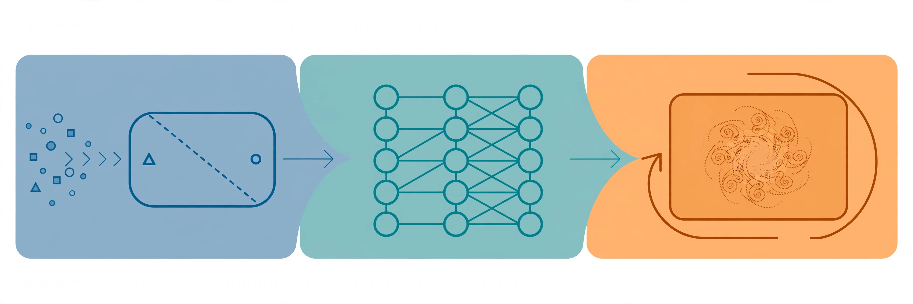

The mathematical foundations of machine learning, taught for the era of foundation models.

This course is the classical core that the rest of this system builds on.

 CS336 taught you how to build a language model. This course teaches you why the pieces work: the statistical principles behind regression and classification, the optimization behind training, the theory behind generalization, and the algorithms behind unsupervised learning and reinforcement learning. The Spring 2026 offering is distinctive: it ends where modern AI begins, with diffusion models, representation learning, LLMs, and RL for language models.

## Lessons

### Part I: Supervised learning
1. [Introduction](l01-introduction.html) — what ML is, the course map, prerequisites
2. [Supervised learning setup](l02-supervised-setup.html) — LMS, gradient descent, normal equations
3. [Weighted least squares](l03-weighted-least-squares.html) — probabilistic view, Newton's method
4. [Exponential family and GLMs](l04-exponential-family-glms.html) — the unifying framework
5. [Gaussian discriminant analysis](l05-gda-naive-bayes.html) — generative vs discriminative

### Part II: Practical advice and deep learning
6. [Dataset splits and ML advice](l06-ml-advice.html) — bias-variance, regularization, debugging
7. [Neural networks 1: architecture](l07-neural-networks-1.html) — MLPs, activations, modern modules
8. [Neural networks 2: backprop](l08-neural-networks-2.html) — the chain rule at scale

### Part III: Unsupervised learning
9. [K-means and GMM](l09-kmeans-gmm.html) — clustering without labels
10. [EM, PCA, ICA](l10-em-pca-ica.html) — latent variables and dimensionality reduction

### Part IV: Generative and foundation models
11. [Diffusion models](l11-diffusion-models.html) — the generative engine behind image models
12. [Representation learning](l12-representation-learning.html) — pretraining, contrastive learning, RAG
13. [LLMs and next-token prediction](l13-llms-next-token.html) — language modeling as ML
14. [Transformers and in-context learning](l14-transformers-icl.html) — attention, MoE, prompting
15. [Attention variants](l15-attention-variants.html) — improving attention, efficiency details

### Part V: Reinforcement learning
16. [RL basics and MDPs](l16-rl-basics.html) — Markov decision processes, value iteration
17. [Policy gradient](l17-policy-gradient.html) — REINFORCE, PPO, RL for language models

## Interview labs

- [Lab 1: Derivations by hand](lab1-derivations.html) — normal equations, logistic gradient, backprop
- [Lab 2: Bias-variance in practice](lab2-bias-variance.html) — diagnose and fix a failing model
- [Lab 3: EM from scratch](lab3-em-from-scratch.html) — implement GMM clustering

## Sources

- Videos: Stanford Online, "Stanford CS229 Machine Learning | Spring 2026" ([playlist](https://www.youtube.com/playlist?list=PLaqpC4kq8Gpw))
- Lecture notes: Tengyu Ma and Andrew Ng, "CS229 Lecture Notes," updated August 23, 2026 ([PDF](https://cs229.stanford.edu/notes2026spring/main_notes.pdf))
