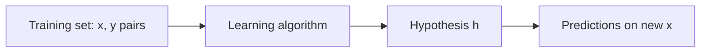
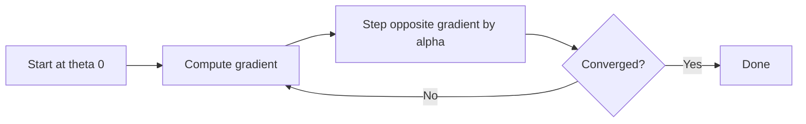
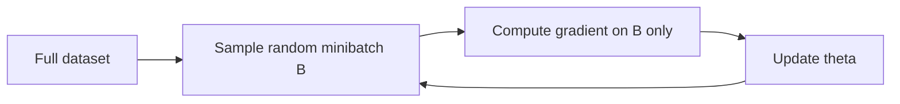

Supervised learning means you tell the machine what you want. You show it an image and say "cat." You show it a house and say "$400,000." The machine learns a function from those labeled pairs. Regression, where the output is continuous, comes first because the math is simpler. [05:54](ts:354)

## The setup

A **hypothesis** is a function from inputs to outputs. Call it \(h\). The input space \(x\) can be images, text, or house data. The output \(y\) can be a label like cat or dog, or a real number like a price.

What makes it supervised is the **training set**: a collection of \((x, y)\) pairs. Each pair is one example. The superscript notation \(x^{(i)}\) means the \(i\)-th example. The convention through the whole course: \(n\) is the number of examples, \(d\) is the number of features. [07:09](ts:429)

The goal is a hypothesis that **generalizes**. You train on the training set, but the point is to label new images you have never seen. That leap, from training performance to real-world performance, is the heart of machine learning. It is also a leap of faith. Later lectures justify it and show how it breaks. [08:22](ts:502)

If \(y\) is continuous, the problem is **regression**. If \(y\) is discrete, it is **classification**. The math for regression is easier, so regression comes first. Classification dominates modern practice, and it arrives in the next lecture. [10:11](ts:611)

> [!PROF] Ré's standing advice, repeated twice: look at your data. You are a good pattern recognizer. Even when you build complicated AI systems, look at the data first. You will discover things. [11:25](ts:685)

## Linear hypotheses

The running example is the Ames Housing Dataset: real sale prices with features like lot size and number of bedrooms. The hypothesis class is linear functions:

\[ h_\theta(x) = \theta_0 + \theta_1 x_1 + \theta_2 x_2 + \cdots \]

Calling these "linear" is an abuse of terminology. They are technically affine because of the offset \(\theta_0\). The course adopts a convention that removes the special case: always assume \(x_0 = 1\), so the hypothesis becomes a clean dot product:

\[ h_\theta(x) = \sum_{i=0}^{d} \theta_i x_i = \theta^T x \]

This convention runs through all the notes. When Ré deviates from it, he says so explicitly. [11:51](ts:711)

The parameters \(\theta\) are what gets learned. No matter how many houses you see, you only ever fit those \(d+1\) numbers. That is a massive reduction: from uncountably many possible functions down to one small parametric family. The hope is that this small family captures the main trend. [13:26](ts:806)

Adding features makes the class richer. With lot size alone you get a line. Add bedrooms and you get a plane. You can always set the extra weights to zero and recover the smaller class, so a richer class fits training data at least as well. [17:50](ts:1070)

## Least squares

To pick \(\theta\), define what "fits the data" means. The **least squares cost** is:

\[ J(\theta) = \frac{1}{2} \sum_{i=1}^{n} (h_\theta(x^{(i)}) - y^{(i)})^2 \]

For each example, take the prediction error, square it, and sum. Then choose the \(\theta\) that minimizes this:

\[ \theta^* = \arg\min_\theta J(\theta) \]

Minimizing average squared error over the training set has a name: **empirical risk minimization** (ERM). You do not need the name, but you will hear it. [15:04](ts:904)

Why square the error? A student asked exactly this. The answer has two parts. First, squaring gives a non-negative number that is zero only for a perfect prediction, and it punishes large errors more than small ones. Second, and decisive: with the square, the problem can be solved exactly. The derivative takes a clean form. Gauss used least squares for this computational advantage two centuries ago, and the advantage still matters. [26:23](ts:1583)

The \(\frac{1}{2}\) is pure convention. The argmin does not care about constants. The \(\frac{1}{2}\) exists so it cancels the \(2\) when you differentiate. Ré calls this the cooking-show view of math: set it up so it looks nice. [28:01](ts:1681)

## Gradient descent

Least squares is a convex, bowl-shaped function. To find the bottom, start somewhere and walk downhill. The gradient points in the direction of steepest increase, so you walk the opposite way:

\[ \theta_j := \theta_j - \alpha \frac{\partial}{\partial \theta_j} J(\theta) \]

The step size \(\alpha\), also called the learning rate, controls how far each step goes. The gradient here has a memorable form. Differentiating \(J(\theta)\) gives the **LMS update rule**:

\[ \theta_j := \theta_j + \alpha \sum_{i=1}^{n} (y^{(i)} - h_\theta(x^{(i)})) x_j^{(i)} \]

Read it as: error times input. For each example, compute how wrong the prediction is, scale by the input, and nudge \(\theta\) to reduce the error. This error-times-input pattern recurs through the entire course. [37:45](ts:2265)

Step size is a judgment call. Too small and you crawl to the optimum. Too large and you overshoot, bouncing from side to side of the bowl without settling. When you train a model and watch the loss bounce instead of descending, the first suspect is \(\alpha\) set too high. [40:03](ts:2403)

> [!CAVEAT] Gradient descent on a bowl works. On a non-convex surface it can stall in a local valley. Everything in the next few lectures is convex underneath, so the optimum is reachable. Neural networks later are not, and there the guarantees vanish. [37:05](ts:2225)

## Machine learning is not statistics

A statistics course proves **recovery guarantees**: given the data, you recover the true parameters to many digits. Machine learning does not care. There may be many \(\theta\) values that predict about equally well, and "close enough" is good enough.

Ré is blunt about how this plays out. In statistics you run careful tests until the gradient falls below a threshold and you can certify closeness to the optimum. In AI you run out of compute credits and stop. That is not a joke about sloppiness. It reflects a different objective: models that predict well, not parameters that are exactly right. [41:02](ts:2462)

The field broke away from statistics when it started training enormous models and asking what was computationally possible rather than what was exactly estimable. That shift is the intellectual core of modern machine learning. [27:34](ts:1654)

## Stochastic gradient descent

Batch gradient descent scans the entire training set for every single update. If your dataset is the whole internet, each step is impossibly slow. The fix is embarrassingly simple: update on a small random **minibatch** instead.

\[ \theta := \theta - \alpha_B \sum_{i \in B} (h_\theta(x^{(i)}) - y^{(i)}) x^{(i)} \]

This is **stochastic gradient descent** (SGD), also called incremental gradient in the older literature. It goes back to Robbins and Monro in the 1950s. People rediscover it every decade or so. It is the workhorse of all of modern AI: every PyTorch training loop uses minibatches. Ré notes he ran SGD in the last 24 hours, and so has everyone training large models. [44:00](ts:2640)

Two statistical assumptions make SGD legitimate. The first, from the start of the lecture: the training set reflects the real world. The second: each minibatch reflects the overall dataset. If you show the model all the cats first and then all the dogs, it learns cats, gets confident, then whipsaws to dogs. Each batch must look like a sample of the population. [45:40](ts:2740)

In practice, nobody samples with replacement from a textbook distribution. The standard move is to **shuffle** the dataset once and sweep through it in order. Theory and practice both say this is fine, and random reshuffling actually converges faster than true with-replacement sampling, by a coupon-collector argument: with replacement, you keep re-seeing common examples while rare ones wait. [47:07](ts:2827)

Batch size itself is partly folklore. Fifteen years ago the belief was that small batches were better because they explored more. Then a paper from Facebook showed larger batches generalizing better despite worse training loss, which contradicted the optimization-centric view and changed the mathematics. Today the honest heuristic is systems-driven: batch size is however much data fits in your GPU memory. Someone at a frontier lab is tuning batch size right now and getting paid well for it. [49:23](ts:2963)

The trajectory of SGD looks different from batch gradient descent. On a smooth quadratic bowl, batch GD glides straight to the optimum. SGD wiggles: each minibatch gradient is noisy, so the path jitters around the true descent direction. With \(\alpha\) too large it bounces in a ball around the optimum instead of settling. One practical trick is to average the iterates over the bouncing trajectory, which simulates a larger batch. [65:33](ts:3933)

> [!INTERVIEW] Expect "why does SGD work, and why not just use the full gradient?" The answer: full-batch gradients cost a full data scan per step, which is infeasible at internet scale. SGD trades a noisy gradient for many cheap steps, and the noise averages out. Also expect "how do you pick batch size": the honest modern answer is GPU memory first, then empirical tuning, because theory does not fully determine it.

## The normal equations

For least squares specifically, there is a second way to solve it: directly, in closed form. Stack all examples into the **design matrix** \(X\), an \(n \times d\) matrix with one example per row, and stack the labels into vector \(y\). The cost becomes:

\[ J(\theta) = \frac{1}{2} \|X\theta - y\|^2 \]

This is just the inner product form of the same sum of squares. Take the gradient with respect to \(\theta\), set it to zero, and solve:

\[ X^T X \theta = X^T y \]
\[ \theta = (X^T X)^{-1} X^T y \]

These are the **normal equations**. Setting the gradient to zero works because the function is strictly bowl-shaped: zero gradient means you are at the bottom. [70:50](ts:4250)

One assumption is buried in that inverse: \(X^T X\) must be invertible. That requires at least as many independent examples as parameters. If \(X^T X\) is singular, there is a null space of \(\theta\) values that all give identical predictions, and no unique solution exists. \(X^T X\) is always positive semidefinite, which is why the bowl shape holds. [75:22](ts:4522)

Ré presents the normal equations mainly as a notation workout. In practice, nobody inverts \(X^T X\) for large problems. SGD is the algorithm that scales. But the derivation forces fluency with matrix calculus, and that fluency is non-negotiable for the rest of the course. [77:17](ts:4637)

> **Interview line:** Linear regression is the template for everything that follows. Memorize the three moves: write the hypothesis, write the cost, minimize it. Know the LMS update (error times input) by heart, know why SGD beats batch GD at scale (one data scan per step is too slow), and know the normal equations plus the invertibility caveat. When an interviewer asks about any classical model, they are checking whether you can replay this template on a new loss.

## Sources

- Video: [Lecture 2: Supervised Learning Setup](https://www.youtube.com/watch?v=cmNIMjPYdgM) (1:18:10)
- Notes: CS229 Spring 2026 lecture notes, Chapter 1 (Linear regression), [PDF](https://cs229.stanford.edu/notes2026spring/main_notes.pdf)
