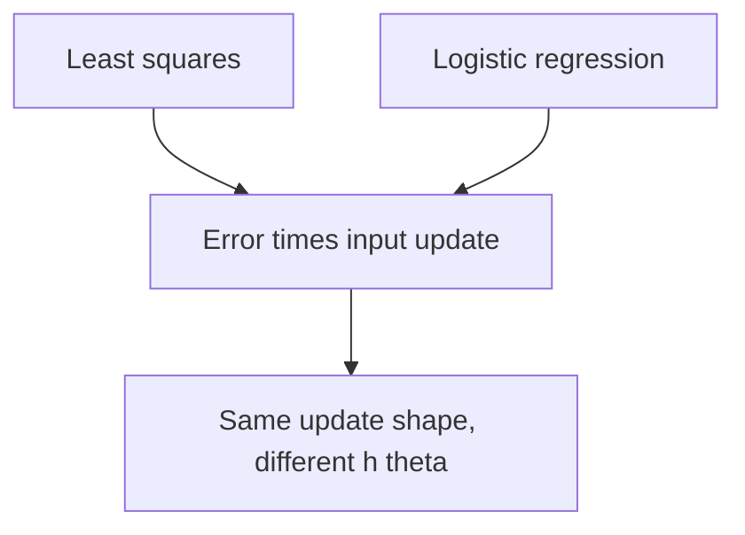

Last lecture derived least squares with no real justification beyond "it works and it is solvable." This lecture rebuilds it from a probabilistic story: assume the data comes from a true linear model plus Gaussian noise, then pick the parameters that make the observed data most likely. That principle, **maximum likelihood**, then generates logistic regression almost for free. [00:05](ts:5)

> [!CAVEAT] The playlist titles this lecture "Weighted Least Squares," but the lecture itself does not cover locally weighted linear regression. It covers the probabilistic interpretation of least squares, logistic regression, and Newton's method. The locally weighted regression section below comes from the official course notes (Chapter 1.4), which is where the playlist title points.

## The generative story

Imagine the data was produced by a process. There exists a true \(\theta\) out in the world, hidden from us. Each label is the true model output plus noise:

\[ y^{(i)} = \theta^T x^{(i)} + \epsilon^{(i)} \]

The noise \(\epsilon^{(i)}\) captures everything we chose not to model: measurement jitter, unmeasured variables, the gap between our linear abstraction and reality. Ré's preferred reading: noise is what you are willing to leave unmodeled. It is an abstraction decision, not a claim about physics. [05:47](ts:347)

Three assumptions on the noise, in increasing order of strength:

1. **Zero mean.** The errors are not systematically biased. If they were, some hidden offset would make the true \(\theta\) unfindable. This one is close to a necessity.
2. **IID.** Independent and identically distributed. This is a strong assumption and we make it for computational reasons: it lets the joint probability factor into a product, which makes all the math tractable.
3. **Gaussian with variance \(\sigma^2\).** We model only the first two moments: mean zero and a variance. A Gaussian is the unique distribution pinned down by exactly those two choices, which is why it shows up everywhere. [09:16](ts:556)

> [!PROF] On whether the data is "really" Gaussian: that is the wrong question. The question is whether the Gaussian model is good enough for what you want out of it. If small changes in \(\sigma^2\) flip your conclusions, be nervous. If sweeping the variance over two orders of magnitude changes nothing, you are in good shape. All models are wrong. Some are useful. [07:02](ts:422)

The Gaussian density has an intimidating form, but only two parts matter. The normalization constant out front is the least important part of the formula: constants vanish the moment you optimize. The action is under the exponential: squared distance from the mean, divided by \(2\sigma^2\). That squared distance is where least squares will come from. [13:44](ts:824)

## From noise to likelihood

If the noise is Gaussian, then each label, conditioned on its input, is Gaussian too:

\[ p(y^{(i)} \mid x^{(i)}; \theta) = \frac{1}{\sqrt{2\pi}\sigma} \exp\left(-\frac{(y^{(i)} - \theta^T x^{(i)})^2}{2\sigma^2}\right) \]

Notation worth absorbing: the bar \(|\) means conditioning (we observe \(x^{(i)}\)), while the semicolon separates \(\theta\) as a **parameter**, not a random event. Each \(\theta\) defines a different distribution, and we are about to search over them. [19:05](ts:1145)

The **likelihood** \(L(\theta)\) scores each candidate \(\theta\) by how probable it makes the observed data. By the IID assumption, the joint probability factors into a product:

\[ L(\theta) = \prod_{i=1}^{n} p(y^{(i)} \mid x^{(i)}; \theta) \]

Products of many small probabilities are numerically miserable, so take the log. The **log likelihood** \(\ell(\theta) = \log L(\theta)\) turns the product into a sum:

\[ \ell(\theta) = -\frac{n}{2}\log(2\pi) - n\log\sigma - \frac{1}{2\sigma^2}\sum_{i=1}^{n}(y^{(i)} - \theta^T x^{(i)})^2 \]

Now maximize. The first two terms do not involve \(\theta\). What remains is a constant minus the least squares cost. Maximizing the likelihood is exactly minimizing \(J(\theta)\). [26:12](ts:1572)

That is the punchline the lecture was building toward: **least squares is maximum likelihood under Gaussian noise**. Last week's minimization had a probabilistic soul all along. [28:40](ts:1720)

## Maximum likelihood as a recipe

The derivation matters less than the pattern it reveals. Maximum likelihood is a crank you can turn on new problems:

1. Write a **forward model**: a probabilistic story for how the data was generated.
2. Write the **likelihood**: how probable the data is under each parameter setting.
3. Take **logs**: the product becomes a sum, numerically stable and additive.
4. **Optimize**: run gradient descent on the resulting cost.

This recipe scales from continuous to discrete to the modern models of the next lectures. It looks like symbol pushing the first time. It becomes the most productive modeling habit in the course. [30:07](ts:1807)

One modeling judgment the lecture stresses: decide what you fit from data versus what you assume. Here \(\sigma^2\) was fixed, not fit. You could fit it with maximum likelihood too. The practitioner's test is sensitivity: sweep the assumed parameter, and if your conclusions survive, the assumption was harmless. [33:06](ts:1986)

## Locally weighted linear regression

This section follows the course notes (Chapter 1.4), the topic the playlist title refers to. Standard linear regression fits one \(\theta\) to the whole dataset. **Locally weighted linear regression** (LWR) fits a new \(\theta\) at every query point, weighting nearby training examples more heavily:

1. Fit \(\theta\) to minimize \(\sum_i w^{(i)} (y^{(i)} - \theta^T x^{(i)})^2\).
2. Output \(\theta^T x\).

The standard weights fall off with distance from the query point \(x\):

\[ w^{(i)} = \exp\left(-\frac{(x^{(i)} - x)^2}{2\tau^2}\right) \]

Close examples get weight near 1. Far examples get weight near 0. The **bandwidth** \(\tau\) controls how fast the weight decays. Despite the Gaussian-looking formula, the weights are not probabilities and have nothing to do with random variables. [notes 1.4]

LWR is the course's first **non-parametric** algorithm. Parametric linear regression stores a fixed set of \(\theta\) values and discards the data. LWR must keep the entire training set, because every prediction re-solves a weighted fit. The hypothesis it represents grows with the dataset. The payoff: with enough data, the choice of features matters less, because the model adapts locally instead of committing to one global shape. The cost: every prediction requires a fresh optimization. [notes 1.4]

## Why classification needs a new model

Binary classification has labels \(y \in \{0, 1\}\): cat or not, spam or not. The naive move is to run least squares on the labels anyway. It fails in a specific, picturable way. Least squares tries to fit the *center of mass* of each class, so far-away points drag the decision boundary around. What you want is just the *split* between the classes, and least squares is solving the wrong geometry. [35:05](ts:2105)

There is a second, practical objection: a linear function returns 7 or -40 for inputs whose labels can only be 0 or 1. You would need ad-hoc rounding code around the model. A classification model should output something in \([0, 1]\) natively. [37:51](ts:2271)

> [!WARN] Ré is honest that least squares on classification "works more often than you think" on real high-dimensional data. Modeling is a matter of degree, not correctness. But the principled move is a model built for discrete outputs.

## The link function

Keep the linear core \(\theta^T x\) but pass it through a nonlinear **link function** \(g\) that squashes it into \([0, 1]\). The canonical choice is the **sigmoid**, also called the logistic function:

\[ g(z) = \frac{1}{1 + e^{-z}} \]

It is smooth and monotone: large positive \(z\) maps near 1, large negative \(z\) near 0. A step function would also squash, but it is not differentiable, which kills gradient-based optimization. The hypothesis becomes:

\[ h_\theta(x) = g(\theta^T x) = \frac{1}{1 + e^{-\theta^T x}} \]

Interpret \(h_\theta(x)\) as a probability: the model's estimated \(P(y = 1 \mid x)\). Then \(1 - h_\theta(x)\) is the probability of the other class. This is the first time the course predicts a distribution instead of a number. [38:11](ts:2291)

The raw score \(\theta^T x\) before the sigmoid is sometimes called the **logit**. The name matters less than the shape: monotone, bounded, differentiable. [41:12](ts:2472)

## Logistic regression from maximum likelihood

Turn the crank. The probabilistic model is Bernoulli: each label is a coin flip with heads probability \(h_\theta(x^{(i)})\):

\[ p(y \mid x; \theta) = h_\theta(x)^y \, (1 - h_\theta(x))^{1-y} \]

This compact form is just an if-then in math clothing. Plug in \(y = 1\) and the second factor becomes 1. Plug in \(y = 0\) and the first factor becomes 1. Take the product over examples (IID again), take logs, and you get a sum. Then optimize. [41:21](ts:2481)

A student caught a sign subtlety: since we *maximize* the log likelihood, the update is gradient **ascent**, with a plus sign instead of the minus in descent. In practice the objective is usually negated into a loss so the code reads as descent. Same mathematics, flipped sign. [44:16](ts:2656)

The gradient has the familiar shape. After the algebra, the update for logistic regression is:

\[ \theta_j := \theta_j + \alpha \sum_{i=1}^{n} (y^{(i)} - h_\theta(x^{(i)})) x_j^{(i)} \]

Error times input, exactly like LMS. The only difference is that \(h_\theta\) now passes through the sigmoid. Ré flags this as a general phenomenon: nearly every model in the first half of the course produces a gradient of the form "prediction error, scaled by input." The nastiness of each model hides inside its \(h_\theta\). The update structure stays the same. [45:38](ts:2738)

This is why the recipe matters more than any single model. Logistic regression is the last layer of essentially every classifier you have used, including the softmax head of a language model predicting its next token. [01:22](ts:82)

## Newton's method

Gradient descent uses only first-order information: the slope, plus a hand-picked step size. **Newton's method** uses second-order information to compute the step size automatically. The idea in one dimension: approximate \(f\) by its tangent line at the current guess (Taylor expansion), then jump to where that line hits zero:

\[ \theta := \theta - \frac{f(\theta)}{f'(\theta)} \]

No \(\alpha\). The method tells you exactly how far to go. Applied to optimization, you find zeros of the *gradient*, so \(f\) becomes \(\nabla_\theta \ell(\theta)\) and \(f'\) becomes the **Hessian** \(H\), the matrix of second partial derivatives:

\[ \theta := \theta - H^{-1} \nabla_\theta \ell(\theta) \]

In higher dimensions the inverse becomes a pseudo-inverse when \(H\) is not perfectly invertible, which handles over- and under-determined cases. When Newton converges it converges fast: each step roughly doubles the digits of precision. [47:55](ts:2875)

So why is SGD the workhorse and not Newton? Count the flops. One SGD step on a minibatch costs \(O(Bd)\). One Newton step costs \(O(nd^2 + d^3)\): the \(d^2\) to build the Hessian, the \(d^3\) to invert it. Newton needs far fewer steps, but each step is astronomically more expensive when \(n\) and \(d\) are both huge. Training on every word on the internet with a trillion parameters makes Newton inconceivable. This is the same computation-versus-statistics tradeoff from Lecture 2, now quantified. [55:44](ts:3344)

Newton is not dead, just relocated. Classical statistics packages use it (or its cousin L-BFGS) for problems with hundreds of features, where it converges before you finish thinking about step sizes. And its *ideas* survive inside modern optimizers: AdaGrad and Adam estimate diagonal curvature instead of the full Hessian, which is Newton's insight at \(O(d)\) cost. Adam is, roughly, momentum plus a cheap curvature estimate. [57:31](ts:3451)

> [!INTERVIEW] The Newton-versus-SGD comparison is a favorite interview probe because it tests whether you think in asymptotics. Know the two costs cold: SGD \(O(Bd)\) per step with many noisy steps, Newton \(O(nd^2 + d^3)\) per step with few precise steps. The follow-up is always "so when would you use Newton": small \(d\), convex problems, classical stats settings where you care about the parameters themselves.

## What the lecture covered

Probabilistic interpretation justifies least squares as maximum likelihood under Gaussian noise. The MLE recipe (forward model, likelihood, logs, optimize) then produces logistic regression for binary classification with almost no new machinery. Newton's method shows what second-order optimization buys and why its \(O(d^3)\) cost keeps it out of large-scale machine learning. Next: generalized linear models, which unify both of today's models under one framework. [61:23](ts:3683)

> **Interview line:** Maximum likelihood is the single most reusable idea in this course. Practice saying it in one breath: assume a generative story, write the likelihood, take logs, optimize the sum. Then demonstrate it twice: Gaussian noise gives least squares, Bernoulli noise gives logistic regression. Interviewers use this to check whether you understand where loss functions come from rather than memorizing them.

## Sources

- Video: [Lecture 3: Weighted Least Squares](https://www.youtube.com/watch?v=uJF_gL3jhxI) (1:02:14)
- Notes: CS229 Spring 2026 lecture notes, Chapters 1-2 (Linear regression and logistic regression), [PDF](https://cs229.stanford.edu/notes2026spring/main_notes.pdf)
