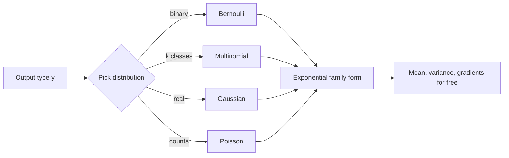

One equation that unifies least squares, logistic regression, and the final layer of every modern AI model. The exponential family gives a single recipe: pick a distribution matching your output type, and inference, learning, and the gradient update all follow. Softmax, the multi-class generalization of logistic regression, is the last step every LLM runs to pick its next token.

## The pitch

Everything from the last two lectures, least squares and logistic regression, was the same procedure with a different loss function. The exponential family explains why. Write a distribution in one special form, and the mean, the variance, and the learning rule all come for free. Ré calls it the cornerstone of a ton of statistics. [00:09](ts:9)

The payoff is immediate and modern. Softmax, the most-used member of this family today, is how an LLM picks among all tokens in its vocabulary at every generation step. It also sits underneath attention, the core of the transformer. [01:57](ts:117)

## The exponential family form

A distribution is in the exponential family if it can be written as

\[ p(y;\eta) = b(y)\,\exp\left(\eta^T T(y) - a(\eta)\right) \]

Four pieces:

- **\(\eta\)**, the natural parameter (also called the canonical parameter). One per free parameter of the distribution.
- **\(T(y)\)**, the sufficient statistic. Think of it as what you measure about \(y\). In this course it is almost always the identity, \(T(y) = y\).
- **\(b(y)\)**, the base measure. A scalar depending only on \(y\), never on \(\eta\).
- **\(a(\eta)\)**, the log partition function. Depends only on \(\eta\). This is where all the action lives.

The log partition function is a normalization constant. The distribution must sum to 1, so \(a(\eta)\) sums or integrates over all possible worlds, every value \(y\) could take. [05:12](ts:312)

> [!KEY] If a distribution fits this form, you already know how to do inference and learning on it. The gradient descent machinery from earlier lectures carries over unchanged.

## Why the log partition function matters

Differentiate \(a(\eta)\) and you get the expectation. Differentiate twice and you get the variance. This holds for every member of the family, because the derivation uses nothing specific to any distribution. [15:50](ts:950)

\[ \frac{\partial a}{\partial \eta} = E[T(y)], \qquad \frac{\partial^2 a}{\partial \eta^2} = \mathrm{Var}[T(y)] \]

Two consequences. First, moments come from one function. Second, \(a(\eta)\) is convex, because its second derivative is a variance, which is positive semi-definite. Convexity means gradient descent can recover the parameters. It will find the bottom of the bowl. [20:00](ts:1200)

Ré notes the connection to statistical physics, where log partition functions appear everywhere, and to cumulant generating functions. The first few cumulants match moments. Beyond that they differ. You do not need this for the course, but it is the machinery underneath. [18:01](ts:1081)

## Example: Bernoulli

Coin flip, \(y \in \{0,1\}\), with \(p(y=1) = \phi\). Rewrite:

\[ p(y;\phi) = \phi^y (1-\phi)^{1-y} = \exp\left( y \log\frac{\phi}{1-\phi} + \log(1-\phi) \right) \]

Matching terms against the family form:

- \(\eta = \log\frac{\phi}{1-\phi}\), the log odds
- \(T(y) = y\)
- \(a(\eta) = \log(1 + e^{\eta})\)
- \(b(y) = 1\)

Inverting the natural parameter gives \(\phi = 1/(1+e^{-\eta})\). The sigmoid appears on its own. Nobody chose it. It fell out of writing Bernoulli in exponential family form. [09:28](ts:568)

## Example: Gaussian

For linear regression the noise was Gaussian. Set \(\sigma^2 = 1\) (it does not affect the choice of \(\theta\)):

\[ p(y;\mu) = \frac{1}{\sqrt{2\pi}} e^{-\frac{1}{2}y^2} \cdot \exp\left(\mu y - \frac{1}{2}\mu^2\right) \]

So \(\eta = \mu\), \(T(y) = y\), \(a(\eta) = \eta^2/2\), and \(b(y) = \frac{1}{\sqrt{2\pi}}e^{-y^2/2}\). The log partition function is \(\frac{1}{2}\eta^2\). Its derivative is \(\eta = \mu\), the mean. Its second derivative is 1, the variance. [12:46](ts:766)

## The catalog

Once you think in terms of error types, the family covers nearly everything:

| Output type | Distribution |
|---|---|
| Binary | Bernoulli |
| Multiple classes | Multinomial (softmax) |
| Real values | Gaussian |
| Discrete counts | Poisson |
| Positive decays | Gamma, exponential |
| Distributions over distributions | Dirichlet |

All of them fit the same form. All of them inherit the same inference and learning. [21:11](ts:1271)



## Constructing a GLM: the three assumptions

A generalized linear model ties the distribution to input features \(x\) with three assumptions:

1. \(y \mid x; \theta \sim \mathrm{ExponentialFamily}(\eta)\). Given \(x\) and parameters, \(y\) follows some exponential family distribution.
2. Predict the expected value: \(h(x) = E[y \mid x]\). This held for both least squares and logistic regression.
3. The natural parameter is linear in the inputs: \(\eta = \theta^T x\).

The third is a design choice, not a law of nature. It is the piece that makes everything tractable. [28:08](ts:1688)

Ré is careful about the parameter names, because they confuse everyone:

- **\(\theta\)**: the model parameters. The only thing you learn.
- **\(\eta = \theta^T x\)**: the natural parameter of the noise distribution for this input.
- **Canonical parameters**: what you would look up on Wikipedia (like \(\phi\) for Bernoulli). Reached from \(\eta\) through the link function.

Learn \(\theta\). Everything else is modeling the noise. [33:18](ts:1998)

## Inference and learning for free

Inference means predicting. From assumption 2:

\[ h_\theta(x) = E[y \mid x; \theta] \]

For logistic regression this was the sigmoid output, the probability of class 1. Same idea, general form. [30:19](ts:1819)

Learning means maximizing the log likelihood. Assume IID data, so the log of the product becomes a sum. Differentiate. The gradient always takes the same shape:

\[ \theta := \theta + \alpha \, (\text{prediction error}) \cdot x \]

Look at the misprediction, multiply by the input, move \(\theta\) in that direction. This is stochastic gradient descent, and it is identical across every GLM. Least squares and logistic regression were never separate algorithms. They were instances. [30:50](ts:1850)

```mermaid
flowchart TD
    A[Pick distribution for y type] --> B[Set eta = theta^T x]
    B --> C[Predict: h = E&#91;y|x&#93;]
    C --> D[Loss: negative log likelihood]
    D --> E[SGD: theta += error * x]
    E --> C
```

## Softmax: multi-class classification

Now the member that matters most in 2026. Suppose \(k\) classes: cat, dog, car, bus. Encode each class as a one-hot vector. A prediction is a distribution over the classes, a point on the simplex. [37:37](ts:2257)

Give each class its own parameter vector \(\theta_j\). Score class \(j\) by \(\theta_j^T x\). Normalize with exponentials:

\[ p(y = j \mid x; \theta) = \frac{\exp(\theta_j^T x)}{\sum_{l=1}^{k} \exp(\theta_l^T x)} \]

Picture it as a bake-off. Each \(\theta_j\) defines a hyperplane. Points on one side score positive for that class. Where hyperplanes disagree, the exponentials decide. Far-away losers get crushed by the exponential, which gives the smooth sigmoid-like behavior. [40:27](ts:2427)

Since probabilities sum to 1, only \(k-1\) are free. And when \(k = 2\), softmax collapses exactly to logistic regression. Define \(\theta = \theta_1 - \theta_2\) and the two-class softmax becomes the sigmoid. It would be strange if the multi-class generalization disagreed with the binary case on two classes. It does not. [58:10](ts:3490)

## Training: cross entropy

Maximum likelihood for softmax means maximizing the probability of the true class. The one-hot label picks out a single term. Take the log. That is cross entropy loss. [60:20](ts:3620)

Ré flags a subtlety. Hard one-hot targets throw away information about near-misses. If the model is torn between cat and dog but sure it is not a car, the loss does not record that. **Label smoothing** spreads a little mass \(\epsilon\) to every class instead of putting it all on the true label. This is regularization. It stops the model from driving weights to infinite confidence on possibly-wrong labels, and it is bundled into every neural net library. [63:36](ts:3816)

Why softmax and not something else? It interpolates smoothly between 0 and 1. The exponentials give every class a nonzero gradient, so backprop reaches all weights instead of only the winner. It is the maximum entropy distribution over discrete choices. And it is numerically stable in practice. Ré's summary: it became the standard because it has the right properties, and now you need a reason to use anything else. [68:00](ts:4080)

> [!PROF] Ré's closing: everything learned so far in the course was two slides of this lecture. Softmax with cross entropy is the last layer of every modern AI system, and the same mathematics sits underneath attention.

## Sources

- Video: [Lecture 4: Exponential Family, GLMs Classification](https://www.youtube.com/watch?v=8gVi4Rk21Eg) (1:14:12)
- Notes: CS229 Spring 2026 lecture notes, Chapter 3 (GLMs, pp. 30-34)

> **Interview line:** When asked why logistic regression uses the sigmoid, derive it: assume Bernoulli noise on a binary label, write it in exponential family form, and the sigmoid is the inverse of the log-odds natural parameter. Then generalize: softmax is the same construction for \(k\) classes, and cross entropy is its log likelihood.
