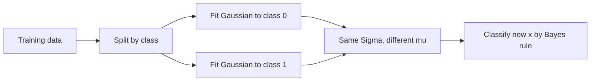

The first generative model. Instead of learning the boundary between classes, learn what each class looks like, then use Bayes rule to classify. Gaussian discriminant analysis fits one Gaussian per class. Naive Bayes does the same for discrete features and builds a spam filter. The lecture ends with Ré's argument that the generative viewpoint, dismissed a decade ago, drove most of modern AI's progress.

## Generative versus discriminative

Every algorithm so far was discriminative. It modeled \(p(y \mid x)\) directly: given the input, what is the label. Logistic regression drew a boundary. The exponential family generalized the boundary. [03:54](ts:234)

A generative algorithm reverses the direction. Model \(p(x \mid y)\), what each class looks like, and \(p(y)\), how common each class is. Then Bayes rule gives the classifier:

\[ p(y \mid x) = \frac{p(x \mid y)\,p(y)}{p(x)} \]

For prediction the denominator does not depend on \(y\), so classify by \(\arg\max_y p(x \mid y)\,p(y)\).

The intuition: a discriminative model learns where cats end and elephants begin. A generative model learns what cats look like and what elephants look like, then matches. The generative model learns a representation of the data. That is the G in GPT. [00:12](ts:12)

> [!PROF] Six or seven years ago, Ré says, nobody cared about generative models because they did not reach state of the art. Now they drive most of AI's growth. The lecture is partly a correction of that old dismissal.

## The multivariate Gaussian

GDA needs Gaussians in \(d\) dimensions. The density:

\[ p(x;\mu,\Sigma) = \frac{1}{(2\pi)^{d/2} |\Sigma|^{1/2}} \exp\left(-\frac{1}{2}(x-\mu)^T \Sigma^{-1} (x-\mu)\right) \]

\(\mu \in \mathbb{R}^d\) is the mean vector. \(\Sigma \in \mathbb{R}^{d \times d}\) is the covariance matrix: symmetric, positive semi-definite. The exponent is a squared distance weighted by \(\Sigma^{-1}\). Points far from \(\mu\) in directions where \(\Sigma\) is small pay a large penalty. [07:59](ts:479)

Geometry of \(\Sigma\):

- **Diagonal \(\Sigma\)**: axis-aligned ellipse. Each diagonal entry stretches one axis. Entries must be positive.
- **Full \(\Sigma\)**: rotated ellipse. Eigenvalues give the stretch along each principal axis. Eigenvectors give the rotation.
- **Contours** are level sets: all points with equal density. For identity covariance they are circles.

Larger \(\Sigma\) means more spread out. Off-diagonal entries tilt the ellipse toward the 45-degree line (positive correlation) or away from it (negative). [16:13](ts:973)

## The GDA model

For continuous features and two classes:

\[ y \sim \mathrm{Bernoulli}(\phi) \]
\[ x \mid y=0 \sim \mathcal{N}(\mu_0, \Sigma) \]
\[ x \mid y=1 \sim \mathcal{N}(\mu_1, \Sigma) \]

One covariance matrix, shared across classes. Two different means. Plus the class prior \(\phi\), which handles population imbalance. A million cats and one elephant shifts the boundary toward cats through Bayes rule, exactly as it should. [26:24](ts:1584)

The shared covariance is a modeling choice, and Ré defends it on cost grounds. \(\Sigma\) has roughly \(d^2/2\) parameters. In high dimensions that is expensive to fit and easy to overfit. Start simple. [27:03](ts:1623)



## Fitting: closed form, no gradient descent

Maximum likelihood for GDA has a closed-form solution. No SGD, no iterations. Write the joint log likelihood, differentiate, solve:

\[ \phi = \frac{1}{n}\sum_{i=1}^{n} 1\{y^{(i)} = 1\} \]

\[ \mu_0 = \frac{\sum_i 1\{y^{(i)}=0\}\,x^{(i)}}{\sum_i 1\{y^{(i)}=0\}}, \qquad \mu_1 = \frac{\sum_i 1\{y^{(i)}=1\}\,x^{(i)}}{\sum_i 1\{y^{(i)}=1\}} \]

\[ \Sigma = \frac{1}{n}\sum_{i=1}^{n} (x^{(i)} - \mu_{y^{(i)}})(x^{(i)} - \mu_{y^{(i)}})^T \]

In words: the prior is the class fraction, each mean is the class average, and the covariance pools deviations from each point's own class mean. Ré calls the derivation the world's most complicated way to compute an average, but the technique, likelihood to parameters by differentiation, recurs through the whole course. [42:45](ts:2565)

One technical point from the derivation: \(\Sigma\) must be invertible. If it is singular, the mean is only identified up to the null space. There is a direction in which you cannot tell where \(\mu\) lives. [43:54](ts:2634)

## The decision boundary

Classify by comparing \(p(x \mid y=0)p(y=0)\) against \(p(x \mid y=1)p(y=1)\). Take logs, expand the Gaussians. Because \(\Sigma\) is shared, every quadratic term \(x^T \Sigma^{-1} x\) cancels. What remains is linear in \(x\). The decision boundary is a hyperplane. [47:27](ts:2847)

Drop the shared-covariance assumption and the quadratic terms survive. That is **quadratic discriminant analysis** (QDA). The boundary becomes curved. Estimation is the same idea, except each class gets its own covariance fit on its own data. More expressive, more parameters, easier to overfit. [56:01](ts:3361)

> [!CAVEAT] Far from the data, complicated decision surfaces do strange things. QDA can carve out regions with no training points and classify them confidently. Linear models do this too, less visibly. Do not trust any classifier far outside its training distribution.

## GDA implies logistic regression, not the reverse

Compute \(p(y=1 \mid x)\) under the GDA model. The algebra gives:

\[ p(y=1 \mid x; \phi, \mu_0, \mu_1, \Sigma) = \frac{1}{1 + \exp(-\theta^T x)} \]

for \(\theta\) a function of the GDA parameters. The posterior is exactly logistic. And this is not special to Gaussians: Poisson class-conditionals with shared structure also yield logistic posteriors. Many generative assumptions collapse to the same discriminative model. [58:10](ts:3490)

The converse fails. Logistic \(p(y \mid x)\) does not imply Gaussian \(p(x \mid y)\). So:

- **GDA** makes stronger assumptions. When they hold, it is asymptotically efficient: with infinite data, no algorithm beats it. It needs less data to learn well.
- **Logistic regression** makes weaker assumptions. It only needs the log odds to be linear. It holds up when the data are not Gaussian. With large datasets on non-Gaussian data, it almost always wins.

In practice logistic regression is used more often. But Ré warns this textbook comparison is a little misleading, because it frames the question as which linear classifier to pick, and the real action moved elsewhere. [63:39](ts:3819)

```mermaid
flowchart TD
    A[GDA: model p&#40;x|y&#41; as Gaussian] --> B[Posterior p&#40;y|x&#41; is logistic]
    C[Poisson class-conditionals] --> B
    D[Logistic regression: model p&#40;y|x&#41; directly] --> B
    B --> E[Same decision surface, different assumptions]
    E --> F[GDA: efficient if Gaussian, fragile if not]
    E --> G[Logistic: tolerant of wrong assumptions, needs more data]
```

## Why generative won the decade

Ré's broader point: statistics cared about getting the parameters right and proving certificates. Machine learning got creative about using models. Training a huge generative model on unlabeled text to predict the next token looks absurd by statistical standards. It produced GPT. Diffusion models assume Gaussian noise and learn to reverse it. That produces image generators. GANs pit a generator against a discriminator. The probabilistic framework is the same one in this lecture: model how the data is generated, then use that model. GDA is its simplest instance. [65:12](ts:3912)

## Naive Bayes: the discrete generative model

GDA needs continuous features. For discrete features, the classic generative model is Naive Bayes. The running example is a spam filter.

Represent an email as a binary vector over the vocabulary: \(x_j = 1\) if word \(j\) appears. With a 50,000-word vocabulary, \(x\) has \(2^{50000}\) possible values. A full multinomial over that space is unrepresentable. [76:02](ts:4562)

The **Naive Bayes assumption**: features are conditionally independent given the class.

\[ p(x_1, \dots, x_d \mid y) = \prod_{j=1}^{d} p(x_j \mid y) \]

This is false. Words are not independent. "not" and "good" interact. But it cuts the parameters from \(2^d\) to \(2d+1\): one prior plus one probability per word per class. Estimation is counting: the fraction of spam emails containing word \(j\). Training is dirt cheap, inference is a sum of logs, and it works surprisingly well. [77:00](ts:4620)

## Laplace smoothing

Naive Bayes has a failure mode. If a word never appeared in training, its estimated probability is zero. One zero in the product zeroes the whole posterior. The classifier returns 0/0 and cannot predict.

**Laplace smoothing** adds a pseudocount:

\[ \phi_j = \frac{1 + \sum_{i=1}^{n} 1\{z^{(i)} = j\}}{k + n} \]

Add 1 to each count, add \(k\) (the number of outcomes) to the denominator. Probabilities still sum to 1, nothing is ever zero. It is a tiny form of regularization: it shrinks the model's confidence in its estimates. Ré notes the general principle behind all regularization is making the model less confident about what it saw. [80:02](ts:4802)

## Sources

- Video: [Lecture 5: Gaussian Discriminant Analysis](https://www.youtube.com/watch?v=zRdE8A4UZes) (1:21:38)
- Notes: CS229 Spring 2026 lecture notes, Chapter 4 (generative learning, pp. 35-48)

> **Interview line:** When asked "generative vs discriminative," say: discriminative models \(p(y|x)\) draw boundaries. Generative models \(p(x|y)\) use Bayes rule. GDA's posterior is logistic, so the two can agree on the boundary, but GDA assumes Gaussian classes (efficient, fragile) while logistic regression only assumes linear log odds (tolerant of wrong assumptions, data-hungry). Then add the modern coda: the generative viewpoint scales to diffusion models and LLMs.
