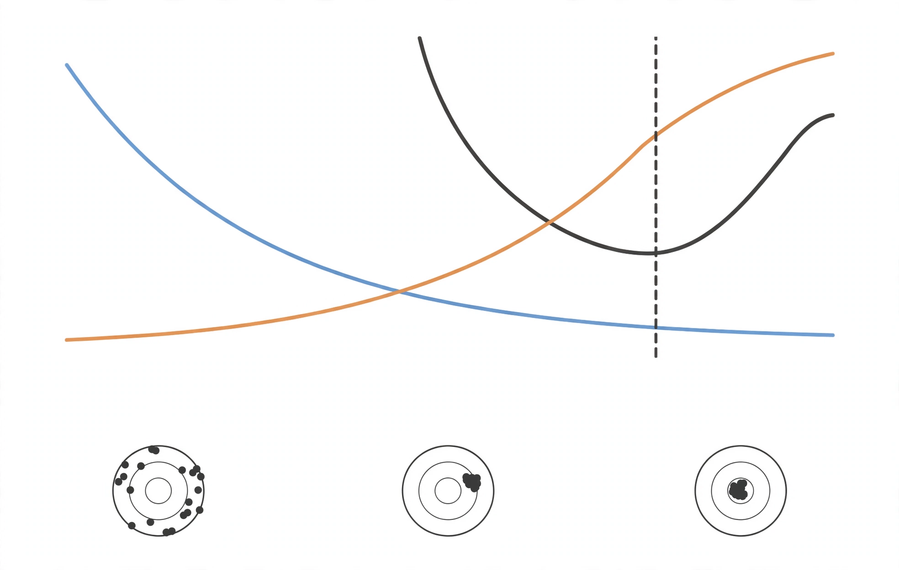
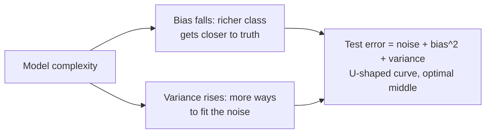
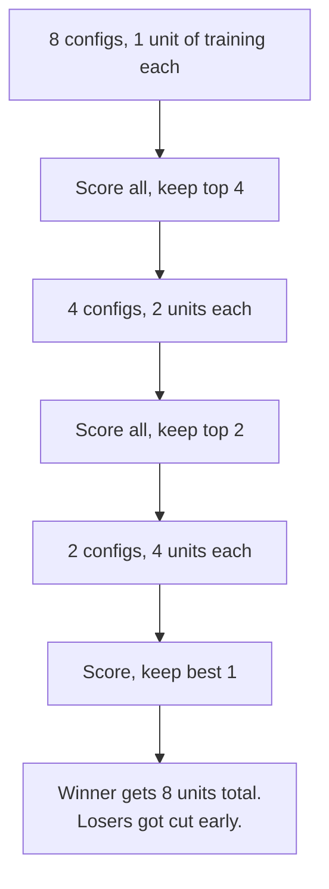

The central question of machine learning: given a finite, noisy sample, how do you pick a model that will generalize? This lesson answers it twice. First the classical answer: the bias-variance decomposition, regularization, and model selection. Then the modern twist: double descent and adaptive overfitting, the two results that forced the field to revise the classical story.

## The setup: overfitting and underfitting

There is a true function in the world. You never see it. You only see noisy samples of it: \(y^{(i)} = h^\star(x^{(i)}) + \xi^{(i)}\), with Gaussian noise \(\xi\). The goal is to recover \(h^\star\). [03:26](ts:206)

Fit a line to quadratic data. The line cannot bend, so it misses no matter which sample you draw. This is **underfitting**: high bias. The model class is too poor to express the truth. [07:00](ts:420)

Fit a 9th-degree polynomial instead. It hits every training point exactly, zero training error. But redraw the sample and you get a wildly different, oscillating function. This is **overfitting**: high variance. The model fits the noise, not the signal. [08:37](ts:517)

Get it just right, a quadratic for quadratic data, and the fits are stable across samples and close to the data. The model class has the right **inductive bias**: its degrees of freedom match the phenomenon. [12:07](ts:727)

> **Interview line:** Underfitting means the model is too simple for the data. Overfitting means the model is too sensitive to the particular sample. Bias measures the first, variance the second.

## The bias-variance decomposition

The pictures become math. Fix a test point \(x\). Draw a training set \(S\). Train a hypothesis \(\hat{h}_S\). Draw fresh test noise \(\xi\). Measure the expected squared error, averaged over both sources of randomness: [20:04](ts:1204)

\[\mathrm{MSE}(x) = \mathbb{E}_{S,\xi}[(y - \hat{h}_S(x))^2]\]

This quantity is sometimes called statistical risk. Expand \(y = h^\star(x) + \xi\) and use the fact that \(\xi\) is zero-mean and independent of \(S\). The cross term vanishes, leaving: [27:27](ts:1647)

\[\mathrm{MSE}(x) = \sigma^2 + \mathbb{E}[(h^\star(x) - \hat{h}_S(x))^2]\]

The first term \(\sigma^2\) is **unavoidable noise**: measurement error in the test point itself. No model can beat it.

Now define \(\bar{h}(x) = \mathbb{E}_S[\hat{h}_S(x)]\), the long-run average prediction. Imagine training on every possible dataset of size \(n\) and averaging the predictions. This is a hypothetical object for analysis, not something you can compute. Insert it and expand again: [34:49](ts:2089)

\[\mathrm{MSE}(x) = \underbrace{\sigma^2}\_{\text{noise}} + \underbrace{(h^\star(x) - \bar{h}(x))^2}\_{\text{bias}^2} + \underbrace{\mathbb{E}[(\bar{h}(x) - \hat{h}_S(x))^2]}\_{\text{variance}}\]

Three terms, three stories:

- **Noise** \(\sigma^2\): intrinsic to the data. Set it to zero only if measurement is perfect.
- **Bias squared**: how far the average prediction is from truth. A property of the model class, not the sample. A line fit to quadratic data has bias no amount of data removes.
- **Variance**: how much the prediction jumps when you redraw the training set. A property of the fitting procedure. The 9th-degree polynomial has enormous variance.

The decomposition holds for squared-error regression. Analogous decompositions exist for classification, but the clean math is regression-only. [37:05](ts:2225)

As complexity grows, bias falls and variance rises. Test error is U-shaped. The sweet spot is the quadratic for quadratic data. This is the canonical chart of classical machine learning. [13:26](ts:806)

One definition worth pinning down: **interpolation** means fitting the training set with exactly zero loss. A 9th-degree polynomial on 10 points interpolates. The classical story says interpolation is a disaster. The modern story disagrees, which is where this lesson goes next. [14:22](ts:862)

## Regularization: trading bias for variance

The decomposition suggests a strategy. Variance is the term you can attack. **Regularization** reduces variance at the cost of a little extra bias. You win when variance falls by more than bias squared rises. [41:02](ts:2462)

The Bayesian view: regularization encodes prior knowledge, e.g. "the weights should not be huge." The frequentist view: it is just an error tradeoff. Both describe the same procedure. [42:55](ts:2635)

The cleanest example is **ridge regression**. Take least squares and add a penalty on the size of \(\theta\): [43:44](ts:2624)

\[J(\theta) = \|y - X\theta\|^2 + \rho\|\theta\|^2, \quad \rho > 0\]

The closed form falls out of one derivative:

\[\hat{\theta} = (X^T X + \rho I)^{-1} X^T y\]

The penalty term \(\rho I\) shifts every eigenvalue of \(X^T X\) up by \(\rho\). This does two things.

First, it fixes rank deficiency. When \(n < d\) (fewer samples than dimensions), \(X^T X\) has a null space: infinitely many \(\theta\) give identical predictions. The penalty selects the **minimum-norm** solution, killing every component in the null space. [47:45](ts:2865)

Second, it tames near-singular directions. If an eigenvalue \(\lambda_i\) is \(10^{-6}\), inverting it multiplies noise by \(10^6\) along that direction: huge variance. With ridge, the contribution becomes \(\lambda_i / (\lambda_i + \rho)^2\), which is bounded. A small \(\rho\) like \(0.1\) barely moves the fit (small bias) but collapses the variance. [52:19](ts:3139)

Ridge is one member of a large family. L1 (Lasso) gives sparsity. **Weight decay** in deep learning is L2 regularization under another name. **Dropout**, randomly zeroing activations during training, can be interpreted as a form of L2 regularization on the weights. **Data augmentation**, rotating or cropping an image that stays a cat, makes the model resistant to noise it should ignore. **Layer normalization** rescales runaway activations. The engineer's summary: anything that stops the model from trusting individual data points too much is regularization. [58:45](ts:3525)

A cultural note from the lecture: statisticians tune regularizers with great care (the Lasso path literature computes every detail). Machine learning practitioners are sloppier. Adam's \(\epsilon = 4 \times 10^{-3}\), the "Karpathy constant," is a heuristic that happens to work. The dev set is trusted more than any amount of math. [56:47](ts:3407)

## The modern twist: double descent

The classical picture says test error must rise past some complexity. Then practitioners trained models with more parameters than training points, interpolated the data perfectly, and got the best generalization anyone had seen. The puzzle of the last decade was not "how do we avoid overfitting" but "why are we not overfitting." [62:35](ts:3755)

**Double descent** (Belkin et al.): plot test error against model size. It falls, rises to a peak at the **interpolation threshold** (just enough capacity to fit the training data), then falls again in the overparameterized regime. Among the many zero-loss solutions, the optimizer's **implicit bias** picks out a smooth one. Gradient descent does not just minimize loss. It selects which minimum to land in, and it prefers minima that generalize. [65:01](ts:3901)

There is also **sample-wise double descent** (Nakkiran): fix the model, vary the number of examples \(n\). Test error peaks when \(n \approx d\), the number of parameters. The peak signals a suboptimal learning procedure at that ratio, and properly tuned regularization largely removes it. [Notes Ch. 8.2]

The practical takeaway: do not hold back from scaling into overparameterized models. The second descent often reaches below the classical minimum. This is the theoretical backdrop for the scaling laws in [CS336 L09](../cs336/l09-scaling-laws-1.html).

## Adaptive overfitting: the ImageNet experiment

A separate worry: the whole field hammers on the same test set for a decade. Do the rankings mean anything, or did everyone collectively overfit to ImageNet? Recht, Roelofs, Schmidt, and Shankar rebuilt ImageNet from scratch, new images, same procedure, ten years later. [67:40](ts:4060)

Result: every model dropped about 11 points of accuracy on the new set, but the **ranking did not change**. Better models stayed better. Adaptive overfitting, the feared collective cheating, did not materialize. Something sturdier than the classical theory predicts is going on. [68:15](ts:4095)

## Train, dev, test: the discipline

The decomposition is theory. The practice is data discipline.

- **Training set**: fit the parameters.
- **Dev (holdout) set**: tune hyperparameters like \(\rho\), pick among model classes. Never pick hyperparameters on the training set: the most expressive model always wins there, with zero training error and no information about generalization.
- **Test set**: sacred. Touch it once, at the end. Every peek leaks information and inflates your estimate.

**K-fold cross-validation** is the data-efficient version. Split the data into \(k\) pieces (often 5). Train on \(k-1\), evaluate on the held-out piece, rotate. Every point serves as validation once, and no data is wasted on a permanent dev set. [71:01](ts:4261)

**Hyperband** (Li and Jamieson) is the compute-efficient version of hyperparameter search. The idea is successive halving: run all candidate configurations for a few steps, drop the worst half, run the survivors twice as long, repeat. Each round spends roughly the same total compute, but promising configurations get exponentially more of it. Simple to implement, near-optimal under mild assumptions on the learning curves. [73:17](ts:4397)

> **Interview line:** State the decomposition \(\mathrm{MSE} = \sigma^2 + \mathrm{bias}^2 + \mathrm{variance}\) and what each term means. Explain ridge regression as eigenvalue surgery: it shifts \(X^T X\) by \(\rho I\) to kill null-space directions and bound tiny eigenvalues. Then show you know the modern story: double descent past the interpolation threshold, and the ImageNet-V2 result that decade-long benchmark reuse did not corrupt model rankings.

## Sources

- Video: [Lecture 6: Dataset Split, ML Advice](https://www.youtube.com/watch?v=llnEgyyuYkQ) (1:18:27)
- Notes: CS229 Spring 2026 lecture notes, Chapters 8-9 (generalization, regularization, model selection)
- Papers:
  - Belkin et al., "Reconciling modern machine learning practice and the classical bias-variance trade-off" (double descent)
  - Recht et al., "Do ImageNet Classifiers Generalize to ImageNet?" (adaptive overfitting)
  - Li and Jamieson, "Hyperband" (hyperparameter optimization)
