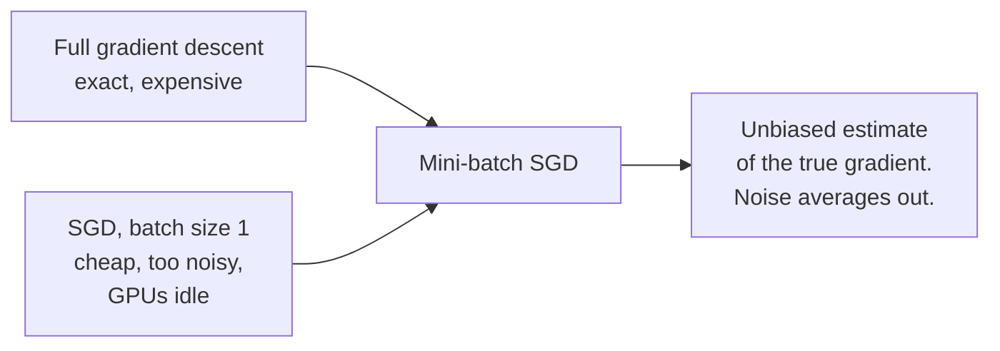
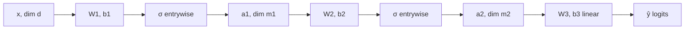
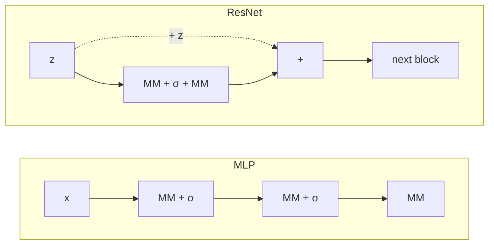

Linear models hit a wall: they can only draw straight lines through the data. This lesson builds the machinery that replaced them. The framework is the same supervised learning you already know, loss plus optimizer, but the model becomes a composition of matrix multiplications and nonlinearities. Everything in modern deep learning, including the Transformer, is assembled from the modules defined here.

Attention and the full Transformer architecture are covered in [CS336 L04](../cs336/l04-attention-alternatives-moe.html). This lesson covers the other building blocks they are made of: MLPs, residual connections, and normalization.

## The framework, extended to nonlinear models

Supervised learning with a nonlinear model works exactly like the linear case. You have a dataset of input-output pairs \((x^{(i)}, y^{(i)})\). You pick a model \(h_\theta\), a loss \(J(\theta)\), and an optimizer. The only change is that \(h_\theta\) is no longer linear in \(\theta\). [08:04](ts:484)

For regression, the loss is squared error: \(J^{(i)}(\theta) = (y^{(i)} - h_\theta(x^{(i)}))^2\). For multiclass classification with labels \(1\) to \(k\), the model outputs \(k\) numbers called **logits**, \(\bar{h}_\theta(x)\). The predicted probability of class \(j\) is the **softmax**: [11:44](ts:704)

\[P(y = j \mid x) = \frac{\exp(\bar{h}_\theta(x)_j)}{\sum_{k} \exp(\bar{h}_\theta(x)_k)}\]

The loss is the negative log-likelihood of the true label, the **cross-entropy loss**. It equals the cross-entropy between the model's predicted distribution and the true label distribution. In PyTorch this is `CrossEntropyLoss`: it takes logits, not probabilities. [15:00](ts:900)

A subtle point about what "nonlinear" means. Nonlinear in the data, like \(\theta_1 x_1^2\), is not interesting: rename \(z_1 = x_1^2\) and you are back to a linear model with no new learning problem. Nonlinear in the **parameters**, like \(\theta_1^2 x_1\), is the real thing. No change of variables reduces it to linear form, so the linear-model techniques stop working. [03:01](ts:181)

## Gradient descent and SGD

The loss is nonconvex, so Newton's method has no guarantees. The workhorse is **stochastic gradient descent**. Full gradient descent computes \(\nabla J(\theta)\) over all \(n\) examples per step. SGD samples one example \(j\) uniformly and steps along \(\nabla J^{(j)}(\theta)\). [21:39](ts:1299)

\[\theta := \theta - \alpha \nabla_\theta J^{(j)}(\theta)\]

The justification: the single-example gradient is an **unbiased estimate** of the full gradient. In expectation over the random sample, it points the same way. Individual steps are noisy, sometimes even pointing backwards, but the noise averages out. [24:03](ts:1443)

Why bother? Computing the full gradient over a trillion tokens is impossible, and often wasteful: individual gradients are highly correlated, so a subset tells you the direction. In practice you use **mini-batches**: sample \(B\) examples, average their gradients. Batch size 1 is too noisy and leaves GPUs idle. The full batch is too expensive. Mini-batch SGD is the compromise the whole field runs on. [26:24](ts:1584)

A common folk belief deserves correction. People say SGD's noise helps it escape bad local minima. The community largely does not believe this is the mechanism. The stronger claim is that in high dimensions there are few bad local minima to escape: a local minimum needs the Hessian positive semidefinite in **all** directions, which is a very strong condition. At most stationary points some direction curves downward, so there is always a way to keep descending. [28:13](ts:1693)

## The ReLU: one neuron

Motivation from the housing data. Price versus size is not a straight line: it stays flat, then rises. A linear model cannot produce the kink. But \(\max(wx + b, 0)\) can, shifted by a constant \(c\) so prices stay positive. [37:58](ts:2278)

\[\bar{h}_\theta(x) = \mathrm{ReLU}(wx + b), \qquad \mathrm{ReLU}(t) = \max(t, 0)\]

This is already a one-dimensional neural network with a single **neuron**: one nonlinear **activation function**. The name "activation" comes from biology. A biological neuron fires once its input crosses a threshold and stays silent below it. The mathematical form differs, but the on-off character is the same. [40:22](ts:2422)

For \(d\)-dimensional input, one neuron is \(\mathrm{ReLU}(w^T x + b)\): an inner product, a scalar bias \(b\), one ReLU. [42:54](ts:2574)

## Stacking neurons

Raw inputs rarely predict the target directly. House price depends on walkability and school quality, quantities absent from the data but computable as nonlinear functions of size, bedrooms, and zip code. So build intermediate variables: \(a_1 = \mathrm{ReLU}(w_1^T x + b_1)\), \(a_2 = \mathrm{ReLU}(w_2^T x + b_2)\), and predict \(y\) as a linear combination of the \(a\)'s. Then stack again: the outputs of one layer become the inputs of the next. [43:41](ts:2621)

In matrix form, one layer is clean:

\[a = \sigma(Wx + b)\]

\(W\) is an \(m \times d\) matrix, \(b\) a vector, \(\sigma\) applied entrywise. The parameter count is \(md + m\). Compose layers and index them: \(a^{[k]} = \sigma(W^{[k]} a^{[k-1]} + b^{[k]})\), with \(a^{[0]} = x\). The last layer is usually kept linear (no activation) so outputs can be negative and the final layer reads as a linear model on learned features. [47:52](ts:2872)

Dimension compatibility is the only hard rule: the output dimension of layer \(k\) must equal the input dimension of layer \(k+1\). In practice the input dimension is fixed by the data, intermediate dimensions often shrink once or twice (a 250k vocabulary collapses to a 2k embedding, then stays there), and the output dimension is fixed by the task. [61:20](ts:3680)

## Activation functions

ReLU is the default, but the zoo is large. Sigmoid \(\sigma(z) = 1/(1+e^{-z})\) and tanh were the original choices from the biological analogy. They are rarely used in hidden layers now because they saturate: gradients vanish as \(z \to \pm\infty\). Sigmoid survives as a **gating** nonlinearity, e.g. in mixture-of-experts routers. [56:23](ts:3383)

- **Leaky ReLU**: \(\max(z, \gamma z)\), small slope for negative inputs.
- **Swish/SiLU**: \(z / (1 + e^{-\beta z})\), used in EfficientNet.
- **GELU**: \(\frac{z}{2}(1 + \mathrm{erf}(z/\sqrt{2}))\), smooth, dips slightly below zero. The standard activation in Transformer language models (BERT) and diffusion transformers.
- **ReLU²**: \(\max(z,0)^2\), improves sparsity in sparse LLMs.
- **Softplus**: \(\frac{1}{\beta}\log(1 + e^{\beta z})\), a smoothed ReLU with a proper second derivative.

Why prefer smooth activations? Partly empirical, partly stability. ReLU's kink at zero is a mild pathology. Smoother functions train more predictably. Beyond that the choice is trial and error. [57:24](ts:3444)

A newer family is **gated activations**. A gated linear unit takes two affine transforms of the same input and multiplies them elementwise:

\[\mathrm{GLU}(h) = (W_1 h + b_1) \odot g(W_2 h + b_2)\]

with \(g\) usually the sigmoid. The **SwiGLU** variant (Swish gating) is the standard feed-forward block in modern Transformer LLMs, including Llama. [Notes Ch. 7.2]

Why not the identity, \(\sigma(z) = z\)? Two linear layers collapse: \(W^{[2]} W^{[1]} x = \tilde{W} x\). Depth without nonlinearity is just linear regression with extra steps. [Notes Ch. 7.2]

## Deep learning as learned features

The old paradigm was **feature engineering**: hand-design a feature map \(\phi(x)\), then fit a linear model \(\theta^T \phi(x)\). Kernels automated part of this. Deep learning automates all of it. Write the network as \(\bar{h}_\theta(x) = w^T \phi_\beta(x)\), where \(\phi_\beta\) is everything except the last layer and \(\beta\) its parameters. The network **learns the feature map** instead of taking it as given. The last linear layer is then just logistic or linear regression on learned representations. [Notes Ch. 7.2]

This is also why Lecture 12 (representation learning) exists: once features are learned, you can pretrain them on one task and reuse them on another.

## Modules: MLP, ResNet, LayerNorm

Modern architectures are built from a small set of composable modules. A **matrix multiplication module** (MM) is \(z \mapsto Wz + b\). An **MLP** is alternating MM and \(\sigma\): \(\mathrm{MLP}(x) = \mathrm{MM}(\sigma(\mathrm{MM}(\sigma(\cdots \mathrm{MM}(x)))))\). All modules use different parameters by default. [63:26](ts:3806)

**Residual connections** (He et al., 2015) changed what depth was possible. A residual block is:

\[\mathrm{Res}(z) = z + \sigma(\mathrm{MM}(\sigma(\mathrm{MM}(z))))\]

Input and output dimensions must match, since they are added. A ResNet is many such blocks in sequence. The motivation: if the intermediate representation \(z\) is already close to the target, the network should model only the **difference** \(y - z\), an easier task than predicting \(y\) from scratch. Two layers per block works best in practice. The reasons are not fully understood. There are also optimization arguments: the skip connection keeps the problem well-conditioned as depth grows. [64:48](ts:3888)

**Layer normalization** stabilizes the scale of activations. For a vector \(z \in \mathbb{R}^m\), compute the empirical mean \(\hat{\mu}\) and standard deviation \(\hat{\sigma}\) across its entries, normalize, then apply a learned affine transform with parameters \(\beta, \gamma\): [71:48](ts:4308)

\[\mathrm{LN}(z) = \beta + \gamma \cdot \frac{z - \hat{\mu}}{\hat{\sigma}}\]

**RMSNorm** drops the mean subtraction and divides by the root-mean-square only. It is the variant used in most current LLMs. LayerNorm makes the forward pass **scale invariant**: multiplying the input by a constant does not change the output. Without it, repeated layers can blow activations up to \(10^{20}\) and training diverges. A subtlety: the gradient is not scale invariant, so some instability moves into the optimizer. [77:14](ts:4634)

**Convolutional networks** get one paragraph because the lecture gives them one minute. A convolution is matrix multiplication with a **Toeplitz** structured matrix: the same small filter, shifted across the input, with shared parameters. This encodes shift invariance for vision. CNNs are now niche. Even vision has largely moved to Transformers. The details are in the notes. [79:01](ts:4741)

> **Interview line:** Define a neuron as \(\mathrm{ReLU}(w^T x + b)\) and a layer as \(a = \sigma(Wx + b)\). Explain why nonlinearity in the parameters (not just the data) is what makes the model genuinely nonlinear. Derive the ResNet block and its "model the residual" motivation. State the LayerNorm formula and its scale-invariance property. Know the activation zoo cold. ReLU is the default. GELU is standard in Transformers. SwiGLU is standard in modern LLM feed-forward layers. Sigmoid is for gating only.

## Sources

- Video: [Lecture 7: Neural Networks 1 (Architecture)](https://www.youtube.com/watch?v=fRM41w9jzQo) (1:20:28)
- Notes: CS229 Spring 2026 lecture notes, Chapter 7.1-7.3 (supervised framework, neural networks, modules)
- Papers:
  - He et al., "Deep Residual Learning for Image Recognition" (ResNet, 2015)
  - Hendrycks and Gimpel, "Gaussian Error Linear Units" (GELU, 2016)
  - Shazeer, "GLU Variants Improve Transformer" (SwiGLU, 2020)
