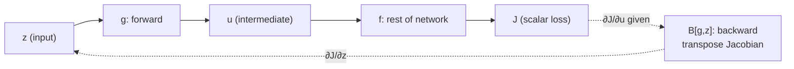
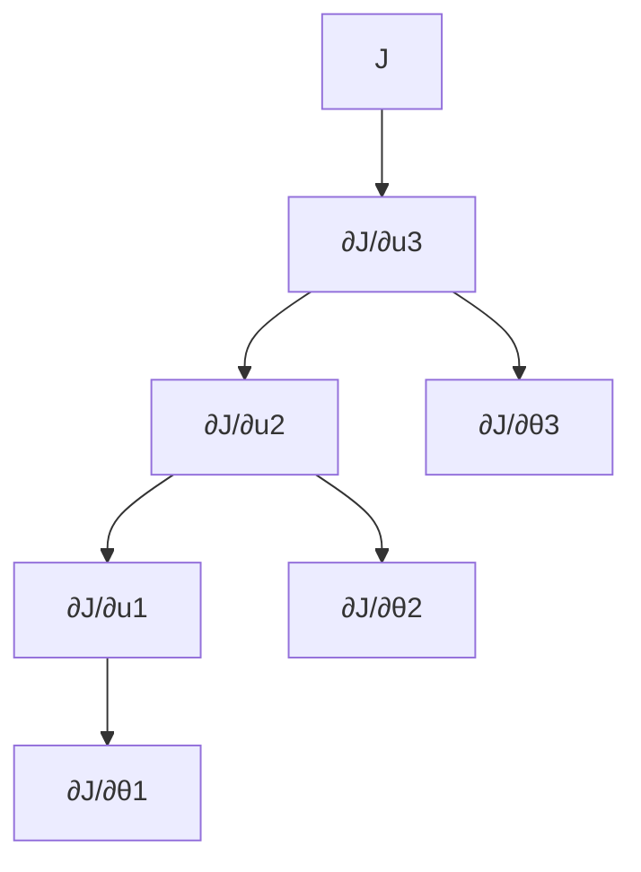

Backpropagation computes the gradient of the loss with respect to every parameter in the network. Every training job runs it under the hood. Frameworks automate it, so you never write it by hand in practice. Ma still teaches the full derivation, because how you design networks and systems depends on how gradients actually flow. [00:26](ts:26)

> [!PROF] Ma notes that research labs used to ask candidates to derive backpropagation in interviews, and suspects some frontier labs still do. He calls it one of the few questions in deep learning with an objectively correct answer. [02:49](ts:169)

## The theorem: backward costs the same as forward

Start with the abstract claim. Take any differentiable circuit of size \(N\): a composition of additions, multiplications, divisions, and elementary functions like exp or sigmoid. If the circuit computes a scalar function \(f\), then the full gradient \(\nabla f\) is computable by another circuit of size \(O(N)\). [06:47](ts:407)

The proof assumes each basic operation costs one unit of time. Computing \(f\) costs \(O(N)\). The claim is that the gradient costs \(O(N)\) too, not \(O(N)\) per partial derivative.

In deep learning language, computing the function is the **forward pass** and computing the gradient is the **backward pass**. The theorem says they take the same time. [09:33](ts:573)

Neural networks are exactly such circuits. Matrix multiplications expand into elementary operations. Activations are elementary functions. One more fact makes the accounting clean: for almost every network used today, the number of operations in the forward pass is proportional to the number of parameters. A \(d \times d\) matrix multiply has \(d^2\) parameters and needs \(d^2\) operations. So both the loss and its gradient cost \(O(\text{parameters})\). [11:19](ts:679)

## A free bonus: second-order information

The theorem applies to any efficiently computable scalar function, including functions built from gradients. Two corollaries fall out.

First, take one gradient descent step inside the loss: \(\ell(\theta - \eta \nabla \ell(\theta))\). Each piece (loss, gradient, loss again) is efficiently computable, so the gradient of this whole object with respect to \(\theta\) is too. This is the machinery behind meta-learning: you can backpropagate through a training algorithm to tune the learning rate or the initialization. [13:15](ts:795)

Second, the **Hessian-vector product** \(\nabla^2 f(x) v\) is computable in \(O(N)\) time for any vector \(v\). Define \(g(x) = \langle \nabla f(x), v \rangle\). The inner product is cheap, so \(g\) is efficiently computable, and one more application of the theorem gives \(\nabla g = \nabla^2 f(x) v\). You can multiply the Hessian by any vector without ever forming the \(N \times N\) Hessian matrix itself. [14:49](ts:889)

> [!CAVEAT] Most optimizers used today do not need Hessian-vector products. Ma mentions this as an advanced application, not a standard tool. [18:16](ts:1096)

## The chain rule, reframed

The engine is the chain rule, presented as a local operation. Suppose a scalar loss \(J\) depends on \(z\) through an intermediate \(u\):

\[ z \xrightarrow{g} u \xrightarrow{f} J \]

The standard chain rule gives, for each coordinate \(z_i\):

\[ \frac{\partial J}{\partial z_i} = \sum_j \frac{\partial J}{\partial u_j} \cdot \frac{\partial g_j}{\partial z_i} \]

In vector form, \(\partial J / \partial z\) equals the transpose of the Jacobian of \(g\) times \(\partial J / \partial u\). [22:01](ts:1321)

The key interpretation: this formula computes \(\partial J/\partial z\) from \(\partial J/\partial u\) using **only** information about \(g\) and the point \(z\). The function \(f\) can be arbitrarily complex. You never look inside it. Once you know the gradient at \(u\), you can forget everything upstream. Ma calls this Markovian: no history required. [24:44](ts:1484)

The notes package this as the **backward function** \(B[g, z]\), the linear map from \(\partial J/\partial u\) to \(\partial J/\partial z\). In PyTorch terms, every module implements a forward function \(g\) and a backward function \(B\). The backward function depends only on local information, so modules compose with anything. [26:53](ts:1613)

## Composing the chain: the backward sweep

For a chain of modules \(x \to M_1 \to u_1 \to M_2 \to u_2 \to M_3 \to J\), the backward pass walks the chain in reverse. Compute \(\partial J/\partial u_2\) first (one local differentiation), use it to get \(\partial J/\partial u_1\) via the backward function of \(M_2\), then \(\partial J/\partial x\) via the backward function of \(M_1\). Each step forgets the modules above it. The modules can all be different: matrix multiply, activation, LayerNorm, anything with a known backward function. [27:35](ts:1655)

## Two phases: activations first, then parameters

So far the variable was the input \(x\). In training, the variable of interest is the parameter vector \(\theta\). The same machinery applies: view each module as a function of its parameters with the input held fixed.

This gives backpropagation its two-phase structure. Phase one computes gradients with respect to the **activations** \(u_1, u_2, \dots\) in strict reverse order. Phase two branches off each activation gradient to compute the gradient with respect to that layer's **parameters**, via \(B[M_i, \theta^{[i]}]\). [33:34](ts:2014)

Two consequences matter for systems work. The activation chain is inherently sequential, but the parameter branches can run in parallel once their activation gradient is ready. And once a parameter gradient is computed, the intermediate values it depended on can be freed. How you order the computation and when you free memory is what makes backprop a systems problem, not just a math problem. [41:03](ts:2463)

## Backward for matrix multiplication

Now the concrete backward functions. Let \(g(z) = Wz + b\) with \(z \in \mathbb{R}^m\), \(W \in \mathbb{R}^{n \times m}\). [42:47](ts:2567)

**With respect to the input.** The Jacobian entry \(\partial (Wz+b)_j / \partial z_i\) equals \(W_{ji}\): only the \(k = i\) term of the sum survives differentiation. The transpose Jacobian is just \(W\) itself transposed, so:

\[ B[MM, z](v) = W^\top v \]

The backward pass through a linear layer is a multiply by the transposed weight matrix. [46:02](ts:2762)

**With respect to the weights.** Apply the chain rule entry by entry: \(\partial J/\partial W_{ij} = \sum_k (\partial J/\partial u_k)(\partial u_k/\partial W_{ij})\). Only \(k = i\) survives, and \(\partial u_i/\partial W_{ij} = z_j\). In matrix form:

\[ B[MM, W](v) = v z^\top \]

The gradient is an outer product of the incoming gradient and the layer input. For a single example it is always **rank 1**. (Across a batch the rank-1 terms sum, so the batch gradient is not rank 1.) The bias gradient is just \(v\) itself. [48:26](ts:2906)

> [!KEY] The weight gradient for one example equals the error signal at the output times the input value: \(\partial J/\partial W_{ij} = (\partial J/\partial u_i) \cdot z_j\). Ma notes this is the Hebbian rule from biology: the synapse update is the product of the two endpoint activities. [52:34](ts:3154)

## Backward for activations

Let \(u = \sigma(z)\) applied elementwise. Output \(i\) depends only on input \(i\), so the Jacobian is diagonal with \(\sigma'(z_i)\) on the diagonal. The backward function is an elementwise product:

\[ B[\sigma, z](v) = \sigma'(z) \odot v \]

No matrix is ever formed. The whole operation costs \(O(m)\) for an \(m\)-dimensional vector, the same as the forward evaluation. [55:49](ts:3349)

The loss modules work the same way. For squared loss \(\ell = \tfrac{1}{2}(z - y)^2\), the backward function is \((z - y) \cdot v\). For logistic loss it is \((\text{sigmoid}(t) - y) \cdot v\). For cross-entropy with softmax it is \((\phi - e_y) \cdot v\) where \(\phi = \text{softmax}(t)\). [59:13](ts:3553)

## The efficiency audit

| Module | Forward cost | Backward cost |
|---|---|---|
| Matrix multiply (\(m \times n\)) | \(O(mn)\) | \(O(mn)\) (transpose multiply, outer product for weights) |
| Elementwise activation (\(m\)-dim) | \(O(m)\) | \(O(m)\) (elementwise product) |
| Scalar loss | \(O(m)\) | \(O(m)\) |

Every row matches. That is the theorem, verified module by module. [59:13](ts:3553)

## Worked example

A tiny network, following the notes' MLP setup. One hidden layer, ReLU activation, squared loss. (Numbers chosen for clarity. The steps are exactly Algorithm 3 in the notes.)

Setup: \(x = [1, 2]\), \(W^{[1]} = I_{2 \times 2}\), \(b^{[1]} = [0, 0]\), \(W^{[2]} = [1, 1]\), \(b^{[2]} = 0\), target \(y = 1\).

**Forward pass.**

\[ z^{[1]} = W^{[1]}x + b^{[1]} = [1, 2], \quad a^{[1]} = \text{ReLU}(z^{[1]}) = [1, 2] \]
\[ z^{[2]} = W^{[2]}a^{[1]} + b^{[2]} = 3, \quad J = \tfrac{1}{2}(3 - 1)^2 = 2 \]

**Backward pass.** Start from \(\partial J/\partial J = 1\).

\[ \frac{\partial J}{\partial z^{[2]}} = z^{[2]} - y = 2 \]
\[ \frac{\partial J}{\partial W^{[2]}} = \frac{\partial J}{\partial z^{[2]}} {a^{[1]}}^\top = 2 \cdot [1, 2] = [2, 4], \quad \frac{\partial J}{\partial b^{[2]}} = 2 \]
\[ \frac{\partial J}{\partial a^{[1]}} = {W^{[2]}}^\top \frac{\partial J}{\partial z^{[2]}} = [2, 2] \]
\[ \frac{\partial J}{\partial z^{[1]}} = \sigma'(z^{[1]}) \odot \frac{\partial J}{\partial a^{[1]}} = [1, 1] \odot [2, 2] = [2, 2] \]
\[ \frac{\partial J}{\partial W^{[1]}} = \frac{\partial J}{\partial z^{[1]}} x^\top = \begin{bmatrix} 2 \\ 2 \end{bmatrix} [1, 2] = \begin{bmatrix} 2 & 4 \\ 2 & 4 \end{bmatrix} \]

Note the rank-1 structure of \(\partial J/\partial W^{[1]}\): both rows are multiples of \([1, 2]\). That is the outer product \(v z^\top\) made visible.

## Vectorization across examples

Real implementations never loop over examples. Stack the \(n\) inputs as columns of a matrix \(X \in \mathbb{R}^{d \times n}\). Then \(Z^{[1]} = W^{[1]} X + b^{[1]}\) with the bias broadcast across columns. Every forward and backward equation above carries over with vectors replaced by matrices. The per-example gradients sum (or average) into the batch gradient, which is why the batch weight gradient is no longer rank 1. [Notes 7.5]

> **Interview line:** State the theorem first: a differentiable circuit of size \(N\) has its gradient computable in \(O(N)\) time, so the backward pass costs the same as the forward pass. Then derive the two facts interviewers test: through a linear layer the signal multiplies by \(W^\top\), and the weight gradient is the outer product of the incoming gradient and the layer input. Mention the rank-1 structure for a single example.

## Sources

- Video: [Lecture 8: Neural Networks 2 (Backprop)](https://www.youtube.com/watch?v=ne2ngVAoMG8) (1:02:13)
- Notes: CS229 Spring 2026 lecture notes, Chapter 7.4 (Backpropagation) and 7.5 (Vectorization)
