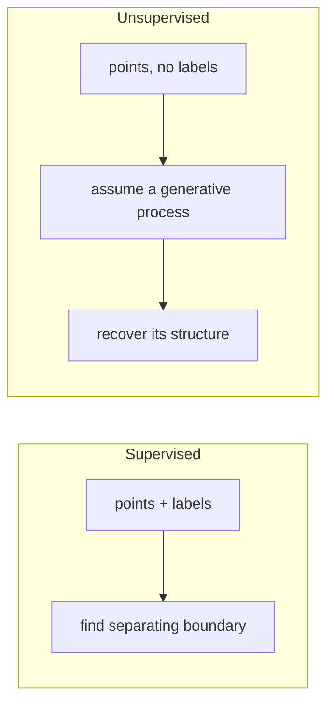
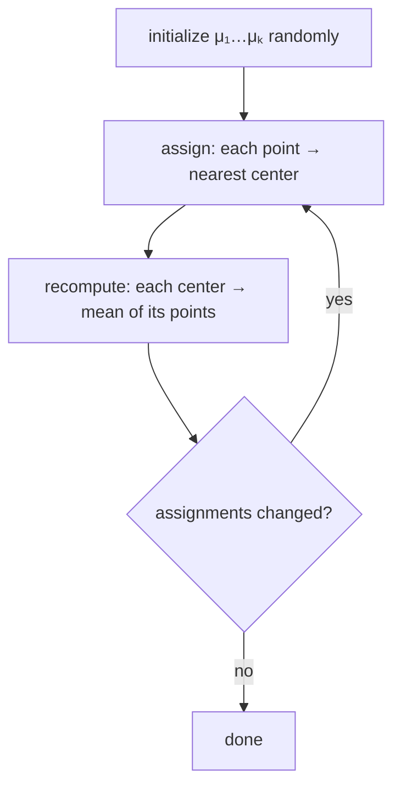
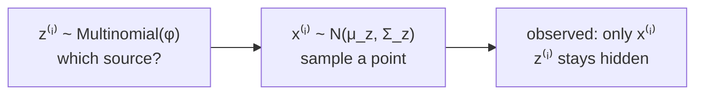
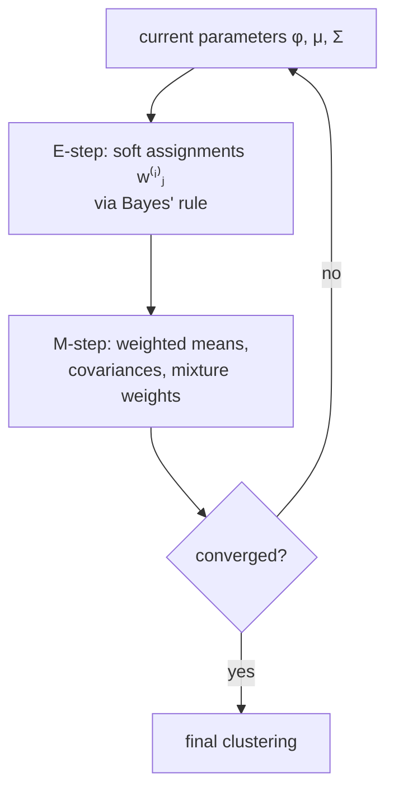
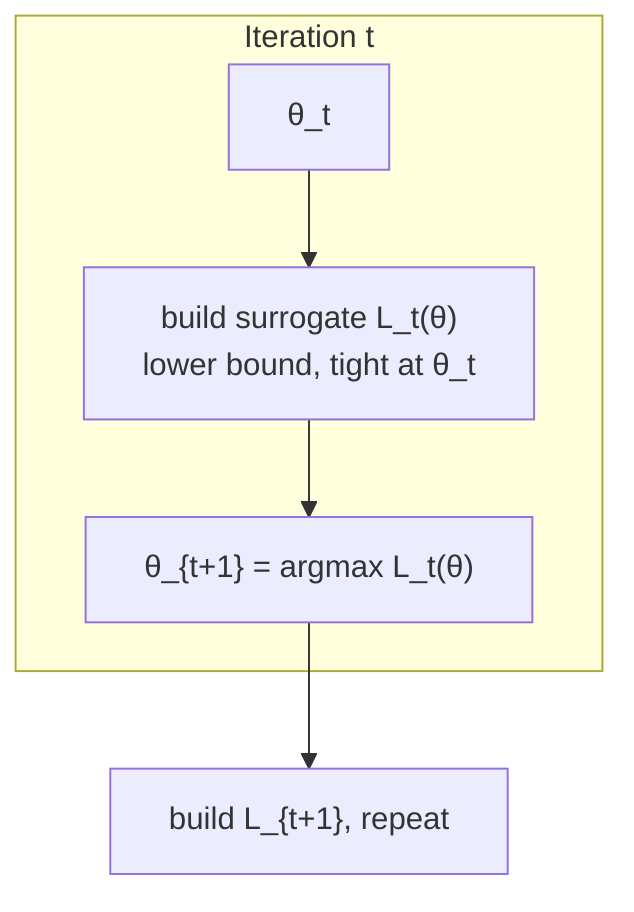

Unsupervised learning drops the labels and keeps the data. The lecture covers the two canonical clustering algorithms, k-means and Gaussian mixtures, and uses them to force a harder question than any algorithm: what are you actually modeling?

## What changes without labels

In supervised learning the labels told you exactly what to optimize: draw the boundary that separates plus from minus. Remove the labels and that specification disappears. You want "clusters," but nothing in the data defines what a cluster is. [02:16](ts:136)

The trade of unsupervised learning: **stronger assumptions, weaker guarantees**. You must assume the data came from some structured process (a mixture of sources, points near prototypes). In return you get no clean optimality statement. Finding the optimal k-means clustering is NP-hard, so the algorithm settles for local answers. [04:39](ts:279)

> [!KEY] Unsupervised learning only works under assumptions. Machine learning only works under assumptions. That is the trade. [22:22](ts:1342)

## K-means

You are given points \(x^{(1)}, \dots, x^{(n)}\) and an integer \(k\). Each point gets assigned to one of \(k\) clusters, written \(c^{(i)} = j\). Each cluster has a center \(\mu_j\). The algorithm:

1. Initialize \(\mu_1, \dots, \mu_k\) randomly (for instance, at \(k\) random training points).
2. Repeat until the assignments stop changing:
   - Assign each point to its nearest center: \(c^{(i)} := \arg\min_j \|x^{(i)} - \mu_j\|^2\).
   - Move each center to the mean of its assigned points.

The name comes from step two: each \(\mu_j\) is the mean of its cluster. [06:27](ts:387)

**Why it converges.** Define the distortion function:

\[ J(c, \mu) = \sum_{i=1}^{n} \|x^{(i)} - \mu_{c^{(i)}}\|^2 \]

K-means is coordinate descent on \(J\): the assignment step minimizes \(J\) over \(c\) with \(\mu\) fixed, and the recompute step minimizes \(J\) over \(\mu\) with \(c\) fixed. So \(J\) decreases monotonically every iteration. It cannot oscillate forever, because there are only finitely many assignments and the objective never goes back up. [15:44](ts:944)

**Why it does not find the best answer.** \(J\) is non-convex. Coordinate descent lands in a local minimum, and the global problem is NP-hard. Different random initializations give different final clusterings. The standard remedy is random restarts: run k-means several times and keep the clustering with the lowest distortion. [16:42](ts:1002)

**Initialization matters enough to have its own algorithm.** Stanford graduate students developed **k-means++**, a smarter seeding that spreads the initial centers apart and guarantees an approximation ratio to the optimal cost. It is the default initialization in sklearn. [18:49](ts:1129)

> [!CAVEAT] If the data has no cluster structure, k-means still returns an answer. The answer means nothing. In high dimensions this bites harder: random points have nearly identical nearest and farthest neighbor distances, so "closeness" itself degrades. Only run clustering when you have reason to believe clusters exist, and validate the result against outside knowledge. [22:08](ts:1328)

## Picking k is a modeling decision

The integer \(k\) is not learned. It encodes your belief about the world: two light sources, five data sources, four gene types. The same dataset can honestly be "two clusters" or "four clusters" depending on the question you ask. Comparing distortion across different \(k\) values is treacherous, because more clusters always fit tighter. The elbow heuristic (look for the kink where adding clusters stops helping much) is a rough guide, not a test. Auxiliary knowledge beats any statistic computed from the same fit. [23:55](ts:1435)

## From hard to soft: Gaussian mixtures

K-means makes hard assignments: each point belongs to exactly one cluster. The Gaussian mixture model (GMM) keeps the same idea but makes the assignments probabilistic. Intuitively it is k-means plus Bayes' rule. [29:47](ts:1787)

The motivating example comes from astronomy. Photons from quasars and stars hit a detector plate. Tight bright bundles come from one kind of source, wide dim smears from another. You observe only the photon positions. You want to recover the sources: their locations, their shapes, and how many photons each one emitted. [30:12](ts:1812)

**The forward model.** Each point is generated in two steps. First flip a biased coin: with probability \(\phi_j\) pick source \(j\). Then sample the point from that source's Gaussian \(\mathcal{N}(\mu_j, \Sigma_j)\). The coin outcome \(z^{(i)}\) is a **latent variable**: it exists in the model but you never observe it. [38:38](ts:2318)

The parameters are the mixture weights \(\phi\), the means \(\mu_j\), and the covariances \(\Sigma_j\). Unlike k-means, each Gaussian gets its own shape: spherical, diagonal, or full covariance ellipses that rotate. [35:11](ts:2111)

**The likelihood.** The probability of the data under parameters \(\theta = (\phi, \mu, \Sigma)\) is:

\[ \ell(\phi, \mu, \Sigma) = \sum_{i=1}^{n} \log \sum_{z^{(i)}=1}^{k} p(x^{(i)} \mid z^{(i)}; \mu, \Sigma)\, p(z^{(i)}; \phi) \]

The sum sits **inside** the log. Setting derivatives to zero gives no closed form. But notice: if the \(z^{(i)}\) values were known, the problem would collapse to fitting one Gaussian per class, nearly identical to Gaussian discriminant analysis from Lesson 5. The entire difficulty is the missing labels. [45:05](ts:2705)

## EM: guess the labels, fit the model, repeat

The EM algorithm alternates between the two halves of that observation. [50:05](ts:3005)

**E-step.** For each point and each source, compute the posterior probability that the point came from that source, using the current parameters and Bayes' rule:

\[ w^{(i)}_j := p(z^{(i)} = j \mid x^{(i)}; \phi, \mu, \Sigma) = \frac{p(x^{(i)} \mid z^{(i)}=j)\, \phi_j}{\sum_{l=1}^{k} p(x^{(i)} \mid z^{(i)}=l)\, \phi_l} \]

These \(w^{(i)}_j\) are soft assignments: "60% source 1, 40% source 2." The mixture weight \(\phi\) plays its role here exactly as intuition suggests. A point sitting between two sources is more likely from the one that emits more points overall. That inference is Bayes' rule. [51:02](ts:3062)

**M-step.** Update the parameters as if the soft guesses were the true labels. The mixture weight \(\phi_j\) becomes the average soft count. Each mean becomes the **weighted** average of the points. Each covariance becomes the weighted empirical covariance:

\[ \phi_j := \frac{1}{n}\sum_i w^{(i)}_j, \quad \mu_j := \frac{\sum_i w^{(i)}_j x^{(i)}}{\sum_i w^{(i)}_j}, \quad \Sigma_j := \frac{\sum_i w^{(i)}_j (x^{(i)}-\mu_j)(x^{(i)}-\mu_j)^\top}{\sum_i w^{(i)}_j} \]

Then repeat: re-estimate the soft assignments with the new parameters, refit, and so on. [54:01](ts:3241)

If every \(w^{(i)}_j\) were 0 or 1, the M-step would be exactly the k-means centroid update. GMM is k-means with the hard assignments relaxed into probabilities. Like k-means, it is vulnerable to local optima, so multiple restarts help. [55:51](ts:3351)

## The detour that makes EM work: Jensen's inequality

To see why alternating E and M steps is principled rather than ad hoc, the lecture takes a detour through convexity. A set is convex if the line segment between any two of its points stays inside the set. A function is convex if its epigraph (the region above the graph) is a convex set. Geometrically: the chord between any two points on the graph lies above the graph. The twice-differentiable test is \(f''(x) \ge 0\) everywhere. [60:40](ts:3640)

**Jensen's inequality** is the definition of convexity restated for expectations:

\[ \mathbb{E}[f(X)] \ge f(\mathbb{E}[X]) \]

Moving the function inside the expectation can only decrease the value. For **concave** functions (like \(\log\)) the inequality flips: \(\mathbb{E}[\log X] \le \log \mathbb{E}[X]\). The log case is the one EM needs, because likelihoods are logs of probabilities. [67:09](ts:4029)

## EM as maximizing a lower bound

Now the picture that justifies the algorithm. Let \(\ell(\theta)\) be the log-likelihood, the hard object with the sum inside the log. EM constructs a surrogate \(L_t(\theta)\) with two properties: it always lies **below** \(\ell(\theta)\), and it touches \(\ell\) exactly at the current parameters \(\theta_t\). Because it is built with Jensen's inequality, the surrogate is easy to maximize. [69:36](ts:4176)

The E-step builds the surrogate. The M-step maximizes it. Since the surrogate touches the true likelihood at \(\theta_t\) and \(\theta_{t+1}\) maximizes the surrogate, the true likelihood cannot decrease. This is the convergence guarantee the next lecture proves in full. It does **not** promise a global maximum: the same local-optima problem as k-means survives, which is expected, since hard-assignment k-means is the 0/1 special case. [72:28](ts:4348)

> **Interview line:** Explain k-means as coordinate descent on the distortion function, which is why it converges but only to a local minimum. Then present GMM as the probabilistic relaxation: latent source labels, E-step computes soft responsibilities with Bayes' rule, M-step does weighted maximum likelihood. If asked why EM converges, sketch the lower-bound picture: each iteration maximizes a surrogate that touches the likelihood at the current parameters, so the likelihood rises monotonically.

## Sources

- Video: [Lecture 9: K-Means and GMM (non-EM)](https://www.youtube.com/watch?v=bSmIGBCoffA) (1:16:30)
- Notes: CS229 Spring 2026 lecture notes, Chapter 10 (K-means) and Chapter 11.1 (EM for mixture of Gaussians)
