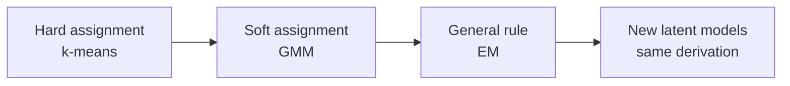
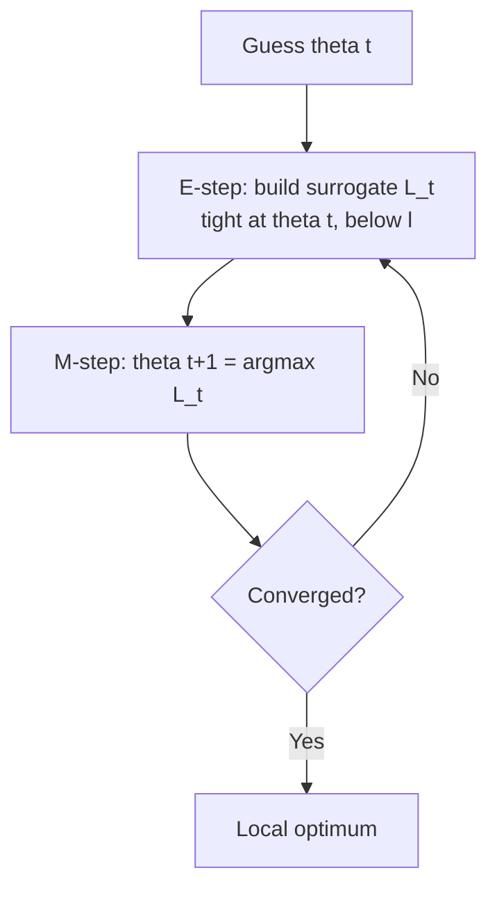

Last lecture built an ad hoc algorithm for Gaussian mixtures: guess soft cluster assignments, refit the Gaussians, repeat. This lecture puts that algorithm on principled footing. The Expectation-Maximization algorithm is the general version of that loop, and the Gaussian mixture is one instance of it. Then the lecture turns to PCA, the non-probabilistic analog: a workhorse for dimensionality reduction that Ré says he uses all the time. [00:28](ts:28)

## The GMM recap

Recall the photon counts from last time. We observe individual photons from unknown sources. We do not know how many points came from each source, and we do not know the shape of each source. [01:18](ts:78)

The model adds a latent variable \(z^{(i)}\): which source point \(i\) came from. The difference from k-means is the assignment. K-means assigns each point to exactly one cluster. GMM assigns each point a probability distribution over clusters. A point might be 50 percent source 1 and 50 percent source 2. Another point might be nearly certain source 2. That distribution is the soft assignment. [01:54](ts:114)

After assigning, we refit the parameters: each \(\mu_j\), each \(\Sigma_j\), and each \(\phi_j\) (the fraction of points in source \(j\)). The ellipse drawn around each cluster is a level set of a multivariate Gaussian. Its axes are the eigenvectors of the covariance. [02:55](ts:175)

Last lecture derived these updates by squinting at what the answer should look like. Today we rederive them from EM. The updates will come out identical. The point of the machinery is that it generalizes: the same derivation works for any latent variable model, not just mixtures. [03:29](ts:209)

## Jensen's inequality, the one tool

Everything rests on one inequality. For a concave function \(f\) and a random variable \(X\):

\[ E[f(X)] \le f(E[X]) \]

Picture \(\log x\). Draw a chord between any two points on the curve. The curve lies below the chord everywhere. That picture is the whole inequality. Take \(a\) with probability \(\lambda\) and \(b\) with probability \(1 - \lambda\). The expected value sits on the chord. The function of the expectation sits on the curve, below it. [04:26](ts:266)

We will use exactly one function: \(f(x) = \log x\), which is concave. Ré hammers the picture because when the symbols get heavy, the picture is what saves you. [05:48](ts:348)

## The EM picture

Forget the symbols for a moment. Draw the log-likelihood \(\ell(\theta)\) as a curve over parameter space. Here \(\theta\) is the vector of all parameters: every \(\mu_j\), every \(\Sigma_j\), every \(\phi_j\). The curve has multiple bumps. We start at a guess \(\theta^{(t)}\). [06:11](ts:371)

Now construct a second curve \(L_t(\theta)\), a surrogate that depends on our current guess. It has two defining properties:

1. **Tight.** It touches the true curve at the current point: \(L_t(\theta^{(t)}) = \ell(\theta^{(t)})\).
2. **Below.** It lies everywhere under the true curve: \(L_t(\theta) \le \ell(\theta)\).

Then maximize the surrogate. Its argmax is our next guess \(\theta^{(t+1)}\). Because the surrogate is below the true curve but touches it at \(\theta^{(t)}\), the argmax cannot be worse than where we started. Repeat. [07:45](ts:465)

The E-step defines the curve given \(\theta^{(t)}\). The M-step optimizes over the curve to get \(\theta^{(t+1)}\). [10:00](ts:600)

> [!KEY] EM is alternating optimization. Build a concave lower bound that touches the likelihood at your current guess, climb to the top of the bound, and rebuild. The likelihood never decreases.

Two warnings. First, this finds a local optimum, not a global one. The true curve can have bumps anywhere. The surrogate only sees its neighborhood. Second, the surrogate is concave and easy to optimize even when the true function is nasty. That is the entire trade. A nasty global problem decomposes into a sequence of nice local problems. [10:22](ts:622)

This is the same structure as k-means, which is also an alternating method. K-means alternates between assigning points to centroids and moving centroids to assigned points. EM alternates between guessing the latent variables and fitting parameters to those guesses. [12:13](ts:733)

## Building the surrogate

Now the symbols. Work with a single data point \(x\). The i.i.d. assumption lets us sum over points at the end. This drops the superscripts and keeps the page readable. [13:12](ts:792)

The log-likelihood for one point marginalizes over the latent \(z\):

\[ \log p_{\theta}(x) = \log \sum_z p_{\theta}(x, z) \]

The sum over \(z\) is what makes direct maximization hard. If \(z\) were observed, the problem would be easy. [13:38](ts:818)

Here comes the trick. Multiply and divide by any distribution \(Q(z)\) over the latent values:

\[ \log p_{\theta}(x) = \log \sum_z Q(z) \frac{p_{\theta}(x, z)}{Q(z)} \]

\(Q(z)/Q(z) = 1\), so nothing changed. But now the sum reads as an expectation: \(E_{z \sim Q}[p_{\theta}(x,z)/Q(z)]\). And we have exactly one tool for expectations of this form: Jensen. Since log is concave:

\[ \log E_{z \sim Q}\left[\frac{p_{\theta}(x,z)}{Q(z)}\right] \ge E_{z \sim Q}\left[\log \frac{p_{\theta}(x,z)}{Q(z)}\right] \]

The right side is our surrogate. For any choice of \(Q\), it lower-bounds the log-likelihood. Each data point gets its own \(Q_i\). There is not one \(Q\) for the whole dataset. [14:14](ts:854)

## Making it tight

A lower bound is only useful if it touches the curve at our current guess. Jensen holds with equality when the random variable inside is constant. So we need:

\[ \frac{p_{\theta}(x, z)}{Q(z)} = c \]

for some constant \(c\) independent of \(z\). That forces \(Q(z) \propto p_{\theta}(x, z)\). Since \(Q\) must sum to 1, the constant is fixed, and:

\[ Q(z) = p_{\theta}(z \mid x) \]

The tight choice is the posterior: given the current parameters and the observed \(x\), our best guess of the latent \(z\). [20:53](ts:1253)

This object has a name: the evidence lower bound, or ELBO.

\[ \mathrm{ELBO}(x, Q, \theta) = \sum_z Q(z) \log \frac{p_{\theta}(x, z)}{Q(z)} \]

It satisfies \(\log p_{\theta}(x) \ge \mathrm{ELBO}(x, Q, \theta)\) for every \(Q\), with equality when \(Q\) is the posterior. Ré calls it a canonical technique. One of his graduate students was writing an ELBO for a paper that week. Diffusion models have ELBOs under the covers. Anywhere a latent variable model appears, this bound appears with it. [24:05](ts:1445)

## Why it converges

The convergence proof is three lines once tightness is established. Let \(\theta^{(t)}\) be the current parameters and \(Q^{(t)}_i(z) = p_{\theta^{(t)}}(z \mid x^{(i)})\) the E-step choice. Then:

\[ \ell(\theta^{(t+1)}) \ge \sum_i \mathrm{ELBO}(x^{(i)}, Q^{(t)}_i, \theta^{(t+1)}) \ge \sum_i \mathrm{ELBO}(x^{(i)}, Q^{(t)}_i, \theta^{(t)}) = \ell(\theta^{(t)}) \]

The first inequality is the bound holding for all \(Q, \theta\). The second is the M-step: \(\theta^{(t+1)}\) maximizes the ELBO by definition. The equality is tightness. So \(\ell\) increases monotonically every iteration. It must converge, since the likelihood is bounded above. [18:21](ts:1101)

Monotone does not mean global. A student asks whether the surrogate could jump over a bump to a better region. Ré: nothing rules that out, and the same is true of gradient descent with a large step size. But there is no guarantee. EM is a local method. In practice, reinitialize from several random starts and keep the best run, exactly as with k-means. [31:37](ts:1897)

## EM for Gaussian mixtures

Now instantiate. The E-step computes, for each point \(i\) and each source \(j\), the posterior:

\[ w^{(i)}_j = p_{\phi,\mu,\Sigma}(z^{(i)} = j \mid x^{(i)}) = \frac{\phi_j \, \mathcal{N}(x^{(i)} \mid \mu_j, \Sigma_j)}{\sum_l \phi_l \, \mathcal{N}(x^{(i)} \mid \mu_l, \Sigma_l)} \]

This is Bayes' rule. Evaluate each Gaussian's density at the point, weight by \(\phi_j\). Normalize. A point sitting between two equal Gaussians gets roughly 60-40 or 50-50. If one source contains a thousand times more points, \(\phi\) shifts the assignment toward it. Nothing here is new. It is the soft assignment from last lecture, now derived as the posterior. [33:28](ts:2008)

> [!PROF] Ré's advice for making the notation stick: write out the numbers and code the E-step once in Python. The vectors are ugly on the board but trivial in code.

The M-step maximizes the ELBO over \(\phi, \mu, \Sigma\). It is a pile of derivatives. The \(\mu_j\) derivation is the instructive one: differentiate, set to zero, multiply through by \(\Sigma_j\) (legal because it is full rank), and out pops the weighted mean. The weights \(w^{(i)}_j\) ride along everywhere. The \(\phi_j\) update needs Lagrange multipliers because the \(\phi\)'s are constrained to sum to 1. Without the constraint you get a spurious extra degree of freedom. [40:57](ts:2457)

The results match the ad hoc updates exactly:

\[ \phi_j = \frac{1}{n}\sum_i w^{(i)}_j, \quad \mu_j = \frac{\sum_i w^{(i)}_j x^{(i)}}{\sum_i w^{(i)}_j}, \quad \Sigma_j = \frac{\sum_i w^{(i)}_j (x^{(i)}-\mu_j)(x^{(i)}-\mu_j)^T}{\sum_i w^{(i)}_j} \]

Compare with the known-\(z\) formulas: identical, except the hard indicators \(1\{z^{(i)} = j\}\) are replaced by the soft weights \(w^{(i)}_j\). EM recovered the ad hoc algorithm, and now the same pattern applies to any latent variable model. [47:59](ts:2879)

## PCA: the non-probabilistic analog

PCA drops the probabilistic model and asks a geometric question. Given data in \(\mathbb{R}^d\), find the directions of maximum variation, and use the top few as a compressed representation. Ré calls it a workhorse he uses constantly, and warns it is often misapplied precisely because it is used so often. [48:58](ts:2938)

The running example: cars, with city mpg on one axis and highway mpg on the other. SUVs cluster at low mpg, economy cars in the middle, hybrids at high mpg. The direction of maximum variation is the axis from gas-guzzler to fuel-efficient. That axis is the first principal component. [49:36](ts:2976)

### Preprocessing: center, then rescale

Two steps before anything else.

**Center.** Subtract the mean so the data has zero mean. If you skip this, the directions of maximum variation point at the cluster's mean instead of capturing how the data varies. People run PCA, forget to center, and get garbage. [51:37](ts:3097)

**Rescale.** Divide each coordinate by its standard deviation. Without this, units dominate: a feature measured in feet has variance millions of times larger than the same feature in miles, and PCA will obediently report "feet" as the principal component. Rescaling puts every coordinate on the same footing. It is optional when features are already comparable, like pixels in an image. [54:41](ts:3281)

### The projection

Pick a unit vector \(u\). The line through the origin in direction \(u\) is \(\{t u : t \in \mathbb{R}\}\). For a point \(x\), the closest point on the line is \(\alpha u\) where \(\alpha = u^T x\). Differentiate \(\|x - \alpha u\|^2\) over \(\alpha\), use \(\|u\| = 1\), and the minimizer falls out: the orthogonal projection. For a \(k\)-dimensional subspace spanned by orthonormal \(u_1, \dots, u_k\), the same argument gives the projection onto the subspace. [56:33](ts:3393)

The gap between a point and its projection is the residual. Here is the key equivalence: **maximizing the variance of the projected data equals minimizing the squared residuals.** You can think of PCA either as keeping as much variance as possible or as approximating the data as well as possible. Same optimum. [62:02](ts:3722)

### The eigenvalue answer

We want the unit vector \(u\) maximizing the projected variance:

\[ \frac{1}{n}\sum_i (x^{(i)T} u)^2 = u^T \left(\frac{1}{n}\sum_i x^{(i)} x^{(i)T}\right) u = u^T \Sigma u \]

where \(\Sigma\) is the empirical covariance (the data are centered, so \(x - \mu = x\)). Maximizing \(u^T \Sigma u\) over unit \(u\): the answer is the principal eigenvector of \(\Sigma\). For a \(k\)-dimensional subspace, take the top \(k\) eigenvectors. The new representation is \(y^{(i)} = [u_1^T x^{(i)}, \dots, u_k^T x^{(i)}]^T \in \mathbb{R}^k\). [63:22](ts:3802)

The linear algebra underneath: every symmetric matrix factors as \(A = U \Lambda U^T\) with orthonormal \(U\) and diagonal \(\Lambda\). Then \(x^T A x = \sum_j \lambda_j \alpha_j^2\) in the eigenbasis, and the maximizer puts all weight on the largest eigenvalue. If \(\lambda_1 = \lambda_2\), any vector in their span maximizes: there is no unique principal component. [65:01](ts:3901)

> [!CAVEAT] PCA degrades silently in three ways. You forget to center. Your features have incomparable scales. Or the top eigenvalues are close together, so the "principal" directions are unstable: rerun on fresh data and you get different coordinates, and any model trained on them breaks. Check the eigenvalue spectrum before trusting the components. [72:19](ts:4339)

### Using it

Reduce 1000 dimensions to 10 when the data truly lives near a small subspace. Applications: compression, visualization in 2 or 3 dimensions, preprocessing before a supervised learner (fewer dimensions, smaller hypothesis class, less overfitting), and denoising (the RC helicopter example: two noisy sensors, one underlying "piloting skill" axis). The fraction of variance explained by the top \(k\) components is computable from the trace of \(\Sigma\) without forming all \(d^2\) entries: with \(k = 3\) you need only the three eigenvalues, and the total is the sum of the diagonal. [76:04](ts:4564)

A student's question: why reduce dimensions at all? Because the wild sea of measurements often hides a small set of real factors. Finding that subspace lets you make stronger inferences. But the eigenvalue separation caveat from above is the price of admission. [76:38](ts:4598)

## ICA: unmixing independent sources

The lecture ends with PCA. ICA comes from the notes (Chapter 13), which develop it as the natural sequel: PCA finds uncorrelated directions, but what if you want the original independent sources?

The cocktail party problem: \(d\) speakers talk at once, \(d\) microphones each record a different mixture. The model is \(x = A s\), where \(s \in \mathbb{R}^d\) holds the \(d\) independent source signals and \(A\) is an unknown mixing matrix. From repeated observations \(x^{(i)}\), recover the sources. Let \(W = A^{-1}\) be the unmixing matrix with rows \(w_j^T\). Then source \(j\) is recovered as \(s^{(i)}_j = w_j^T x^{(i)}\).

Three ambiguities are unrecoverable from the data alone. **Permutation:** relabeling the sources changes nothing observable. **Scaling:** doubling a column of \(A\) while halving the corresponding source leaves every \(x\) unchanged. **Rotation under Gaussianity:** if the sources are Gaussian, any orthogonal rotation of the mixing matrix produces identical observations, because the spherical Gaussian is rotationally symmetric. ICA therefore requires non-Gaussian sources. With Gaussian sources the unmixing is fundamentally undetermined.

One technical note the notes emphasize: densities do not transform by substitution alone. If \(x = As\) then \(p_x(x) = p_s(Wx)\,|W|\), with the Jacobian determinant \(|W|\). Forgetting it is a classic error.

> **Interview line:** For EM, derive the E-step as posterior computation via Bayes' rule and the M-step as weighted maximum likelihood, then prove monotonicity from tightness in three lines. Know that EM converges only locally, so you reinitialize. For PCA, state the objective (maximize \(u^T \Sigma u\)), the solution (top eigenvectors of the covariance), and the three silent failure modes: uncentered data, mixed scales, degenerate eigenvalues. For ICA, name the cocktail party setup and the three ambiguities. The cross-lecture connection interviewers love: ELBOs reappear inside diffusion models, which is Lecture 11.

## Sources

- Video: [Lecture 10: GMM (EM), PCA](https://www.youtube.com/watch?v=sUS-eTa0l6s) (1:20:06)
- Notes: CS229 Spring 2026 lecture notes, Chapter 11 (EM, Jensen's inequality, ELBO), Chapter 12 (PCA), Chapter 13 (ICA)
