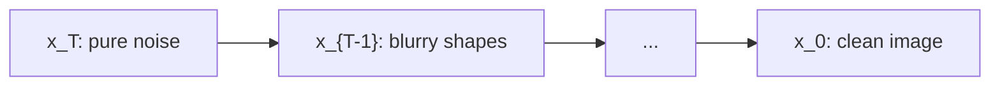

Diffusion models generate images by learning to denoise. Start from pure noise. Remove a little noise. Repeat a thousand times. A clean image appears. The trick that makes this trainable: the noising direction is fixed and known, so only the denoising direction needs learning. [00:05](ts:5)

Ma moved this lecture earlier than planned because it sits right next to the EM algorithm. Training a diffusion model is variational inference, the same machinery Chris Ré built for Gaussian mixtures. [00:17](ts:17)

## Why diffusion won

Before diffusion, image generation meant GANs and variational autoencoders. Diffusion is now the predominant approach and beats both. The course no longer teaches GANs or VAEs. The notes still carry a VAE section for the curious. [00:46](ts:46)

Diffusion also reaches beyond images. Most vision-language-action models in robotics use diffusion to generate actions. Researchers are trying diffusion for language models too, since it can generate tokens in parallel and may run faster than autoregressive decoding at inference time. [00:36](ts:36)

## The task

You have samples from some data distribution \(p_{data}\), say natural images. You want a model that generates new samples from the same distribution. Realistic, but not copies. Call a real image \(x_0\). [02:53](ts:173)

Generation runs backward. Start with \(x_T\), pure white noise. Apply a learned model to get \(x_{T-1}\), then \(x_{T-2}\), and so on until \(x_0\). Each step removes a little noise. Early steps recover rough contours. Late steps sharpen details. The model at each step is \(p_\theta(x_{t-1} \mid x_t)\), a Markov chain, with \(\theta\) a neural network. [04:00](ts:240)

## The forward process: noising on purpose

Training needs pairs of noisy and clean images. The clever move: create them yourself with a fixed noising process. Take a clean image \(x_0\). Add a little Gaussian noise to get \(x_1\). Repeat until \(x_T\) is pure noise. Then learn to reverse it. [06:05](ts:365)

The noising rule at each step:

\[ x_t = \sqrt{1 - \beta_t}\, x_{t-1} + \sqrt{\beta_t}\, \epsilon_t, \qquad \epsilon_t \sim \mathcal{N}(0, I) \]

Here \(\beta_t\) is a small scalar between 0 and 1, the noise variance added at step \(t\). You shrink the image slightly and add a little noise. One step barely blurs the image. [07:35](ts:455)

Why these exact coefficients? They keep the scale stationary. The covariance updates as a linear interpolation:

\[ \text{Cov}(x_t) = (1 - \beta_t)\,\text{Cov}(x_{t-1}) + \beta_t I \]

If the data starts with identity covariance, every \(x_t\) keeps identity covariance. You mix in more noise without changing the overall scale. Even otherwise, the covariance just slides along a line toward identity. [10:48](ts:648)

Unroll the recursion and a clean closed form appears. Define \(\bar{\alpha}_t = \prod_{s=1}^{t}(1 - \beta_s)\). Then:

\[ x_t = \sqrt{\bar{\alpha}_t}\, x_0 + \sqrt{1 - \bar{\alpha}_t}\, \hat{\epsilon}_t \]

where \(\hat{\epsilon}_t\) is a standard Gaussian (a linear combination of the independent per-step noises). Since each \((1-\beta_s) < 1\), the product \(\bar{\alpha}_t\) decays to 0 as \(t\) grows. So \(x_t\) converges to a standard normal. After enough steps, the signal is washed out and only noise remains. [14:09](ts:849)

> [!PROF] Ma caught his own typo live: he first wrote the recursion without square roots, a student flagged it, and he fixed every line on the board. The square roots are what keep the variance stationary. [19:21](ts:1161)

## The key asymmetry: forward is fixed

The forward process involves zero learning. You design it. You choose the \(\beta_t\) schedule. You can run it exactly. This is the big difference from a variational autoencoder, where both directions are neural networks that must be learned. Here only the backward direction is learned. [27:55](ts:1675)

## Parameterizing the reverse

The true reverse process \(q(x_{t-1} \mid x_t)\) exists (a Markov chain reversed is still a Markov chain) but is unknown. Parameterize it with a neural network:

\[ p_\theta(x_{t-1} \mid x_t) = \mathcal{N}(\mu_\theta(x_t, t),\, \sigma_t^2 I) \]

Given a noisy image \(x_t\) and the timestep \(t\), the network predicts the mean of the slightly cleaner image. The variance \(\sigma_t^2\) is chosen, not learned. [29:00](ts:1740)

A student asked: why not denoise in one step? Because gradual denoising is easier to learn. One giant jump from noise to image is a hard function. A thousand tiny denoising steps are each easy. The original paper used \(T = 1000\). [33:27](ts:2007)

Why Gaussian for the reverse? A deep theorem from stochastic processes: in the continuous limit, with many tiny steps, the true reverse process is Gaussian. Ma cites Anderson (1985) for the reverse-time SDE. The intuition is the law of large numbers: each step accumulates many tiny noises, and accumulated noise is Gaussian. So parameterizing the reverse as Gaussian is not arbitrary. It matches the truth in the limit. [35:45](ts:2145)

## The continuous view

In continuous time, the forward process is a stochastic differential equation: deterministic drift plus Brownian motion. The reverse process has the same noise term but a more complex drift that depends on the score \(\nabla_x \log p_t(x)\), the gradient of the log density. That score is exactly what the network ends up learning. The notes give an intuitive proof with Bayes rule and Taylor expansion. The lecture stays informal here. [43:11](ts:2591)

## Training through the ELBO

Now the learning problem. You want to maximize \(\log p_\theta(x_0)\), the log likelihood of real images under your model. But \(p_\theta(x_0)\) is a marginal over all the intermediate noisy images \(x_1, \dots, x_T\). Those are latent variables. This is exactly the EM setting from the previous lecture. [55:28](ts:3328)

Map the notation: in the ELBO from last time, \(x\) was the observed data and \(z\) the latent variable. Here \(x_0\) plays the role of \(x\), and the whole trajectory \(x_1, \dots, x_T\) plays the role of \(z\). The ELBO says:

\[ \log p_\theta(x_0) \geq \mathbb{E}_q[\log p_\theta(x_0 \mid z)] - \text{KL}(q(z \mid x_0)\,\|\,p_\theta(z)) \]

The posterior \(q\) is a free choice. Any \(q\) gives a valid lower bound. The inspired choice: let \(q\) be the forward noising process, \(q(x_{1:T} \mid x_0)\). It is fixed and known, so no parameters to fit for \(q\). In a VAE both \(p\) and \(q\) are parameterized. Here one side is nailed down, which makes optimization much easier. [59:05](ts:3545)

> [!KEY] The ELBO needs a posterior over latents. Diffusion hands you one for free: the forward noising process you designed. That is the structural reason diffusion trains better than a VAE.

## Decomposing the KL

The KL term compares two distributions over whole trajectories. The chain rule for KL splits it into per-step pieces:

\[ \text{KL}(q(x_{1:T}\mid x_0)\,\|\,p_\theta(x_{1:T})) = \underbrace{\text{KL}(q(x_T\mid x_0)\,\|\,p_\theta(x_T))}_{L_T} + \sum_{t=2}^{T} \underbrace{\mathbb{E}_q[\text{KL}(q(x_{t-1}\mid x_t, x_0)\,\|\,p_\theta(x_{t-1}\mid x_t))]}_{L_{t-1}} \]

Each \(L_{t-1}\) asks: does my one-step denoiser match the true one-step denoiser, given that the true one also knows \(x_0\)? [67:00](ts:4020)

Here is the magic. The true posterior \(q(x_{t-1} \mid x_t, x_0)\) is computable in closed form. Given \(x_0\), everything is Gaussian, and conditionals of Gaussians are Gaussian with known formulas. Bayes rule gives a Gaussian whose mean \(\tilde{\mu}_t(x_t, x_0)\) is a linear combination of \(x_t\) and \(x_0\). [77:54](ts:4674)

Now choose the reverse variance \(\sigma_t^2\) to match the true posterior variance. Then both Gaussians in each KL share a covariance, and the KL between two Gaussians with the same covariance is just a quadratic form in the mean difference:

\[ L_{t-1} = \mathbb{E}_q\left[\frac{1}{2\tilde{\beta}_t}\,\|\tilde{\mu}_t(x_t, x_0) - \mu_\theta(x_t, t)\|^2\right] \]

Training reduces to: predict the right mean at each denoising step. [81:09](ts:4869)

## A note on notation

Ma pauses to address something that confuses newcomers. When he writes \(p_\theta(x_{t-1} \mid x_t)\), the symbols are ambiguous in the standard ML way. The \(x_t\) on the left is both a random variable and a particular value it takes. The right side is both a distribution and a density evaluated at a point. Nobody in ML distinguishes these with capital letters the way mathematicians do. The notes use a more formal notation where both sides are densities. In papers, the loose version is fine once you know what it means. [50:51](ts:3051)

## Where this goes next

The lecture ran over time before finishing. The remaining pieces, predicting noise instead of means, the final training loop, and how to sample, open the next lecture. The per-step loss above is the foundation everything else simplifies from.

> **Interview line:** When asked how diffusion models train, say: the forward noising process is fixed, so it serves as a known posterior in the ELBO. The KL chain rule splits the bound into per-step terms. Each term compares your denoiser's predicted mean against the true posterior mean, which is computable because everything is Gaussian given the clean image. Training is then just regression on denoising steps. The one-sentence version: diffusion is variational inference where the encoder is not learned.

## Sources

- Video: [Lecture 11: Diffusion Models](https://www.youtube.com/watch?v=dqUMCzWjZSI) (1:22:31)
- Notes: CS229 Spring 2026 lecture notes, Chapter 14 (Diffusion models)
