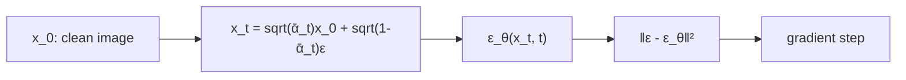

The first half of this lecture finishes diffusion training. The second half starts the foundation model sequence: what changed after GPT-3, and how you adapt a pre-trained model to new tasks. [00:05](ts:5)

> [!CAVEAT] A second video, lNTajqxxOn4, is titled "Lecture 13: LLMs, Next-Word Prediction Loss" in the playlist. That title is wrong. The video is a second lecture on representation learning: embeddings, contrastive learning, semantic search, and RAG. Its content is merged into this lesson below, with timestamps pointing at that video.

## Diffusion, continued: the loss simplifies

Recall the ELBO split from last time: a sum of per-step KL terms \(L_{t-1}\), plus a final-step term \(L_T\) and a reconstruction term \(L_0\).

\(L_T\) vanishes. It compares \(q(x_T \mid x_0)\) against the prior \(p_\theta(x_T)\). For large \(T\) both are standard normal, since the noise washes out the signal. Their KL goes to 0. [07:28](ts:448)

\(L_0\) looks different on the surface but reduces to the same form as every other \(L_t\). So the whole training objective is one clean sum: minimize the squared mean-prediction error at every timestep. [14:30](ts:870)

In practice, people drop the \(\frac{1}{2\tilde{\beta}_t}\) coefficients entirely. The weighted and unweighted versions train similarly, and the unweighted one is simpler. Theory gives you the form. Practice keeps the shape and discards the constants. [15:13](ts:913)

## The reparameterization: predict noise, not means

Here is the step that turns the math into the algorithm everyone implements. The target mean \(\tilde{\mu}_t(x_t, x_0)\) is a linear combination of \(x_t\) and \(x_0\). And \(x_t\) itself is \(\sqrt{\bar{\alpha}_t}\,x_0 + \sqrt{1-\bar{\alpha}_t}\,\hat{\epsilon}_t\). Substitute and rearrange: the mean prediction can be rewritten so that the only unknown part is the noise \(\hat{\epsilon}_t\) that was added. [18:48](ts:1128)

So instead of having the network predict a mean, have it predict the noise:

\[ \mu_\theta(x_t, t) = \frac{1}{\sqrt{\alpha_t}}\left(x_t - \frac{\beta_t}{\sqrt{1 - \bar{\alpha}_t}}\,\epsilon_\theta(x_t, t)\right) \]

The known parts are hardcoded. The network \(\epsilon_\theta\) learns only what it cannot derive. Plug this into the loss and everything cancels except the noise difference. [24:10](ts:1450)

## The final training algorithm

1. Sample a clean image \(x_0\) from the training set.
2. Sample a timestep \(t\) uniformly from \(1\) to \(T\).
3. Sample noise \(\epsilon \sim \mathcal{N}(0, I)\).
4. Build the noisy image: \(x_t = \sqrt{\bar{\alpha}_t}\,x_0 + \sqrt{1-\bar{\alpha}_t}\,\epsilon\).
5. Ask the network to predict the noise: \(\epsilon_\theta(x_t, t)\).
6. Loss: \(L_t(\theta) = \|\epsilon - \epsilon_\theta(x_t, t)\|^2\). Take a gradient step.

That is the entire algorithm. Sample, noise, predict the noise, descend. [27:03](ts:1623)

Sampling runs the learned denoiser backward. Draw \(x_T\) from pure noise. For each step, compute the predicted noise, form the predicted mean \(\mu_\theta\), then sample \(x_{t-1} = \mu_\theta + \sigma_t z\) with fresh noise \(z\). The reverse step keeps some noise because given \(x_t\) you genuinely do not know which trajectory produced it. Uncertainty remains until the end. [29:37](ts:1777)

## Why diffusion trains better

Two structural reasons. First, the forward process is fixed, so the ELBO posterior needs no learning. A VAE parameterizes both directions and must learn both. Second, stretching the timeline to \(T = 1000\) makes each step locally easy. Early steps only need rough contours. Late steps only sharpen. Decomposing one hard generation problem into a thousand easy denoising problems is what makes the optimization tractable. [32:17](ts:1937)

> [!PROF] Ma frames the whole ML stack as layers: data, architecture, loss function, training procedure, then gradient computation and the optimizer underneath. New ideas usually strike at the loss level. Optimizer innovations like Adam transfer across everything, from linear regression to diffusion to LLMs. [34:51](ts:2091)

## The foundation model paradigm

The term "foundation model" was coined by a Stanford survey paper written after GPT-3 appeared in summer 2020. Percy Liang led the team. Faculty crowded around the OpenAI playground, realized this was a new paradigm distinct from the deep learning wave, and wrote it up. The paper called it an emergent paradigm. Six years later, Ma says, it is simply the paradigm. [36:51](ts:2211)

Two phases define it:

1. **Pre-training.** Train on massive unlabeled data, several orders of magnitude more than before. Download everything from the internet. Early datasets were messy, HTML tags and all. Quality matters, but quantity came first.
2. **Adaptation.** Take the pre-trained model and adapt it to tasks. The number of downstream tasks is effectively unlimited. [39:40](ts:2380)

The pre-training loss is an average over examples with no labels: \(L_{pre}(\theta) = \frac{1}{n}\sum_i \ell_{pre}(x^{(i)}, \theta)\). The loss itself is simple. The scale is what is new. [40:04](ts:2404)

## Adaptation: from few-shot to zero-shot

Adaptation has two axes: how much downstream data you have, and whether you update parameters.

With a small labeled downstream set (5 to 10 examples), you do **few-shot** learning. GPT-3's breakthrough was that you often need no examples at all. **Zero-shot** means you describe the task in words and the model solves it. Nobody collects downstream labels anymore for the frontier models. You prompt instead. [44:16](ts:2656)

The rest of this lecture covers adaptation that updates parameters. Prompting, which adapts without touching parameters, comes later. [45:44](ts:2744)

## Representation learning

Representation learning is pre-training with a narrower goal: learn a function \(\phi_\theta\) that maps data \(x\) into an \(m\)-dimensional vector. That vector is called the representation, the features, or the embedding. You train it with some loss, get parameters \(\hat{\theta}\), and then the fixed function \(\phi_{\hat{\theta}}\) turns any input into a vector. [47:51](ts:2871)

**Linear probing** freezes the representation and learns only a linear head \(w\) on top: prediction \(w^\top \phi_{\hat{\theta}}(x)\). For classification add a softmax. The only variable is \(w\), so this is just linear regression on learned features. It works far better than handcrafted features because the representation already captures semantic structure linearly. It also remains a tool for mechanistic interpretability: if a linear probe can read a concept out of a layer, the model represents that concept there. [50:06](ts:3006)

**Fine-tuning** unfreezes everything. Initialize \(\theta\) at \(\hat{\theta}\), initialize \(w\) randomly, and optimize both jointly on the downstream loss. [54:55](ts:3295)

Notice something strange. The fine-tuning loss is the same function you would optimize training from scratch. Only the initialization differs. Yet pre-trained initialization finds a far better solution. That is a proof the loss has many global minima with identical training loss but very different test performance. Initialization selects among them. [56:35](ts:3395)

Why should a linear head suffice at all? Because the pre-training loss is designed to make representations linearly usable. Linearity is not an assumption about the world. It is a property the training procedure installs. [59:06](ts:3546)

**LP-FT** chains the two: linear probe first (fit \(w\) with \(\theta\) frozen), then fine-tune both starting from the fitted \(w\). A random initial \(w\) can damage the pre-trained representation with large early gradients. Fitting \(w\) first keeps the subsequent joint updates small and preserves what pre-training built. [60:09](ts:3609)

## LoRA: low-rank adaptation

Fine-tuning updates every parameter of a gigantic model for a small downstream task. That looks like overkill, and it risks overfitting. But you cannot just pick a subset of parameters to update. Everything is dense matrices. The LoRA answer: restrict the update, not the parameters. [62:26](ts:3746)

Reparameterize each weight matrix as \(W = W_0 + AB\), where \(W_0\) is frozen and \(A, B\) are thin matrices with inner rank \(r\). A \(d \times d\) matrix has \(d^2\) degrees of freedom. The update \(AB\) has \(2dr\). With \(d = 1000\) and \(r = 10\), that is 20,000 versus 1,000,000. Initialize \(A = 0\) and \(B\) random, so training starts exactly at the pre-trained model. [64:43](ts:3883)

What does LoRA actually save? Less than people assume.

- **Compute:** barely anything. The forward pass still computes \(W_0 x\). The backward pass still multiplies by \(W_0^\top\). The frozen bulk dominates both.
- **Memory:** the real saving is optimizer state. Adam-style optimizers keep gradients and momentum per parameter, costing several times the parameters themselves [uncertain: Ma says "a factor of 12 or something, maybe six"]. With LoRA you keep that state only for \(A\) and \(B\), not \(W_0\). [68:00](ts:4080)

The biggest win is operational. Many users can share one frozen \(W_0\) while each holds a small personal adapter. A serving system preloads the base model once and swaps thousand-user adapters in and out of GPU memory fast, since each adapter is tiny. Loading a low-rank update from CPU is far cheaper than loading full weights. That is why commercial fine-tuning APIs offer LoRA and not full fine-tuning. [73:07](ts:4387)

## Embeddings and semantic search

Representation learning produces a mapping \(\phi_\theta\) from raw input \(x\) (image, text, audio) to a vector in Euclidean space. Ma calls these vectors embeddings. The goal: similar inputs map to similar embeddings. Two cat photos land near each other. A cat and an airplane land far apart. [00:17](ts:17)

Linear probing on these embeddings used to be the main application. Ma says it is fading: people now use end-to-end models instead of the two-step probe. The dominant application today is similarity search. [02:52](ts:172)

There is no ground-truth embedding. A representation is good if it satisfies the similarity property. Labels are discrete categories, not points in space. Raw pixels fail the property: two photos of the same cat are far apart pixel-by-pixel. The network must extract semantic meaning. [08:43](ts:523)

## Supervised pre-training for embeddings

Train a network on a labeled classification task, then throw away the head. The penultimate layer becomes \(\phi_\theta(x)\). [03:50](ts:230)

The label set must be diverse. With 1,000 ImageNet classes the learned features generalize. With binary labels (black-and-white versus color) the network learns almost nothing useful, because the task demands no rich representation. And scaling labels is expensive. That cost pushes the field toward unsupervised methods. [05:40](ts:340)

## Contrastive learning

No labels. Take image \(x\), apply two random augmentations to get \(\hat{x}\) and \(\tilde{x}\). Random crop matters most. Flips, blur, noise, and color shifts help. Feed both through the network and demand their embeddings be close. [07:24](ts:444)

Alone this collapses: the network maps everything to one point and every pair is "close." You need a counterbalance. Take another image \(z\), augment it, and demand its embedding stay far from \(x\)'s. Augmentations of the same image pull together. Augmentations of different images push apart. [13:53](ts:833)

One flaw is real. If \(x\) and \(z\) happen to be similar (two cats), the objective pushes them apart, which is counterproductive. Ma's answer: most random pairs are dissimilar, so the damage is rare. Treat it as collateral damage. The benefit of the push-apart term outweighs the harm. [15:53](ts:953)

## The SimCLR objective

SimCLR turns the philosophy into a batch computation. Sample \(B\) images, augment each twice, arrange \(2B\) examples. Build a similarity matrix \(S\) where \(S_{ij}\) is the inner product of embeddings \(i\) and \(j\). With normalized embeddings this equals cosine similarity. [26:29](ts:1589)

For each column \(i\), the loss is

\[ \ell_i = -\log \frac{\exp(S_{ii})}{\sum_j \exp(S_{ij})}. \]

The numerator rewards the diagonal (the true pair). The denominator punishes every off-diagonal entry. Check monotonicity: bigger \(S_{ii}\) shrinks the loss, bigger \(S_{ij}\) grows it. [30:27](ts:1827)

Read it as classification. Given \(\hat{x}_i\), which \(\tilde{x}\) is its partner? The similarities are logits, the softmax picks the partner, and the negative log is cross-entropy. Each column is one multi-class problem: find my friend among strangers. Sum over all columns for the batch loss. [34:50](ts:2090)

Pairs need not come from augmentation. An image and its text description form a positive pair too. Train on image-text pairs and you get a shared embedding space across modalities. That is how text-image representation models are built. [40:07](ts:2407)

## Hard negatives and batch design

Most negatives are easy: a cat versus a chair separates itself. The informative ones are hard negatives, pairs that look similar but are not the same. Ma's example: a photo of a cat playing soccer versus a text about the FIFA World Cup. Mining hard negatives is one of the biggest practical tricks. But push too far and hard negatives become positives. Stop before the boundary blurs. [41:35](ts:2495)

Batch construction matters. \(B\) is a subsample (128, 1,000, 4,000), not the dataset. Sample the batch from one data source so examples resemble each other and negatives stay hard. In a code-embedding startup Ma worked with, sampling from the same programming language and repo kept the loss demanding. Random sampling across languages made the task trivially easy. [46:01](ts:2761)

The \(B^2\) similarity computation is cheap. The real cost is the \(2B\) forward passes through a network with billions of parameters. [44:07](ts:2647)

For text, augmentations do not exist, so positive pairs come from structure: a document's title and headers versus its body text. Title of document A with body of document B is a negative pair. [48:29](ts:2909)

## Semantic search

Embed the whole corpus once: \(\phi_\theta(d_1)\) through \(\phi_\theta(d_n)\). At query time, embed the query and find the corpus vectors with the largest inner product. Brute force works for small corpora. Vector databases solve the large-scale nearest-neighbor problem. Ma treats fast retrieval as a pure algorithms question, out of scope for the course. [49:27](ts:2967)

## Retrieval-augmented generation

RAG applies semantic search to LLMs. Frontier models never see enterprise proprietary data: it cannot leak into their training sets. Fine-tuning on private data is expensive and forces you to host the model. RAG avoids both. [53:34](ts:3214)

At test time, retrieve the 5 to 10 most relevant documents from the private corpus, send them to the model inside its context window along with the query, and let it generate from query plus evidence. Parameters never change. [55:21](ts:3321)

Three properties make RAG attractive. **Modularity:** retrieval and generation are separate systems. **Governance:** deny a user retrieval access to a document and they never see it. Access control lives in the retrieval layer. **Forgetting:** delete a document from the corpus and it can never be retrieved. Unlearning a fine-tuned model is still an open problem. [57:11](ts:3431)

Retrieval need not be semantic. Anthropic uses LLM-generated regular expressions to search code, which works because code is structured: file trees, exact variable names. Semantic retrieval still wins where regex struggles. Ma expects hybrids, and says the best retrieval method per application is still unknown. [58:28](ts:3508)

## What comes next

The lecture ends by previewing the sequence ahead: autoregressive language model training (what GPT actually optimizes), then RL for language models, with the RL basics needed to understand it. The pre-ChatGPT techniques in this lecture are the bridge. The dominating post-2022 approach is next. [00:55](ts:55)

> **Interview line:** When asked how to adapt a foundation model, name the ladder: zero-shot prompting (no parameters change), linear probing (train a head), fine-tuning (train everything from a pre-trained init), LP-FT (probe then fine-tune), LoRA (train a low-rank update). Then give the two facts interviewers test: fine-tuning works because initialization selects among many global minima, and LoRA's main saving is optimizer-state memory plus multi-tenant serving, not compute.

## Sources

- Video: [Lecture 12: Representation Learning](https://www.youtube.com/watch?v=_kREM2UAiJ8) (1:15:57)
- Notes: CS229 Spring 2026 lecture notes, Chapters 14-16 (Diffusion models, Foundation models overview, Representation learning)
