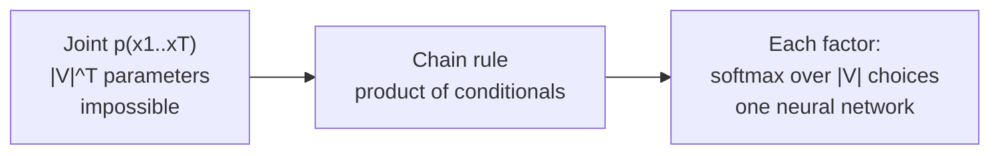
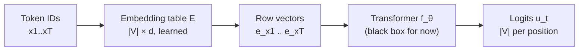

> [!CAVEAT] The playlist title "Lecture 13: LLMs, Next-Word Prediction Loss" (video lNTajqxxOn4) does not match its content. That video actually covers representation learning: embeddings, contrastive learning, semantic search, and RAG. The LLM and next-token material is in video pwQ0l4hFCVI ("Lecture 14"), minutes 01:00 to 39:00. This lesson sources from there.

Language modeling is classification. L01 framed it this way: predicting the next token means choosing one label out of 50,000 to 250,000 possibilities. This lesson makes that precise.

## The counting argument

A text is a sequence of tokens \(x_1, \ldots, x_T\). Each token comes from a vocabulary \(V\) of size about 250,000. The number of possible sequences is \(|V|^T\). [11:03](ts:663)

No model can assign one free parameter per sequence. \(|V|^T\) is astronomically larger than any parameter count. So the joint distribution must be factorized.

The chain rule gives the factorization:

\[ p(x_1, \ldots, x_T) = p(x_1) \cdot p(x_2 \mid x_1) \cdot p(x_3 \mid x_1, x_2) \cdots p(x_T \mid x_1, \ldots, x_{T-1}) \]

Each factor is a distribution over only \(|V|\) choices. That is representable: a vector of logits plus a softmax. The modeling problem reduces to learning each conditional \(p_\theta(x_t \mid x_1, \ldots, x_{t-1})\). [11:52](ts:712)

## Tokenization in one paragraph

Raw text must become token IDs before any of this works. The lecture sketches byte-pair encoding: start from characters, repeatedly merge the most frequent adjacent pair, and keep the resulting subwords as the vocabulary. [09:10](ts:550) Character-level vocabularies are small but make sequences long. Word-level vocabularies keep sequences short but break on rare words like "glioblastoma". Subwords split the difference. The full treatment, with a worked BPE implementation, is in [CS336 L01](../cs336/l01-overview-tokenization.html). What matters here: after tokenization, text is a sequence of integers \(x_t \in V\), and everything downstream operates on those integers.

## From IDs to vectors

A neural network needs numerical inputs. Each token ID is mapped to a learned row vector \(e_{x_t} \in \mathbb{R}^{1 \times d}\), its embedding. The full embedding table \(E \in \mathbb{R}^{|V| \times d}\) is a parameter of the model, trained like everything else. [14:24](ts:864)

Ma uses row vectors throughout the LLM section to match implementation practice, even though math convention prefers column vectors. Every vector multiplies weight matrices on the right. [15:22](ts:922)

## The model as a black box

For the loss derivation, the transformer is just a function \(f_\theta\). It takes the prefix \(x_0, x_1, \ldots, x_{t-1}\) (with \(x_0\) a beginning-of-sequence token) and returns logits \(u_t = f_\theta(x_0, \ldots, x_{t-1}) \in \mathbb{R}^{|V|}\). [36:57](ts:2217)

The conditional probability is the softmax of those logits:

\[ p_\theta(x_t \mid x_1, \ldots, x_{t-1}) = \text{softmax}(f_\theta(x_0, \ldots, x_{t-1}))_{x_t} \]

Only the entry for the actual next token \(x_t\) matters. The rest of the \(|V|\)-dimensional vector is the model's full predictive distribution at that position.

## The training loss

Training maximizes the log-likelihood of observed sequences. For one sequence:

\[ \text{loss}(x_1, \ldots, x_T; \theta) = -\frac{1}{T} \sum_{t=1}^{T} \log p_\theta(x_t \mid x_0, \ldots, x_{t-1}) \]

Each term is a cross-entropy loss between the model's predicted distribution and the one-hot observed token. The lecture works this out on the board: the log of the product becomes a sum of logs, and each log hits exactly one softmax entry, the observed token's. [36:25](ts:2185)

In practice the loss averages over many sequences, and an optimizer like AdamW minimizes it over minibatches. The gradient flows through the whole transformer by backpropagation, the same machinery as L08.

A tiny example makes the loss concrete. Suppose the vocabulary is {cat, sat, mat} and the training sequence is "cat sat". At position 1, the model outputs logits over the three tokens, softmaxes them, and the loss term is \(-\log p_\theta(\text{cat} \mid x_0)\). At position 2, the term is \(-\log p_\theta(\text{sat} \mid x_0, \text{cat})\). The total loss is the average of the two. Every position contributes one term. Every term pushes probability mass toward the token that actually came next.

## One loss, three old ideas

Next-token prediction composes three ideas from earlier in this course:

- **Maximum likelihood** (L03): the loss is the negative log-likelihood of the data under the model. Same crank, new domain.
- **Cross-entropy** (L07): each position's term is the cross-entropy between the predicted distribution and the observed token. The softmax plus log picks out one entry.
- **Classification** (L04, L05): each position is a \(|V|\)-way classification problem. L01 said this on day one. Now the machinery is visible.

The embedding table itself shows the scale. With \(|V| = 250{,}000\) and \(d = 4{,}096\), the table \(E\) holds about a billion parameters before the transformer even starts. The notes cite Qwen3.5's vocabulary of 248,320 tokens as a concrete reference point.

> [!KEY] Next-token prediction is maximum likelihood estimation on text. Every token in every document is one labeled example, and the label is the token itself. That is why web-scale text needs no human annotation.

## Generation

Training sees whole sequences. Generation starts from nothing, or from a prompt, and builds the sequence one token at a time:

1. Given prefix \(x_1, \ldots, x_t\), compute logits \(f_\theta(x_0, \ldots, x_t)\).
2. Sample \(x_{t+1}\) from \(\text{softmax}(\cdot)\).
3. Append \(x_{t+1}\) to the prefix and repeat.

Each generated token feeds back as input for the next step. [27:46](ts:1666)

A prompt is just a starting prefix: \(x_1, \ldots, x_k\) given as a question or instruction, with the model completing \(x_{k+1}, \ldots\). [28:22](ts:1702)

Three inference-time knobs adjust the sampling distribution without retraining:

- **Temperature** \(\tau\): sample from \(\text{softmax}(f_\theta / \tau)\). As \(\tau \to 0\) this becomes greedy decoding (always the argmax). Larger \(\tau\) flattens the distribution. [29:11](ts:1751)
- **Top-k**: keep only the \(k\) most probable tokens, renormalize, sample from those. [35:36](ts:2136)
- **Top-p (nucleus)**: keep the smallest set whose cumulative probability reaches \(p\) (often 0.9), renormalize. Usually combined with temperature around 0.7 to 1.0.

These are decoding choices, not changes to the model. The trained distribution \(p_\theta\) stays fixed.

## Training sees truth, generation sees itself

There is an asymmetry worth naming. During training, every position's prediction conditions on the true prefix from the data. The model never feeds its own guesses back in. During generation, there is no ground truth, so each step conditions on the model's own previous outputs. Errors can compound: one bad token shifts the conditioning for everything after it.

This gap has a name in the literature: exposure bias. The lecture does not dwell on it, but the structure makes it visible. Training is parallel across positions because all prefixes are known upfront. Generation is serial because each token depends on the last. That serial dependence is also why inference systems cache keys and values rather than recomputing them, a theme L14 picks up in the complexity section.

## Why this objective works

The notes (17.1) state the motivation plainly: the object of interest is the distribution of language itself, which sentences are plausible and how text continues. A model that assigns probabilities to sequences and samples continuations from conditional distributions turns every downstream task into conditional generation from a prompt. Classification, summarization, translation, and question answering all become "continue this prompt." That is why next-token prediction is a useful pretraining objective: it is the single task from which the others follow.

> [!INTERVIEW] When asked why LLMs use next-token prediction, give three points. First, the counting argument: \(|V|^T\) sequences cannot be modeled jointly, so the chain rule factorization is forced. Second, every token is a free labeled example, so web text trains without annotation. Third, the learned conditional distribution turns all tasks into prompt continuation. Then mention the loss by name: average negative log-likelihood, one cross-entropy term per position.

## Sources

- Video: [Lecture 14: Transformers, In-Context Learning](https://www.youtube.com/watch?v=pwQ0l4hFCVI) (LLM material: 01:00-39:00)
- Notes: CS229 Spring 2026 lecture notes, Chapter 17.1 (tokenization) and 17.2 (autoregressive models and next-token prediction loss)
- Cross-links: tokenization mechanics in [CS336 L01](../cs336/l01-overview-tokenization.html)
