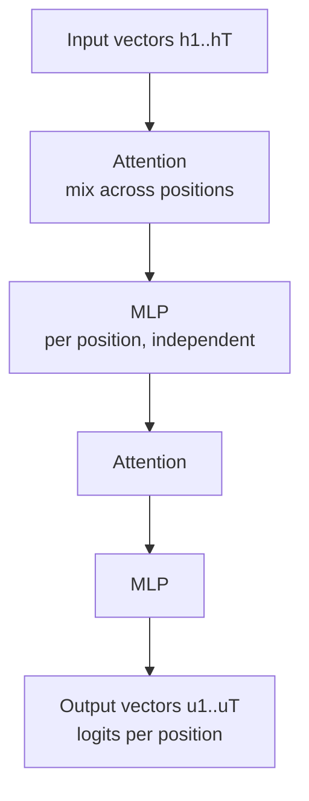
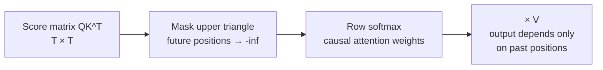

> [!CAVEAT] The video's second half teaches the transformer architecture in full. In-context learning, attention variants, MoE, and SFT appear in the lecture notes (17.4-17.8) rather than on the board. Those sections are labeled as notes material below.

L13 treated the transformer as a black box \(f_\theta\). This lesson opens the box.

## The high-level structure

A transformer alternates two operations across many layers. Attention layers fuse information across positions. MLP layers process each position independently. [39:27](ts:2367)

The MLP is a two- or three-layer network applied separately to every position vector. It has no cross-position dependencies, so it parallelizes trivially. Attention is the only place where positions interact. Everything the model knows about context flows through attention. [40:59](ts:2459)

The whole stack trains end to end by autodifferentiation. Attention is built from small matrix multiplications, the MLP from matrix multiplications, so the backward pass composes the same way as any neural network. [42:03](ts:2523)

## Single-head attention

Attention maps a sequence of vectors to a sequence of vectors. The lecture defines it in three steps.

**Step 1: project into queries, keys, values.** Each input row vector \(h_t^{in} \in \mathbb{R}^{1 \times d}\) multiplies three learned matrices \(W^Q, W^K, W^V \in \mathbb{R}^{d \times d_h}\):

\[ q_t = h_t^{in} W^Q, \quad k_t = h_t^{in} W^K, \quad v_t = h_t^{in} W^V \]

The intuition: the query asks "what information am I looking for," the key advertises "what information I have," and the value carries the actual content forwarded when query and key match. [44:05](ts:2645) Ma is candid that this intuition is rough. The mechanism works, but nobody knows exactly how, in the sense of a precise account of what each head computes. The math is exact. The interpretation is provisional. [46:17](ts:2777)

**Step 2: scores and softmax.** At position \(t\), take inner products of \(q_t\) with every key, scale, and softmax:

\[ p_{t,1}, \ldots, p_{t,T} = \text{softmax}\left(\frac{q_t k_1^\top}{c}, \ldots, \frac{q_t k_T^\top}{c}\right) \]

The scale \(c = \sqrt{d_h}\) keeps the logits near unit variance. Without it, large head dimensions push the softmax into saturation and gradients vanish. [59:14](ts:3554)

**Step 3: weighted values.** The output is the attention-weighted combination:

\[ h_t^{out} = \sum_{j=1}^{T} p_{t,j} v_j \]

In matrix form, with rows stacked into \(Q, K, V\): \(H^{out} = \text{softmax}(QK^\top / c) \, V\), row-wise softmax. [59:53](ts:3593)

## Causal masking

There is a problem. As defined, the output at position \(t\) depends on all inputs, including future ones. That breaks the autoregressive property L13 needs: \(u_t\) must depend only on \(x_1, \ldots, x_{t-1}\).

The fix is masking. For each position \(t\), delete all dependencies on positions after \(t\) before computing the output. In matrix terms, the upper triangle of the \(QK^\top\) score matrix is masked out (set to \(-\infty\) before the softmax). [61:09](ts:3669)

## Multi-head attention

One head computes one kind of interaction. In practice the layer runs \(n_h\) single-head attentions in parallel, each with its own \(W^Q, W^K, W^V\). The \(n_h\) output sequences are concatenated per position and projected through one more matrix to a single output vector. [66:39](ts:3999)

The intuition for why multiple heads help: each head can specialize. One head might track which past entity matters, another the sentiment of past passages. Concatenation plus projection aggregates those specialists. Head counts reach the hundreds in 100B-parameter models. [67:34](ts:4054)

The deeper attention zoo, linear-time alternatives, sparse attention, and mixture-of-experts routing, is taught in [CS336 L04](../cs336/l04-attention-alternatives-moe.html). CS229 covers the standard form. CS336 covers what replaces it at scale.

## Residuals, normalization, and block layout

Around each sublayer sit the usual stabilizers. After attention, normalize, apply the MLP, and add the residual back. Modern models use the pre-norm layout with RMSNorm rather than LayerNorm:

\[ r_t = \text{LN}(h_t^\ell + [\text{att}(h_1^\ell, \ldots, h_T^\ell)]_t), \quad h_t^{\ell+1} = \text{LN}(r_t + \text{MLP}(r_t)) \]

Post-norm versus pre-norm is an ordering detail. The notes point to the figure for the exact layouts. [72:28](ts:4348)

## The T-squared cost

Attention's cost is quadratic in sequence length. Each of the \(T\) positions computes inner products against \(T\) keys, each of dimension \(d_h\): \(T^2 d_h\) operations. The score matrix itself is \(T \times T\). At a million tokens, that is prohibitive, which is why long-context requests get compacted. [74:02](ts:4442)

Two mitigations, briefly:

- **Memory**: the full \(T \times T\) matrix need not be materialized. Compute it in blocks, multiply each block by the corresponding values, and discard. That is the core idea of FlashAttention. [75:45](ts:4545) The same blocking logic applies at generation time to the KV cache: keys and values of past tokens are stored once and reused, so each new token costs one query against the cached keys rather than a full recomputation.
- **Architecture**: attention variants reduce the \(T\) dependence structurally, at some cost in expressiveness. The lecture defers details to the following lecture. [76:02](ts:4562)

> [!PROF] Ma notes that production systems are closer to linear in \(T\) than the naive \(T^2\) suggests, but exactly which variant OpenAI or Anthropic uses is not public knowledge. [76:02](ts:4562)

## Attention variants (notes 17.4)

The variants trade KV-cache memory against quality:

- **Multi-query attention (MQA)**: many query heads share one key head and one value head. Smallest KV cache.
- **Grouped-query attention (GQA)**: query heads split into groups, one key/value head per group. The middle ground most current models use.
- **Sliding window attention**: each position attends only to a recent window, so old keys and values leave the active cache.
- **QK-Norm**: normalize queries and keys before the dot product so the logits cannot saturate when vector norms grow.

## Mixture-of-experts (notes 17.5)

MoE layers replace some dense MLP blocks. A router picks a few experts per token. Each token activates only its chosen experts. Total parameters grow without proportional growth in per-token compute. The router learns which specialized MLP fits the current token and context. Full treatment: [CS336 L04](../cs336/l04-attention-alternatives-moe.html).

## In-context learning (notes 17.6)

In-context learning uses the pretrained model with no gradient updates. Given a few labeled examples \((x^{(1)}, y^{(1)}), \ldots, (x^{(n)}, y^{(n)})\) and a test input \(x^{test}\), concatenate them into one prompt:

> Q: 2 ~ 3 = ? A: 5. Q: 6 ~ 7 = ? A: 13. Q: 15 ~ 2 = ?

The model continues the pattern. If it infers that ~ means addition from the examples, it outputs "A: 17". Nothing is trained. The examples are just more prefix for the autoregressive model to continue.

The same mechanism handles practical formats. A prompt can show message-label pairs in JSON and ask the model to label a new message the same way. Prompting is attractive because it needs no training data, but performance depends on the pretrained model and on prompt wording.

## Zero-shot prompting and SFT (notes 17.7-17.8)

**Zero-shot** is the limiting case: describe the task in words with no examples. Instruction tuning makes this work. Collect many tasks written as natural-language instructions with desired responses, finetune the mixture, and the model learns the convention that an instruction in the prompt should be followed. That is why instruction-tuned models act as zero-shot assistants.

**Supervised finetuning (SFT)** adapts parameters on downstream data instead of freezing them. It is ordinary supervised learning applied to a pretrained model. The post-training pipeline, SFT then RLHF then RLVR, is built in full in [CS336 L15](../cs336/l15-post-training-sft-rlhf.html).

> [!INTERVIEW] When asked how transformers work, start from the type signature: sequence of vectors in, sequence of vectors out. Then the three steps: project to Q/K/V, softmax over scaled query-key inner products, weight the values. Add causal masking as the autoregressive enabler and multi-head as parallel specialists. Then the cost: \(T^2 d_h\) compute, mitigated by FlashAttention-style tiling and GQA. Finish with the phenomena: in-context learning is pattern continuation with frozen weights, and SFT is what teaches instruction following.

## Sources

- Video: [Lecture 14: Transformers, In-Context Learning](https://www.youtube.com/watch?v=pwQ0l4hFCVI) (transformers: 39:00-77:24)
- Notes: CS229 Spring 2026 lecture notes, Chapters 17.3 (transformer architecture), 17.4 (attention variants), 17.5 (MoE), 17.6 (in-context learning), 17.7 (prompting), 17.8 (SFT)
- Cross-links: attention alternatives and MoE in [CS336 L04](../cs336/l04-attention-alternatives-moe.html); SFT and RLHF in [CS336 L15](../cs336/l15-post-training-sft-rlhf.html)
