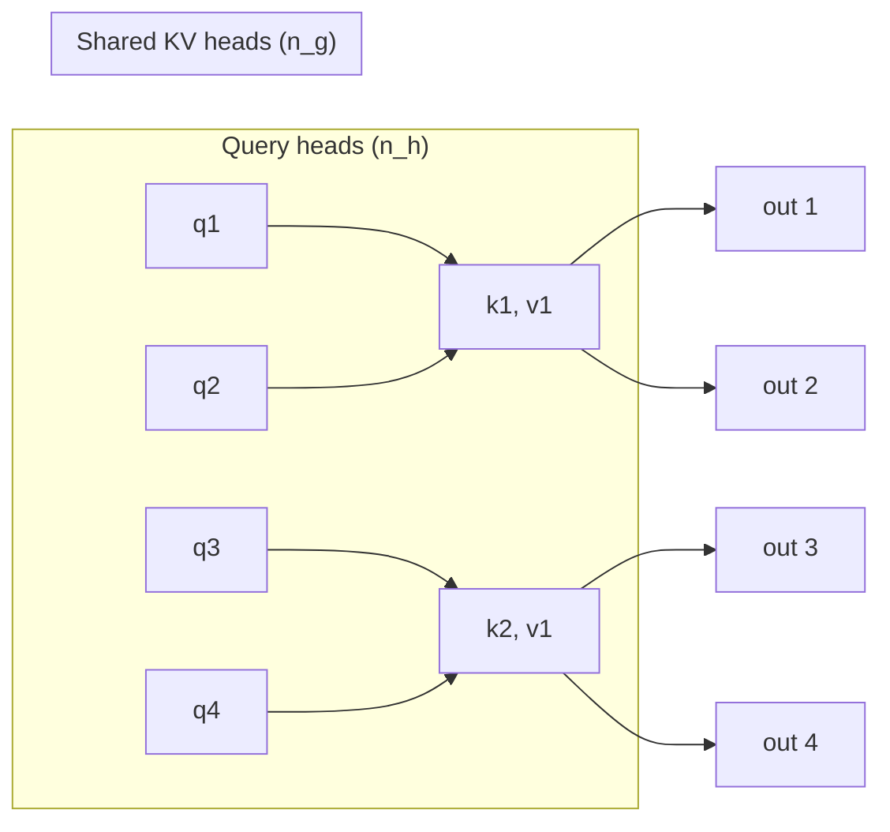
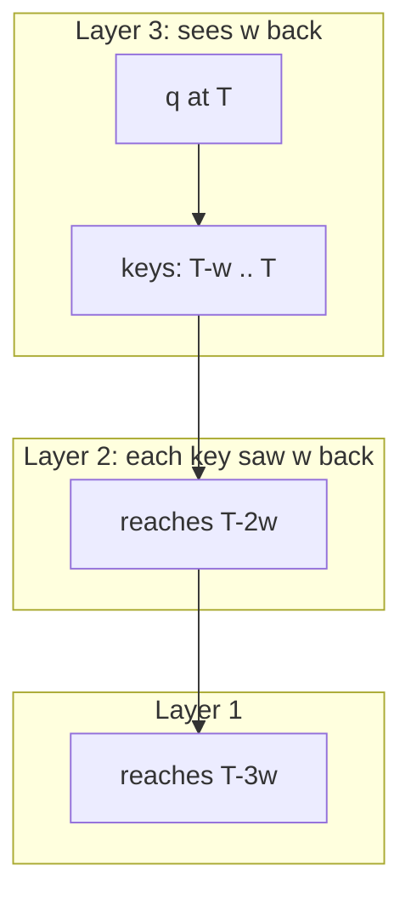

> [!CAVEAT] The playlist titles this video "Lecture 16: Basic Concept in RL, Policy Gradient." That title is wrong. The video is about attention variants: it opens with "last Wednesday, we talked about attention, and today we are going to talk about some variants of attention" [00:08](ts:8). The RL lectures are the two mislabeled videos that follow it.

Last lecture built standard multi-head attention. This lecture asks what to change when attention meets real hardware. Three variants: group-query attention (shrinks the KV cache), sliding window attention (breaks the quadratic compute), and QK normalization (keeps scales sane). The second half turns to mixture of experts and to how pretrained models get used: in-context learning, zero-shot prompting, and supervised fine-tuning. [00:44](ts:44)

## Why attention needs variants

Standard attention has two costs. Compute scales as \(T^2\): every query does an inner product with every key. Memory scales as \(T\): during generation you must store all keys and values, the KV cache. [04:55](ts:295)

The memory cost is the binding constraint at inference. The KV cache eats GPU memory, which caps how many sequences fit in a batch. Small batches mean the GPU cannot parallelize across examples, so decode becomes memory-bound: the compute units sit idle waiting on memory. [06:30](ts:390)

Ma's framing for the whole lecture: architecture co-design with GPU properties. You cannot discuss these variants without the hardware picture. [00:30](ts:30)

## Group-query attention

The KV cache stores keys and values for every head. Group-query attention (GQA) cuts that storage by sharing. Keep all \(n_h\) query heads, but use only \(n_g\) key heads and \(n_g\) value heads, with \(n_g\) much smaller than \(n_h\). Groups of query heads attend to the same keys and values. [07:31](ts:451)

Why shrink keys and values but not queries? During generation you only need the query for the current step. Past queries are already consumed. Keys and values for the whole history must persist. So the memory incentive sits entirely on the K and V side. [18:19](ts:1099)

The grouping is explicit. Let \(\tau = n_h / n_g\) be the number of query heads per key group, with \(n_g\) dividing \(n_h\). Query head \(j\) maps to key group

\[ g(j) = \left\lfloor \frac{j-1}{\tau} \right\rfloor + 1 \in \{1, \dots, n_g\}. \]

The \(j\)-th output head is

\[ H^{out}_j = \mathrm{softmax}_{row}\left(\frac{Q_j K_{g(j)}^\top}{c} + M\right) V_{g(j)}, \]

where \(M\) is the causal mask and \(c\) is the normalization constant. Everything is standard attention except the shared index \(g(j)\). [13:19](ts:799)

Two endpoints fall out. When \(n_g = n_h\), GQA is ordinary multi-head attention. When \(n_g = 1\), every query head shares one key and one value head: that is multi-query attention (MQA), from Shazeer (2019). GQA (Ainslie et al., 2023) sits between them. The three form a spectrum trading model quality against decoding efficiency, with KV cache size shrinking as key-value heads drop. [22:11](ts:1331)

The history matters. MQA came first and proved too aggressive: one key head loses too much of the past. GQA relaxes it with a tunable \(n_g\). Qwen and DeepSeek models adopted GQA, which is why Ma teaches it as the default choice. [22:26](ts:1346)

> [!PROF] Ma is candid that he does not know typical \(n_g\) values offhand ("maybe like 100 or something, we need to check the code") [22:38](ts:1358). The grouping order does not matter because the keys are learned: permute the assignment and training permutes the keys to match [23:06](ts:1386). But the mapping must be static and hard-coded so it compiles to fast GPU kernels [24:03](ts:1443).

## The \(\sqrt{d}\) scaling, derived

The normalization constant \(c\) deserves its heuristic derivation because interviews love it. Each attention score is an inner product of two \(d_h\)-dimensional vectors. If entries are order 1 and roughly random, the inner product concentrates around \(\sqrt{d_h}\). Dividing by \(c = \sqrt{d_h}\) pulls scores back to order 1, so the softmax input scale does not drift when you change head dimension. [15:20](ts:920)

Ma flags this as heuristic, not theorem. Different assumptions about the vectors give different constants. Empirically \(\sqrt{d_h}\) works, so it stays. [17:12](ts:1032)

## Sliding window attention

GQA attacks memory. Sliding window attention attacks compute. The \(T^2\) inner products are the problem: at \(T = 10^6\), a million squared is not a workable number. The fix: each query attends only to the last \(w\) positions. Compute drops from \(T^2\) to \(T \times w\), linear in \(T\). [26:03](ts:1563)

The subtlety is the receptive field across layers. One layer sees \(w\) back. But keys in layer 2 depend on hidden states from layer 1, which already looked \(w\) back. So with \(l\) layers, the top layer effectively reaches \(l \times w\) tokens into the past. [29:05](ts:1745)

The limit is real: beyond \(l \times w\) tokens, the model has no dependence on the past at all. It forgets. Ma notes many papers propose sparse patterns that avoid forgetting, the notes cite them, and the field has not converged on a best one. [29:52](ts:1792)

> [!WARN] Sliding window does not change the KV cache story much. The window bounds compute per query, but the cache still holds the keys you attend to. GQA and sliding windows solve different halves of the cost problem.

## QK normalization

One small detail before leaving attention. The \(\sqrt{d}\) heuristic assumes query and key entries stay order 1. Training can break that assumption: magnitudes drift, and the heuristic silently fails. Some open models normalize \(q\) and \(k\) (RMS norm) before the inner product, so the scale stays controlled by construction. Another heuristic, also empirically motivated. [30:33](ts:1833)

## Mixture of experts: the CS229 framing

The lecture then turns to the MLP half of the transformer and introduces mixture of experts. The mechanics (routing, top-k selection, load balancing, shared experts) are covered in depth in [CS336 L04](../cs336/l04-attention-alternatives-moe.html), so this lesson keeps only Ma's framing.

The core idea: disentangle memory from compute. Keep 128 experts in memory but activate 8 per token. Total parameters grow. Per-token compute does not. That is why open models report sizes like 30B-A3B: 30 billion total parameters, 3 billion active during inference. A 1 trillion parameter dense model cannot be served at reasonable latency and price. A 1 trillion parameter MoE with 30B active behaves like a 30B model at serving time. [32:44](ts:1964) [50:55](ts:3055)

Two clarifications Ma stresses. Routing happens per token per layer, not per sequence: each position in each layer independently chooses its experts [38:54](ts:2334). And specialization is emergent, not designed: nobody trains the math expert on math. Experts specialize because specialization minimizes the loss, though how strong the specialization is remains debated [38:09](ts:2289).

For the routing equations, the top-k mechanism, shared experts (DeepSeek V3), and the load-balancing regularization that keeps all experts in use, see [CS336 L04](../cs336/l04-attention-alternatives-moe.html).

## In-context learning, zero-shot, and why they shocked the field

The last third covers how pretrained models get used. In-context learning was taught in [L14](l14-transformers-icl.html). Ma adds the perspective that made it shocking.

Few-shot prompting concatenates examples into the context: question, answer, question, answer, then the test question, and the model completes it. Ma's example: "2 ~ 3 = ? A: 5. 6 ~ 7 = ? A: 13. 15 ~ 2 = ? A:" Humans guess the operator is plus and answer 17. Models do the same from a few examples. [52:01](ts:3121) [53:22](ts:3202)

The striking fact: parameters never update. The model learns the task from the string alone. If you believe capability lives in parameters, in-context learning should not improve fundamental capabilities much. It teaches style and definitions, not new skills. A few examples will not teach cancer classification from scans. That still needs tuning. [58:14](ts:3494)

Zero-shot drops the examples entirely: just a task description, optionally with the desired output format. This was the GPT-3 surprise. Researchers expected new tasks to need at least some training. Prompting alone worked, and it changed industrial deployment: instead of collecting data, training a specialized model per company, and serving N models, you serve one model and each company writes prompts. [59:26](ts:3566) [62:23](ts:3743)

Capabilities once thought emergent at scale now distill into small models, and instruction-style data increasingly appears during training itself. So the few-shot/zero-shot boundary keeps moving. [63:15](ts:3795)

## Supervised fine-tuning and instruction tuning

To strengthen these capabilities deliberately, collect instruction data and train on it. Given pairs \((x_i, y_i)\) where \(x\) is the instruction and \(y\) is the answer, minimize the negative log likelihood of \(y\) given \(x\), decomposed per token:

\[ \mathcal{L} = -\frac{1}{n}\sum_{i=1}^{n} \sum_{t=1}^{T_i} \log p_\theta(y_{t,i} \mid x_i, y_{<t,i}). \]

The prompt \(x\) is never predicted, only conditioned on. Continue training from the pretrained checkpoint. Anything of this form is supervised fine-tuning (SFT). When the dataset is instruction-response pairs, it is called instruction tuning. [64:44](ts:3884) [67:43](ts:4063)

One subtlety from the Q&A: if \(y\) contains a chain of thought, SFT trains the model to imitate the human's reasoning path, which can discourage the model from finding its own better path. Micromanagement helps versus nothing, but RL on the outcome is the cleaner way to get reasoning. That is the teaser for the RL lectures. [69:45](ts:4185)

> [!INTERVIEW] When asked how GQA differs from MHA, say: same queries, fewer key/value heads shared across query groups, KV cache shrinks by \(n_h/n_g\), MQA is the \(n_g = 1\) endpoint. When asked why SFT is "supervised," say: the answers \(y\) are the supervision signal, and "fine-tuning" means starting from a pretrained checkpoint. When asked what in-context learning cannot do, say: it cannot add fundamental capabilities because parameters never update.

## Sources

- Video: [Lecture 15: Attention Variants](https://www.youtube.com/watch?v=hHC-SF3utxg) (1:13:19). Playlist title ("Lecture 16: Basic Concept in RL, Policy Gradient") is incorrect.
- Notes: CS229 Spring 2026 lecture notes, Chapter 17.4 (Variants of Attention), 17.5 (Mixture-of-Experts), 17.6-17.8 (in-context learning, zero-shot, SFT)
- Papers: Shazeer (2019) multi-query attention. Ainslie et al. (2023) grouped-query attention
- Mechanics of MoE: [CS336 L04: Attention Alternatives and MoE](../cs336/l04-attention-alternatives-moe.html)
- Transformer and ICL basics: [CS229 L14](l14-transformers-icl.html)
