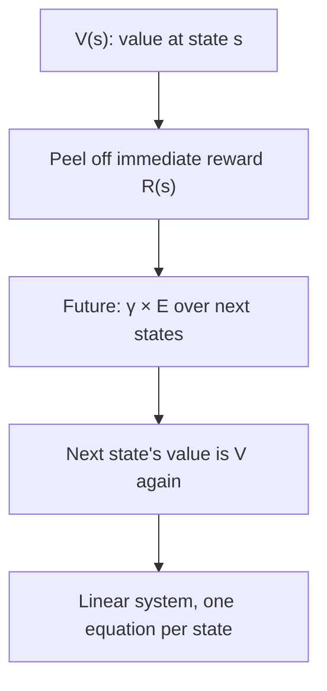

> [!CAVEAT] The playlist titles this video "Lecture 18: GMM (EM), PCA." The transcript proves it is the first reinforcement learning lecture. The same mislabel affects the next video. The lesson follows the actual content.

Reinforcement learning starts where the rest of the course stops. Supervised learning predicts. RL decides, acts, and lives with the consequences. This lecture builds the modeling framework (the MDP) and ends with the first derivation of policy gradient.

## Sequential decision making

The problem RL solves is sequential decision making. [00:28](ts:28) Two words, each load-bearing:

- **Decision** means your output changes the world. You operate the robot, you do not just label its picture. Actions have ramifications. [01:41](ts:101)
- **Sequential** means you decide repeatedly. Operating a robot means issuing a command at every time step: go left, go right, raise the arm. [02:08](ts:128)

Greedy fails here. What is optimal right now may be terrible for the future. You must reason about downstream consequences. [02:28](ts:148)

A second tension: exploration versus exploitation. Visiting a new restaurant is exploration. It is not optimal given what you know, but it buys information for future decisions. Ma notes the course mostly skips this tradeoff. In current practice, algorithms explore implicitly and that is enough. [02:47](ts:167)

## Learning from rewards, not labels

The classical RL setup has almost no supervision. You do not know the optimal actions, even in training. What you get is a **reward**: a scalar that says whether a sequence of actions was good or bad. It never tells you which action was correct. [05:24](ts:324)

This forces a trial-and-error loop. Generate actions, try them, reinforce the good ones, penalize the bad ones. Data collection and training are the same loop: you collect data yourself, in an active way, then train on what worked. [06:09](ts:369)

> [!KEY] Supervised learning learns a mapping from inputs to labels. RL learns a policy from rewards. The reward judges outcomes. It never demonstrates the right action.

## The MDP

To talk about algorithms, you need a model of the world. That model is the Markov decision process. [07:24](ts:444)

The running example: a robot on a 1D tape, cells 1 through 10, with a goal cell. [08:01](ts:481)

An MDP is a tuple \((S, A, P, R, \gamma)\):

- **\(S\)**, the state set. Everything needed to describe the world. Here, the robot's cell. For a real robot: joint angles, positions, camera images. For Go: the whole board, \(3^{361}\) configurations. Choosing what counts as state is a modeling decision. You abstract away what you cannot model. [09:07](ts:547)
- **\(A\)**, the action set. Here: go left, go right. For a real robot: torques on each joint. For Go: board positions. [11:19](ts:679)
- **\(P_{sa}\)**, the transition dynamics. Given state \(s\) and action \(a\), a probability distribution over the next state. \(P_{sa}(s')\) is the chance of landing in \(s'\). It sums to 1 over \(s'\). It can be deterministic, but often it is stochastic: an imperfect controller goes left with probability 0.9 and stays put with 0.1. [12:09](ts:729)
- **\(R\)**, the reward function. Maps states to real numbers. It encodes the goal: +1 at the goal cell, −0.1 everywhere else, so the robot reaches the goal fast and stays there. [18:12](ts:1092)
- **\(\gamma\)**, the discount factor, between 0 and 1, usually near 0.99. [26:30](ts:1590)

### Reward shaping

You may define the reward any way you want. Two philosophies compete. [21:19](ts:1279)

One: reward only the true goal (reach cell 9). Two: add a slope, rewarding cell 8 more than cell 7, to give the algorithm gradient to follow. The second is **reward shaping**.

Shaping has a failure mode. Suppose an unknown teleport tunnel runs from cell 2 to cell 9. Your slope says "walk toward 9," but the optimal move is "go to 2 and teleport." The shaped reward misguides the robot. When you understand the task poorly, reward the final outcome and nothing else. [22:47](ts:1367)

> [!PROF] Ma's manager analogy: a manager who knows exactly what to do gives fine-grained rewards. A hands-off manager states the final goal and does not care how it is achieved. [24:21](ts:1461)

## Trajectories and return

Interact with the MDP and you get a **trajectory**: \(s_0, a_0, s_1, a_1, \ldots\). The agent picks actions. The environment samples next states from \(P_{sa}\). [16:30](ts:990)

The **return** (or payoff) of a trajectory is the discounted sum of rewards:

\[ \sum_{t=0}^{\infty} \gamma^t R(s_t) \]

The **expected return** averages over the randomness of transitions. The discount factor does two jobs. It expresses time preference ($1 today beats $1 in a century). It also bounds the payoff: if each reward is bounded by \(m\), the total is bounded by \(m/(1-\gamma)\), so infinite horizons stay well-defined. [27:42](ts:1662)

The goal of RL: maximize the expected return. [32:02](ts:1922)

## Policies

The Markov property is the key structural fact. The next state depends only on the current state and action, never on history. Consequence: the optimal action at time \(t\) depends only on \(s_t\). The past is the past. [32:26](ts:1946)

So the thing you are looking for is a **policy** \(\pi\): a mapping from states to actions, \(\pi: S \to A\). [34:12](ts:2052)

Two kinds:

- **Deterministic**: one action per state. There always exists a deterministic optimal policy. If two actions tie, pick either. Randomizing between a payoff-1.0 action and a payoff-2.0 action just dilutes the better one. [35:54](ts:2154)
- **Randomized (stochastic)**: \(\pi(a \mid s)\), a distribution over actions given the state. Worse in principle, but essential in practice. A deterministic policy is a hard switch: a small parameter update jumps from action 1 to action 2 with no continuity. A stochastic policy moves smoothly, 50/50 to 40/60 to 30/70, which gradient methods need. [37:02](ts:2222)

## Value functions

The **value function** \(V^\pi(s)\) is the expected total payoff starting from state \(s\) and following policy \(\pi\) forever. [40:03](ts:2403)

The **optimal value function** is the best you can do:

\[ V^*(s) = \max_\pi V^\pi(s) \]

And the **optimal policy** is the argmax:

\[ \pi^*(s) = \arg\max_{a \in A} \sum_{s'} P_{sa}(s') V^*(s') \]

One policy is simultaneously optimal for every starting state. [42:50](ts:2570)

## The Bellman equation

The Bellman equation turns an infinite sequential problem into a recursion you can solve. Ma builds intuition with a geometric series first. [43:36](ts:2616)

To compute \(1 + \gamma + \gamma^2 + \cdots\), call it \(V\), peel off the first term, factor out \(\gamma\), and notice the remainder is \(V\) again:

\[ V = 1 + \gamma V \quad\Rightarrow\quad V = \frac{1}{1-\gamma} \]

The same trick on \(V^\pi\): peel off the immediate reward \(R(s)\), factor \(\gamma\), and the remaining future payoff starting from \(s_1\) is \(V^\pi(s_1)\) again. Summing over possible next states:

\[ V^\pi(s) = R(s) + \gamma \sum_{s'} P_{s,\pi(s)}(s')\, V^\pi(s') \]

The left side mentions \(V^\pi\). The right side does too. It is a linear system: one equation per state, linear in all the \(V^\pi\) values. Solve the linear system and you have every value. For the optimal value function, replace the policy's action with a max over actions:

\[ V^*(s) = R(s) + \max_{a \in A} \gamma \sum_{s'} P_{sa}(s')\, V^*(s') \]

The notes develop two classical solvers from this. **Value iteration** repeatedly applies the Bellman backup until convergence. **Policy iteration** alternates between evaluating the current policy and greedily improving it. For small MDPs policy iteration converges in few steps. For large ones value iteration is preferred. The lecture skips both, jumping straight to the algorithm family that matters for language models. [55:44](ts:3344)

## Policy gradient: the setup

REINFORCE (all caps, for historical reasons) is the precursor to every RL algorithm used for LLMs. It is simpler than the value-function machinery above, which is exactly why it survives in the LLM setting. [55:44](ts:3344)

It works only for **stochastic** policies. Parameterize one with a neural network: \(\pi_\theta(a \mid s)\). Two requirements: the network evaluates the density for any \((s, a)\), and you can sample from it. [57:42](ts:3462)

Define the expected return of the parameterized policy:

\[ \eta(\theta) = \mathbb{E}_{\tau \sim P_\theta}\left[ \sum_t \gamma^t R(s_t, a_t) \right] \]

The plan is gradient ascent on \(\eta\). The obstacle: \(\theta\) does not appear inside the expectation. The rewards and states are just numbers you sampled. All the \(\theta\)-dependence hides in the *sampling distribution*. You cannot push the gradient inside the expectation the usual way. [01:01:00](ts:3660)

## The log-derivative trick

Abstract the problem: maximize \(\mathbb{E}_{x \sim p_\theta}[f(x)]\) where \(f\) has no \(\theta\) in it. Write the expectation as an integral, swap gradient and integral (the integral is over a fixed measure, so this is legal), and use one identity:

\[ \nabla_\theta \log p_\theta(x) = \frac{\nabla_\theta p_\theta(x)}{p_\theta(x)} \]

Multiply and divide by \(p_\theta\) to get back to an expectation:

\[ \nabla_\theta \mathbb{E}_{x \sim p_\theta}[f(x)] = \mathbb{E}_{x \sim p_\theta}[ \nabla_\theta \log p_\theta(x) \cdot f(x) ] \]

Now everything is computable: evaluate \(f\) on samples, evaluate the score \(\nabla_\theta \log p_\theta\), take the empirical mean. [01:04:33](ts:3873)

Apply it to trajectories. The trajectory probability factors:

\[ P_\theta(\tau) = \mu(s_0)\,\pi_\theta(a_0 \mid s_0)\,P_{s_0a_0}(s_1)\,\pi_\theta(a_1 \mid s_1)\cdots \]

Take the log-gradient. Every term that does not involve \(\theta\) vanishes, including the transition dynamics \(P_{s_t a_t}(s_{t+1})\), which you may not even know. What survives:

\[ \nabla_\theta \eta(\theta) = \mathbb{E}_{\tau \sim P_\theta}\left[ \left(\sum_t \nabla_\theta \log \pi_\theta(a_t \mid s_t)\right) \left(\sum_t \gamma^t R(s_t)\right) \right] \]

> [!KEY] The policy gradient needs no model of the world. The unknown transition dynamics drop out of the gradient. You only need to sample trajectories and evaluate your own policy's log-probabilities.

A student's worry: for LLMs the trajectory space is astronomically large. Ma's answer: you never enumerate it. You sample a few trajectories and take the empirical mean. The variance is not exponential in \(T\), and the next lecture is entirely about reducing it. [01:14:43](ts:4483)

> **Interview line:** When asked how RL differs from supervised learning, say: no labels, only scalar rewards. The agent collects its own data by trial and error. The goal is a policy maximizing expected discounted return. Then write the MDP tuple and the Bellman equation. For "why policy gradient," say: \(\theta\) lives in the sampling distribution, not inside the expectation, so you use the log-derivative trick, and the unknown dynamics cancel out.

## Sources

- Video: [Lecture 16: RL Basics, MDPs](https://www.youtube.com/watch?v=xveNBYVTrqw) (1:16:25; playlist mislabels it "Lecture 18: GMM (EM), PCA")
- Notes: CS229 Spring 2026 lecture notes, Chapters 19 (RL/MDPs), 21.1 (REINFORCE)
