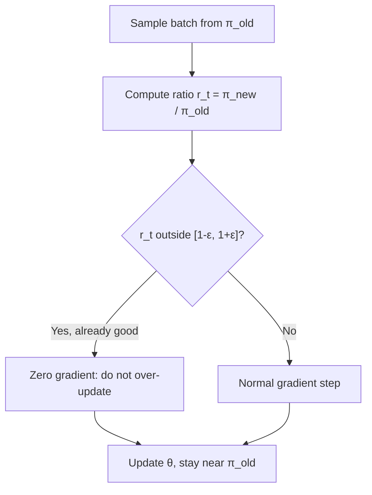
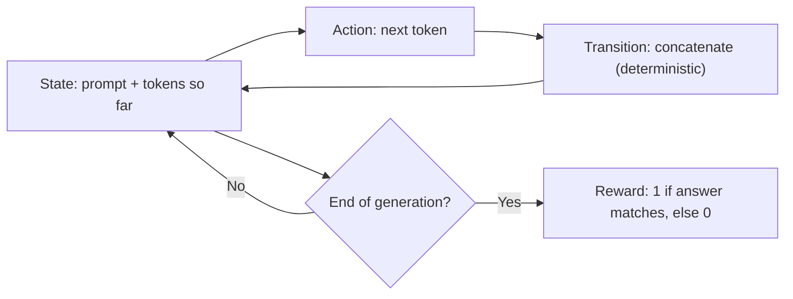

> [!CAVEAT] The playlist titles this video "Lecture 20: GMM (EM), PCA." The transcript proves it is the quarter's final lecture, on policy gradient, PPO, and RL for language models.

The last lecture of the quarter finishes policy gradient and aims it at the problem the field cares about most: training language models to reason. Three ideas carry the lecture: variance reduction through baselines, PPO's answer to on-policy data waste, and the MDP formulation that turns chain-of-thought into an RL problem.

## What policy gradient is really doing

Recall the estimator from last lecture. Stare at it instead of deriving it, and the meaning is plain. [00:55](ts:55)

You are maximizing the log-probability of the actions you sampled, weighted by reward. High reward: push the trajectory's log-likelihood up hard. Zero reward: weight zero, no push at all. The reward is a weighting knob on likelihood maximization. [03:01](ts:181)

## The zero-expectation identity

One fact makes every simplification in this lecture possible. Sample \(a_t\) from your own policy \(\pi_\theta\), then take the expected gradient of its log-probability:

\[ \mathbb{E}_{a_t \sim \pi_\theta(\cdot \mid s_t)}[ \nabla_\theta \log \pi_\theta(a_t \mid s_t) ] = 0 \]

Proof sketch: expand the expectation as an integral, apply the chain rule \(\nabla \log p = \nabla p / p\), cancel, swap integral and gradient, and you get \(\nabla_\theta 1 = 0\). A probability distribution always integrates to 1, so its gradient is nothing. [04:09](ts:249)

Intuition: with no reward weighting, no action is better or worse than any other, so the gradient should be zero. The reward is the only thing that breaks the symmetry. [07:00](ts:420)

## Reward-to-go

The vanilla estimator weights every action's log-gradient by the *entire* trajectory return, including rewards earned before the action was taken. Those past rewards are constants from action \(a_t\)'s perspective: nothing \(a_t\) does can change them. [09:00](ts:540)

Formalize with the law of total expectation. Condition on the full history up to \(s_t\). The past-reward terms become constants, the inner expectation over \(a_t\) hits the zero-identity, and they vanish. What survives is the **reward-to-go**: only rewards from time \(t\) onward, the part the action can still influence. [14:46](ts:886)

> [!KEY] Weight each action only by the future it can affect. Past rewards are sunk costs. Including them adds variance, not signal.

## Baselines

The zero-identity gives you a free knob. You may add or subtract anything that does not depend on \(a_t\) (a function of \(s_t\) only) without changing the expected gradient. Subtract a **baseline** \(b(s_t)\): [16:07](ts:967)

\[ \nabla_\theta \eta \approx \sum_t \nabla_\theta \log \pi_\theta(a_t \mid s_t) \cdot (R_{\geq t} - b(s_t)) \]

Expectation unchanged. Variance potentially much smaller. The example: rewards always fall between 10 and 11. Without a baseline you reinforce both the 10-action and the 11-action, just with different strengths. Subtract 10.5 and the 10-action becomes an explicit *negative* example (−0.5) while the 11-action stays positive (+0.5). Same expectation, far more direct learning signal. [17:35](ts:1055)

The subtlety Ma stresses: subtract a constant per state, not one global constant. If one state yields rewards in [10, 11] and another in [0, 1], subtract 10.5 for the first and 0.5 for the second, so every state's adjusted rewards sit on the same scale. [19:48](ts:1188)

This is classical control variates: find something correlated with your random variable that has mean zero, subtract it, variance shrinks.

## The on-policy bottleneck

The REINFORCE loop is: sample trajectories from \(\pi_\theta\), estimate the gradient, update \(\theta\). [26:38](ts:1598)

It is **on-policy**. The estimator requires trajectories sampled from the *current* \(\theta\). Take one gradient step and your samples are stale. A second step needs fresh sampling. Each batch of trajectories buys exactly one update. When sampling is expensive (and for LLMs it is), this is brutally data-inefficient. [28:02](ts:1682)

PPO exists to reuse samples across several updates.

## Importance sampling

Want to estimate the gradient at \(\theta\) using trajectories sampled from an older policy \(\pi_{\theta_{old}}\)? Correct the distribution mismatch with the likelihood ratio: [30:18](ts:1818)

\[ r_t(\theta) = \frac{\pi_\theta(a_t \mid s_t)}{\pi_{\theta_{old}}(a_t \mid s_t)} \]

Ma corrects only the action distribution, not the state distribution. The states still come from the old policy's rollouts, which is an approximation, but the action correction is exact and computable. The surrogate objective becomes an expectation over old-policy states and actions, weighted by \(r_t(\theta)\) times the advantage. [31:07](ts:1867)

## PPO's clipping: the four cases

The ratio \(r_t\) can explode. If the new policy assigns 60x the old policy's probability to an action, the gradient explodes with it. PPO's answer: clip. Walk through the four cases with advantage \(\hat{A}_t\) and ratio \(r_t\): [38:21](ts:2301)

| Advantage | Ratio | Meaning | PPO does |
|---|---|---|---|
| Positive (good action) | \(r_t > 1 + \epsilon\) | Already better than old policy | Zero it out. No need to push further. |
| Positive | \(r_t < 1 + \epsilon\) | Good action, not yet likely enough | Normal gradient. Increase its probability. |
| Negative (bad action) | \(r_t < 1 - \epsilon\) | Already less likely than old policy | Zero it out. Already heading the right way. |
| Negative | \(r_t > 1 - \epsilon\) | Bad action, still too likely | Normal gradient. Push its probability down. |

The paper's compact formula implements exactly this case analysis:

\[ J^{PPO}(\theta) = \mathbb{E}\left[ \min\left( r_t \hat{A}_t,\; \text{clip}(r_t, 1-\epsilon, 1+\epsilon)\,\hat{A}_t \right) \right] \]

When the ratio is inside the clip range, both terms agree and you get the plain gradient. When it escapes, the min picks the clipped constant, which has no gradient. Typical \(\epsilon\): 0.2, sometimes 0.28. [43:01](ts:2581)

Ma is candid about the theory. The story is "stay near the old policy so the state-distribution approximation stays valid," but he does not find the justifications convincing. PPO's stability for post-training is still an open problem. The frontier labs may know tricks the open community has not converged on. [24:29](ts:1469)

A student asks the obvious: does clipping slow learning? Yes, exactly. That is the price of stability. [49:01](ts:2941)

## CISPO

A newer variant Ma's own training runs use instead of PPO. Same four cases, different clipping philosophy: [51:20](ts:3080)

- **PPO** zeroes the gradient when the ratio escapes the clip range. No learning at all in that regime.
- **CISPO** clips the *value* but keeps a gradient. Above \(1 + \epsilon\) with positive advantage, it holds the contribution constant at the clip boundary rather than dropping it. Learning continues, just less aggressively.

The motivation differs too. PPO clips because "you are already doing fine, stop updating." CISPO clips because "large ratios mean large, unstable updates," regardless of whether the direction is good. On the negative-advantage side, CISPO is reluctant to crush a bad action's probability to zero: over-penalizing kills diversity and collapses to a deterministic local minimum. A bad action today might combine well with others tomorrow, so leave it some chance. [54:51](ts:3291)

## Chain-of-thought

Now the pivot to language models. Instead of answering immediately, let the model generate thinking tokens \(z_1 \ldots z_n\) before the answer \(y_1 \ldots y_k\). [56:27](ts:3387)

Two discovery paths:

- **Few-shot CoT**: prompt with hand-written step-by-step examples, model imitates the pattern. [59:32](ts:3572)
- **Zero-shot CoT**: append "let us think step by step" to the prompt. Accuracy jumps 5-20% from those few words. [01:00:00](ts:3600)

Supervised fine-tuning on thinking traces hits a ceiling. Human-crafted reasoning is too clean: real thinking tokens are messy, back-and-forth, full of shorthand and self-doubt, and models trained on succinct traces actually do worse. You cannot hand-write the data the model needs. [01:01:10](ts:3670)

## RLVR: the MDP for language models

Reinforcement learning sidesteps the data problem. You do not label *how* to think. You only judge whether the final answer is right. Map generation onto an MDP: [01:03:55](ts:3835)

- **State** \(s_t\): the prompt plus all tokens generated so far.
- **Action** \(a_t\): the next token.
- **Transition**: deterministic and trivial, concatenation. \(s_{t+1}\) is just \(s_t\) plus the new token.
- **Reward**: binary, at the very end only. 1 if the extracted answer matches ground truth, 0 otherwise.

As taught in [CS336 L15](../cs336/l15-post-training-sft-rlhf.html), this is the RLHF/RLVR setup from the application side. Here is the foundation underneath it: the same policy gradient, the same likelihood ratio, the same clipping, now with tokens as actions.

Practical details from the lecture:

- **Answer extraction must be programmatic.** Early setups forced the model to wrap answers in tags and parsed them with a simple matcher. No model-based judging in the loop if you can avoid it. [01:08:50](ts:4130)
- **The baseline is a group average.** Sample 8 trajectories for the same question, average their rewards to get \(\bar{r}\), subtract it. Rewards of (1,0,0,0,0,0,0,0) become (+7/8, −1/8, …). This is the GRPO-style baseline: no learned value function, just the batch mean. Optionally divide by the standard deviation. [01:11:08](ts:4268)
- **You need a non-zero starting reward.** RL bootstraps from success. If the initial policy never produces a correct answer, every reward is 0 and nothing learns. Llama 4's near-zero thinking capability made RL nearly useless on it at first. Qwen and DeepSeek started with a little thinking ability, got one success in eight, reinforced it, and bootstrapped upward. SFT on reflective traces is one way to buy that first success. [01:13:38](ts:4418)
- **LLM-as-judge is hackable.** Using a model to score answers risks the solver gaming the judge's stylistic preferences rather than correctness. How hackable depends on the judge's size. The question is open. [01:16:11](ts:4571)

## Compute reality

RL for LLMs has three phases: generation, reward computation, training. Generation dominates because it is sequential: token by token, no parallelization, with the full KV cache in memory. Training is a forward-backward pass over already-generated trajectories, much like pretraining. Pretraining has no generation phase at all (data comes from the internet). RLVR pays for generation every iteration. [01:17:21](ts:4641)

> **Interview line:** When asked how RL trains reasoning models, give the MDP mapping in one breath: state is prompt plus generated tokens, action is the next token, transitions are deterministic concatenation, reward is binary answer-match at the end. Then say why: SFT cannot teach thinking because good thinking traces are messy and unwritable by hand, so you reward outcomes and let the policy discover the process. Name PPO's clip as the stabilizer and the group-mean baseline as the variance reducer.

## Sources

- Video: [Lecture 17: Policy Gradient, PPO, RLVR](https://www.youtube.com/watch?v=J7CossjMvEg) (1:18:56; playlist mislabels it "Lecture 20: GMM (EM), PCA")
- Notes: CS229 Spring 2026 lecture notes, Chapter 21 (policy gradient, PPO)
- Application side: [CS336 L15: Post-Training: SFT and RLHF](../cs336/l15-post-training-sft-rlhf.html), [CS336 L16: RLVR](../cs336/l16-post-training-rlvr.html)
