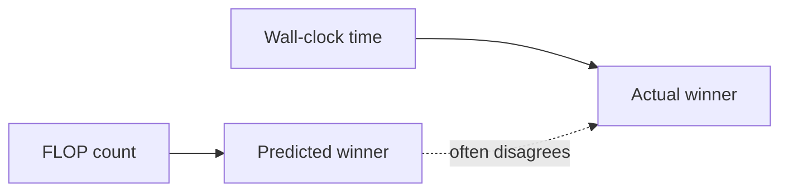
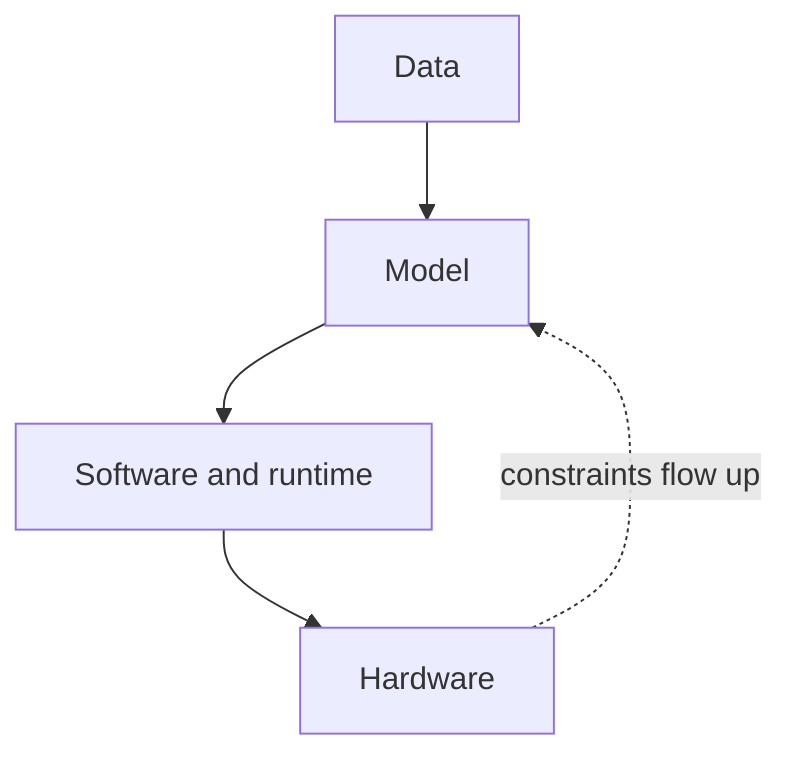

The model is only half the story. The other half is the system that trains it and serves it. This course studies that half.

## Why systems decide how far ML goes

Model capability grows with three inputs: compute, data, and parameters. Kaplan et al. showed this scaling relationship in 2020. Larger models also gain abilities that smaller ones lack entirely. Few-shot learning and chain-of-thought reasoning appear only past certain scales.

But capability has a price, and the price grows faster than the hardware. Training compute for ML has grown roughly 32x every two years. Moore's law gives 2x in the same period. Model sizes now exceed what a single accelerator can hold. GPT-4 scale weights do not fit in one A100, even the 80GB version.

Training a frontier model costs tens of millions of dollars up front. Inference costs a fraction of a cent per call, but it accumulates across millions of users. Real deployments need low latency. Training runs last months. Power and cloud bills dominate budgets.

So efficiency is not an optimization detail. It is the binding constraint on what gets built.

## Algorithmic scaling is not real-world performance

This is the central claim of the course. A better asymptotic complexity does not guarantee a faster program.

Two exhibits from the intro lecture:

**Linear attention versus FlashAttention.** Linear attention scales as O(N) in context length. Standard attention scales as O(N^2). On paper, linear attention wins for long contexts. In wall-clock time, FlashAttention wins. It is a hardware-aware implementation of exact attention. The asymptotically worse algorithm runs faster because it fits the hardware.

**EfficientNet versus ResNet.** EfficientNet uses depthwise convolutions with far fewer FLOPs than competing ResNets. Despite the lower FLOP count, runtime was higher. Counting FLOPs predicted the wrong winner.

> [!KEY] Never trust FLOP counts alone. The hardware decides which operations are cheap. Systems for ML is the discipline of making algorithms and hardware agree.

## The full stack

Efficiency work happens at four levels, and they interact:

- **Data.** Higher quality samples, compression, dimensionality reduction. Less data moved means less time spent.
- **Model.** Quantization, distillation, pruning, sparsification, architecture search. Smaller or cheaper models for the same quality.
- **Software and runtime.** Mapping, scheduling, parallel distribution, pipelining. How the computation is organized across devices.
- **Hardware.** GPUs, TPUs, and specialized accelerators. The physical substrate everything else targets.

A decision at one level changes the best choice at the others. Quantizing weights to 8-bit integers shrinks memory traffic and speeds up math, but naive quantization destroys accuracy past a few billion parameters. Dettmers et al. showed that outlier-aware mixed precision makes 8-bit inference work up to 175B parameters with no accuracy loss. That is a model-level insight discovered by inspecting hardware-level behavior.

Sparsity works the same way. Mixture-of-experts replaces one giant dense matrix with many small experts and routes each input to a few of them. The model grows in capacity without growing in per-token cost. For the mechanics, see [CS336 L04](../cs336/l04-attention-alternatives-moe.html).

## Parallelism is a mapping problem

No frontier model trains on one device. Scaling requires splitting work across many accelerators, and the split is a combinatorial optimization problem over the compute graph and the hardware topology.

Two basic splits illustrate the trade-off:

| | Model parallelism | Tensor parallelism |
|---|---|---|
| What is split | Whole layers across devices | Tensors inside one operation |
| Communication | Less | More |
| Idle time | More | Less |

Network topology matters too. Links inside one machine are orders of magnitude faster than links between machines. The optimal mapping must know the hardware. For the full treatment, see [CS336 L07](../cs336/l07-parallelism-1.html) and [CS336 L08](../cs336/l08-parallelism-2.html).

## What this course covers

The course moves through the stack in order:

1. **Transformer architecture review.** Sequence models, attention, pretraining and fine-tuning. (Bridge: [CS336 L01](../cs336/l01-overview-tokenization.html) and [CS336 L03](../cs336/l03-architectures-hyperparameters.html) cover the model side in depth. This course moves fast here.)
2. **Hardware-aware algorithm design.** Accelerators, the GPU memory hierarchy, arithmetic intensity, the roofline model.
3. **Analyzing transformer performance.** FLOP counting for training and inference, KV-cache efficiency, speculative decoding.
4. **Efficient attention.** FlashAttention as the canonical hardware-aware algorithm.
5. **Memory-efficient networks.** Quantization, sparsity, pruning, distillation.
6. **Adapting LLMs.** Scaling laws, fine-tuning, RLHF, parameter-efficient methods. (Bridge: [CS336 L15](../cs336/l15-post-training-sft-rlhf.html).)
7. **Parallelism.** Data, tensor, and pipeline parallelism, ZeRO, automatic parallelization.
8. **Efficient architectures and serving.** Attention-free models, MoE, inference systems.
9. **Guest talks.** Practitioners from industry on real systems problems.

## Prerequisites and posture

Python and NumPy. Probability and linear algebra. Multivariable calculus. Prior ML foundations (CS229, CS230, or equivalent) is preferred. This course assumes you know what a transformer does. It teaches you what a transformer costs.

The project asks for the fastest high-quality language model inference on a single GPU, using the course techniques. That is the right summary of the whole course in one sentence: speed with quality held fixed.

> [!CAVEAT] The exported intro deck is labeled Fall 2023. The course site and calendar are Fall 2024, the latest offering. Content matches the Fall 2024 calendar.

> **Interview line:** When asked why systems matter for ML, give the two exhibits: linear attention loses to FlashAttention in wall-clock time despite better asymptotics, and EfficientNet's lower FLOP count did not mean lower runtime. Then state the principle: hardware utilization, not FLOP counts, predicts performance. Interviewers at frontier labs use this to separate people who have trained models from people who have only read about them.

## Sources

- Slides: [Introduction deck](https://docs.google.com/presentation/d/1-Ak4_aiS6prtXECuDT3vUWojuTawrwZYea8d87yGsbA/edit) (Google Slides)
- Course site: [CS229S Fall 2024](https://cs229s.stanford.edu/fall2024/)
