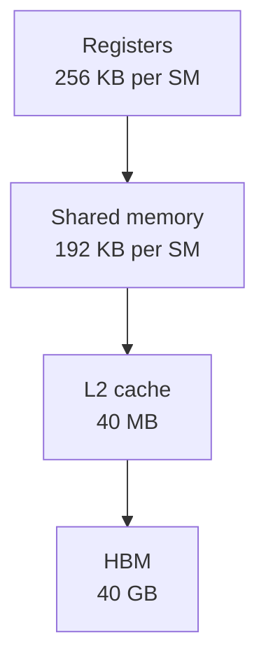
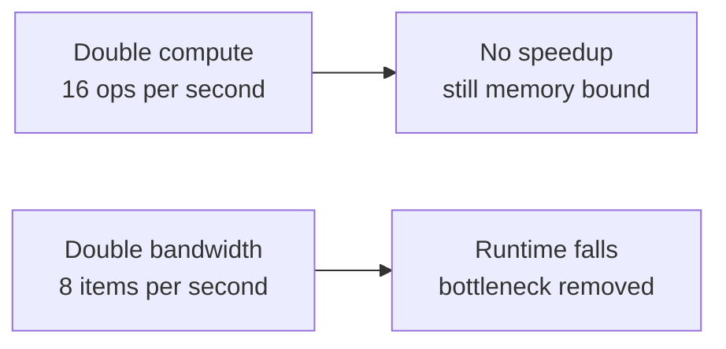
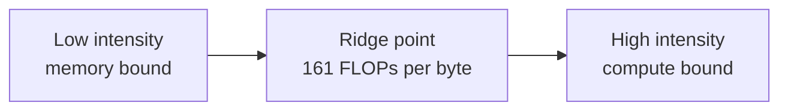

Big-O notation lies about real performance. This lesson replaces it with a hardware-grounded way to reason: arithmetic intensity and the roofline model. Everything later in the course is an application of these ideas.

## The hardware in one page

CPUs and GPUs split transistor budgets differently. A CPU spends most transistors on caching and flow control to minimize latency for a few tens of threads. A GPU spends them on data processing to maximize throughput for thousands of threads.

A GPU is built from streaming multiprocessors (SMs). Each SM has one instruction unit driving many processors in parallel. Threads run in groups of 32 called warps, under the SIMT model: single instruction, multiple threads. Work is organized into thread blocks, and blocks form a grid that the hardware distributes across SMs.

Memory sits in a hierarchy. On a 40GB A100, from fastest to slowest:

| Level | Size |
|---|---|
| Registers | 256 KB per SM |
| Shared memory | 192 KB per SM |
| L2 cache | 40 MB |
| HBM (device memory) | 40 GB |

Moving data between levels costs time. The central fact of GPU performance: computation is cheap, data movement is expensive.

For the full hardware anatomy, including TPUs and the memory wall, see [CS336 L05](../cs336/l05-gpus-tpus.html). What is new here is the analytical method, not the hardware tour.

## Why big-O is not enough

Asymptotics ignore constants and implementation details. Both can dominate in practice. An algorithm can be asymptotically superior and slower on real hardware if it does not suit the machine. L01 gave the exhibits: linear attention versus FlashAttention, EfficientNet versus ResNet.

The replacement metric is hardware utilization: the fraction of the hardware's theoretical peak performance that an algorithm and its implementation actually attain. To compute it, you need two hardware properties and two algorithm properties.

## Two hardware numbers

Every processor is described by:

- **Memory bandwidth.** Items moved between memory and processor per second.
- **Compute bandwidth.** Operations performed per second.

For the A100 in FP16: 1,935 GB/s memory bandwidth and 312 TFLOPS compute bandwidth. The ratio is 312,000 / 1,935 = 161 FLOPs per byte. The processor can do 161 floating-point operations in the time it takes to move one byte. Computation outruns data movement by two orders of magnitude.

## A toy example that teaches everything

Imagine a processor with 8 ops/s compute bandwidth and 4 items/s memory bandwidth. An algorithm loads 8 items, does 1 operation per item, writes 8 items back. Assume compute overlaps with I/O.

Steady state: 4 items arrive per second. The processor does 4 ops per second out of a possible 8. Compute utilization is 50%. Bandwidth utilization is 100%. The bottleneck is memory. The program is memory bound.

Now double the compute speed to 16 ops/s. Nothing changes. The processor still waits on 4 items per second. Utilization drops to 25%. Buying a faster chip bought zero speedup.

Instead double the memory bandwidth to 8 items/s. Now 8 items arrive per second and the processor does 8 ops per second. Both utilizations hit 100%. Runtime falls. The fix matched the actual bottleneck.

> [!KEY] Optimize the bottleneck you have, not the one you wish you had. Faster compute does nothing for a memory-bound program.

## Compute bound versus memory bound

Let Tmem be time spent on memory access and Tmath be time spent on math. With perfect overlap, total time is max(Tmem, Tmath). Whichever is longer names the regime:

\[ T_{math} = \frac{\text{number of ops}}{\text{compute bandwidth}}, \qquad T_{mem} = \frac{\text{bytes accessed}}{\text{memory bandwidth}} \]

Compute bound if Tmath is larger. Memory bound if Tmem is larger.

## Arithmetic intensity

Arithmetic intensity compresses the comparison into one number:

\[ \text{Arithmetic intensity} = \frac{\text{total FLOPs}}{\text{total bytes moved}} \]

It measures how many operations you perform per byte fetched. Compare it against the hardware ratio. For the A100, the bar is 161 FLOPs/byte. An algorithm with intensity below 161 is memory bound on the A100. Above 161, compute bound.

## Worked example: matrix multiplication

For C = AB with A (N x K) and B (K x M): each of the NM entries needs a dot product of length K, which is 2K FLOPs. Total: 2MNK FLOPs.

Memory traffic in FP16 (2 bytes per value): read A (NK), read B (KM), write C (NM). Total bytes: 2(KM + NK + NM).

\[ \text{Intensity} = \frac{2MNK}{2(KM + NK + NM)} \]

Two shapes, two regimes, same operation:

- M = K = 8192, N = 128: intensity = 124.1. Below 161. Memory bound. A thin matmul starves the compute units.
- M = K = N = 8192: intensity = 2730.6. Above 161. Compute bound. A square matmul saturates the chip.

> [!WARN] The same operation flips regimes with shape. "Matmul is compute bound" is false without the dimensions. Decode-phase matmuls with small batch sizes are the classic memory-bound case in LLM serving.

## The roofline model

Plot performance against arithmetic intensity on log-log axes. The roofline has two segments: a slanted memory roof rising with intensity, and a flat compute ceiling. Each algorithm is a point. Points under the slanted segment are memory bound. Points under the flat segment are compute bound. The vertical gap to the roof is your headroom.

The model tells you which optimizations can help. Below the ridge, only memory optimizations matter. Above it, only compute optimizations matter.

## Six principles for high performance

The lecture distills hardware-aware design into six moves. Every efficiency technique in this course is one of them.

1. **Fusion.** Combine operations so intermediate results never round-trip to memory. FlashAttention fuses the attention computation into tiled kernels. Critical for memory-bound ops.
2. **Parallelization.** Expose enough work to saturate every SM. The A100 has 108 SMs, so you need at least 108 independent output items to keep the chip busy.
3. **Blocking and tiling.** Assign tiles of work to processors to exploit locality. A naive matmul thread computes one output element: intensity 2K/(2(2K+1)), roughly 1. A thread computing a 2x2 tile reuses each loaded value across more FLOPs and raises intensity.
4. **Caching versus recomputation.** Cache when compute bound, recompute when memory bound. KV caching stores keys and values across decode steps because recomputing them costs more than the memory traffic of reloading them.
5. **Pipelining.** Overlap computation with memory reads and writes to hide latency.
6. **Hardware-specific optimizations.** Tensor Core intrinsics, new instructions, custom kernels. The last resort and often the largest win.

## Caching versus recomputation in attention

Autoregressive generation recomputes keys and values for the whole prefix at every step unless you cache them. For each new token with sequence length N and model dimension d:

- Without cache: recompute K and V for all N tokens, costing 2(2Nd^2) FLOPs per step.
- With cache: compute K, Q, V for the one new token only, costing 3(2d^2), and reuse the rest.

The cache trades memory (storing N vectors per layer) for the repeated O(N) compute. Since decode is memory bound anyway, this trade wins decisively. For the full inference picture, see [CS336 L10](../cs336/l10-inference.html).

> **Interview line:** When asked how to speed up a slow model, do not start with ideas. Start with measurement: compute the arithmetic intensity of the hot op, compare it against the hardware ratio (161 FLOPs/byte on A100), and name the regime. Memory bound means fuse, tile, or quantize to cut traffic. Compute bound means parallelize or use faster math. Then give the matmul shape example to show the regime depends on dimensions, not just the operation name.

## Assignment connection

Assignment 1 has three parts: program a small transformer in PyTorch, profile transformers and compute arithmetic intensity (the theory from this lesson), and implement a depthwise 1D convolution in CUDA (the practice). The profiling habit from this lesson is the deliverable that transfers to every later topic.

## Sources

- Slides: [Hardware-Aware Algorithm Design deck](https://docs.google.com/presentation/d/14hK7SmkUNfSEIRGyptFD2bGO7K9sJOTnwjAVg3vgg6g/edit) (Google Slides)
- Course site: [CS229S Fall 2024](https://cs229s.stanford.edu/fall2024/)
