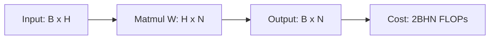
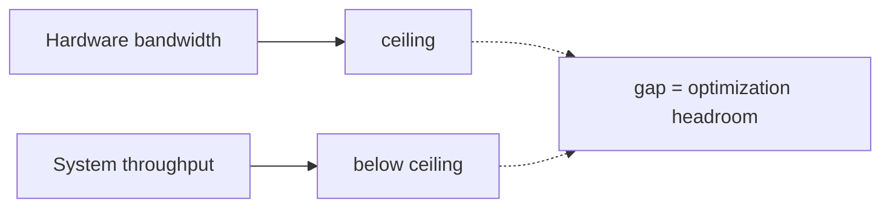
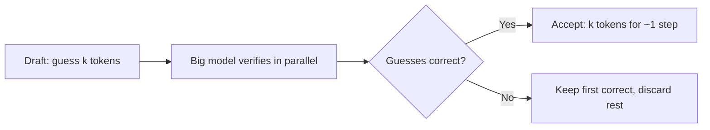

The systems skill that matters most is counting. Before you optimize anything, count the FLOPs, count the bytes moved, and compare the two. This lecture builds that skill on transformers: how much work each part does, where the bottlenecks are, and which tricks actually help.

The mechanics of KV caching are taught in [CS336 L10](../cs336/l10-inference.html). The roofline model is taught in [CS336 L05](../cs336/l05-gpus-tpus.html). This lesson does not repeat them. It teaches the counting.

## The 2BHN rule

A matrix multiply of an \(M \times K\) matrix by a \(K \times N\) matrix costs \(2MNK\) FLOPs. Every FLOP count in this lecture is an application of that rule.

Take one MLP layer. Batch size \(B\), hidden dimension \(H\), output dimension \(N\). The forward pass is one matmul: \(2BHN\) FLOPs. The rule of thumb the lecture gives: forward FLOPs are about \(2B\) times the number of parameters.

Backpropagation through the same layer costs about twice the forward pass. Two matmuls: \(dL/dW = a^T \cdot dL/dz\) costs \(2HBN\), and \(dL/da = dL/dz \cdot W^T\) costs \(2BHN\). Total: \(4BHN\). The lecture states the general finding: backprop takes roughly 2x the FLOPs of the forward pass. Training one step therefore costs about 3x a forward pass.

One more backprop fact from the slides: you must cache the activations (\(a_1\)) from the forward pass to reuse them in the backward pass. That storage requirement is the memory cost of training.

> [!KEY] Forward pass: \(2B\) times parameters. Backward pass: about 2x the forward pass. Memorize these two ratios. They answer half of all systems interview questions.

## KV caching: the FLOP argument

Autoregressive generation recomputes the keys and values of every previous token at every step. KV caching stores them instead. The key idea from the slides: the keys and values for existing tokens never change, because each token only attends to tokens before it. So reuse them.

For a sequence of length \(N\) with model dimension \(d\), generating one new token:

- Without cache: computing K and V for the full sequence costs \(2 \times 2Nd^2\).
- With cache: computing K, Q, V for the current token costs \(3 \times 2d^2\). The attention scores \(S = QK^T\) cost \(2Nd\), and \(AV\) costs \(2Nd\).

The cache eliminates the quadratic recomputation. But it is not free. It costs memory: \(2 \times 2 \times n_{layers} \times d\) bytes per token in 16-bit format (two vectors, K and V, times bytes per value, times the dimension, times layers).

## When does caching make sense?

Caching trades memory traffic for saved computation. That trade only wins if you are compute bound. The lecture works the numbers on an A100 (312 TFLOPs/s compute, 1.5 TB/s memory bandwidth, per the slides):

- Time to compute \(W_k x\) and \(W_v x\) for one token: \((2 \times n_{layers} \times 2 \times d^2) / 312 \times 10^{12}\) seconds.
- Time to load \(W_k\) and \(W_v\) from memory: \((2 \times 2 \times n_{layers} \times d^2) / 1.5 \times 10^{12}\) seconds.

The ratio of memory time to compute time is \(312/1.5 = 208\). Computing the KV for one token takes the same time as the memory system needs for 208 tokens worth of traffic. Below that crossover you are memory bound, above it compute bound.

> [!CAVEAT] The lecture is explicit: KV caching makes sense only when you are compute bound. If you are not compute bound, the extra memory traffic of the cache costs more than the recomputation saves. Extra computation is free only when compute is not the bottleneck.

## Throughput, latency, bandwidth

Three terms the lecture defines precisely because interviews conflate them:

- **Latency**: time to process a single item. Matters for interactive systems.
- **Throughput**: items processed per unit time. A property of the system, not the hardware. Batching raises throughput without changing latency.
- **Bandwidth**: a property of the hardware. The maximum rate it can sustain.

Throughput can never exceed bandwidth, but it is usually below it. The gap between the two is your optimization opportunity.

## Batch size moves the bottleneck

Small batches are memory bound: you spend most of the time loading the model weights and process little data per load. Large batches are compute bound: FLOPs scale with batch size but the weight memory does not.

The lecture verifies this empirically on GPT2-XL on an A100 40GB, showing the memory-bound regime at small batch sizes crossing into the compute-bound regime as batch grows.

Then it does the capacity planning exercise. A100 40GB, 7B parameter model (24 layers, \(d = 2048\)), sequence length 1024:

1. Model weights: \(7 \times 10^9 \times 2\) bytes = 14 GB.
2. Leftover for KV cache: 26 GB. Per token: \(4 \times 24 \times 2048 = 200\) KB.
3. Token capacity: \(26 / 0.0002 = 130{,}000\) tokens.
4. Batch size: \(130{,}000 / 1024 \approx 128\).

That is the full pipeline from FLOP counting to a deployment decision: how many concurrent users one GPU serves.

## Speculative decoding

Small-batch inference is memory bound: the GPU loads the weights, does little work, and idles. Speculative decoding exploits exactly this. The idea: guess the next few tokens, add them to the batch, and verify them in parallel with the big model. If the guesses are right, you get extra tokens for free. If wrong, it costs almost nothing, because you were memory bound anyway.

Procedure:

1. Guess the next tokens to assemble a big batch.
2. Run the whole batch in parallel on the big model.
3. Check the guesses during decoding.

Results from the cited papers: 2 to 3x speedup on Chinchilla (70B), T5 (11B), and LaMDA (137B).

Three ways to guess:

- **Smaller draft model.** Train a small model on the same data. Pros: transformers are well calibrated, so agreement is good. Draft size is tunable (about 15x smaller seems optimal). Same code. Cons: another model to manage. Extra memory. Agreement is imperfect.
- **Medusa heads.** Train extra heads that predict the next-next token, the next-next-next token, and so on. Pros: nearly free at inference, easy to train. Cons: it is a mean-field approximation of a distribution that does not factor that way, so guesses degrade fast. Good for about 2x, not 4x.
- **Lossy optimization.** Make the model fast and reckless with int4 quantization, skipped layers, skipped heads, early exit. Pros: no extra model, highly correlated with the full model. Cons: complicated code. The lecture notes this direction is underexplored.

> [!INTERVIEW] The speculative decoding question tests whether you connect the bottleneck analysis to the optimization. The expected answer: decode is memory bound at small batch sizes, so extra parallel work is nearly free, which is why guessing-and-verifying beats generating one token at a time. If you can derive the 208x crossover from the A100 numbers, you stand out.

## Sources

- Slides: [Analyzing the Performance of Transformers](https://docs.google.com/presentation/d/1PV0cKnzcHRCAbJy3OtER1UdJME7T7WBEqLLYmKWJR4g) (CS229S Fall 2024)
- KV cache mechanics: [CS336 L10](../cs336/l10-inference.html)
- Roofline model and GPU memory hierarchy: [CS336 L05](../cs336/l05-gpus-tpus.html)
- Carol Chen, Transformer Inference Arithmetic, 2022 (cited in the lecture slides)
- Leviathan et al., [Fast Inference from Transformers via Speculative Decoding](https://arxiv.org/abs/2211.17192), 2023
- Chen et al., [Accelerating Large Language Model Decoding with Speculative Sampling](https://arxiv.org/abs/2302.01318), 2023
