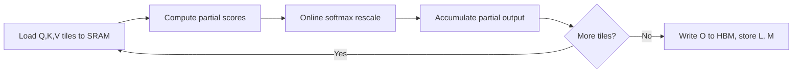

Attention costs \(O(N^2)\) in both memory and compute for sequence length \(N\). The Q, K, V matrices are \(N \times d\), but the attention score matrix is \(N \times N\). Everything in this lesson follows from asking where the real bottleneck is.

The full FlashAttention derivation is taught in [CS336 L04](../cs336/l04-attention-alternatives-moe.html). This lesson teaches the CS229S version: the bottleneck diagnosis that motivates it, and the hardware-aware principles behind it.

## The efficient attention zoo

Before FlashAttention, the field tried to change the algorithm. The survey taxonomy (Tay et al., 2022) groups the attempts:

- **Sparse**: compute attention on a subset of tokens. Sparse Transformer (Child et al., 2019), BigBird (Zaheer et al., 2021). Fixed sparsity patterns cut the work but impose structure the model may not want.
- **Low rank**: project keys and values to smaller dimensions. Linformer reduces the \(N \times N\) matrix to \(k \times k\), but causal masking becomes hard to maintain.
- **Kernel**: replace the softmax similarity with a feature map so matrix associativity applies. The Linear Transformer (Katharopoulos et al., 2020) writes \(\text{sim}(q_i, k_j) \approx f(q_i) f(k_j)\), drops the exp, and reorders the multiplies to avoid the \(N \times N\) matrix entirely.

```mermaid
flowchart TD
    A[O(N^2) attention] --> B[Change the algorithm]
    B --> C[Sparse: subset of tokens]
    B --> D[Low rank: project K, V smaller]
    B --> E[Kernel: feature map, no softmax]
    A --> F[Keep the algorithm exact]
    F --> G[FlashAttention: change the execution]
```

The lecture is candid about the tradeoff: approximate methods tend to face large quality-efficiency tradeoffs, shown on Pile perplexity and long-range benchmarks. That motivates the pivot question on the next slide: is there a fast **exact** attention algorithm?

## The GPU execution model

A GPU kernel loads inputs from HBM to SRAM and registers, computes, and writes results back to HBM. The memory hierarchy on an A100:

| Level | Size per unit |
|---|---|
| Registers | 256 KB per SM |
| L1 / shared memory | 192 KB per SM |
| L2 cache | 40 MB |
| HBM | 40 GB |

SRAM is roughly a thousand times smaller than HBM. The challenge the lecture states: memory access is the core bottleneck for attention, because compute speeds have outpaced memory speeds (300 TFLOPS versus 2 TB/s), and standard implementations do not account for reads and writes between memory levels. PyTorch gives no interface for fine-grained memory control.

## Profiling: attention is memory bound

The lecture profiles standard attention and computes its arithmetic intensity (FLOPs per byte moved). The A100 ratio: 312 TFLOPs/s divided by 1,935 GB/s gives 161 FLOPs per byte. An algorithm needs more than 161 FLOPs per byte to be compute bound on this hardware.

Plugging in model dimension \(d\) and sequence length \(N\), standard attention's ops-to-byte ratio falls below 161. It is memory bound. The lecture is careful about scope: this analysis covers attention (many lightweight computations between massive reads and writes), not the matmuls in the feed-forward blocks or QKV projections.

Contrast with a big matmul: for \(M = K = N = 8192\), arithmetic intensity is 2730, far above 161, so it is compute bound. Same hardware, different bottleneck. The algorithm decides, not the chip.

> [!KEY] Standard attention is memory bound on modern GPUs. The \(N \times N\) score matrix is read and written to HBM repeatedly, and memory bandwidth, not FLOPs, sets the speed limit.

## Three principles for high performance

The lecture gives the design principles before the solution:

1. **Fusion.** Save memory trips by doing composite operations on data already loaded. A kernel that loads inputs, computes twice, then writes once beats two kernels that each round-trip through HBM.
2. **Tiling.** Partition data into subsets that fit in shared memory. Thread blocks collaborate: one thread loads data that many threads use, instead of each loading independently. The slides show tiling cutting memory accesses in half for a small matmul example. Tile sizes should keep tensor cores busy (16x16 tiles natively, and 64x64 costs about the same latency as 16x16, so go bigger).
3. **Caching versus recomputation.** For compute-bound workloads, cache intermediates. For memory-bound workloads, recompute them. Backprop needs forward-pass intermediates. If the computation is cheap relative to memory traffic, recompute instead of storing.

Plus pipelining (overlap compute with memory transfers) and hardware-specific tricks (tensor cores, new instructions).

## FlashAttention: the exact answer

FlashAttention (Dao et al., 2022) applies all three principles and changes nothing about the math. The objective from the slides: reduce HBM accesses while computing exact attention.

The core move: never materialize the full \(N \times N\) matrix. SRAM is 20 to 40 MB. For sequence length \(N\) in FP16, the score matrix needs \(2N^2\) bytes, which does not fit. So tile the computation: load blocks of Q, K, V into SRAM, compute partial attention, and accumulate.

The obstacle is softmax. Softmax needs the max and the sum over the full row, but tiling only sees one block at a time. The fix is online rescaling. For two tiles with partial sums \(L(1), L(2)\) and partial outputs \(O(1), O(2)\):

\[ O = \frac{A(1)V(1) + A(2)V(2)}{L(1) + L(2)} \]

Rescale each tile's output by its share of the running denominator as new tiles arrive. The result is bit-identical to standard attention. No approximation.

For the backward pass, the \(N \times N\) matrix is gone, so recompute it. Store only the softmax normalization statistics (size \(N\)) from the forward pass, then recompute attention tiles in SRAM during backward. FLOPs go up 13 percent. HBM traffic drops 9x. Runtime drops 6x.

| | Standard | FlashAttention |
|---|---|---|
| GFLOPs | 66.6 | 75.2 (up 13%) |
| HBM traffic | 40.3 GB | 4.4 GB (down 9x) |
| Runtime | 41.7 ms | 7.3 ms (down 6x) |

> [!KEY] Lower FLOPs do not mean faster wall clock. FlashAttention does more FLOPs and runs 6x faster, because it was never FLOP bound. This is the single most interview-relevant sentence in systems for ML.

The results the lecture foreshadows: 15 percent faster than the MLPerf 1.1 record on BERT pretraining, 3x faster than HuggingFace implementations at 1k sequence length, and the first transformer to beat random chance on Path-X and Path-256, with quality improving as context grows.

FlashAttention-2 (Dao, 2023) fixes work partitioning between blocks and warps, uses CUTLASS 3 primitives, and parallelizes over sequence length, batch size, and head count. The lecture closes by noting that FlashAttention beats approximate methods like Linformer on memory efficiency, and that combining exact tiling with sparsity ideas gives the fastest runtimes.



> [!INTERVIEW] Expect: "Why is attention slow, and how does FlashAttention fix it?" The strong answer has three parts. One, diagnose: attention is memory bound, the \(N \times N\) matrix round-trips through HBM. Two, principles: tile to fit SRAM, fuse to avoid round trips, recompute the backward pass instead of storing. Three, the trick that makes it exact: online softmax rescaling. End with the punchline: more FLOPs, 6x faster.

## Sources

- Slides: [Hardware Aware Algorithm Design](https://docs.google.com/presentation/d/1kY5MOOJfWny7SvV4D7YeSAulOTMnnVJTKKG5DQYLid0) (CS229S Fall 2024)
- Full FlashAttention derivation: [CS336 L04](../cs336/l04-attention-alternatives-moe.html)
- Dao et al., [FlashAttention](https://arxiv.org/abs/2205.14135), NeurIPS 2022
- Dao, [FlashAttention-2](https://arxiv.org/abs/2307.08691), 2023
- Tay et al., [Efficient Transformers: A Survey](https://arxiv.org/abs/2009.06732), 2022
