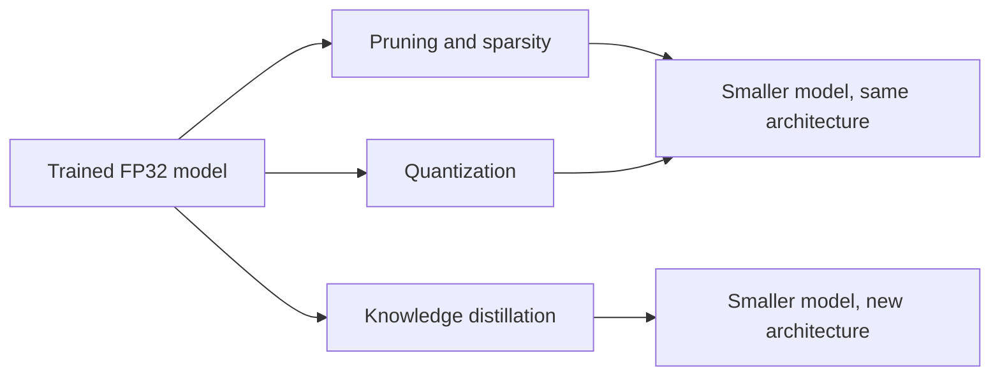
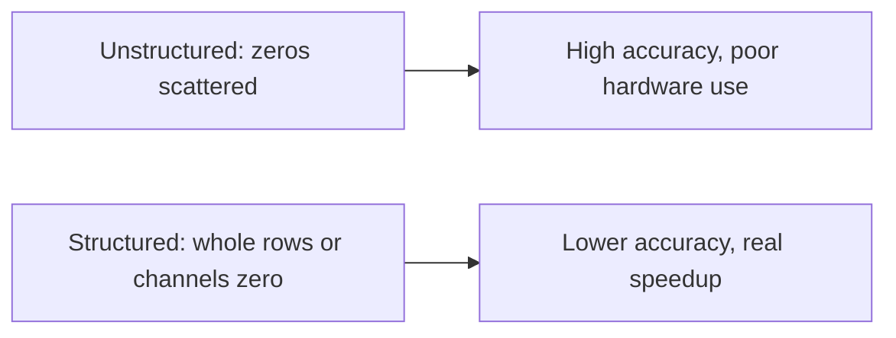
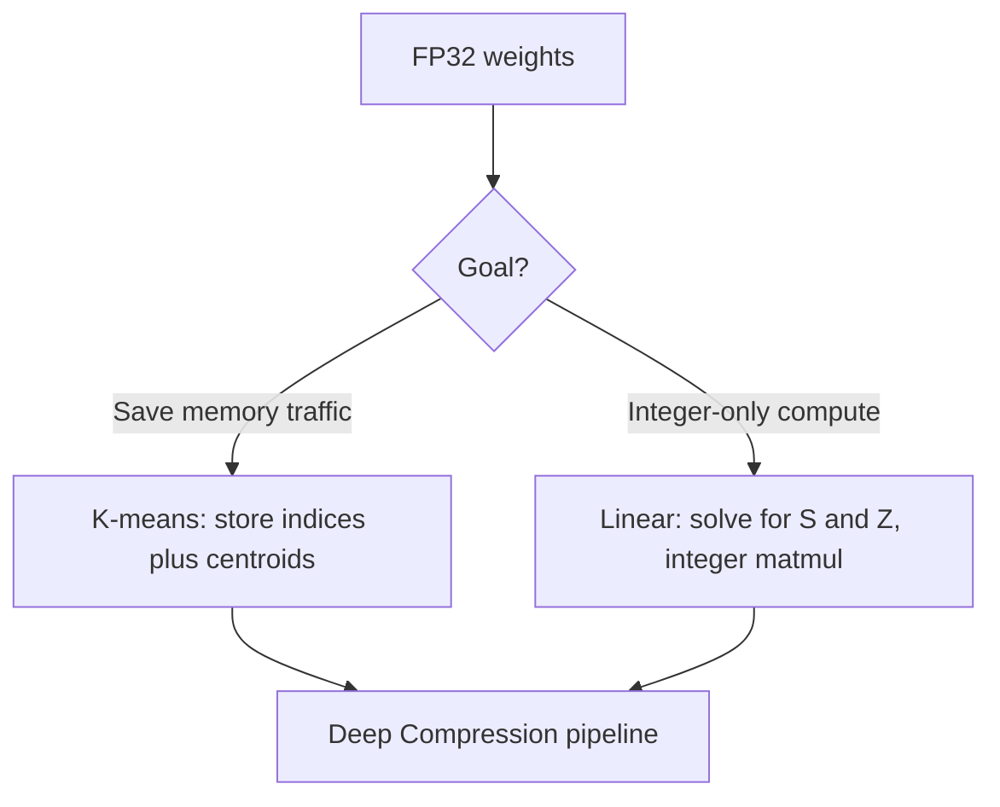

Memory is expensive. The gap between model size and GPU memory keeps growing: a 70B model in FP16 needs 140 GB just for weights, while a single H100 holds 80 GB. Last lesson reduced memory traffic through algorithm design. This lesson reduces the memory requirement itself, through three techniques: pruning, quantization, and knowledge distillation. The deck draws on MIT 6.5940 (Song Han).

## The three levers

- **Pruning and sparsity** discard a subset of parameters or neurons after training. The result is a sparse network.
- **Quantization** uses a subset of the real numbers instead of the full FP32 set.
- **Knowledge distillation** trains a small model that mimics the quality of the large one.

All three preserve accuracy while cutting memory. They also compose: Deep Compression showed pruning plus quantization beats either alone.

## Pruning

### Formal setup

Let \(W\) be the original weights and \(W_P\) the pruned weights. Let \(\|W_P\|_0\) be the number of nonzeros, \(T\) the target parameter count, \(L\) the loss. Pruning is the optimization problem

\[ \min_{W_P} L(x; W_P) \quad \text{s.t.} \quad \|W_P\|_0 < T. \]

An ideal pruning process has three properties: it accelerates training or inference on real hardware, it retains the original accuracy, and it generalizes across models instead of being over-engineered for one.

### Patterns decide whether pruning helps hardware

Two weight matrices pruned to the same sparsity can behave very differently:

Fine-grained pruning keeps more accuracy but may still touch every memory block, so the hardware sees no savings. The deck's key point: structured access is what hardware rewards. Three access patterns rank very differently on a GPU: repeatedly reading the same location (fast, cached), reading sequential memory (fast, coalesced), reading random locations (slow). Unstructured sparsity turns weight reads into random reads.

**2:4 (N:M) sparsity** is the compromise that made it into silicon. In every contiguous block of 4 values, exactly 2 are zero. The pattern is structured enough that metadata overhead stays low, and NVIDIA Ampere sparse tensor cores execute it at roughly 2x the dense rate. The deck asks the right question: how does accuracy survive 50% pruning? Answer: iterative pruning with fine-tuning, not one-shot pruning.

### Which weights to remove

**Magnitude-based pruning**, the widely used heuristic: weights with larger absolute values matter more. Fine-grained version drops small individual weights. Coarse-grained version drops whole rows whose summed absolute values are small. The deck works a small example: \(W = [5, 0.3, -0.4]\), ReLU activation. The weight 5 dominates the output. Drop the small ones first.

**Regression-based (channel) pruning** treats one layer at a time. Learn a binary vector \(B\) that selects which rows (channels) to keep, then relearn \(W\) to minimize the reconstruction error \(\|Z - \hat{Z}\|_F^2\) subject to \(\|B\|_0 < N_c\). This is He et al., "Channel Pruning for Accelerating Very Deep Neural Networks."

**Sensitivity analysis** picks the pruning ratio per layer instead of using one global ratio. Different layers have different sensitivities: the first layer is usually sensitive, fully connected layers usually are not. For each layer, prune at increasing ratios in magnitude order and measure accuracy. Stop where the curve bends.

For transformers specifically, the deck cites SpAtten: cascade token and head pruning for sparse attention.

> [!INTERVIEW] When asked how to fit a model on a smaller GPU, name the three levers and the decision order: quantize first (cheapest, no retraining for post-training quantization), then prune with 2:4 sparsity if the hardware supports it, then distill if you need a fundamentally smaller architecture. Mention that unstructured sparsity rarely speeds up inference without specialized kernels.

## Quantization

### How numbers live in hardware

A char is 8 bits. An int is 32 bits. ML training historically used FP32 (4 bytes). BFloat16 (2 bytes) is now standard. Programs address memory by byte, so halving the bit-width halves the memory traffic for reading weights.

The deck walks the IEEE 754 format because the bit budget is the whole game:

\[ \text{value} = (-1)^{\text{sign}} \times (1 + \text{fraction}) \times 2^{\text{exponent} - \text{bias}}. \]

FP32 uses 8 exponent bits and 23 fraction bits. FP16 shrinks both (5 exponent, 10 fraction), which hurts dynamic range, the gap between the largest and smallest representable values. **BF16** keeps 8 exponent bits and cuts the fraction to 7: same range as FP32, less precision. That tradeoff is why BF16 trains stably while FP16 needed loss scaling.

Two motivations for quantizing below 16 bits:

1. **Storage.** Total bytes = parameters × bit-width. A 70B model drops from 140 GB (FP16) to 35 GB (INT4).
2. **Compute and energy.** Addition costs \(O(N)\) for \(N\)-bit values. Multiplication costs \(O(N^2)\). Narrower integers mean cheaper, cooler arithmetic.

As taught in [CS336 L10](../cs336/l10-inference.html), inference is memory-bound, so the storage win translates directly into serving speed. The mechanics of low-precision serving live there. This lesson covers the two classical quantization methods.

### Method 1: K-means quantization (Deep Compression)

Han et al., ICLR 2016 best paper. During inference:

1. Cluster the FP32 weights into \(S\) clusters.
2. Store a \(\log_2(S)\)-bit index per weight plus the \(S\) FP32 centroids.
3. Reconstruct weights on the fly from the index-to-centroid map.

Storage math for a \(D \times D\) FP32 matrix: \(32D^2\) bits shrink to \(\log_2(S) \cdot D^2 + 32S\). With \(D = 4\) and \(S = 4\), that is 64 bytes down to 20 bytes, a 3.2x compression. As \(S \ll D\), savings grow. Note the limitation: computation stays FP32, so this saves memory traffic, not FLOPs.

Fine-tuning works too: backpropagate through the shared centroids. The gradient for centroid \(C_k\) is the sum of gradients of all weights assigned to it:

\[ \frac{dL}{dC_k} = \sum_{i,j : W_{ij} \in C_k} \frac{dL}{dW_{ij}}. \]

Huffman coding on top squeezes further: frequent centroid indices get shorter codes, saving 20%+ more on AlexNet's final layer.

### Method 2: Linear quantization (integer-only inference)

Jacob et al. Map the real range \([r_{\min}, r_{\max}]\) to the integer range \([q_{\min}, q_{\max}]\) with a scale \(S\) and zero-point \(Z\):

\[ r = S(q - Z). \]

Solve for \(S\) and \(Z\) from the two endpoint equations. Then rewrite the matmul \(Y = WX\) entirely in integers:

\[ q_Y = \frac{S_W S_X}{S_Y}(q_W - Z_W)(q_X - Z_X) + Z_Y, \]

rescaling the multiplier back to \(N\)-bit integers. Every operation is integer arithmetic: no FP32 anywhere in the loop. The deck's 2-bit example shows the reconstruction error explicitly, so you can see what the quantization error costs.

The deck cites the Lite Transformer as quantization applied to attention architectures.

## Knowledge distillation

Small models are hard to train directly: they underfit. The key idea: let a large teacher guide a small student. Motivating cases are phones, laptops, IoT devices, and healthcare monitors, anywhere the full model cannot run.

The design space is what to align between teacher and student:

- **Output logits** (Hinton et al., 2014): match the softmax probabilities. The teacher's soft targets carry "dark knowledge": a plane image scores 0.982 for plane and 0.017 for car, and that 0.017 tells the student planes look slightly car-like. Losses used: cross-entropy \(E[-p_t \log p_s]\) or L2 on the logits.
- **Intermediate weights, features, gradients, sparsity patterns**: progressively deeper alignment (FitNets, attention transfer, and related work).

The student trains on a combined loss: the distillation loss against the teacher plus the standard classification loss against the labels.

## Recap

Pruning removes weights (mind the pattern, or hardware ignores you). Quantization narrows the number format (k-means for memory traffic, linear for integer compute). Distillation trains a small model from a large teacher's soft targets. Next: adapting a trained model to new data, through fine-tuning and parameter-efficient methods.

> **Interview line:** For "how do you serve a 70B model on limited GPUs," answer in layers: BF16 halves memory over FP32 for free. INT8/INT4 quantization cuts another 2-4x (post-training quantization needs no retraining. Watch activation outliers, which is what SmoothQuant addresses). 2:4 sparsity doubles throughput on Ampere+ if you can hold accuracy. Distillation is the last resort because it means retraining. Then name the hardware fact that makes it all work: inference is memory-bandwidth bound, so every byte saved is latency saved.

## Sources

- Slides: Memory Efficient Neural Networks deck, CS229S Fall 2024 ([course calendar](https://cs229s.stanford.edu/fall2024/calendar/)). Draws on MIT 6.5940 (Song Han).
- Related in this system: [CS336 L10: Inference](../cs336/l10-inference.html) (low-precision serving mechanics), [CS336 L05: GPUs](../cs336/l05-gpus-tpus.html) (memory hierarchy).
