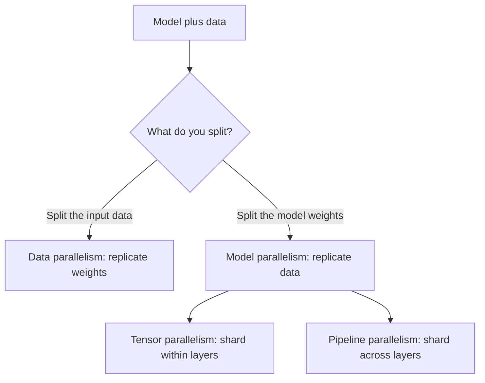
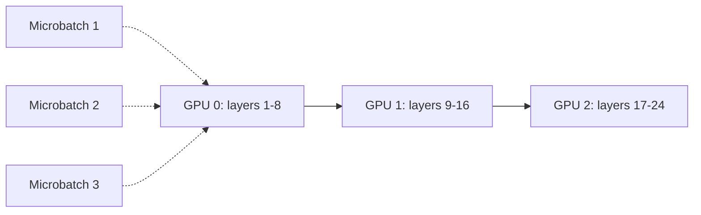

GPU FLOPS double roughly every 2.5 years. LLMs grow roughly 10x per year. Hardware loses that race, so parallelism is not optional: it is the only way to train and serve frontier models. Two challenges dominate every design: minimizing communication overhead (time spent moving data between GPUs) and minimizing synchronization overhead (dependencies that force GPUs to wait on each other).

The deep treatment of distributed training mechanics lives in [CS336 L07](../cs336/l07-parallelism-1.html) and [CS336 L08](../cs336/l08-parallelism-2.html). This lesson teaches the CS229S decision framework: the three strategies, their tradeoffs, and when to reach for each.

## Two axes of partitioning

Every parallel strategy partitions along one of two axes:

1. **Partition the input data.** Each GPU gets a slice of the batch.
2. **Partition the model parameters.** Each GPU gets a slice of the weights.

Pipeline parallelism adds a twist: partition weights across space and data across time. The three strategies combine freely, which is how thousand-GPU training runs are built.

## Data parallelism

Split the batch across \(N\) GPUs. With batch 64 on 4 GPUs, each GPU processes 16 examples. Every GPU holds a complete copy of the weights. Forward and backward passes run independently per GPU. At the end of backward, gradients are averaged across GPUs via **all-reduce**, and every replica applies the same update.

### Ring all-reduce

The standard algorithm (Horovod popularized it). For \(N\) GPUs it takes \(2(N-1)\) iterations. Each GPU sends fragments to two peers per iteration: the first \(N-1\) iterations accumulate (reduce-scatter), the next \(N-1\) distribute the result (all-gather). Bandwidth analysis: each node sends \(2(N-1) \cdot X/N\) bytes for data of size \(X\), so communication time is \(2(N-1)X/(NB)\) at bandwidth \(B\). The cost is nearly independent of \(N\), which is why data parallelism scales.

### Pros and cons

Pros: the most direct throughput lever (global batch grows with each GPU), and easy to implement (PyTorch DDP is built in).

Cons: the model must fit in one GPU's memory, and every weight synchronizes every step, so it is communication-heavy. GPT-3 cannot train with pure data parallelism on 80 GB GPUs.

### The 16P memory wall and ZeRO

Mixed-precision training with Adam needs, for \(P\) parameters: 2P bytes for FP16 weights, 2P for FP16 gradients, and 4P each for the FP32 master weights, momentum, and variance. Total: **16P bytes** of parameter and optimizer state per GPU, replicated everywhere.

**ZeRO** (Zero Redundancy Optimizer, Rajbhandari et al.) removes the redundancy in three stages:

| Stage | What is partitioned | Memory per GPU |
|-------|--------------------|----------------|
| Baseline | nothing | 16P |
| 1 | optimizer states | \(4P + 12P/N_d\) |
| 2 | optimizer states + gradients | \(2P + 14P/N_d\) |
| 3 | optimizer states + gradients + parameters | \(16P/N_d\) |

Stage 3 gathers parameters on demand for each forward/backward pass. Communication volume rises about 1.5x, but memory falls proportionally to the data-parallel degree \(N_d\). **PyTorch FSDP** (Fully Sharded Data Parallel) is the production implementation: wrap the module in `FSDP(module)` and the sharding happens automatically.

## Tensor parallelism (Megatron-style)

Shard within layers instead of across them. For transformers, split the attention heads and the MLP's intermediate dimension across GPUs, then all-reduce after each attention and MLP block to synchronize.

Pros: per-GPU memory drops, and unlike naive layer-wise splitting, utilization stays high because every GPU works on every layer.

Cons: an all-reduce per attention block and per MLP block means extremely frequent synchronization. You need very fast interconnect (NVLink-class) or throughput collapses. It is also harder to implement: the synchronization ops go inside the attention module by hand.

## Pipeline parallelism

Revisit vertical slicing (layers sharded across GPUs, activations passed along), which alone leaves GPUs idle most of the time. The fix: split each batch into **microbatches** and keep multiple microbatches in flight, like a CPU pipeline.

Two new decisions appear:

- **Microbatch size.** Larger microbatches raise arithmetic intensity but enlarge the pipeline bubble (idle time at the start and end of each batch).
- **Schedule.** GPipe vs 1F1B (one forward, one backward): the schedule decides which microbatch runs where at each step, which sets the bubble size and the activation memory.

TeraPipe extends the idea to the sequence dimension: split the input sequence into subsequences and pipeline token-by-token, which suits long-context LLM training.

Pros: per-GPU memory drops, and communication is point-to-point activation passing instead of all-reduces, so modest networking suffices.

Cons: pipeline bubbles still waste utilization, and scheduling microbatches concurrently is genuinely hard to implement well.

## The decision framework

The deck's summary, which is the part worth memorizing:

- **Data parallelism** wins when the model and activations fit in GPU memory. Simplest, highest throughput per GPU added.
- **Tensor parallelism** wins when they do not fit but you have one server with very fast networking. Pays all-reduce tax per layer.
- **Pipeline parallelism** wins when they do not fit and you have multiple servers or slow networking. Pays bubble tax instead of all-reduce tax.

And you do not choose one: **3D (PTD) parallelism** combines all three, which is how Megatron-Turing NLG 530B and similar runs scale to thousands of GPUs. Data parallelism scales the batch, tensor parallelism shards the layers, pipeline parallelism shards the depth.

## Automatic parallelization

The strategy space grows combinatorially, and testing candidates at thousand-GPU scale is prohibitively expensive. **Alpa** (OSDI 2022) automates the search: it separates inter-operator parallelism (pipeline) from intra-operator parallelism (data and tensor), searches each space, and emits the optimal combined strategy for a given model and cluster.

> [!INTERVIEW] For "how would you train a 70B model on 64 A100s," walk the decision tree: 70B in BF16 is 140 GB, too big for one 80 GB GPU, so pure data parallelism is out. Start with tensor parallelism degree 8 inside each node (NVLink handles the all-reduces), pipeline parallelism across the 8 nodes (point-to-point over InfiniBand), and data parallelism on whatever is left. Add ZeRO-1 or FSDP to cut optimizer-state memory. Mention the bubble-vs-all-reduce tradeoff explicitly: that is the signal interviewers listen for.

## Sources

- Slides: Parallelism Fundamentals deck, CS229S Fall 2024 ([course calendar](https://cs229s.stanford.edu/fall2024/calendar/)).
- Related in this system: [CS336 L07: Parallelism 1](../cs336/l07-parallelism-1.html), [CS336 L08: Parallelism 2](../cs336/l08-parallelism-2.html) (deep mechanics).
