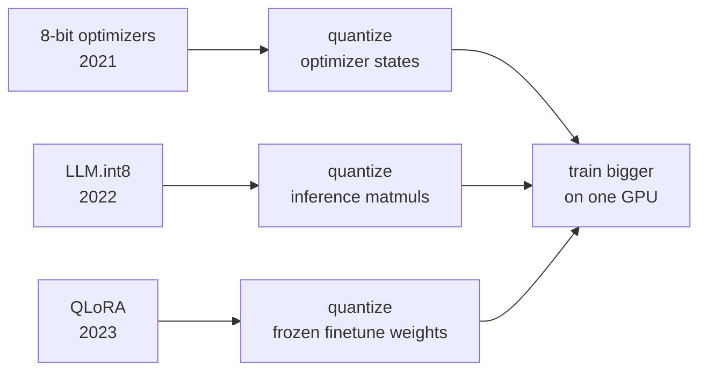
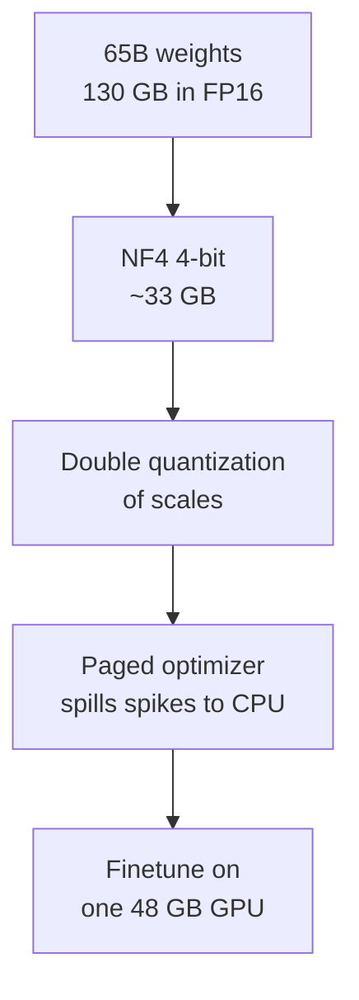

Tim Dettmers is the researcher behind bitsandbytes, the library that put 8-bit training and inference in everyone's hands. His three results form a toolkit: 8-bit optimizers cut the memory cost of training, LLM.int8() cut the memory cost of inference, and QLoRA cut the memory cost of finetuning. Each one attacked the same problem from a different angle: the numbers inside neural networks do not need 32 bits.

> [!CAVEAT] No transcript or recording transcript is available for this guest talk, so the talk's specific claims cannot be quoted. What follows is reconstructed from Dettmers' published papers and the bitsandbytes library, which are the public record of the work the CS229S calendar describes as "Efficient Training and Inference." Anything about the talk itself beyond its title is marked [uncertain].

## The memory problem, three times

Training a model stores more than weights. The optimizer keeps running statistics per parameter. Adam stores two extra numbers per weight, tripling the memory. Inference with a 175-billion-parameter model needs hundreds of gigabytes just to hold the weights. Finetuning a 65-billion-parameter model was, until recently, a multi-GPU job by default.

Dettmers' program treats all three as quantization problems. The bet: neural network tensors tolerate aggressive low-precision storage if the quantization respects their statistics.

## 8-bit optimizers: block-wise quantization

The 2021 paper asks a simple question: Adam's optimizer states dominate training memory, so why store them in 32 bits?

Naive 8-bit quantization of optimizer states fails because of outliers. A few large values stretch the quantization range and crush everything else into a few bins. The fix is block-wise quantization: split each tensor into small blocks, quantize each block with its own scale. Outliers then corrupt only their own block instead of the whole tensor.

The result, from the paper: 8-bit Adam matches 32-bit Adam on standard benchmarks while cutting optimizer memory roughly in half. The technique shipped in bitsandbytes and became the default way to train on memory-limited GPUs.

> [!KEY] The recurring move in all three papers: find where the outliers live, then give the quantization scheme a way to isolate them instead of letting them poison the range.

## LLM.int8(): the outlier discovery

The 2022 paper starts from a failed experiment. Standard 8-bit quantization of transformer matrix multiplications works fine up to about 6 billion parameters, then accuracy collapses. Dettmers and coauthors investigated why and found something structural.

Past roughly 6.7B parameters, a phase shift occurs. A small set of feature dimensions develop extreme magnitudes: about 150,000 outlier values per sequence, concentrated in only around 6 feature dimensions, present in every layer and most sequence positions. These outliers are not noise. Zeroing them drops top-1 attention softmax probability mass by over 20 percent and degrades perplexity by 600 to 1000 percent, even though they are only about 0.1 percent of features. Zeroing the same number of random features barely moves perplexity. The model routes critical information through these dimensions.

The method, LLM.int8(), has two parts. First, vector-wise quantization: quantize per row or column rather than per tensor, so each feature dimension gets its own scale. Second, mixed-precision decomposition: run the outlier feature dimensions in 16-bit and everything else in 8-bit, then add the partial results.

\[ Y = X_{\text{outlier}} W_{\text{outlier}} + X_{\text{regular}} W_{\text{regular}} \]

The first term runs in FP16, the second in INT8. Over 99.9 percent of the computation stays in 8-bit. The paper reports no accuracy degradation from 6.7B up to 175B parameters, and for the first time made models like OPT-175B and BLOOM-176B runnable on a single server with consumer GPUs.

The deeper lesson, and the reason this talk belongs in a systems course: quantization stopped being a pure compression problem. Past a scale threshold, the model's internal statistics change qualitatively, and the quantization scheme has to understand the model's structure. The outlier dimensions are a property of large transformers, not of the data.

## QLoRA: finetuning a 65B model on one GPU

The 2023 paper attacks finetuning memory. LoRA already cut the trainable parameters by adding small low-rank adapters to frozen weights. But the frozen weights themselves still cost memory: a 65B model in 16-bit needs about 130 GB, far beyond a single 48 GB GPU.

QLoRA adds three techniques on top of LoRA.

**4-bit NormalFloat (NF4).** Pretrained weights follow a roughly normal distribution. NF4 is a 4-bit type whose quantization bins are spaced to be information-theoretically optimal for normally distributed data. This beats naive 4-bit quantization on the exact tensors being stored.

**Double quantization.** Quantization needs per-block scale constants, and those constants cost memory too. Quantize the constants themselves. A second, smaller quantization pass on the scales saves a meaningful fraction at 65B scale.

**Paged optimizers.** Training has memory spikes, for example from gradient checkpointing. Instead of crashing with an out-of-memory error, paged optimizers spill the spike to CPU RAM through unified memory and page it back. The training run survives moments that would otherwise kill it.

Stacked together, the frozen 65B weights drop from about 130 GB to about 33 GB. The LoRA adapters themselves still train in 16-bit with full-precision gradients. Only the frozen weights ever touch 4-bit. The paper reports finetuning a 65B model on a single 48 GB GPU with no meaningful quality loss versus 16-bit finetuning.

## The systems view

All three papers share a methodology worth naming. First, measure where the memory actually goes instead of assuming. Second, characterize the statistics of the tensors involved, because the optimal low-precision format depends on the distribution. Third, isolate pathological values rather than letting them dictate the format for everything. Fourth, ship the implementation: bitsandbytes is why these ideas reached practitioners instead of staying in papers.

For the CS229S arc, this talk is the efficiency counterpart to the parallelism talks. Narayanan's lesson (L08) scales training out across many GPUs. Dettmers' work scales training down onto the GPUs people actually have. Both change what is trainable, from opposite directions.

> [!INTERVIEW] When asked how to finetune a large model cheaply, name QLoRA's three components and what each one buys: NF4 cuts weight memory 4x, double quantization trims the constant overhead, paged optimizers survive spikes. Then add the conceptual point: NF4 works because pretrained weights are approximately normal, so the quantization bins match the data. Interviewers reward the statistics argument, not just the recipe.

> **Interview line:** Dettmers' three results are one idea applied three times: neural network tensors do not need 32 bits if the quantization respects their statistics. 8-bit optimizers use block-wise scales to contain outliers, LLM.int8() keeps systematic outlier dimensions in FP16 while the rest runs in INT8, and QLoRA uses a normal-optimal 4-bit type plus double quantization plus paged optimizers to finetune 65B on one GPU.

## Sources

- Video: [Tim Dettmers on efficient training and inference](https://www.youtube.com/watch?v=EsMcVkTXZrk) (duration not verified, transcript unavailable)
- Papers: [8-bit Optimizers](https://arxiv.org/abs/2110.02861), [LLM.int8()](https://arxiv.org/abs/2208.07339), [QLoRA](https://arxiv.org/abs/2305.14314)
- Code: [bitsandbytes](https://github.com/bitsandbytes-foundation/bitsandbytes)
