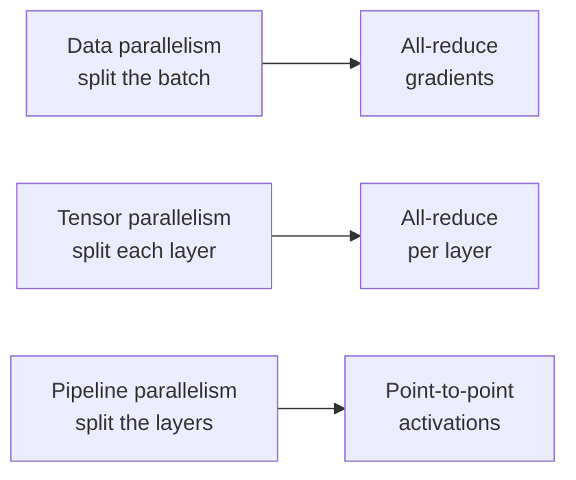
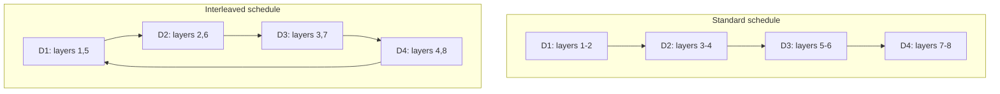

Deepak Narayanan is a senior applied research scientist in NVIDIA's ADLR group, on the Megatron-LM team. He did his PhD at Stanford with Matei Zaharia, working on pipeline parallelism and cluster scheduling. This talk is about training large language models at scale: not the algorithms, but the systems decisions that decide whether a training run finishes in weeks or never. [00:56](ts:56)

> [!CAVEAT] This talk comes from the Stanford MLSys Seminars series, not from a CS229S lecture recording. The CS229S calendar links it as the guest talk on parallelism. No public lecture video playlist exists for this course offering.

## Why parallelism is not optional

Model sizes grew by almost four orders of magnitude in five years. [01:46](ts:106) Two walls make single-GPU training impossible.

First, memory. The parameters of a hundred-billion-parameter model do not fit in the main memory of the largest accelerators, and that is before counting activations, gradients, and optimizer states. [02:00](ts:120)

Second, compute. Narayanan estimates that training a 175-billion-parameter GPT-3-style model on 300 billion tokens would take about 288 years on a single NVIDIA V100. [02:35](ts:155)

A third pressure limits the easy way out. Grouping inputs into large batches amortizes communication overhead, but larger batches need more tokens to reach the same loss. That caps how far data parallelism alone can scale. In HPC terms, the problem demands strong scaling: parallelize a fixed problem over as many GPUs as possible. [02:56](ts:176)

## The talk's structure

Narayanan organizes the talk in four parts: existing parallelism methods, how the methods interact, domain-specific optimizations, and recent paradigm changes plus open questions. [03:35](ts:215) The throughline is that no single method wins. The art is in composing them.

## The three methods

**Data parallelism** splits a batch over devices. Each device holds a full model copy. At the end of each iteration, gradient updates are aggregated with an all-reduce so every copy stays identical. [05:26](ts:326) It cannot be used alone for large models because each device must still hold the full model.

**Tensor parallelism** splits the model's own parameters across devices. For transformers, Megatron splits each matrix multiplication: one weight matrix column-wise, the next row-wise. This particular split minimizes synchronization points. Each transformer layer needs an all-reduce in the forward pass and one in the backward pass. [07:07](ts:427)

**Pipeline parallelism** splits the model's layers across devices and splits each batch into microbatches that flow through the stages. [08:37](ts:517) [10:36](ts:636)

## The pipeline bubble

Pipeline parallelism has a fundamental inefficiency. At the start of an iteration, later stages sit idle waiting for activations to arrive. At the end, early stages sit idle while the pipeline drains. This idle time is the pipeline bubble, or pipeline flush. [12:33](ts:753)

The bubble fraction is roughly \((P-1)/m\), where \(P\) is the number of pipeline stages and \(m\) is the number of microbatches. More microbatches shrink the bubble but raise other costs. Every parallelism decision is a trade against something else.

## Composing all three: the interconnect decides

Real training uses all three methods at once. The composition that works is dictated by the hardware hierarchy. GPUs inside one server connect over NVLink, which is very fast. GPUs across servers connect over InfiniBand, which is much slower. [15:01](ts:901)

This creates a placement rule: put the communication-heavy parallelism inside the node. Tensor parallelism needs an all-reduce per layer, so its degree \(T\) should fit within one server's 8 GPUs. Pipeline parallelism only needs point-to-point activation transfers between stages, so it can span the slower cross-server links. [19:00](ts:1140)

## The tensor versus pipeline tradeoff, measured

Narayanan makes the tradeoff quantitative. With \(n\) total GPUs, tensor degree \(T\), and pipeline degree \(P\), the constraint \(T \times P = n\) holds. Two effects pull in opposite directions as \(T\) grows.

Effect one: the pipeline bubble shrinks. Since \(P = n/T\), a larger \(T\) means a smaller \(P\), and the bubble is proportional to \(P\). [18:20](ts:1100)

Effect two: tensor-parallel all-reduces get expensive. Once \(T\) exceeds the 8 GPUs in a server, those all-reduces cross InfiniBand. [18:52](ts:1132)

The experiment: a 162-billion-parameter GPT model on 64 A100 GPUs, sweeping \((T, P)\) pairs with \(T \times P = 64\), measuring per-GPU throughput in teraflops per second. [19:17](ts:1157) Throughput rises, peaks at \((8, 8)\), then falls. The peak sits exactly where tensor all-reduces stay within NVLink while the pipeline bubble stays small. [20:50](ts:1250)

> [!KEY] The optimum is not "maximize one method." It is the point where the interconnect hierarchy and the bubble cost balance. On 64 A100s, that point is tensor 8 by pipeline 8.

## The interleaved schedule

The standard pipeline schedule assigns contiguous layer chunks to each device. The interleaved schedule assigns layers round-robin: with 8 layers and 4 devices, device 1 gets layers 1 and 5, device 2 gets 2 and 6, and so on. [24:01](ts:1441)

The win: device 4 no longer waits for a full \(P-1\) microbatches of two-layer compute before receiving its first input. The pipeline bubble roughly halves. [25:18](ts:1518)

The price: activations now travel through the device set twice per microbatch instead of once, doubling point-to-point communication. [26:19](ts:1579) On a 175B model over 96 A100s, the interleaved schedule wins clearly at small batch sizes, where the bubble dominates. As batch size grows, the bubble shrinks on its own and the gap closes. [27:13](ts:1633) [28:01](ts:1681)

Relaxed schedules go further: they change the semantics slightly, accept small convergence effects, and eliminate the bubble almost entirely. [29:03](ts:1743)

## Domain-specific optimizations

At scale, even 10 percent throughput improvements are hugely valuable. They cut millions of dollars from a training run. [30:25](ts:1825)

One Megatron optimization exploits redundant communication. When tensor and pipeline parallelism combine, the same tensor can get sent multiple times over slow InfiniBand. The fix: scatter the tensor at the sending nodes over fast NVLink first, then send smaller pieces across servers. [31:25](ts:1885) [31:53](ts:1913)

On the precision side, a natural question: if training runs in 16-bit, can the all-reduce also run in 16-bit instead of 32-bit? [42:00](ts:2520) Every byte saved on communication is throughput gained.

## The paradigm is shifting under the methods

Two changes alter the ground this analysis stands on.

First, companies stopped publishing model details, so the public scaling curves end around 2021. More importantly, scale stopped meaning only parameter count. The Chinchilla finding pushed the field toward smaller models trained on far more tokens. Reasoning about parallelism now has to cover a different operating regime. [35:19](ts:2119) [35:53](ts:2153)

Second, architectures are diversifying. Mixture-of-experts models route tokens to subparts of the model dynamically, which creates very different communication patterns from dense transformers. Parallelizing MoE well is an open problem. [42:26](ts:2546)

## Open questions

Narayanan closes with what is unsolved.

**Automation.** Hand-designing \((T, P, D)\) configurations means writing out expressions for communication volume, idle time, and memory footprint, then validating against cluster experiments. [46:00](ts:2760) Automated search over the configuration space exists but the space is enormous, so the research problem is pruning it intelligently. [43:26](ts:2606)

**The batch size wall.** There is a regime where batch size divided by GPU count approaches \(1/8\), one sample per GPU in an 8-GPU node. Past that, the only path is distributing individual matrix multiplications across slower cross-node links, which current interconnects cannot support efficiently. [47:47](ts:2867) Newer interconnect hierarchies, where 256 GPUs share fast links before going cross-box, may change this. [49:37](ts:2977)

**Fault tolerance.** Synchronous training runs at the speed of the slowest GPU. Stragglers and failures slow the entire pipeline. Asynchronous training would help, but it changes convergence, and at million-dollar run costs, teams are conservative about unproven techniques. [52:28](ts:3148) [53:06](ts:3186)

**Reduced-precision communication and offload.** Active work includes lower-precision collectives and offloading reductions to the network itself, such as NVIDIA SHARP, so GPUs never do the summation. [51:45](ts:3105)

Asked what he would talk about next time, Narayanan points at inference: autoregressive serving is not compute-bound the way training is, and its throughput problems are a different world. [54:40](ts:3280)

> **Interview line:** When asked how to parallelize LLM training, do not recite the three methods in isolation. State the composition rule: tensor parallelism inside the node (NVLink), pipeline across nodes (InfiniBand), data parallelism on top. Then name the two costs that fight each other, the pipeline bubble versus all-reduce volume, and give the (8, 8) sweet-spot result as evidence that the optimum is measured, not guessed.

## Sources

- Video: [Deepak Narayanan on training LLMs at scale](https://www.youtube.com/watch?v=JA1l96tjrs4) (55:54)
- Notes: official subtitle transcript (en-orig)
- Paper: [Megatron-LM](https://arxiv.org/abs/2104.04473) (Narayanan et al.)
