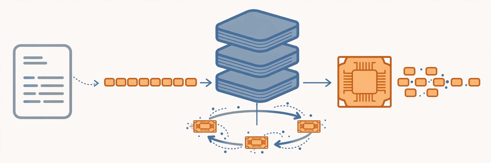

The highest-priority course in this system.

You build a complete language model pipeline: tokenizer, architecture, training, scaling, systems, data, and alignment. Third offering; lectures from Spring 2025 are also on YouTube and are used only where the 2026 material has gaps.

## Lectures

| # | Date | Topic | Instructor |
|---|---|---|---|
| 1 | Mar 30 | Overview, tokenization | Percy Liang |
| 2 | Apr 1 | PyTorch (einops), resource accounting | Percy Liang |
| 3 | Apr 6 | Architectures, hyperparameters | Tatsunori Hashimoto |
| 4 | Apr 8 | Attention alternatives, mixture of experts | Tatsunori Hashimoto |
| 5 | Apr 13 | GPUs, TPUs | Tatsunori Hashimoto |
| 6 | Apr 15 | Kernels, Triton, XLA | Percy Liang |
| 7 | Apr 20 | Parallelism | Percy Liang |
| 8 | Apr 22 | Parallelism | Tatsunori Hashimoto |
| 9 | Apr 27 | Scaling laws | Tatsunori Hashimoto |
| 10 | Apr 29 | Inference | Percy Liang |
| 11 | May 4 | Scaling laws | Tatsunori Hashimoto |
| 12 | May 6 | Evaluation | Percy Liang |
| 13 | May 11 | Data: sources, datasets | Percy Liang |
| 14 | May 13 | Data: filtering, deduplication, mixing, synthetic data | Percy Liang |
| 15 | May 18 | Mid/post-training: SFT, RLHF | Tatsunori Hashimoto |
| 16 | May 20 | Post-training: RLVR | Tatsunori Hashimoto |
| 17 | May 27 | Alignment, multimodality | Percy Liang |
| 18 | Jun 3 | Guest lecture: Dan Fu | Dan Fu |

## Assignments

1. Basics: tokenizer, Transformer, training loop
2. Systems: GPU kernels, Triton, parallelism
3. Scaling: scaling laws, hyperparameter prediction
4. Data: data pipelines, filtering
5. Alignment: SFT, RLHF-style alignment

Assignment PDFs ship with this system under `assignments/`.
