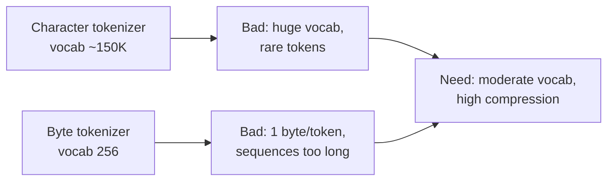

## The from-scratch philosophy

This is the third offering of CS336. The philosophy has not changed: you learn how language models work by building every piece yourself, from the ground up [00:02:35](ts:00:02:35).

Percy Liang gives the honest motivation. Frontier models are industrialized now. Training one costs on the order of a billion dollars, and labs publish no details about how they build them [00:05:04](ts:00:05:04). The GPT-4 report states this explicitly: competitive and safety concerns mean no disclosure of the build process.

So we build small models. But small models can mislead. Two examples from the lecture [00:06:05](ts:00:06:05):

- At small scale, MLP layers take about 44% of FLOPs. At 175B parameters, they take about 80%. What you optimize changes with scale.
- Capabilities emerge with scale. Few-shot learning looked broken at small scale, then appeared past a critical size.

> [!KEY] Small-scale experiments teach mechanics and mindset, not all intuitions. What works at 100M parameters may not work at 100B.

Liang splits transferable knowledge into three kinds [00:07:21](ts:00:07:21):

1. **Mechanics.** How things work: what a Transformer is, how parallelism works.
2. **Mindset.** How to approach building: profile everything, benchmark everything, optimize for efficiency.
3. **Intuitions.** Which modeling and data decisions yield good performance. These transfer least across scales.

This course teaches the first two well. The third requires working at scale yourself.

## The framing question

The course frames everything as one optimization problem [00:11:01](ts:00:11:01):

> What is the best model one can build with a certain data and compute budget?

For pretraining, the binding constraint is usually compute, not data. You have more data than you can afford to process. So the recurring theme is **efficiency**: squeeze the most out of your hardware and your FLOPs.

## A short history of language models

Liang traces the lineage that matters for this course [00:11:49](ts:00:11:49):

| Era | Development |
|---|---|
| 1950s | Shannon uses language models to measure the entropy of English |
| 1990s–2000s | N-gram models power speech recognition and machine translation. They make generated text fluent |
| 1997 | LSTMs |
| 2003 | Bengio's neural language model: a feedforward network over a small context window |
| 2014 | Seq2seq: compress a whole sentence into a vector |
| 2014 | Adam optimizer |
| 2015 | Attention, developed for machine translation |
| 2017 | The Transformer |
| 2018–2019 | ELMo, BERT, GPT-2, T5 |
| 2020 | Kaplan scaling laws, GPT-3 |
| 2022–2026 | InstructGPT, LLaMA family, Mistral/Mixtral, DeepSeek V2/V3/R1, Qwen, Kimi, GLM, open-weight releases |

The 2026 picture also includes open efforts that publish weights, code, data, and papers together: EleutherAI, OLMo, Marin. These matter because they let you study real builds instead of guessing.

## Course structure

Five assignments, each intense. Assignment 1 alone is roughly equivalent to all five CS224N assignments combined, by student report [00:20:32](ts:00:20:32). The assignments:

1. **Basics.** Tokenizer, Transformer, training loop.
2. **Systems.** GPU kernels, Triton, parallelism.
3. **Scaling.** Scaling laws, hyperparameter prediction.
4. **Data.** Data pipelines, filtering.
5. **Alignment.** SFT, RLHF-style alignment.

> [!PROF] "The lectures are great, but you learn really by doing the assignments." Plan your time around them, not around watching videos [00:23:23](ts:00:23:23).

Lectures alternate between Percy Liang and Tatsunori Hashimoto. This lecture is Percy. Guest lectures close the course: Daniel Selsam and Dan Fu.

## Tokenization

A language model places a probability distribution over sequences of **tokens**, represented as integer indices. Raw text is a Unicode string. So you need two procedures:

- **encode**: string → list of integer token ids
- **decode**: list of integer token ids → string

A tokenizer implements both. The roundtrip must hold: `decode(encode(s)) == s`.

### First observations

Play with a real tokenizer and three patterns appear [00:36:00](ts:00:36:00):

- A word and its preceding space form one token (`" world"`, not `"world"`).
- The same word tokenizes differently at the start vs. the middle of a string (`"hello hello"`).
- Numbers split into chunks of a few digits.

The lecture uses the GPT-5 tokenizer (tiktoken `o200k_base`) for live demos.

### Compression ratio

The key metric: **bytes per token** [00:38:00](ts:00:38:00).

```python
def get_compression_ratio(string: str, indices: list[int]) -> float:
    """Bytes per token. Higher is better: shorter sequences."""
    num_bytes = len(bytes(string, encoding="utf-8"))
    num_tokens = len(indices)
    return num_bytes / num_tokens
```

Higher compression means shorter sequences, and attention is quadratic in sequence length. You can raise compression by growing the vocabulary, but that spreads training signal thin across rare tokens. This tradeoff drives every tokenizer design.

### Character tokenizer

Represent the string as Unicode code points. `ord("a")` is 97, `ord("🌍")` is 127757, and `chr` inverts it.

```python
class CharacterTokenizer(Tokenizer):
    """Represent a string as a sequence of Unicode code points."""
    def encode(self, string: str) -> list[int]:
        return list(map(ord, string))

    def decode(self, indices: list[int]) -> str:
        return "".join(map(chr, indices))
```

Two problems [00:44:00](ts:00:44:00):

1. The vocabulary is huge: roughly 150K Unicode characters.
2. Most characters are rare. The model wastes capacity on tokens it barely sees.

Worst of both worlds: large vocabulary, low compression ratio.

### Byte tokenizer

Represent the string as UTF-8 bytes. Every byte is an integer from 0 to 255.

```python
class ByteTokenizer(Tokenizer):
    """Represent a string as a sequence of bytes."""
    def encode(self, string: str) -> list[int]:
        return list(map(int, string.encode("utf-8")))

    def decode(self, indices: list[int]) -> str:
        return bytes(indices).decode("utf-8")
```

The vocabulary is tiny (256). But the compression ratio is exactly 1 byte per token, the worst possible. Sequences get very long, and attention is quadratic. Not viable for Transformers.



### Word tokenizer

Split on words with a regex (`\w+|.` keeps alphanumeric runs together), then map each distinct chunk to an integer.

Good: tokens are meaningful, compression is high. Bad [00:50:00](ts:00:50:00):

- Vocabulary is unbounded. New words need a special UNK token.
- UNK tokens corrupt perplexity calculations and lose information.
- Rare words still starve for training data.

### Byte Pair Encoding

BPE is the standard answer. Philip Gage introduced it in 1994 for data compression. Sennrich et al. adapted it for NLP in 2016. It is a data-driven heuristic that sits between bytes and words.

**Training.** Start with the byte vocabulary (256 tokens). Repeat:

1. Count all adjacent token pairs in the training corpus.
2. Merge the most frequent pair into a new token.
3. Add the new token to the vocabulary.

Stop after a fixed number of merges (the vocabulary size, e.g. 32K or 100K).

**Encoding.** Start from bytes. Apply the learned merges in order, earliest first:

```python
def merge(indices: list[int], pair: tuple[int, int], new_index: int) -> list[int]:
    """Replace every occurrence of pair with new_index."""
    new_indices = []
    i = 0
    while i < len(indices):
        if i + 1 < len(indices) and indices[i] == pair[0] and indices[i + 1] == pair[1]:
            new_indices.append(new_index)
            i += 2
        else:
            new_indices.append(indices[i])
            i += 1
    return new_indices

class BPETokenizer(Tokenizer):
    def __init__(self, params: BPETokenizerParams):
        self.params = params  # vocab: id -> bytes, merges: (id,id) -> id

    def encode(self, string: str) -> list[int]:
        indices = list(map(int, string.encode("utf-8")))
        for pair, new_index in self.params.merges.items():
            indices = merge(indices, pair, new_index)
        return indices

    def decode(self, indices: list[int]) -> str:
        return b"".join(map(self.params.vocab.get, indices)).decode("utf-8")
```

> [!KEY] BPE allocates vocabulary to frequent byte sequences. Common words become single tokens (high compression). Rare strings fall back to bytes (no UNK token, always decodable).

The lecture's summary of the design space [01:10:00](ts:01:10:00):

- Character, byte, and word tokenizers are all highly suboptimal.
- BPE is an effective data-driven heuristic.
- Tokenization is still a separate preprocessing step. End-to-end byte-level models (ByT5, BLT, H-Net) are active research, covered later in the course.

### The two requirements

Any tokenization solution must satisfy [01:14:00](ts:01:14:00):

1. The model operates on **chunks** (abstractions) of the sequence, not raw characters.
2. Chunks are **variable length**, so the model spends capacity on interesting parts.

BPE satisfies both with a simple greedy heuristic. That is why it won.

## Assignment connection

Assignment 1 implements a BPE tokenizer from scratch: training (merge counting), encoding, decoding, and special-token handling. The `BPETokenizer` above is the starting sketch. The assignment version must handle large corpora efficiently (the naive `merge` loop is O(n) per merge. You will need faster data structures) and pass roundtrip tests on real text.

> [!INTERVIEW] Tokenizer questions appear in frontier-lab interviews because they test systems thinking: UTF-8 edge cases, merge-order correctness, and the compression vs. vocabulary tradeoff. Know why BPE beat word tokenizers (no UNK, bounded vocab) and where it still fails (numbers, multilingual text, code).
