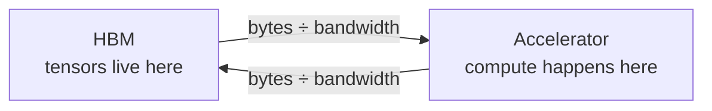
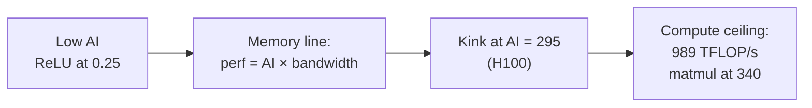

## Two questions to open

The lecture opens with news: the Marin 1e23-FLOP run finished and matched the forecasted loss within 0.05. Extrapolating the fitted scaling law gives a GPT-5-level loss estimate [00:00:40](ts:00:00:40).

Then two questions set the agenda [00:02:06](ts:00:02:06):

| Question | Answer | Ingredients |
|---|---|---|
| How long to train a 70B model on 15T tokens with 1024 H100s? | 143 days | 6ND FLOPs, H100 spec, MFU 0.5 |
| Largest model trainable on 8 H100s with AdamW? | ~53B parameters | 80 GB per GPU, 12 bytes per parameter |

The napkin math for the first:

| Step | Value |
|---|---|
| Total FLOPs = 6ND | 6 × 70e9 × 15e12 = 6.3e24 |
| H100 dense BF16 | 1979 / 2 = 989.5 TFLOP/s |
| Effective per GPU (MFU 0.5) | ~495 TFLOP/s |
| 1024 GPUs per day | ~4.38e22 FLOP |
| Days | 6.3e24 / 4.38e22 ≈ 143 |

For the second: 8 × 80e9 bytes / 12 bytes per parameter ≈ 53.3e9. Activations are excluded, so this is an upper bound. The point is not exact arithmetic. It is rough shapes you can compute in your head.

## What you take away

Mechanics: PyTorch and tensor semantics, straightforward. Mindset: do resource accounting reflexively. Attach a performance question to every line of code you write. Intuitions: how resources are actually spent. There is no ML magic today [00:04:13](ts:00:04:13).

## Tensors: the building blocks

Everything is a tensor: parameters, gradients, optimizer states, data, activations. The DeepSeek-V3.2 checkpoint is a bag of tensors, each with a shape and a precision [00:05:06](ts:00:05:06).

Memory is simple: number of elements times element size.

```python
x = torch.zeros(4, 8)   # default dtype is float32
assert x.numel() == 4 * 8
assert x.element_size() == 4      # 4 bytes per float32
assert x.numel() * x.element_size() == 128  # bytes
```

Tensors get big fast. One feedforward matrix in GPT-3 (12288×4 by 12288, fp16) occupies 2.3 GB [00:07:30](ts:00:07:30).

## Floating-point formats

| Format | Bits | Exponent bits | Note |
|---|---|---|---|
| FP32 | 32 | 8 | Default dtype. Baseline from scientific computing. |
| FP16 | 16 | 5 | Poor dynamic range. 1e-8 underflows to zero. Training gives NaNs. |
| BF16 | 16 | 8 | Brain float (2018). Same range as FP32, worse resolution. The sweet spot. |
| FP8 | 8 | E4M3 or E5M2 | Standardized 2022. E4M3 spans [-448, 448]. E5M2 spans [-57344, 57344]. |
| NVFP4 | 4 | per-block scale | NVIDIA (2025). 4-bit values plus one scale factor per block. |

FP32 splits into 1 sign bit, 8 exponent bits (dynamic range), and 23 mantissa bits (precision). Deep learning goes the other way from scientific computing: 32 bits is more than these workloads need.

FP16 keeps only 5 exponent bits. It cannot represent very large or very small numbers. `torch.tensor([1e-8], dtype=torch.float16)` is exactly zero. Train in FP16 and you get underflow, overflow, and NaNs [00:08:51](ts:00:08:51).

BF16 moves bits from the mantissa to the exponent. Same 16 bits, same dynamic range as FP32, worse resolution. Deep learning is stochastic and sloppy, so range matters more than resolution. This tradeoff is worth it almost everywhere [00:09:55](ts:00:09:55).

Mixed precision is the standard practice. Use BF16 for parameters, activations, and gradients. Use FP32 for optimizer states. Averaging squared gradients in low precision is unstable. PyTorch AMP casts to BF16 when safe. Matmuls yes, exponentiation no [00:11:54](ts:00:11:54).

FP8 comes in two variants because you choose between range and resolution. The H100 Transformer Engine supports it. NVFP4 pushes to 4 bits per value: the representable values are -6, -4, -3, -2, -1.5, -1, -0.5, 0, 0.5, 1, 1.5, 2, 3, 4, 6, and each block gets a scale factor. You get more range than 4 bits alone, but neighboring values cannot vary freely. Nemotron 3 Super was trained in NVFP4. You cannot declare an FP4 tensor yourself. NVIDIA's stack handles it under the hood [00:13:48](ts:00:13:48).

> [!PROF] A student asked about 1-bit. Liang: train in BF16, then quantize to 1-2 bits for inference. Training a credible 1-bit language model has not been done [00:15:00](ts:00:15:00).

Tensors live on CPU by default. Move them with `.to(device)` or create them on the device directly, or you get no GPU speedup.

## einops: named dimensions

The motivation is code like this:

```python
x = torch.ones(2, 2, 3)      # batch seq hidden
y = torch.ones(2, 2, 3)      # batch seq hidden
z = x @ y.transpose(-2, -1)  # batch seq seq
```

Reading `-2, -1` forces you to track axis positions in your head. einops names the dimensions instead [00:18:13](ts:00:18:13).

**einsum** is generalized matrix multiplication with bookkeeping:

```python
from einops import einsum, reduce, rearrange

x = torch.ones(3, 4)  # seq1 hidden
y = torch.ones(4, 3)  # hidden seq2
z = einsum(x, y, "seq1 hidden, hidden seq2 -> seq1 seq2")
```

Names missing from the output get summed out. The batched case needs no transpose because the naming does the transpose for you:

```python
x = torch.ones(2, 3, 4)  # batch seq1 hidden
y = torch.ones(2, 3, 4)  # batch seq2 hidden
z = einsum(x, y, "batch seq1 hidden, batch seq2 hidden -> batch seq1 seq2")
```

`...` covers any number of batch dimensions. In language modeling you juggle batch, sequence, and head dimensions. `...` lets you write modular code without knowing the tensor rank [00:22:05](ts:00:22:05).

**reduce** generalizes sum, mean, max, and min:

```python
y = reduce(x, "... hidden -> ...", "sum")  # same as x.sum(dim=-1)
```

**rearrange** splits and merges dimensions. Here a flattened `total_hidden` of size 8 is really `heads × hidden1`:

```python
x = torch.ones(3, 8)  # seq (heads hidden1)
w = torch.ones(4, 4)  # hidden1 hidden2
x = rearrange(x, "... (heads hidden1) -> ... heads hidden1", heads=2)
x = einsum(x, w, "... hidden1, hidden1 hidden2 -> ... hidden2")
x = rearrange(x, "... heads hidden2 -> ... (heads hidden2)")
```

It appears in the assignment once. The flatten order follows the pattern order. einops is syntactic sugar: it lowers to the same primitive ops, so there is no speedup. The win is that you stop thinking about transposes.

## FLOPs vs FLOP/s

Lowercase flops: number of floating-point operations. A measure of work done. Uppercase FLOP/s: operations per second. A measure of hardware speed. The lecture always writes /s to keep them apart [00:27:30](ts:00:27:30).

Anchors: GPT-3 took 3.14e23 FLOPs. GPT-4 is speculated at 2e25. The H100 spec sheet lists 1979 TFLOP/s in BF16 with sparsity. The fine print says dense is half. Always divide by two: 989.5 TFLOP/s dense. Eight H100s for one week deliver about 5e21 FLOPs [00:30:33](ts:00:30:33).

A matmul X (B×D) @ W (D×K) costs one multiply and one add per (i, j, k) triple:

\[ \text{FLOPs} = 2BDK \]

Elementwise ops cost the matrix size. For large matrices nothing rivals matmuls, so count the matmuls and move on. Read 2BDK as 2 × tokens × parameters: the shape of the 6ND training formula [00:32:30](ts:00:32:30).

> [!PROF] Two student questions. Sub-cubic matmul algorithms? Real wins come from hardware co-design, not asymptotic algorithms. Is addition cheaper than multiplication? On this hardware they cost the same.

## Benchmarking and MFU

To time an op, call `torch.cuda.synchronize()` before and after. GPU calls are asynchronous. Without the barrier your timings look impossibly fast. Average over several trials [00:35:30](ts:00:35:30).

MFU, model FLOPs utilization, is actual FLOP/s divided by promised FLOP/s, ignoring communication overhead:

\[ \text{MFU} = \frac{\text{actual FLOP/s}}{\text{promised FLOP/s}} \]

0.5 is good for a modern model. A pure matmul can reach 0.8. At 0.1, something is wrong [00:37:54](ts:00:37:54).

Why is MFU not 1.0? Because of memory. That needs a new concept.

## Arithmetic intensity

Cartoon hardware: HBM holds the tensors, the accelerator chip computes. Every op moves inputs in, computes, and moves outputs back. Two clocks run:

- compute time = FLOPs / (FLOP/s)
- communication time = bytes / (bytes/s)

Assume perfect overlap, so total time is the max of the two. Imperfect in practice, good enough for analysis [00:40:35](ts:00:40:35).



**Accelerator intensity** is FLOPs per byte the hardware can sustain. H100: 989.5e12 / 3.35e12 ≈ 295. Keep 300 in your head. **Arithmetic intensity** is FLOPs per byte the workload performs. Below 295 you are memory-bound, waiting on bits. Above 295 you are compute-bound, saturating the chip.

Worked examples in BF16:

| Op | Bytes moved | FLOPs | AI | Bound? |
|---|---|---|---|---|
| ReLU on vector | 4N | N | 0.25 | memory |
| GELU on vector | 4N | 20N | 5 | memory |
| Dot product | 4N + 2 | 2N − 1 | 0.5 | memory |
| Matrix-vector (N×N) | 2N + 2N² + 2N | N(2N − 1) | ≈ 1 | memory |
| Matrix-matrix (N×N) | 6N² | N²(2N − 1) | ≈ N/3 ≈ 340 | compute |

For ReLU on a million BF16 values, communication takes 1e-6 s and computation takes 1e-9 s. The compute is a thousand times faster than the data movement [00:44:00](ts:00:44:00). GELU does 20× the math per element, yet its AI of 5 is still far below 295. Isolated, GELU costs the same wall-clock as ReLU. The bottleneck is memory, not math [00:48:23](ts:00:48:23).

Matmul is the opposite: you send N² numbers and do N³ work, so intensity grows with N. Below the accelerator intensity, shrinking the problem does not speed it up. Above it, you saturate the GPU. This is why large batches and large matrices matter [00:50:00](ts:00:50:00).

> [!KEY] Transformers are big matrix multiplications with small ops sprinkled between. That is why their arithmetic intensity is high by design. Inference is the reverse: one token at a time is a matrix-vector product, so inference is memory-bound. The inference lecture builds on this.

## Roofline plots

Plot arithmetic intensity on x and realized FLOP/s on y. Each line is one accelerator. The kink sits at the accelerator intensity. Low-AI ops ride the slanted memory line. High-AI ops hit the flat compute ceiling [00:54:51](ts:00:54:51).



Roofline restates MFU in one line: MFU = min(1, AI / accelerator intensity).

## The cost of training

Take a deep network: input B×D, L layers of D×D matmul plus ReLU. Parameters = D²L.

Gradients first, mechanically. With y = 0.5(x·w − 5)², x = [1, 2, 3], w = [1, 1, 1]: after `loss.backward()`, `w.grad` is [1, 2, 3].

Now count. Zoom into one layer, h2 = h1 @ w2. The backward pass computes two matmuls:

```python
h1_grad = einsum(h2.grad, w2, "batch out, in out -> batch in")  # dL/dh1
w2_grad = einsum(h2.grad, h1, "batch out, batch in -> in out")   # dL/dw2
```

Each costs the same as the forward matmul. The backward pass is exactly 2× the forward pass: one gradient for the inputs, one for the parameters. Total per step: 2 (forward) + 4 (backward) = 6. Hence 6 × tokens × parameters [01:05:08](ts:01:05:08).

This holds for Transformers while the context stays short. Long contexts add an attention term quadratic in sequence length that this accounting omits.

> [!PROF] einops earns its keep here. The transpose in the chain rule always confuses. Named dimensions make the two backward matmuls obvious.

## Optimizers: memory

Assignment 1 asks for Adam, so the lecture uses AdaGrad (2011) to avoid giving it away. AdaGrad keeps g2, the sum of squared gradients:

```python
g2 += torch.square(grad)                        # update state
p.data -= lr * grad / torch.sqrt(g2 + 1e-5)     # update params
```

The family in one line each: momentum is SGD plus an exponential average of gradients. AdaGrad scales by accumulated grad². RMSProp is AdaGrad with exponential averaging. Adam is RMSProp plus momentum [01:07:07](ts:01:07:07).

Memory per parameter under mixed precision:

| Item | Bytes per parameter |
|---|---|
| Parameters (BF16) | 2 |
| Gradients (BF16) | 2 |
| Optimizer state (FP32) | 4 for AdaGrad, 8 for Adam (m and v) |
| Activations | 2·B·D·L total, scales with batch |

That is the 2+2+4+4 = 12 from the opening question. States stay in FP32 because averaging squares in low precision is unstable [01:10:00](ts:01:10:00). The optimizer state is not a speed bottleneck. It is a capacity bottleneck: it decides whether the model fits in HBM at all.

## Two memory savers

**Gradient accumulation.** Activation memory grows with batch size, but large batches stabilize training up to a critical batch size (covered later). Split the batch into micro-batches, accumulate gradients without zeroing, and step every batch/micro steps. Activation memory drops by the split factor [01:12:31](ts:01:12:31).

**Activation checkpointing**, also called gradient checkpointing or rematerialization. Training stores every layer's activations for the backward pass. Checkpointing stores only a subset and recomputes the rest during backward:

```python
x = torch.utils.checkpoint.checkpoint(layer, x)  # recompute, do not store
```

Trade memory for compute. Store nothing: O(1) memory but O(L²) compute, since each layer recomputes from the start. Store every √L layers: O(√L) memory. The lecture says the recompute overhead is also O(√L). The code comment says O(L) extra compute [uncertain: the two sources disagree here] [01:13:21](ts:01:13:21).

## Assignment connection

Assignment 1 implements Adam from scratch and repeats this FLOP and memory accounting carefully for a full Transformer. Two blog posts linked from the lecture code walk through transformer training memory and transformer FLOPs in detail.

> [!INTERVIEW] Resource-accounting questions are frontier-lab staples: derive 6ND, explain why training is compute-bound and inference is memory-bound, and size a training run with napkin math. This lecture is the entire playbook.
