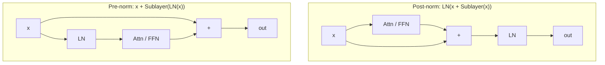

## The survey approach

Tatsunori Hashimoto titles the lecture "everything you did not want to know about architectures and hyperparameters". The premise: architecture is inscrutable, and theory will not save you. The best move is to train models yourself and try variants. The second best is to survey what everyone else built, and separate the choices that are fixed across all working models from the ones you can vary freely [00:00:24](ts:00:00:24).

Assignment 1 already shows the gap between the vanilla Vaswani transformer (sin/cos position embeddings, ReLU, post-norm) and the modern variant you implement: pre-norm, RoPE, SwiGLU. Those choices were copied from LLaMA. So did everyone else [00:02:38](ts:00:02:38).

The survey behind the lecture: 19 new dense models last year (Qwen 2, Gemma 3, InternLM2, Nemotron 4). This year brings Qwen 3, Gemma 4, Olmo 3, Percy's Marine 8B, and a wave of MoEs, which Lecture 4 covers [00:04:30](ts:00:04:30).

An architecture must do three things: learn from data, train efficiently on GPUs, and not blow up halfway through training. Every messy choice below traces back to one of these [00:06:00](ts:00:06:00).

## Where the layer norm goes

The one thing the original transformer got wrong, by consensus: layer norm placement. The original puts the norm inside the residual stream. The modern choice puts it outside the stream, before each sublayer [00:08:00](ts:00:08:00).

Everyone uses pre-norm now. The single exception in the survey is OPT-350M, and OPT was "kind of a mess of a language model" [00:09:09](ts:00:09:09).

Why it matters:

- The original motivation was killing the learning-rate warmup. Post-norm needs warmup. Pre-norm converges cleanly without it (Xiong, 2020).
- The deeper reason is gradient attenuation. "Keep your residual stream clean": with pre-norm, x flows untouched from bottom to top, so gradients flow straight back through. Post-norm re-normalizes every block and scrambles gradient scales.
- Salazar and colleagues measured fewer and smaller gradient spikes under pre-norm [00:12:22](ts:00:12:22).

Variants exist. Grok, Gemma 2, and Olmo 2 place the norm after the sublayer computation but still outside the residual stream. And when stability bites, teams sprinkle norms everywhere, including inside attention (QK norm, below). That "ridiculous" fix keeps working [00:13:00](ts:00:13:00).

## RMSNorm and the death of the bias

Modern models use RMSNorm, not LayerNorm. LayerNorm subtracts the mean, divides by the standard deviation, then rescales with learned parameters. RMSNorm skips the mean subtraction and the bias: it only scales [00:14:19](ts:00:14:19).

Representationally there is no reason to prefer it. The reason is systems. [Lecture 2](l02-pytorch-resource-accounting.html) showed that FLOPs are not runtime: layer norm is 0.17% of FLOPs but can be up to 25% of runtime on small models, because it is pure memory movement with tiny arithmetic intensity [00:15:43](ts:00:15:43). Dropping the mean computation is a free win. Narang et al. (2020) found more steps per second on a 200M model, plus slightly better performance as a bonus.

The same logic kills bias terms. The original transformer has biases on its linear layers. Most implementations drop them: another memory-intensive, compute-light op, gone for a free systems win. Biases can also induce stability issues [00:16:30](ts:00:16:30).

> [!KEY] The pattern: remove every op that moves memory without adding expressive power. RMSNorm and bias removal are the same move.

## Activations: the GLU takeover

The zoo: ReLU, GELU, Swish, ELU, GeGLU, SeLU, SwiGLU, LiGLU. You can train a good model on plain ReLU (Chinchilla is arguably the best of that group) or GELU (GPT-3). But nearly every credible modern model uses a gated linear unit [00:20:00](ts:00:20:00).

Construction: take a standard FFN, xW1 → activation → W2, and add a gate. A second matrix V produces a same-shaped gate that multiplies the activated output elementwise:

\[ \text{FFN}(x) = (\text{act}(xW_1) \odot xV)\, W_2 \]

The name is activation plus GLU: ReLU gives ReGLU, GELU gives GeGLU, Swish (x·sigmoid(x)) gives SwiGLU [00:22:00](ts:00:22:00).

The split is clean. Google models use GeGLU (Gemma, T5). LLaMA descendants and PaLM use SwiGLU. SwiGLU is probably dominant, but among gated units the choice barely matters [00:23:50](ts:00:23:50).

The 2/3 rule: a gated FFN has three matrices instead of two. Shrink the FF dimension by 2/3 to hold parameters constant: 4 × 2/3 = 8/3 ≈ 2.67. This is a rule of thumb, not an iron law [00:24:00](ts:00:24:00).

Evidence: Shazeer (2020) ran parameter-matched comparisons with multiple replicates and error bars. GLU variants beat non-GLU variants consistently. Narang et al. (2020) corroborated on T5-style models [00:25:01](ts:00:25:01).

The exception proves the rule is soft: Nemotron-4 340B used squared ReLU and trained fine. But non-gated models are now rare.

## Parallel blocks: a good idea that lost

Normal blocks are serial: attention, then MLP. GPT-J tried parallel: add the attention and MLP outputs into the residual stream together. PaLM's report describes it: share the layer norms, fuse the matmuls, gain systems efficiency. PaLM claimed no performance drop and 15% better systems utilization. Cohere followed [00:27:55](ts:00:27:55).

It fell out of favor over the last two years. Serial execution got well optimized, and parallel blocks lose effectively half the depth, which hurts representation. Later Google models quietly dropped it, which is itself a signal: no clean controlled ablation exists [00:41:00](ts:00:41:00).

## Position embeddings and RoPE

Attention is position-independent: it is inner products, so shuffling the inputs changes nothing. Position must come from somewhere [00:30:00](ts:00:30:00).

| Scheme | Idea | Status |
|---|---|---|
| Sinusoidal | Add sin/cos of position (Fourier intuition) | Original transformer |
| Absolute learned | One embedding per position | Early large models |
| Relative (T5-style) | Add a bias to the attention matrix by offset | T5, Chinchilla |
| RoPE | Rotate Q/K by position-dependent angles | Dominant since ~2024 |

Relative embeddings are relative, but they add into the attention matrix: they do not factorize as an inner product of position-aware embeddings. RoPE wanted a true relative embedding: ⟨f(x,i), f(y,j)⟩ = g(i−j) [00:32:27](ts:00:32:27).

The trick: inner products are invariant to rotation. Take the position-free word vector and rotate it by an angle proportional to its position. "We" at 0 and "know" at 1 have relative angle 1. In "of course we know", "we" sits at 2 and "know" at 3: both rotated further, but the relative angle is still 1. Absolute position cancels [00:34:00](ts:00:34:00).

In D dimensions, chunk the vector into pairs and rotate each pair. The rotation speeds vary: slow frequencies capture long-range dependence, fast ones capture neighbors. The RoPE paper (Su et al., 2021) motivates this with complex numbers. The geometry above is the whole idea [00:35:30](ts:00:35:30).

Implementation notes:

- Multiply by sines and cosines. Do not add them. Additive sin/cos creates cross terms between position and content, which leaks absolute position. Multiplication keeps it purely relative [00:36:30](ts:00:36:30).
- Apply to queries and keys at the attention level, not to embeddings at the bottom. Generate cos/sin from position IDs and apply as a matrix multiply or a manual rotation.
- Gemma 4's proportional RoPE rotates only the first two coordinates. Dropping the slow frequencies is a valid optimization for tiny models [00:37:21](ts:00:37:21).

Q&A notes: higher-dimensional rotations beyond 2D pairs have not been seen to work. ALiBi-style injection into the attention matrix works fine but never became dominant.

## Hyperparameters: the forgiving ones

Once you train a model you face concrete questions: FF size, head count, vocab size, weight decay, dropout, depth vs width. The space people actually search is small, and most choices sit in wide flat basins [00:43:00](ts:00:43:00).

**FF ratio (d_ff / d_model): 4.** The rule of thumb works remarkably well. GLU variants use 8/3 ≈ 2.67 (the 2/3 correction). LLaMA 2 chose 3.5 (×1.33, justified by efficient MQA attention freeing capacity for the MLP). The bold exception: T5 used 64×, arguing bigger matmuls utilize hardware better. Kaplan et al. (2020) swept the ratio and found a flat basin from ~1 to ~10. Past ~10–100 the loss shoots up quadratically. T5 v1.1 quietly returned to 2.5× [00:45:06](ts:00:45:06).

**Head dimensions: heads × head_dim = d_model.** The canonical multi-head setup keeps total width matched to the model dimension. From the lecture table:

| Model | Heads | Head dim | Model dim | Ratio |
|---|---|---|---|---|
| GPT-3 | 96 | 128 | 12288 | 1 |
| LLaMA 2 | 64 | 128 | 8192 | 1 |
| PaLM | 48 | 258 | 18432 | 1.48 |
| Qwen 3.5 (27B) | 24 | 256 | 5120 | 1.2 |
| LaMDA | 128 | 128 | 8192 | 2 |
| T5 | 128 | 128 | 1024 | 16 |
| T5 v1.1 | 64 | 64 | 4096 | 1 |

Most models sit near 1. The exceptions are Google models. Another forgiving basin [00:50:00](ts:00:50:00).

**Aspect ratio (d_model / n_layers): ~100.** GPT-3, LLaMA, and friends all land near 100 width per layer. Systems push wide: deep models force pipeline parallelism, which nobody wants to deal with. Wide models split cleanly with tensor parallelism. Kaplan's sweep finds the optimum near 100 at every model size. Tay et al. (2021) found that only FLOPs matter, not the ratio: pick anything in the forgiving band and spend your worry on utilization [00:51:37](ts:00:51:37).

**Vocab size: two regimes.** Monolingual English models run 30–50K: original transformer 37000, GPT 40257, GPT-2/3 50257, T5 32128, LLaMA 32000. Multilingual and production models run 100–250K: mT5 250000, PaLM 256000, GPT-4 100276, Gemma 4 262144, DeepSeek 100000, Qwen 152064, Yi 64000. Bigger models support bigger vocabs. Nobody trains large monolingual models anymore [00:54:00](ts:00:54:00).

> [!PROF] A student asked whether bits-per-byte is comparable across tokenizers. Hashimoto: yes. Modern tokenizers are complete (they model any string), and bits-per-byte normalizes by bytes, the same denominator. Perplexity and bits-per-byte are duals.

**Regularization: the counterintuitive one.** Single-pass SGD over more data than you can process barely memorizes, so overfitting is not the problem. Some trainers watch only training loss. Yet weight decay stays popular in modern models. Andriushchenko et al. (2023): weight decay is not acting as a regularizer here. It interacts with the optimizer to improve optimization. Train and validation loss do not separate across weight-decay values, but with learning-rate decay, stronger weight decay starts slow and converges to a better minimum. Dropout has fallen out of favor. It does not interact well with optimization [01:01:43](ts:01:01:43).

The defaults: FF ratio 4 (8/3 for GLU), heads × head_dim = d_model, aspect ratio ~100, vocab matched to multilinguality, weight decay on despite no overfitting [01:03:00](ts:01:03:00).

## Stability: the expensive-model problem

Recent years shifted emphasis from performance to stability. A spiky loss curve with exploding gradient norms can leave an unrecoverable model after millions of dollars. The usual suspects: softmaxes. The exponential blows up. The division blows up. A language model has two: the output softmax and the attention softmax [01:05:00](ts:01:05:00).

**Output softmax: the Z-loss.** Log-probability is log P = U − log Z. U is the residual-stream output and usually well-behaved. Z is the danger: an exponential sum that can explode or collapse. Softmax is overparameterized (adding a constant to U changes nothing), so add a penalty on (log Z)² that pulls log Z toward zero. From Devlin (2014). Baichuan used it first among open models. DCLM and OLMo followed. Surprisingly effective [01:09:01](ts:01:09:01).

**Attention softmax: QK norm.** RMSNorm the queries and keys before their matmul. Inputs to the softmax then have scale ~1 by construction. Originated in multimodal work (Chameleon). Now standard in large models. It does not hurt performance and prevents attention degeneracies [01:10:01](ts:01:10:01).

**Logit soft capping.** Hard-cap the attention logits with tanh so they can never explode. Gemma 2, 3, and 4 use it. NVIDIA's systematic comparisons: QK norm alone does slightly better (it lets you raise the learning rate). Soft capping alone loses performance because the model can never express very confident attention. It is the safer, stronger intervention [01:12:18](ts:01:12:18).

> [!KEY] The stability philosophy in one line: if it is unstable, throw a layer norm at it. Pre-norm, post-sublayer norms, QK norm: the same move, applied wherever the spikes appear.

## Attention for inference: GQA

Serving changes the math. You pay for FLOPs and for memory accesses. Prefill (processing the prompt) has good arithmetic intensity: big matrices, long sequences. Decode is autoregressive: generate one token, condition, repeat. The KV cache reuses past keys and values, which saves compute but creates a memory-access pattern of B·S²·D + S·D². Arithmetic intensity becomes N/D + 1/B: you need big batches, short sequences, or huge models. Small models serve badly [01:15:18](ts:01:15:18).

**MQA** (multi-query attention): share one K and one V across all heads. Only queries differ. The KV cache shrinks drastically and the N/D term gains a factor of H. The cost is expressive power [01:19:35](ts:01:19:35).

**GQA** (grouped-query attention): the knob between them. Keep all query heads, use fewer K/V heads. Shazeer (2019) measured a small perplexity hit for MQA. Ainslie (2023) found low-to-no hit for GQA. In practice GQA gets nearly full multi-head quality at near-MQA inference cost, which is why almost every model today uses it [01:21:07](ts:01:21:07).

DeepSeek-V2's MLA (multi-head latent attention) is a different factorization with different tradeoffs. Lecture 4 covers it.

> [!INTERVIEW] "Why GQA?" is a standard inference interview question. Answer with the decode arithmetic-intensity argument: the KV cache makes decode memory-bound, and fewer K/V heads cut the bytes moved per token.

## Sliding windows and hybrid attention

Full attention is quadratic. GPT-3 alternated full attention with banded (windowed) attention. The idea came back strongly in the last year: alternate full-attention layers with local sliding-window layers. Cohere's Command A used full attention every 4th layer and sliding windows between. Local layers aggregate into global ones as you go up. Some variants drop RoPE on the long-range layers (NoPE) and keep position info only locally. Llama 4, Gemma 4, and Olmo 3 all interleave full and sliding-window attention with full RoPE [01:25:11](ts:01:25:11).

Qwen 3.5 (listed as Qwen 3 Next on the slide) uses the same alternating skeleton with a different cheap layer: a gated DeltaNet state-space model instead of sliding windows, with full attention every 4 layers. SSMs are Lecture 4 [01:27:55](ts:01:27:55).

## Assignment connection

Assignment 1 has you implement exactly the modern consensus from this lecture: pre-norm Transformer blocks, RoPE, and SwiGLU. When a default looks arbitrary, this lecture is the receipt: it is the choice the field converged on.
