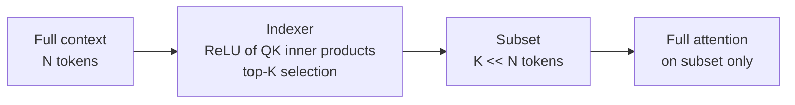
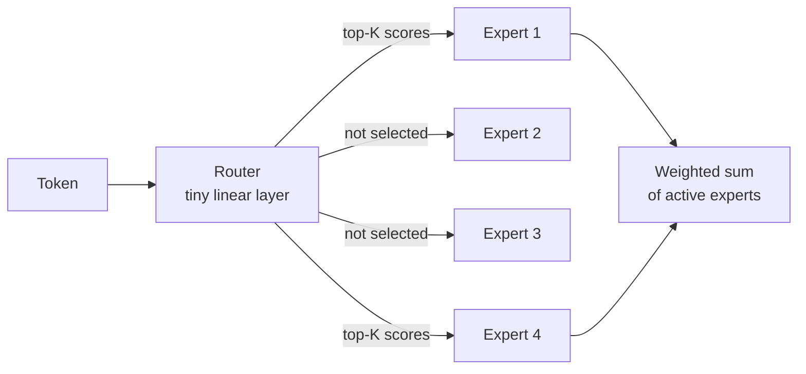

## Two modifications

Lecture 3 covered the basic Transformer and small tweaks to it. This lecture covers two advanced developments [00:00:05](ts:00:00:05).

1. **Attention alternatives.** Architectural changes that make the dependence on sequence length linear instead of quadratic. This modifies the attention block.
2. **Mixture of experts.** A way to get far more parameters per unit of compute. This modifies the MLP block.

## Why long context needs new attention

Vendors keep shipping larger context windows. Agents and knowledge-heavy workloads reward packing more into the context.

The cost picture explains the urgency. The feedforward cost grows linearly with sequence length. Attention is an all-to-all interaction, so it grows quadratically. At short sequences the feedforward dominates. At long sequences attention dominates and keeps pulling away.

The basic toolkit has two items:

- **Hybrid attention.** Use cheap local attention in most layers and full global attention rarely, for example once every eight layers.
- **Systems engineering.** Constant factors matter enormously. FlashAttention rearranges the attention computation to minimize memory transfer. It gives roughly 2x speedups and avoids materializing the large attention matrix, so sequences that did not fit in memory now run [00:03:48](ts:00:03:48).

> [!PROF] Classical CS training says big-O is what matters. In language models, constant factors from systems work have repeatedly changed what is feasible. FlashAttention did not fix the quadratic cost, but it changed the economics of context length.

For 5 to 10 million tokens, these tricks are not enough. The lecture asks whether linear-time dependence on sequence length is possible.

## Linear attention: the core idea
. Linear attention compresses the past into a fixed-size recurrent state (linear).")


Every working linear-time method in this lecture builds on one idea: the **associativity of multiplication** [00:06:00](ts:00:06:00).

Write attention with \(Q \in \mathbb{R}^{n \times d_k}\), \(K \in \mathbb{R}^{n \times d_k}\), \(V \in \mathbb{R}^{n \times d_v}\):

\[ \mathrm{Attn}(Q, K, V) = \rho(QK^\top)V \]

The \(QK^\top\) term costs \(O(n^2 d_k)\). Now drop the softmax \(\rho\) for a moment. Treat it as the identity. Then:

\[ QK^\top V = Q(K^\top V) \]

Moving the parentheses changes the cost from \(O(n^2 d_k + n^2 d_v)\) to \(O(nd_v d_k)\). The \(n^2\) term is gone. The remaining dimensions \(d_v, d_k\) are in the thousands, not millions, so this is far cheaper at long context.

> [!KEY] Associativity lets you choose which matrix product is quadratic. Standard attention pays \(n^2\). Linear attention pays \(d^2\) instead.

## The recurrent form

The reordered form has a second benefit. Write it as a left-to-right sweep:

\[ S_t = S_{t-1} + k_t v_t^\top \qquad y_t = q_t S_t \]

Here \(S_t\) is a fixed-size state. Accumulate \(k_t v_t^\top\) into it, then read out with \(q_t\). This is an RNN.

This gives a **duality**. Use the dense parallel form for training. Use the serial recurrent form for inference, where you carry only the fixed-size state forward. You get the best of both worlds [00:06:00](ts:00:06:00).

```mermaid
flowchart LR
    A[Dense form<br/>Q times K-transpose-V] -->|training| B[Parallel<br/>fast on GPU]
    A -->|inference| C[Recurrent form<br/>fixed-size state S]
    C --> D[O(1) memory<br/>per token]
```

Two facts to keep straight. Dropping the softmax is the lossy step. The equivalence between the dense linear form and the recurrent form is exact [00:21:07](ts:00:21:07).

Linear attention alone is weak. It is the starting point, not the destination.

## Mamba-2: add a forget gate

Pure linear attention always carries the full state forward. LSTMs taught us that forgetting matters. Mamba-2 adds an input-dependent gate \(\gamma_t = f(x_t)\) [00:11:47](ts:00:11:47):

\[ S_t = \gamma_t S_{t-1} + k_t v_t^\top \qquad y_t = q_t S_t + v_t D \]

\(\gamma_t\) controls how much state survives. The \(v_t D\) term is a residual pass-through: the current token's value feeds directly to the output, with \(D\) as a learned modulation gate [00:22:26](ts:00:22:26).

The gate depends only on the current input \(x_t\), never on the state. That restriction preserves the duality: you can still compute everything in parallel for training or serially for inference. The rule of thumb: gate with input-dependent terms only, and the parallel/serial duality survives.

Mamba-2 is a state space model by the Gu and Dao group. NVIDIA's NeMo Tron 3 uses Mamba-2 layers as the lightweight layer with occasional full softmax attention. It matches models like Qwen 3 and GPT-OSS with better throughput at long context [00:13:27](ts:00:13:27).

## Gated DeltaNet: gate the input too

Gated DeltaNet pushes the recurrence further. It adds a second gate \(\beta_t\), the "no input" gate: when \(\beta_t = 0\), the current token contributes nothing to the state [00:14:55](ts:00:14:55).

\[ S_t = \gamma_t (I - \beta_t k_t k_t^\top) S_{t-1} + \beta_t k_t v_t^\top \qquad y_t = q_t S_t \]

The term \((I - \beta_t k_t k_t^\top)\) acts as a projector. Before writing the new key-value pair, it erases prior information stored in the current key direction \(k_t\). Intuition: when you write new information for a key, also clear out the stale information filed under that key.

This update has been reinvented independently. Fast weight programming and test-time training derive the same projector from meta-learning least-squares objectives. Different design principles converged on the same math.

Qwen 3.5 and Qwen Next use a 3:1 Gated DeltaNet to attention hybrid. Decoding throughput stays much higher than Qwen 3 as context grows, with little performance loss [00:18:23](ts:00:18:23).

| Method | State update | Extra gate | Used at scale |
|---|---|---|---|
| Linear attention | \(S_t = S_{t-1} + k_t v_t^\top\) | none | Minimax M1 (7:1 hybrid) |
| Mamba-2 | \(S_t = \gamma_t S_{t-1} + k_t v_t^\top\) | forget \(\gamma_t\) | NeMo Tron 3 |
| Gated DeltaNet | \(S_t = \gamma_t(I - \beta_t k_t k_t^\top)S_{t-1} + \beta_t k_t v_t^\top\) | forget \(\gamma_t\), no-input \(\beta_t\) | Qwen 3.5, Qwen Next (3:1 hybrid) |

## What the hybrid studies show

No one has proven a fully linear-time attention at scale. Everything battle-tested is a hybrid: mostly cheap recurrent layers with some full attention mixed in. Minimax M1 uses 7 linear layers per 1 full attention layer and stays competitive with models like DeepSeek R1 [00:10:07](ts:00:10:07).

A ByteDance Seed and UC Santa Cruz study varies the hybrid ratio [00:19:13](ts:00:19:13). Full attention is the dashed baseline. As the fraction of recurrent layers rises, performance degrades. At low ratios the best architectures show almost no hit. Past a threshold, degradation becomes clear, on both retrieval and QA tasks.

## Limits of state space models

Two trade-offs from the Q&A are worth keeping [00:33:50](ts:00:33:50):

- **Expressive power.** The all-to-all connection of softmax attention is powerful and easy to train. A finite state must compress everything it carries, so some information is lost relative to keeping the full context.
- **State size vs. context.** If the state were as large as the context, nothing would be lost, but you would pay the full cost. A tiny state cannot compress a huge context without loss.

On the future, the lecture's answer is pragmatic: expect architectures that throw all of these tricks together, plus a higher layer where post-training teaches the model to manage its own context through compaction and retrieval [00:32:34](ts:00:32:34).

## Sparse attention: a different idea

DeepSeek Sparse Attention (DSA), introduced in DeepSeek V3.2 and also adopted by GLM 5, takes a totally different route [00:23:13](ts:00:23:13).

A lightweight **indexer** selects a small subset of tokens. Then full attention runs only on that subset.



Mechanics: compute \(QK^\top\) inner products, apply ReLU, weight by terms derived from preceding tokens, and take the top-K positions. The indexer is quadratic, but it is cheap: low precision, low dimensional. The second stage is quadratic on a short, bounded context.

The surprising part: you do not need to train with the indexer. Train a normal dense transformer at short context. Bolt the indexer on during the long-context extension stage, then post-train. This matches the standard recipe: short-context pretraining, long-context extension, post-training.

Results: DeepSeek V3.2 matched frontier models of its time (Claude 4.5 Sonnet, Gemini 3) with much better prefill and decode scaling. GLM 5 ablations show full DSA training loses little versus full attention, even on hard long-context retrieval [00:25:59](ts:00:25:59).

> [!KEY] DSA is not linear time. It wins on constant factors: a cheap indexer plus exact attention on a short subset. Do not get stuck on quadratic versus linear. Constant factors decide what ships.

## Mixture of experts: a more efficient MLP

Conceptually, a mixture of experts changes nothing deep. It is a more efficient MLP [00:34:23](ts:00:34:23).

Take the big feedforward network. Cut it into smaller feedforward networks, the **experts**. Add a **router** that picks which experts handle each token. If you have 4 experts and route each token to 1, you hold 4x the parameters but pay 1x the compute per forward pass.



Routing happens at the **token level**. Every token gets its own expert assignment. The router itself is naive: a single matrix multiply between the input and one vector per expert.

Why this matters:

- **Same FLOPs, better models.** Fedus et al. 2022 (Switch Transformer): fix the active parameters, increase the expert count, and test loss keeps falling [00:37:39](ts:00:37:39).
- **Faster training.** OLMoE shows MoEs training roughly 2x faster than dense equivalents at the same compute.
- **Better inference economics.** DeepSeek V2 showed far fewer active parameters matching or beating dense models on MMLU.
- **A new parallelism axis.** Experts are natural chunks. Put them on different devices and route activations between devices. This is expert parallelism, covered in the systems lectures.

Qwen 1.5 MoE, with 2.7B active parameters, beat many 7B dense models. That result, plus DeepSeek's early work, convinced the open-source community [00:41:21](ts:00:41:21).

## Routing: how tokens find experts

Almost every deployed MoE uses **token-choice top-K** routing: each token picks its K favorite experts. The alternative, expert-choice (each expert picks its favorite tokens), trains fine but token choice gets lower validation loss and is the standard. OLMoE ablates this directly [00:48:59](ts:00:48:59).

The router zoo, from most to least used:

| Router | How it works | Status |
|---|---|---|
| Top-K on inner products | Score each expert by \(w_i^\top x\), softmax, take top K | Standard: Switch (K=1), GShard (K=2), Mixtral (K=2), DBRX (K=4), Qwen (K=4), DeepSeek |
| Hash routing | Hash the input, send to a fixed expert | Works as a baseline, not deployed |
| RL routing | Treat routing as a bandit policy, train with REINFORCE | Earliest work (Bengio 2013), not common: variance and complexity |
| Linear assignment | Solve the global token-to-expert matching exactly | Optimal per step, far too expensive at scale |

The standard top-K gate in equation form:

\[ s_i = \mathrm{softmax}(w_i^\top x), \qquad g = \mathrm{topK}(s), \qquad y = x + \sum_{i \in g} g_i \cdot \mathrm{FFN}_i(x) \]

The gates \(g_i\) are just inner products between per-expert weights and the input. Nothing more complicated.

> [!PROF] The same top-K selection pattern appears in DSA, in H-Net, and across MoE papers. Learn to recognize it. It is becoming a standard architectural primitive [00:53:14](ts:00:53:14).

### DeepSeek's refinements: fine-grained and shared experts

DeepSeek MoE introduced two ideas now used everywhere [00:54:31](ts:00:54:31):

- **Fine-grained experts.** Cut experts into smaller chunks and use more of them. Smaller, more numerous experts beat fewer large ones at fixed compute.
- **Shared experts.** Reserve some experts that are always on for every token. Common processing gets offloaded to the shared expert, so routed experts can specialize further. This bypasses the router entirely.

DeepSeek's ablations show both help, with large gains on TriviaQA and Natural Questions from the shared expert. OLMoE agrees on fine-grained experts but finds shared experts do not help much. A genuine disagreement between careful studies.

The DeepSeek MoE design is now the standard template, the way the LLaMA design became standard for dense transformers. Recent routing configurations:

| Model | Routed experts | Active (K) | Shared |
|---|---|---|---|
| GShard | 2048 | 2 | 0 |
| Switch Transformer | 64 | 1 | 0 |
| Mixtral | 8 | 2 | 0 |
| DBRX | 16 | 4 | 0 |
| Grok | 8 | 2 | 0 |
| DeepSeek V1 | 64 | 6 | 2 |
| Qwen 1.5 MoE | 60 | 4 | 4 |
| DeepSeek V3 | 256 | 8 | 1 |
| OLMoE | 64 | 8 | 0 |
| Llama 4 Maverick | 128 | 1 | 1 |

## Training MoEs: the hard part

Training must stay sparse. Activating all experts during training would cost the full FLOPs of every expert, defeating the purpose. But sparse gating is not differentiable, and you never observe the counterfactual experts you did not pick. This is a bandit-flavored problem [00:43:10](ts:00:43:10).

Three approaches exist:

1. **RL.** REINFORCE on the routing policy works (Clark et al. 2020) but gradient variance and complexity make it uncompetitive.
2. **Stochastic perturbation.** Shazeer et al. 2017 inject Gaussian noise into routing scores so close ties break randomly and gradients can rank experts. Fedus et al. 2022 used multiplicative jitter to make experts less brittle, but later work removed it: ablations show dropping the stochastic tricks helps stability and quality.
3. **Heuristic balancing losses.** What everyone actually uses.

### Expert collapse and the balancing loss

Naive gradient descent produces a rich-gets-richer dynamic. The chosen experts get the gradient signal, their router weights grow, they get chosen more. Experts collapse: a few experts take everything and the rest starve [01:03:48](ts:01:03:48).

The fix is a heuristic auxiliary loss from the Switch Transformer. For each expert \(i\), let \(f_i\) be the fraction of tokens dispatched to it and \(P_i\) the total router probability mass assigned to it. The loss is proportional to:

\[ \mathcal{L}_{\mathrm{aux}} = \alpha \sum_i f_i \cdot P_i \]

The equation looks arbitrary. Take the gradient with respect to \(P_i\): it is proportional to \(f_i\), the fraction of tokens the expert received. So the loss pushes down the router mass on popular experts in proportion to their popularity. Read it in gradient space and the mechanism is clear [01:03:59](ts:01:03:59).

The DeepSeek recipe: backpropagate straight through the experts, ignoring the non-differentiability, and add per-expert balancing plus **per-device balancing** (experts on the same device should share load evenly, for utilization). DeepSeek V3 replaces much of this with per-expert biases tuned by an online learning trick, calling it "auxiliary-loss-free" balancing, though some aux losses remain. It also switches the weighting to sigmoid plus softmax top-K [01:23:41](ts:01:23:41).

Remove the balancing loss and the result is catastrophic. OLMoE ablates this: training loss spikes, and nearly all tokens collapse onto two experts. With the loss, all experts stay utilized [01:07:51](ts:01:07:51).

> [!WARN] Experts are not semantic specialists. Routing visualizations show punctuation going to one expert and non-English scripts to another. There is no "Wall Street Journal expert." The router is a single linear layer. It cannot learn topics.

## MoE systems

Expert parallelism adds a third axis beside data and model parallelism. Each has limits: data parallelism caps at the batch size, model parallelism at natural cut points. Experts give another way to split work across devices.

The computation pattern of MoEs maps to structured sparse matrix multiplies, which GPUs support natively. Frameworks like MegaBlocks exploit this so that many small expert matmuls become one efficient sparse operation [01:12:37](ts:01:12:37).

Communication is the price. Routing means shipping activations between devices. NeMo Tron 3 down-projects activations before the all-to-all collective, cutting communication volume without shrinking the model's hidden dimension.

One solved historical problem: naive MoE serving **dropped tokens** when an expert's queue overflowed. Since dropping happened at the batch level, other users' queries could bump your tokens out and change your results. Modern dropless architectures (MegaBlocks and others) removed this [01:16:22](ts:01:16:22).

## Stability: the router softmax

MoEs add another softmax in the router, and softmaxes are the danger zone for training stability (exponentials and divisions). Zoph et al. studied this early. The standard fixes: run the router in float32 even when the rest trains in low precision, and add a z-loss on the router. OLMoE ablations show the z-loss visibly calms spiky training curves [01:17:36](ts:01:17:36).

## Fine-tuning and upcycling

MoEs overfit when fine-tuned on small data. The train/validation gap grows far larger than for dense models [01:18:30](ts:01:18:30). Common responses: fine-tune only the attention layers, fine-tune only non-MoE layers, or follow the bitter lesson and retrain on far more data (DeepSeek used 1.4M SFT examples) [01:19:25](ts:01:19:25).

**Upcycling** converts a trained dense model into a MoE: copy the MLP into several experts, randomly initialize a router, keep training. MiniCPM upcycled a 2.4B dense model to 13.4B parameters for nearly free gains. Qwen upcycled 1.8B into the Qwen 1.5 MoE (top-K 4, 60 experts, 4 shared), one of the first large-scale upcycling successes [01:19:46](ts:01:19:46). Nobody upcycles anymore: if you want a MoE, train the hero run as a MoE from the start.

## DeepSeek V1 to V3

The lecture closes by walking the DeepSeek lineage, recommended reading for architecture design:

- **V1 (16B total, 2.8B active).** The Platonic MoE: 2 shared + 64 fine-grained experts, standard top-K routing, standard aux-loss balancing (per-expert and per-device).
- **V2 (236B total, 21B active).** Scaled up: 2 shared + 160 fine-grained experts. Adds top-M device routing and communication balancing losses, balancing traffic in and out. Systems-aware design: respect the hardware, not just the math.
- **V3 (671B total, 37B active).** 1 shared + 256 fine-grained experts, 8 active. Sigmoid plus softmax top-K weighting, aux-loss-free balancing with seq-wise aux.

Two more V3 ingredients:

- **MLA (multi-head latent attention).** Express Q, K, V as functions of a lower-dimensional latent \(c\). The KV cache stores only \(c\), which is much smaller [01:23:59](ts:01:23:59). The catch: RoPE conflicts with latent caching, so a few non-latent key dimensions carry the rotation.
- **MTP (multi-token prediction).** Lightweight heads predict multiple future tokens at once. Partly a statistical bet, partly systems: it builds in a speculative decoder [01:25:12](ts:01:25:12).

Summary from the slides: MoEs exploit sparsity so you hold more parameters than you pay for. Discrete routing is hard, but top-K heuristics work at scale. The empirical evidence is now strong: MoEs are cost-effective and here to stay.

## Assignment connection

The systems material here feeds Assignment 2 (GPU kernels, Triton, parallelism). Expert parallelism and the networking-topology trade-offs appear there: given a topology, decide how to shard the model, or given a sharding, decide what topology it needs.

> [!INTERVIEW] Expect questions on why MoEs win (parameters without FLOPs), how top-K routing trains despite non-differentiability (straight-through gradients plus the balancing loss), and the failure modes (expert collapse, router instability, fine-tune overfitting). For attention alternatives, know the associativity trick cold and be able to derive the recurrent form.

## Sources

- Video: [Lecture 4, Stanford Online YouTube](https://www.youtube.com/watch?v=cKSwj_qZ8Jg)
- Slides: [lecture_04.pdf](https://github.com/stanford-cs336/lectures/blob/main/lecture_04.pdf)
- Notes: official subtitle transcript (en-orig)
