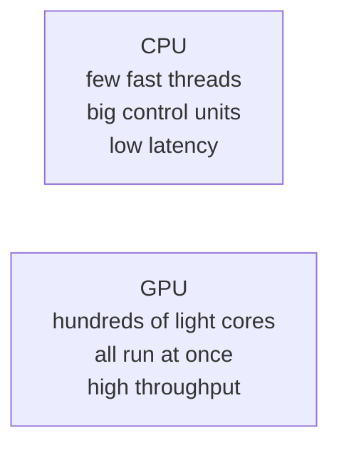
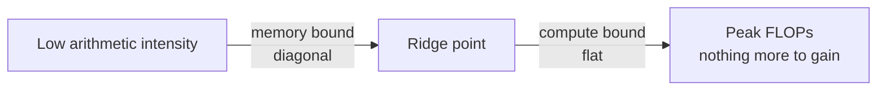
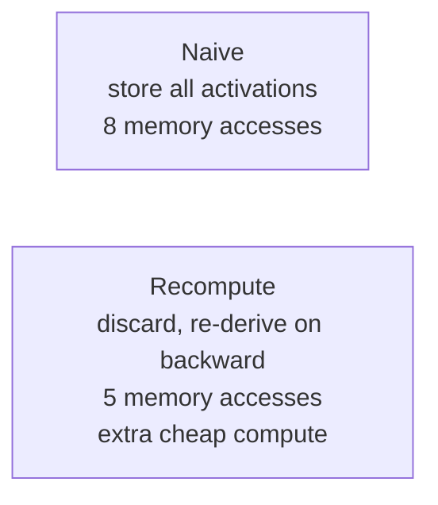
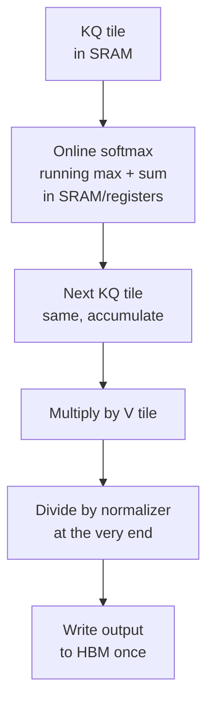

## The promise of this lecture

The systems portion of the course starts here. The lecture makes one promise: by the end, you will understand a strange plot [00:00:05](ts:00:00:05).

The plot shows matrix-multiply throughput against matrix dimension. Throughput generally rises with size, since more work keeps the hardware busier. But the curve has wild patterns: at certain sizes, throughput collapses. This lecture explains why, and how to stay at the top of the curve.

## Compute is the currency

Better language models come from more compute applied well. Faster hardware, better utilization, more chips, improved parallelization: all of these drive progress. This is the scaling-laws worldview from Lecture 1.

The old way of getting faster hardware is dead. **Dennard scaling**, making transistors smaller and clocks faster, tapped out in the 2000s [00:05:16](ts:00:05:16). Smaller transistors no longer run at higher clock speeds. There are physical reasons. Serial speedup is over.

The replacement is horizontal scaling: run more things in parallel instead of running one thing faster. GPUs are the embodiment of this shift. From the K20/M40 era to P100/V100, GPU FLOPs took off with super-exponential growth, over 1000x in a decade. Two hardware inflections drove it [00:07:11](ts:00:07:11):

- **2017, V100: Tensor Cores**, dedicated matrix-multiply circuits.
- **After: structured sparsity and low-precision formats** like FP8.

> [!KEY] There is no LLM scaling without GPU scaling. Systems is not a side topic. It is the substrate the scaling laws run on.

## CPU vs GPU philosophy

A CPU optimizes for **latency**. A few fast threads, big control units, complex branching and control flow. The time from instruction to completion is short.

A GPU optimizes for **throughput**. Hundreds of lightweight compute units run in parallel. Any single task may take long and stall, but aggregate throughput across all tasks is enormous.

## Anatomy of a GPU

The basic unit is the **SM**, the streaming multiprocessor. Think of it as a core: an independent compute unit with its own sub-components and its own fast memories. An A100 has 108 SMs. (The lecture verbally says 128 at one point. The slides and the later arithmetic use 108.) Each SM contains many **SPs**, streaming processors, that execute threads in parallel.

Memory lives in a hierarchy. The closer to the SM, the faster [00:10:20](ts:00:10:20):

| Memory | Location | Speed (A100) |
|---|---|---|
| Registers | Inside SM, per thread | Fastest |
| L1 cache / shared memory | Inside SM | 20-30 cycles |
| L2 cache | On die | Slower |
| Global memory (HBM/DRAM) | Chips next to the GPU | ~10x L1 latency |

SRAM (shared/cache) costs about 100x more than DRAM and runs about 8x faster. Building a whole chip from SRAM is possible. One inference-chip startup did exactly that, betting giant SRAM wins for inference. It was recently acquired by NVIDIA. For general accelerators the hierarchy stays: you must respect it to go fast.

Q&A clarifies shared memory versus L1 cache: the cache is automatic, storing recently accessed data on its own. Shared memory is programmable. You explicitly put things in and take them out.

## The execution model: threads, blocks, warps

Three players [00:13:18](ts:00:13:18):

- **Thread.** Does work in parallel. All threads follow the **SIMT** model: every thread executes the same instruction, but on different inputs. Same instruction stream, different data.
- **Block.** A group of threads. A block is guaranteed to run on a single SM, so its threads share that SM's shared memory. Blocks matter for tiling later.
- **Warp.** The scheduling unit: 32 consecutively numbered threads that always execute together. Grouping threads into warps cuts scheduler overhead.

The SIMT guarantee applies within the warp: all 32 threads in a warp execute the same instruction at the same time.

## The memory model

From a thread's view [00:15:44](ts:00:15:44):

- **Registers.** Fastest, most local. Hold things like array addresses.
- **Shared memory.** Visible within the block. The home for data reused across threads.
- **Global memory.** The far DRAM. Read it only if you accept the latency hit.
- **Constant memory.** Exists, rarely used.
- **Host memory.** CPU-side memory. Use it to offload beyond GPU capacity.

The rule for the whole lecture: **outside shared memory, everything is slow.** Group work into blocks to minimize global memory reads.

## TPUs: convergent evolution

TPUs are the alternative evolution of the same idea. If you build an energy-efficient ML accelerator, you converge on the same structure: lightweight control, a fast matrix-multiply unit, fast local memory plus slow HBM. The lecture maps every GPU concept to a TPU concept nearly one to one [00:15:44](ts:00:15:44).

Differences that matter:

- **Sizing.** TPUs use fewer, much bigger matrix-multiply units. An H100 has about 132 SMs and 528 matmul units. A TPU has 2 processor units and 8 matmul units. GPUs get flexibility from many small units. TPUs are locked into big matrix multiplies.
- **The 64-dimension floor.** TPU matrix units refuse inputs below a minimum size. A batch-size sweep in the lecturer's own paper stops at 64 because the unit will not take anything smaller.
- **Naming trap.** TPU "tensor cores" are processors, the SM equivalent. GPU "tensor cores" are matrix-multiply units. Same name, different object. Disambiguate by context.
- **No warps.** TPUs schedule blocks without the warp layer, trading off matmul versus non-matmul flexibility.
- **Networking.** The biggest TPU-vs-GPU differences are in how chips connect, not in the chips. That belongs to the parallelism lectures.

Both use systolic arrays under the hood to stream data through the multiply. The core lesson transfers: respect the memory hierarchy and feed the matmul units.

## Strengths of the GPU model

Three properties made GPUs win:

1. **Scalable.** Want more throughput? Add SMs, as long as memory bandwidth keeps up.
2. **Programmable.** SIMT is deceptively easy: write one instruction stream, run it on all inputs. You never program individual threads.
3. **Lightweight threads.** The scheduler swaps warps in and out almost for free, so stalled warps hide behind running ones.

Early researchers hacked programmable graphics shaders to compute matmuls. Then the V100 shipped Tensor Cores, dedicated matmul circuits. Matrix multiplies became the privileged operation: **more than 10x faster than any other floating-point op on the GPU** [00:23:51](ts:00:23:51). Any ML architecture that scales with compute will contain a matmul. Nothing else converts silicon into throughput this efficiently.

## The growing gap: compute vs memory

FLOPs scale fast. Memory bandwidth scales slowly. Inter-chip parallelism scales slower still. The gap between compute and memory widens every generation, so keeping compute units fed gets harder over time. That is why most optimizations in this lecture are memory optimizations.

Inference already shows where this leads: **prefill/decode disaggregation**. Prefill is compute-heavy matmuls, so run it on one chip. Decode is memory-bandwidth bound, so run it on another. At least one Chinese open model [uncertain: named in lecture as "step one three"] goes further and disaggregates by layer type, sending attention and MLPs to different accelerators [00:29:10](ts:00:29:10).

## The roofline model

The roofline plot has two regions [00:31:12](ts:00:31:12):

- **Memory-bound (diagonal).** Throughput rises with work per byte moved. More compute cannot help.
- **Compute-bound (flat).** The matmul units are saturated. More work per byte changes nothing.

Efficient GPU code lives on the flat part. The job is to raise **arithmetic intensity**, the FLOPs per byte read, until the compute units saturate. Six tricks follow. The first is about control flow. The other five are about memory.

## Trick 1: control divergence

On a CPU, an `if` picks one branch and runs it. On a GPU, every thread in the warp executes the **same instruction**. So every thread executes **both** branches. Threads on the wrong side mask out their results and sit idle [00:34:10](ts:00:34:10).

Execution serializes: the bottom-branch threads run while the top-branch threads wait, then they swap. This is **control divergence**: big compute gaps where the GPU does nothing.

The fix is stylistic. A ReLU written as a multiply by a mask runs everywhere at once. A ReLU written as an `if` walks both branches. GPU code multiplies by zeros and masks instead of branching.

## Trick 2: low precision

Fewer bits means fewer bits to move. The arithmetic is simple. Elementwise ReLU on a vector of size \(n\) in FP32: one 4-byte read plus one 4-byte write per 1 FLOP gives **8 bytes per FLOP**. In FP16 that halves to **4 bytes per FLOP**. (Bytes per FLOP is the inverse of arithmetic intensity.) [00:35:03](ts:00:35:03)

Real low-precision matmuls are mixed precision, and the details are a black art:

- **Downcast** weights and activations before the product.
- **Accumulate** partial sums in full precision.
- **Emit** outputs in FP32.

The hard part is choosing the format per operation. Matmuls can go low. Softmax and exponentials usually need FP32, or at least BF16. Getting this right took years of slow empirical work on training stability.

**FP8** has no single canonical format. E4M3 (4 exponent bits, 3 mantissa) suits some ops. E5M2 suits others. With so few bits, one format cannot fit all.

**MXFP8** (Blackwell) goes further: many scaling factors instead of one [00:38:49](ts:00:38:49). Activations are 8-bit, and each block of 32 elements gets its own 8-bit scale factor (E8M0, exponent only, so powers of two). Different regions of a matrix have different magnitudes, so per-block scales preserve range where a single global scale would overflow or underflow.

The clever design has a catch: **transposes break the pattern**. A transposed matrix no longer aligns with the one-scale-per-32 layout. Re-quantizing on every transpose would be expensive, so training keeps **two quantized copies** of each matrix: the original and the transposed version.

In practice: quantize only the layers that are safe (the first and especially the last layer resist quantization. The last layer drives the loss directly), and expect 20-30% matmul savings, not 2x. The quantize/dequantize overhead dilutes the win.

**MXFP4** is the next frontier: representable values run from -6 to 6, one scale factor per 16 elements. A paper has trained in FP4. No serious production model has, yet. The next generation probably will [00:42:58](ts:00:42:58).

Q&A notes: scaling factors are not trained. The library picks them by scanning min/max or tracking running statistics. Structured sparsity, by contrast, has mostly washed out empirically, except that MoEs are one successful form of structured sparsity.

> [!INTERVIEW] Know the mixed-precision recipe cold: what gets downcast, what accumulates in FP32, and why the softmax stays high precision. Interviewers use this to test whether you understand stability or just repeat "use FP16."

## Trick 3: operator fusion

Think of the GPU as a factory and memory as the warehouse, with a conveyor belt between them. Compute keeps scaling up. The belt does not. Every separate operation ships materials back and forth across the belt [00:47:48](ts:00:47:48).

Computing \(\sin^2(x) + \cos^2(x)\) naively launches 5 CUDA kernels: sin, cos, two squares, one add. Each one reads from and writes to global memory. The fused version reads once, does everything inside the SM, writes once. One kernel instead of five.

Easy fusions like this are automatic: `torch.compile` and JAX's compiler do them for you. Hard fusions still need manual kernels.

## Trick 4: recomputation

Backprop stores activations on the forward pass, then consumes them on the backward pass. From a systems view, those stored activations are memory traffic.

Take three stacked sigmoids. Naive: 1 read for \(x\), 3 writes for the intermediates and output, then the mirror on the backward pass. Total: **8 memory accesses** for almost no compute.

Alternative: throw the activations away. Store only the output. On the backward pass, re-run the forward computation on the fly wherever each activation is needed. Now: 2 reads (\(x\) and the output gradient) plus 1 write. Total: **5 accesses**, or 5/8 of the original [00:50:12](ts:00:50:12).

This only makes sense when compute is abundant and memory is dear. On modern GPUs, that is exactly the situation.

## Trick 5: coalescing

DRAM reads in **bursts**. Activating a row of memory cells is expensive. Once a row is open, reading the whole row is nearly free. A single read can return around 128 bytes if the data sits in one contiguous block [00:54:17](ts:00:54:17).

A memory access is **coalesced** when all threads in a warp fall inside the same burst. Then one burst serves the whole warp.

For a row-major 4x4 matrix, threads that read down a column each land in a different burst: the warp reads the entire matrix to get one column. Threads that read along a row share one burst: one read serves everyone. Coalescing is why matrix layout and access order matter [00:55:54](ts:00:55:54).

## Trick 6: tiling, the big one

Tiling groups memory accesses so repeated reads hit shared memory instead of global memory. Cut the matrix into tiles, load a tile into shared memory once, and do all the work on the tile there.

For an \(n \times n\) matmul, the naive code reads each input element \(n\) times from global memory. With tile size \(T\):

- Each element is read \(n/T\) times from global memory.
- Within a tile it is read \(T\) times from shared memory.

That is a factor-of-\(T\) cut in global memory traffic. At the extreme \(T = n\), each element is read from global memory exactly once.

Complications are real:

- **Tile sizes may not divide the matrix.** A 257-wide matrix with 128-wide tiles leaves skinny, nearly empty tiles and low utilization.
- **Alignment.** Shift the matrix by one element and the tile no longer lines up with burst windows. Coalesced single-read tiles become ragged multi-read tiles. The fix is **padding**.
- **Autotuning.** `torch.compile`'s max-autotune mode spends minutes benchmarking tile sizes because the optimum depends on the matrix, the burst layout, and shared-memory size.

This explains real mysteries. Karpathy's nanoGPT speedup: bumping the vocabulary from 50257 to 50304, a padding change, gave a 25% speedup through better-aligned reads. And the lecture's opening plot: color the curves by divisibility and the pattern appears. Sizes divisible by 1 or 2 crawl. Divisible by 16 or 32 fly. Powers of two are not magic. They fit the burst windows, so tiles read coalesced.

### Wave quantization

The plot's periodic crashes have a second cause [01:05:50](ts:01:05:50). From 1792 to 1793, throughput falls off a cliff. With 256x128 tiles:

- At 1792: \(7 \times 14 = 98\) tiles.
- At 1793: \(8 \times 15 = 120\) tiles.

An A100 has 108 SMs. 98 tiles fit in one wave. 120 tiles need two waves: 108 run, then 12 stragglers run with most of the GPU idle [01:09:18](ts:01:09:18). One extra element of dimension buys a whole extra wave. This is **wave quantization**.

## FlashAttention: the victory lap

FlashAttention is pure systems: from naive PyTorch attention to one clever fused kernel, with dramatic latency wins and far less HBM traffic. Every trick in this lecture appears in it.

Attention is 3 matrix multiplies (Q, K, V projections and the two products) with a softmax in the middle. The matmuls tile exactly like the tiled matmul above. The paper's first figure is literally that. The problem is the softmax: it is global, coupling all tiles together.

The key is the **online softmax** (Milakov and Gimelshein 2018) [01:14:45](ts:01:14:45). Instead of exponentiating everything, subtracting the max, and normalizing, keep a running maximum and a running sum as you sweep:

1. For each new block, update the running max if a larger value appears.
2. Rescale the accumulated sum to correct for the new max (a telescoping correction).
3. At the end, divide by the accumulator.

Because it is online, each tile's softmax contribution computes independently.

The forward pass: tiled KQ products stay in SRAM, the exponential fuses in, the running softmax statistics accumulate in shared memory or registers, and only at the end does the tiled multiply with V happen with a final division. The backward pass uses recomputation: instead of saving the \(n^2\) attention matrix, re-derive everything tile by tile.

That is the whole trick set in one algorithm: **tiling** for the matmuls, **fusion** for the exponentials, the **online softmax** to break the global coupling, and **recomputation** for the backward pass.

## Closing

Three takeaways close the lecture:

1. Understand the hardware down to the low level, or you will cargo-cult rules like "make dimensions multiples of 32" without knowing why.
2. Matmuls are the core operation. The compute-memory gap means data movement decides performance.
3. Hardware-aware thinking extends to architecture design, not just kernels. FlashAttention is architecture work done with a systems mindset.

## Assignment connection

Assignment 2 covers GPU kernels, Triton, and parallelism. Its exercises resemble the ones in the Google TPU/GPU book the lecture recommends. The tiling, coalescing, and fusion material here is the conceptual prerequisite. The assignment makes you implement the kernels.

## Resources from the lecture

- Horace He's GPU blogs and explainers [00:02:32](ts:00:02:32), including the BRRR introduction to GPU performance.
- The CUDA Mode community (formerly TPU Mode).
- The Google TPU book, now also a GPU book, with exercises: <https://jax-ml.github.io/scaling-book/gpus/>.

> [!INTERVIEW] The matmul plot question is a classic interview probe: "throughput rises with size but has periodic dips, why?" Answer in layers: roofline (memory-bound to compute-bound), divisibility and coalescing (burst alignment), wave quantization (tiles vs SM count). Each layer shows deeper hardware understanding.

## Sources

- Video: [Lecture 5, Stanford Online YouTube](https://www.youtube.com/watch?v=izZba4UA7iY)
- Slides: [lecture_05.pdf](https://github.com/stanford-cs336/lectures/blob/main/lecture_05.pdf)
- Notes: official subtitle transcript (en-orig)
