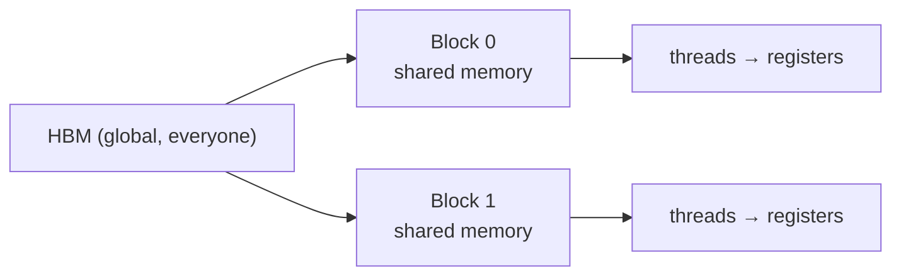

## The game

Lecture 5 gave the GPU overview. This lecture writes code [00:00:19](ts:00:00:19).

The agenda: benchmark and profile, then write four Triton kernels of increasing difficulty. GeLU (elementwise), softmax (row reduction), row sum (reduction with tiling), matmul plus ReLU (real tiling). By the end, you hold the ingredients for FlashAttention [00:58:01](ts:00:58:01).

## Hardware and programming model, recapped

The memory hierarchy is the whole game. Fast memory is small and near the SMs. Large memory is slow and far.

| | A100 | H100 | B200 |
|---|---|---|---|
| SMs | 108 | 132 | 148 |
| Registers per SM | 256 KB | 256 KB | 256 KB |
| L1 cache + shared memory per SM | 192 KB | 256 KB | 256 KB |
| L2 cache (whole chip) | 40 MB | 50 MB | 96–126 MB |
| HBM | 80 GB | 80 GB | 192 GB |
| Register bandwidth | ~116 TB/s | ~401 TB/s | ~447 TB/s |
| L1 + shared bandwidth | ~19 TB/s | ~33 TB/s | ~40 TB/s |
| L2 bandwidth | ~5–8 TB/s | ~12 TB/s | ~17 TB/s |
| HBM bandwidth | 2 TB/s | 3.35 TB/s | 8 TB/s |

(Numbers from the lecture code. The L1/L2 bandwidths are rough estimates. Online sources differ.)

The programming model: **threads** run code on a small part of the data, **thread blocks** (CTAs, concurrent thread arrays) group threads, and the **grid** collects the blocks [00:03:18](ts:00:03:18).

Why blocks exist at all: for elementwise ops like GeLU, per-thread thinking is natural. Each thread handles one element. But softmax and matmul need threads to communicate. Reading and writing HBM for that communication is too slow, so communication goes through shared memory, which is local to one SM. A thread block is the group of threads that shares shared memory, and one block schedules onto one SM [00:04:38](ts:00:04:38).



The programming model gives correctness. The hardware sets performance. The two levels stay separate in your head [00:07:55](ts:00:07:55).

## Five hardware details that decide performance

The model is clean. The hardware is not. Five details dominate.

**Warps.** Inside a block, threads group into warps of 32. All threads in a warp execute the same instruction in lockstep on an SM [00:09:08](ts:00:09:08). Branching is the failure mode: if threads in a warp take different paths (if A else B), the paths serialize. That is control divergence, and you avoid it.

The warp scheduler is the good news. An SM runs many warps and switches between them at zero cost. A warp blocked on an HBM read yields instantly to a warp doing tensor-core work. This hides latency [00:10:40](ts:00:10:40).

**Occupancy.** Each thread may use at most 255 registers. Registers per SM are fixed, so fatter threads mean fewer threads, which lowers occupancy [00:11:16](ts:00:11:16). Worked example from the lecture [00:12:50](ts:00:12:50):

- 128 threads per block, 160 registers per thread → 20,480 registers per block.
- B200 SM has 65,536 registers → 3 blocks fit → 12 warps.
- Max is 64 warps → occupancy 12/64 ≈ 18%.

> [!CAVEAT] Low occupancy is not automatically bad. Fewer threads that each do more work can win. This is thread coarsening, and the Triton compiler does it for you later in the lecture.

**Bank conflicts.** Shared memory splits into 32 banks, each 4 bytes wide. Per cycle, each bank serves at most one thread (unless threads hit the same location) [00:14:21](ts:00:14:21). Threads hitting the same bank serialize. Worst case: 32 threads read one matrix column → 32-way conflict, the worst possible. Matmul cannot always dodge this, because it reads rows of one matrix and columns of the other. The fix is swizzling (rearranging shared memory, e.g. row xor col). The lecture names it and moves on [00:16:24](ts:00:16:24).

**Memory coalescing.** This is the HBM counterpart, and a different constraint [00:17:01](ts:00:17:01). When the 32 threads of a warp touch HBM, accesses combine into 128-byte transactions (cache lines). Full coalescing: all threads land in one cache line (32 threads × 4 bytes = 128 bytes). Reading down a column fetches whole lines and wastes most of each. Note the disagreement. The transcript caption says "20 to 128 bytes". The lecture code says 128 bytes. The 128-byte figure matches 32 threads × 4 bytes, so use it.

**Wave quantization (block occupancy).** B200 has 148 SMs. Launch 160 blocks: wave one runs 148, wave two runs 12, and most SMs sit idle during the tail [00:18:31](ts:00:18:31). Fix: make the block count divide the SM count.

Summary of the model: grid sees HBM, block sees shared memory, thread sees registers. Warps, bank conflicts, coalescing, and occupancy decide how fast it actually runs [00:19:14](ts:00:19:14).

A student asked whether two blocks can share one SM. The answer: it depends on the block. If one block already saturates the SM's tensor cores, adding another buys nothing. The real fix for the tail-wave problem is to change the block size so blocks divide evenly [00:20:23](ts:00:20:23).

## Benchmark and profile before you optimize

The recipe for the whole course [00:22:08](ts:00:22:08):

1. Benchmark and profile your code.
2. Make changes.
3. Benchmark and profile again.

Always measure first. Find the bottleneck before writing kernels.

**Benchmarking** measures wall-clock time of an operation. It gives one number: end-to-end time. That number lets you compare implementations and see how time scales with dimension.

The lecture rolls its own benchmark to make the gotchas visible. The `benchmark()` function in `lecture_06.py`:

```python
def benchmark(run, num_warmups=1, num_trials=3):
    # Warmup: first runs include lazy compilation. Steady state is what matters.
    for _ in range(num_warmups):
        run()
    torch.cuda.synchronize()  # GPU is async. Wait for CUDA threads to finish.

    times = []
    for _ in range(num_trials):  # Multiple trials capture variance
        start_event = torch.cuda.Event(enable_timing=True)
        end_event = torch.cuda.Event(enable_timing=True)
        start_event.record()
        run()
        end_event.record()
        torch.cuda.synchronize()
        times.append(start_event.elapsed_time(end_event))
    return sum(times) / len(times)
```

Three rules. Warm up, because lazy compilation pollutes the first run. Run multiple trials, because timing has variance. Synchronize, because CUDA launches are asynchronous and the timer lies without it [00:24:01](ts:00:24:01).

One scaling observation: matmul time grows cubically, but stays flat until about dimension 2000. GPUs are built for large matmuls. A 2×2 matmul on a GPU is comically inefficient [00:25:55](ts:00:25:55).

**Profiling** shows where time goes. It also reveals what your code actually does, which matters when high-level code hides the machinery [00:26:25](ts:00:26:25). The PyTorch profiler on `A + B` shows a single `cuda functor add` kernel. On `A @ B`, it shows long kernel names, and the name changes with tensor size. Decode one [00:29:31](ts:00:29:31):

- `cutlass`: NVIDIA's CUDA linear algebra library.
- `sm100`: built for Blackwell (B200).
- `f32`: float32.
- `64x64x16`: the tile shape. Tiling returns in the matmul section.

## One computation, three speeds: GeLU

Three implementations of the GeLU activation (tanh approximation) race [00:30:14](ts:00:30:14):

| Implementation | What it is | Result |
|---|---|---|
| Naive | Write the formula directly in PyTorch | ≈3.75 [uncertain: units not stated in lecture] |
| Builtin | `torch.nn.functional.gelu` | Much faster |
| Compiled | `torch.compile(naive_gelu)` | Much faster, slightly behind builtin |

The profiler explains the gap. The naive version launches many kernels: one per primitive in the computation graph. Each launch reads from HBM into the SM, computes, and writes back. Between kernels, everything must return to HBM. The builtin is a single hand-written CUDA kernel. The compiled version is a single kernel too, and the profiler shows it is a Triton kernel [00:34:48](ts:00:34:48).

> [!KEY] Kernel fusion is the whole story. Naive: many kernels, many HBM round trips, no fusion. Builtin and compiled: one kernel, one read and one write per element.

A student asked whether the Triton kernel is faster than the CUDA builtin. It is not, here. The compiled Triton kernel trails the hand-written CUDA builtin. Results are hardware-dependent and neither is terribly optimized. The point is the shape of the answer, not the exact numbers [00:36:08](ts:00:36:08).

## Triton: think in thread blocks

CUDA asks: what does each thread do? That gives fine-grained control, but you manage thread synchronization and shared memory by hand. For elementwise ops CUDA is fine. For anything with communication, the bookkeeping hurts [00:37:11](ts:00:37:11).

Triton (built by OpenAI, now standard) asks: what does each thread block do? The conceptual loop: load data into shared memory, operate on it, write back to global memory [00:39:01](ts:00:39:01). Triton sits between PyTorch (whole tensors, atomic ops) and CUDA (individual elements): block-level thinking.

The first kernel, GeLU on an 8192-element vector with block size 1024 (8 blocks) [00:39:57](ts:00:39:57):

```python
def triton_gelu(x):
    assert x.is_cuda and x.is_contiguous()
    y = torch.empty_like(x)          # Triton is not functional: pre-allocate the output
    num_elements = x.numel()
    BLOCK_SIZE = 1024
    num_blocks = triton.cdiv(num_elements, BLOCK_SIZE)
    triton_gelu_kernel[(num_blocks,)](x, y, num_elements, BLOCK_SIZE=BLOCK_SIZE)
    return y

@triton.jit
def triton_gelu_kernel(x_ptr, y_ptr, num_elements, BLOCK_SIZE: tl.constexpr):
    pid = tl.program_id(axis=0)      # Which block am I? (0, 1, 2, ...)
    start = pid * BLOCK_SIZE         # Offset into x
    offsets = start + tl.arange(0, BLOCK_SIZE)
    mask = offsets < num_elements   # Guard the tail block

    x = tl.load(x_ptr + offsets, mask=mask)   # HBM -> block
    # GeLU tanh approximation (tl.tanh does not exist; tanh(a) = (exp(2a)-1)/(exp(2a)+1))
    a = 0.79788456 * (x + 0.044715 * x * x * x)
    exp = tl.exp(2 * a)
    tanh = (exp - 1) / (exp + 1)
    y = 0.5 * x * (1 + tanh)
    tl.store(y_ptr + offsets, y, mask=mask)   # block -> HBM
```

Every Triton kernel has the same skeleton: wake up, find your index, read, compute, write [00:46:05](ts:00:46:05). Pointers are integers (memory addresses). You do pointer arithmetic. The mask keeps the tail block from reading past the tensor.

## PTX: what Triton compiles to

Triton code is a specification for the compiler, not what the GPU runs. The compiler emits PTX (parallel thread execution), NVIDIA's intermediate assembly [00:50:00](ts:00:50:00). Reading the generated PTX for the GeLU kernel:

- `ld.global` / `st.global`: load from and store to HBM.
- `%r` registers are integers, `%f` registers are floating point.
- `%ctaid.x` is the block index, `%tid.x` is the thread index. The same compiled code runs on every thread. The IDs distinguish them.
- The compiler applied thread coarsening: one thread processes 8 elements, not 1. The thread was too lightweight, so the compiler fattened it [00:52:52](ts:00:52:52).

What PTX does not show: which SM runs the code, which warp it joins. That scheduling is hardware-controlled [00:54:58](ts:00:54:58).

> [!PROF] People do hand-write PTX when they believe they can beat the compiler. For mature NVIDIA compilers that is rare. On less-developed accelerators, you sometimes have to reach in and hand-hold [00:55:20](ts:00:55:20).

## Reduction 1: softmax, one block per row

Naive PyTorch softmax on an M×N matrix: compute row max (MN reads, M writes), subtract (MN+M reads, MN writes), exponentiate (MN reads, MN writes), sum for the denominator (MN reads, M writes), divide (MN reads, MN writes). Total: 5MN + M reads, 3MN + 2M writes. In principle MN reads and MN writes suffice, a 4x win [00:59:41](ts:00:59:41).

Softmax is row-wise, not elementwise, but rows do not interact. So: one block per row [01:00:41](ts:01:00:41).

```python
def triton_softmax(x):
    y = torch.empty_like(x)
    M, N = x.shape
    block_size = triton.next_power_of_2(N)  # One block holds all columns
    triton_softmax_kernel[(M,)](x, y, x.stride(0), y.stride(0), N, block_size)
    return y

@triton.jit
def triton_softmax_kernel(x_ptr, y_ptr, x_row_stride, y_row_stride, num_cols, BLOCK_SIZE: tl.constexpr):
    row_idx = tl.program_id(0)
    col_offsets = tl.arange(0, BLOCK_SIZE)

    x_ptrs = x_ptr + row_idx * x_row_stride + col_offsets
    # Masked-out slots get -inf: the softmax equivalent of zero
    x_row = tl.load(x_ptrs, mask=col_offsets < num_cols, other=float("-inf"))

    # This is just the naive softmax, once the scaffolding is done
    x_row = x_row - tl.max(x_row, axis=0)
    numerator = tl.exp(x_row)
    denominator = tl.sum(numerator, axis=0)
    y_row = numerator / denominator

    y_ptrs = y_ptr + row_idx * y_row_stride + col_offsets
    tl.store(y_ptrs, y_row, mask=col_offsets < num_cols)
```

Two details carry over to every kernel. Strides map multi-dimensional indices to linear memory: index = row × stride_row + col × stride_col. And once data fits in a block, the core computation reads like plain PyTorch [01:04:08](ts:01:04:08).

## Reduction 2: rows bigger than a block (baby tiling)

What if the row is 4096 columns and the block holds 1024? The row does not fit. Strategy, shown on the simpler row-sum: split the row into 4 tiles. Each block still owns one row, but now iterates over its tiles, accumulating as it goes [01:05:28](ts:01:05:28).

```python
@triton.jit
def row_sum_kernel(x_ptr, out_ptr, N, BLOCK_SIZE: tl.constexpr):
    row = tl.program_id(0)
    acc = tl.zeros([BLOCK_SIZE], dtype=tl.float32)  # One accumulator per thread

    for start in range(0, N, BLOCK_SIZE):          # Loop over tiles
        cols = start + tl.arange(0, BLOCK_SIZE)
        x = tl.load(x_ptr + row * N + cols, mask=cols < N, other=0.0)
        acc += x

    result = tl.sum(acc, axis=0)                   # Final reduction to a scalar
    tl.store(out_ptr + row, result)
```

The accumulator lives in registers or shared memory. The compiler decides. Here is where Triton stops looking like PyTorch: the explicit loop over tiles exists because the data does not fit [01:10:06](ts:01:10:06).

Blocks versus tiles, the distinction to keep [01:11:00](ts:01:11:00): in the GeLU example, the vector split into blocks, each processed independently. Here, one block owns the whole row and iterates over tiles. Tiles are sequential within a block. Blocks are parallel across blocks.

## Matmul with tiling, plus a free ReLU

Matmul is the bread and butter, optimized to death, and the canonical tiling example [01:12:00](ts:01:12:00). The lecture adds ReLU after the matmul on purpose: a linear layer followed by an activation, and a free fusion demo.

Three approaches, with arithmetic intensity (operations per byte transferred) [01:12:44](ts:01:12:44):

| Approach | HBM reads | Arithmetic intensity |
|---|---|---|
| Naive: each C[m,n] reads its row of A and column of B from HBM | O(MKN) | O(1), bad |
| Idealized: load all of A and B into shared memory once | O(MK + KN) | O(N), ideal, but A and B do not fit |
| Tiling: output tiles, sweep K-tiles through shared memory | between | O(tile size) |

Tiling looks globally like the naive approach and locally like the idealized one [01:16:14](ts:01:16:14). Each output tile is one thread block. The block loads an A tile and a B tile, multiplies them with `tl.dot` in shared memory, accumulates, advances to the next K tile, and finally writes the output tile to HBM once.

```python
BLOCK_M, BLOCK_N, BLOCK_K = 64, 64, 32
grid = (triton.cdiv(M, BLOCK_M), triton.cdiv(N, BLOCK_N))  # 2D grid over output tiles

@triton.jit
def matmul_relu_kernel(a_ptr, b_ptr, c_ptr, M, N, K,
                       stride_am, stride_ak, stride_bk, stride_bn, stride_cm, stride_cn,
                       BLOCK_M: tl.constexpr, BLOCK_N: tl.constexpr, BLOCK_K: tl.constexpr):
    pid_m = tl.program_id(0)   # Which output tile (row)
    pid_n = tl.program_id(1)   # Which output tile (column)

    indices_m = pid_m * BLOCK_M + tl.arange(0, BLOCK_M)
    indices_n = pid_n * BLOCK_N + tl.arange(0, BLOCK_N)
    indices_k = tl.arange(0, BLOCK_K)

    a_ptrs = a_ptr + indices_m[:, None] * stride_am + indices_k[None, :] * stride_ak
    b_ptrs = b_ptr + indices_k[:, None] * stride_bk + indices_n[None, :] * stride_bn

    acc = tl.zeros([BLOCK_M, BLOCK_N], dtype=tl.float32)
    for k in range(0, K, BLOCK_K):
        a = tl.load(a_ptrs, mask=(indices_m[:, None] < M) & (indices_k[None, :] + k < K), other=0.0)
        b = tl.load(b_ptrs, mask=(indices_k[:, None] + k < K) & (indices_n[None, :] < N), other=0.0)
        acc += tl.dot(a, b)                      # Shared memory: looks like PyTorch
        a_ptrs += BLOCK_K * stride_ak            # Advance to the next K tile
        b_ptrs += BLOCK_K * stride_bk

    acc = tl.maximum(acc, 0.0)                   # Fusion: free ReLU before the write
    c_ptrs = c_ptr + indices_m[:, None] * stride_cm + indices_n[None, :] * stride_cn
    tl.store(c_ptrs, acc, mask=(indices_m[:, None] < M) & (indices_n[None, :] < N))
```

While you are writing the kernel anyway, fusing an elementwise activation at the end is nearly free: the data is already in the block [01:18:36](ts:01:18:36).

## Where Triton sits among kernel languages

Closing Q&A [01:24:32](ts:01:24:32). Alternatives to Triton: PTX at the extreme (full control, not advised as a first step), and DSLs like ThunderKittens. Every language has an inductive bias that makes some things easy and some hard. Triton was built by people who train Transformers, so Transformer work is easy in it. The other DSLs are not strictly above or below Triton in the stack. They offer different characteristics.

> [!INTERVIEW] Expect: "why is your kernel slow?" Answer in this lecture's vocabulary. Check fusion (HBM round trips per kernel), tiling (arithmetic intensity), occupancy (register pressure), coalescing (access pattern), and wave quantization (block count vs SM count). The GeLU race is the canonical fusion story.

## Assignment connection

Assignment 2 is the systems assignment: GPU kernels, Triton, parallelism. The lecture ends where the assignment begins: these four kernels are the ingredients for implementing FlashAttention. FlashAttention is tiled softmax plus tiled matmul with the online-softmax trick so the full attention matrix never materializes. Also note: the assignment asks you to profile with nsight for finer detail than the PyTorch profiler shown here.

## Note on the lecture title

The lecture is titled "Kernels, Triton, XLA". The transcript contains no discussion of XLA. The compilation story here is `torch.compile`, which produced a Triton kernel (the Inductor backend). Treat XLA coverage as absent from this lecture [uncertain].
