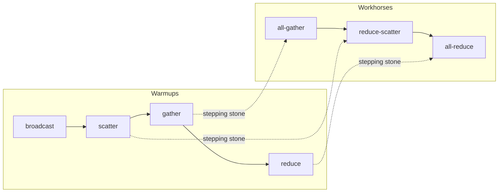
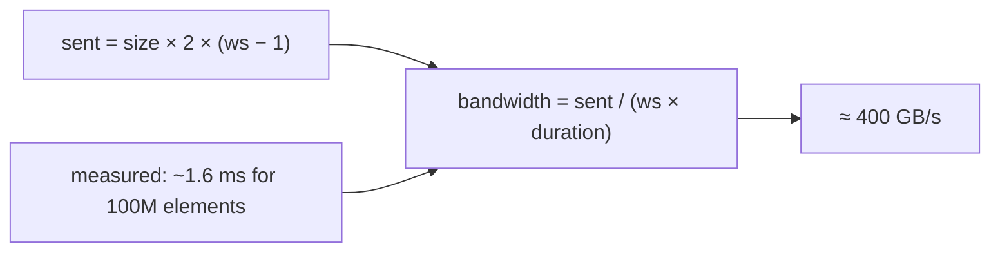

## Why more than one GPU

Last week made one GPU fast. This week uses many GPUs to go faster [00:00:10](ts:00:00:10). Two reasons, and they are different [00:03:17](ts:00:03:17):

1. **The model does not fit.** Parameters, gradients, optimizer state, and activations exceed one GPU's HBM. A B200 holds 192 GB. A 1-trillion-parameter model does not fit.
2. **More FLOPs.** Even if the model fits, splitting the work across GPUs trains faster. But spreading out costs communication bandwidth, so you compute the tradeoff.

The unifying theme across both weeks: compute (tensor cores, ALUs) sits far from data. On one GPU, "far" means HBM. On many GPUs, "far" can mean a different GPU. The game is orchestrating computation to avoid data-transfer bottlenecks [00:01:12](ts:00:01:12).

The memory hierarchy generalizes:

| Level | Interconnect | Relative speed |
|---|---|---|
| Single GPU: L1 / shared memory | on-chip | fastest |
| Single GPU: HBM | on-chip | fast (lamented last week, fast this week) |
| Single node, multi-GPU | NVLink / NVSwitch | slower |
| Multi-node, multi-GPU | InfiniBand / Ethernet | slowest |

Last week's trick: reduce memory accesses with fusion and tiling. This week's trick: reduce communication across GPUs with replication and sharding [00:02:50](ts:00:02:50).

The lecture has two parts. Part 1: the building blocks of distributed communication (collectives, hardware, torch.distributed, bandwidth measurement). Part 2: bare-bones data, tensor, and pipeline parallelism on deep MLPs. MLPs are the compute bottleneck in Transformers, so the examples carry over [00:05:20](ts:00:05:20).

## Collective operations

Collective operations are the primitives of distributed programming, dating to the 1980s. "Collective" means you specify one communication pattern across many devices instead of managing point-to-point messages yourself [00:05:50](ts:00:05:50).

Setup vocabulary [00:06:55](ts:00:06:55): a **rank** is one device (GPUs here: rank 0, 1, 2, 3). The **world size** is the number of devices (4 in the examples). For this class, rank = GPU [00:42:08](ts:00:42:08).

| Operation | Input (4 ranks) | Output | Role |
|---|---|---|---|
| Broadcast | rank 0: [0,1,2,3] | every rank: [0,1,2,3] | Warmup. Real use: rank 0 loads a checkpoint, broadcasts once at init. |
| Scatter | rank 0: [0,1,2,3] | ranks hold 0, 1, 2, 3 | Warmup. Stepping stone to reduce-scatter. |
| Gather | ranks hold 0, 1, 2, 3 | rank 0: [0,1,2,3] | Warmup. Stepping stone to all-gather. |
| Reduce (sum) | ranks hold 0, 1, 2, 3 | rank 0: 6 | Warmup. Stepping stone to all-reduce. |
| All-gather | ranks hold 0, 1, 2, 3 | every rank: [0,1,2,3] | Workhorse. Each rank holds a parameter shard. All-gather rebuilds full parameters for the forward pass. |
| Reduce-scatter (sum) | rank i holds [i,i+1,i+2,i+3] | rank 0: 6, rank 1: 10, rank 2: 14, rank 3: 18 | Workhorse. After backward: sum gradients, distribute storage. |
| All-reduce (sum) | rank i holds [i,i+1,i+2,i+3] | every rank: [6,10,14,18] | Workhorse. After backward: sum gradients, replicate everywhere. Equals reduce-scatter + all-gather. |
| All-to-all | rank i sends element j to rank j | rank j collects column j (a transpose) | Most general. MoE expert routing: each rank holds data split + expert subset, routes activations to experts. |

Terminology memory aids [00:19:43](ts:00:19:43): **reduce** applies an associative, commutative op (sum, min, max). **Scatter** is the inverse of **gather**: scatter distributes, gather centralizes. **All** means the destination is all devices.

Broadcast, scatter, gather, reduce are warmups. All-gather, reduce-scatter, and all-reduce drive training. All-to-all matters for MoEs, where the balanced case is exactly a matrix transpose. Unbalanced splits are allowed, but you want balance for load [00:18:16](ts:00:18:16).

A student asked about the NumPy analogy for broadcast. Conceptually the same one-to-many idea, but these are communication operations across devices, not shape rules [00:12:05](ts:00:12:05).



## The interconnect hardware

Classic setup (your gaming GPU plus a friend's): GPUs on one node talk over PCIe. GPUs on different nodes go through Ethernet [00:22:04](ts:00:22:04).

Serious training looks different [00:23:31](ts:00:23:31):

- **8 GPUs per node**, connected by NVLink to an NVSwitch. NVLink 5 moves 1.8 TB/s total, against 8 TB/s HBM on a B200. About 4x slower than HBM, still fast for device-to-device traffic. From the programmer's view, any GPU reaches any other GPU. The switch routes [00:24:29](ts:00:24:29).
- **Nodes into pods** over InfiniBand (~0.05 TB/s). The GPU path goes PCIe → host channel adapter → InfiniBand cable.
- **Pods into clusters** over Ethernet, through PCIe and the CPU. Slowest.

The CPU is the enemy of latency. Traditional Ethernet forces the GPU to copy data to a kernel socket buffer, build TCP packets, and copy to the NIC ring buffer. **RDMA** (remote direct memory access) lets one GPU read or write another GPU's memory with no CPU involvement [00:27:05](ts:00:27:05). NVLink/NVSwitch and InfiniBand support RDMA. Standard Ethernet does not.

A student asked how RDMA relates to the hardware names. NVLink, NVSwitch, and InfiniBand are hardware: cables and switches. RDMA is operational: what happens during communication. **RoCE** (RDMA over Converged Ethernet) is another way to do RDMA on Ethernet hardware, cheaper and weaker than InfiniBand. Meta explored it, and Llama may have trained on it [00:28:47](ts:00:28:47).

Scale-up hardware keeps pushing the fast domain outward. GB200/GB300 **NVL72**: trays of 8 GPUs, 9 trays per rack, 72 GPUs in one NVLink domain. (G = Grace CPU. Each tray holds 2 CPUs and 8 GPUs.) [00:27:55](ts:00:27:55).

Two systems translate collectives into packets. **NCCL** (NVIDIA Collective Communications Library) takes an all-reduce or broadcast, detects the hardware topology, picks paths between GPUs, and launches the actual send/receive kernels. Communication kernels are GPU kernels. Everything on the GPU is a kernel [00:30:03](ts:00:30:03). **torch.distributed** is the clean Python interface on top: NCCL backend for GPUs, gloo for CPUs. It also offers higher-level algorithms like FSDP, which this course skips on purpose: the course builds from scratch so you see the mechanics [00:36:13](ts:00:36:13).

## Collectives in code

The lecture traces single-process for readability. Running `lecture_07.py` directly uses real multiprocessing. The `spawn` wrapper launches world-size processes, each running the same function with its own rank [00:37:19](ts:00:37:19).

Setup and teardown:

```python
def setup(rank, world_size):
    os.environ["MASTER_ADDR"] = "localhost"   # Coordination metadata only
    os.environ["MASTER_PORT"] = "15623"       # Data itself goes through NCCL
    backend = "nccl" if torch.cuda.is_available() else "gloo"
    dist.init_process_group(backend, rank=rank, world_size=world_size)
```

`dist.barrier()` waits for all processes to reach that line. Barriers order execution across processes, but each extra barrier risks unnecessary waiting [00:39:12](ts:00:39:12).

The three workhorses, demonstrated:

```python
# All-reduce: sum in place, result on every rank
data = torch.tensor([0., 1, 2, 3]) + rank
dist.all_reduce(tensor=data, op=dist.ReduceOp.SUM, async_op=False)

# Reduce-scatter: sum, then scatter one piece per rank
dist.reduce_scatter_tensor(output=output, input=input, op=dist.ReduceOp.SUM)

# All-gather: collect every rank's piece onto every rank
dist.all_gather_into_tensor(output_tensor=output, input_tensor=input)
```

Run in sequence, the outputs prove that all-reduce = reduce-scatter + all-gather [00:46:02](ts:00:46:02).

Two subtleties worth keeping. First, `async_op`: CUDA is already async within a process, and now processes are async too. Async collectives return immediately so you can overlap computation with communication (load the next batch while the all-reduce flies). Call `wait()` or hit a barrier when you need the result [00:43:50](ts:00:43:50). Second, barrier versus `cuda.synchronize()`: a barrier only aligns process arrival. If CUDA kernels are still running, the processes arrive, pass the barrier, and stay unsynchronized. Synchronize CUDA first, then barrier [00:53:40](ts:00:53:40).

## How fast is communication

Benchmark: all-reduce 100M elements across 4 ranks, warm up, synchronize plus barrier (both forms of asynchrony), average the per-rank times. It took about 1.6 ms [00:48:45](ts:00:48:45). Is that good? Compute the effective bandwidth.

Bytes moved in an all-reduce: each of the (world_size − 1) reduction steps both sends and receives the payload, so sent bytes = size × 2 × (world_size − 1). Total duration = world_size × duration. Bandwidth = sent bytes / total duration.



As world size grows, (ws−1)/ws → 1, leaving 2 × size / duration: independent of world size. It is also independent of topology (ring or tree). NCCL figures that out [00:50:42](ts:00:50:42). Reduce-scatter has no 2x factor and lands in the same ~400 GB/s range. All-reduce moves twice the data in twice the time, so the bandwidth matches. This mirrors the MFU reasoning from the systems lectures: turn a raw time into a rate, then judge the rate.

## Data parallelism: split the batch

Cut along the batch dimension. Batch 128, 4 ranks → each rank gets 32 rows [00:56:58](ts:00:56:58). Every rank holds all parameters. The only difference from standard training is one step: after backward, all-reduce the gradients, average them, then update [00:59:15](ts:00:59:15).

```python
batch_size, num_dim = 128, 1024
local_batch_size = batch_size // world_size          # 32 rows per rank
data = data[rank*local_batch_size:(rank+1)*local_batch_size]

params = [init(num_dim, num_dim) for _ in range(num_layers)]
optimizer = torch.optim.AdamW(params, lr=1e-3)       # Each rank keeps its own optimizer state

for step in range(num_steps):
    x = data
    for param in params:
        x = x @ param
        x = F.gelu(x)
    loss = x.square().mean()
    loss.backward()
    for param in params:
        dist.all_reduce(tensor=param.grad, op=dist.ReduceOp.AVG)  # The one new line
    optimizer.step()
```

Losses differ across ranks (different data), gradients start different, the all-reduce makes them identical, so parameters stay identical everywhere [01:02:10](ts:01:02:10). DDP treats the model as a black box, so the same code works for a Transformer [01:01:44](ts:01:01:44). Batch size must be at least the world size, ideally a clean multiple. Pad if it is not [01:00:52](ts:01:00:52).

The limitation: DDP holds all parameters on every GPU. When parameters do not fit, you need FSDP/ZeRO, which splits the monolithic all-reduce into reduce-scatter + all-gather so storage distributes too. That is next lecture, with Tatsu [01:02:31](ts:01:02:31).

> [!KEY] Data parallelism is one line on top of standard training: average the gradients across ranks after the backward pass. Everything else is identical.

## Tensor parallelism: split the width

Cut along the width. Do not touch the data. Split each layer's columns. num_dim 1024, 4 ranks → each rank owns 256 columns of every weight matrix (column tensor parallelism. Row splitting exists, but the lecture skips it) [01:03:03](ts:01:03:03).

```python
local_num_dim = num_dim // world_size                # 256 columns per rank
params = [init(num_dim, local_num_dim) for _ in range(num_layers)]

x = data                                             # Every rank holds all the data
for layer in range(num_layers):
    x = x @ params[layer]                            # batch x local_num_dim
    x = F.gelu(x)                                    # Elementwise: no communication needed
    activations = [torch.empty(batch_size, local_num_dim) for _ in range(world_size)]
    dist.all_gather(tensor_list=activations, tensor=x)
    x = torch.cat(activations, dim=1)                # Rebuild batch x num_dim
```

Unlike DDP, you change the model itself. The trick that makes it work: a matmul splits into smaller matmuls whose results you gather [01:07:22](ts:01:07:22). Forward uses all-gather every layer. The backward pass uses reduce-scatter, the dual operation. The lecture implements forward only. Backward is the homework exercise. and you must call the collective yourself because plain autograd knows nothing about your sharding [01:08:36](ts:01:08:36).

> [!WARN] Forward all-gather implies backward reduce-scatter. Learn the duality. It appears in every tensor-parallel implementation.

## Pipeline parallelism: split the depth

Cut along the depth. Each rank owns a subset of layers (4 layers, 2 ranks → 2 layers each), full width, and sees all the data in some form [01:09:42](ts:01:09:42). Communication is point-to-point: `dist.send` / `dist.recv` between neighboring ranks, the collectives from part 1 not needed here.

The naive version has pipeline bubbles: rank 1 idles while rank 0 works through the whole batch, then rank 0 idles while rank 1 works. The fix is micro-batches: split the batch into 4 micro-batches so a rank hands off work quickly and the pipe stays full [01:13:20](ts:01:13:20).

```python
local_num_layers = num_layers // world_size
local_params = [init(num_dim, num_dim) for _ in range(local_num_layers)]
micro_batches = data.chunk(chunks=4, dim=0) if rank == 0 else [torch.empty(32, num_dim) for _ in range(4)]

for x in micro_batches:
    if rank - 1 >= 0:
        dist.recv(tensor=x, src=rank - 1)      # Activations from the previous stage
    for param in local_params:
        x = x @ param
        x = F.gelu(x)
    if rank + 1 < world_size:
        dist.send(tensor=x, dst=rank + 1)      # Hand off to the next stage
```

Not handled here: overlapping communication with computation (async send/recv), which is what actually kills the remaining bubbles. That overlap is also missing from the DDP section above: gradients could stream out during the backward pass instead of waiting for it to finish. Assignment 2 explores both [01:14:59](ts:01:14:59).

## Which parallelism, where

The choice is hardware-driven [01:17:13](ts:01:17:13):

- **Tensor parallelism** moves activations every layer: heavy communication. Keep it inside a node on NVLink-class bandwidth.
- **Pipeline parallelism** moves activations only at stage boundaries: tolerates slow interconnects. Decentralized training across the world uses it.
- **Data parallelism** scales until the critical batch size: past it, bigger batches stop helping and you waste compute. Then add tensor parallelism.

In practice you combine them: tensor parallel within a node, data parallel (or FSDP) across nodes, pipeline if the model still does not fit [01:18:02](ts:01:18:02). Two more axes exist beyond this lecture: **sequence parallelism** (split the sequence length, for attention) and **expert parallelism** (split MoE experts, the all-to-all from part 1). Both appear in Assignment 2.

The closing pattern to internalize [01:19:44](ts:01:19:44): at every level of the hierarchy you choose between recomputing, storing in memory, or storing on another device and communicating. Activation checkpointing was recompute-vs-memory on one GPU. Data parallelism is redundant work (every rank updates all parameters) to avoid moving optimizer state. The hierarchy never goes away because models keep outgrowing hardware.

One more note: in JAX/TPU land (the course links the Levanter project), you declare the model and the sharding strategy and the compiler inserts the communication. Appealing, but it takes the from-scratch joy out of the exercise [01:19:00](ts:01:19:00).

## Assignment connection

Assignment 2 is the systems assignment. This lecture is its part-1 foundation: collectives, DDP, tensor and pipeline parallelism on MLPs. The assignment pushes further: overlap communication with computation, sequence and expert parallelism, and combinations of the strategies. Next lecture (Tatsu) goes deeper on parallelism techniques including FSDP/ZeRO.

> [!INTERVIEW] Know the three cuts cold: data = batch, tensor = width, pipeline = depth. Know the collective each one needs. DDP needs all-reduce on gradients. Tensor parallel needs all-gather forward and reduce-scatter backward. Pipeline needs point-to-point plus micro-batches. Know the hardware mapping: tensor parallel inside the fast domain, pipeline across the slow one.
