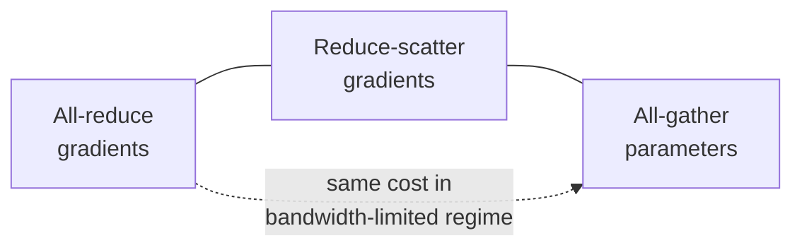
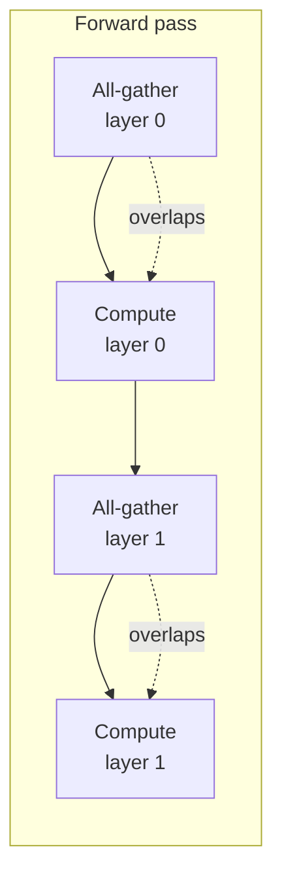
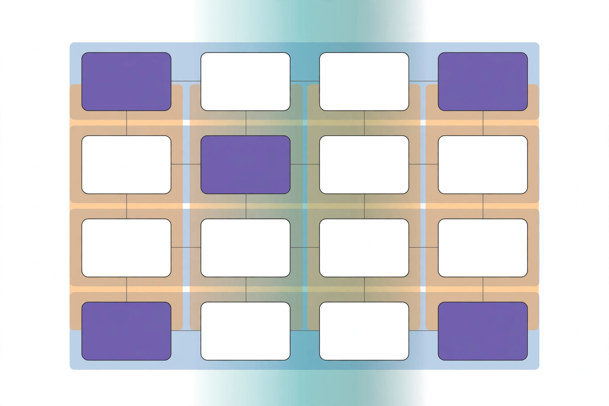

## The full parallelism toolbox

The previous lecture covered the mechanics of parallelism. This lecture covers the full set of strategies that modern training runs combine at once [00:05](ts:00:05). At the largest scale, no single strategy suffices. You will need most or all of them, which the lecture calls 4D parallelism: data, tensor, pipeline, and more, running simultaneously.

Two ideas structure everything. First, the unit of compute is no longer the GPU. It is the entire data center [10:25](ts:10:25). Second, there are two distinct communication regimes: fast intra-node links, where communication-heavy strategies are affordable, and slow inter-node links, which need communication-frugal strategies.

> [!KEY] Every parallelism decision is a tradeoff between memory scaling, compute scaling, and communication cost. The winning recipe matches each strategy to the interconnect it can afford.

## Why parallelize: compute and memory

Two bottlenecks force multi-machine training [00:55](ts:00:55). One is compute: the fastest supercomputers have exaflops, while a single chip has far less. The other is memory: large models do not fit on one GPU, so you must shard them.

All accounting in this lecture happens at the level of **collective communication** primitives: reduce, all-reduce, all-gather, broadcast, reduce-scatter [02:33](ts:02:33). You will not send packets. You will reason about which collectives an algorithm needs.

One equivalence drives much of the lecture [03:10](ts:03:10):

An all-reduce costs the same as a reduce-scatter followed by an all-gather, in the bandwidth-limited regime. That is the best you can do. This equivalence makes several memory-saving tricks free.

## Hardware: TPU mesh versus GPU fat tree

Before the algorithms, one hardware detour, because it changes which strategies different labs prefer [04:31](ts:04:31).

**TPUs** use a toroidal mesh: chips connect to neighbors, and the edges wrap around. The neighbor count stays fixed as the network grows, so scaling is simple and cheap. This topology excels at predictable, neighbor-only communication, like tensor parallelism over a dense model.

**GPUs** use an all-to-all philosophy, often a fat tree: GPUs connect very fast within a pod, and spine switches connect pods. As nodes grow, the tree grows, and communication topology gets more complex. This is more flexible for unstructured, stochastic communication, like routing tokens to experts in a mixture of experts.

The workloads are now pushing both designs toward each other [07:27](ts:07:27). Google announced a tree-style TPU topology that morning, plus a switched scale-out network called Virgo for cross-rack training. Modern MoEs create all-to-all traffic at inference time, and inference bottlenecks demand flexible connectivity.

> [!PROF] The lecture uses the Huawei Ascend 910 and its CloudMatrix-384 rack as a hardware-design case study. Each chip is much slower than an H200 at matmuls, but 384 chips connect through fiber-optic switches. The system brute-forces communication problems at 4x the power consumption of the equivalent NVIDIA system [08:56](ts:08:56). If you pay the power cost, you can scale out aggressively. If you want power efficiency, you end up somewhere else.

## Naive data parallel and the memory disaster

Data parallelism is the simplest strategy. Take a batch of size B, split it across M machines, compute gradients locally, and synchronize [11:55](ts:11:55).

| Property | Naive data parallel |
|---|---|
| Compute | Scales. Each GPU processes B/M examples. |
| Communication | 2x the parameter count per batch (one all-reduce of gradients). Fine when batches are big. |
| Memory | No scaling. Every GPU holds full parameters, gradients, and optimizer state. |

The memory situation is worse than it first looks [13:28](ts:13:28). A common rule of thumb: training needs about 5 copies of the weights, or 16 bytes per parameter.

| What is stored | Bytes per parameter |
|---|---|
| Model parameters (FP16/BF16) | 2 |
| Gradients (FP16/BF16) | 2 |
| Master weights (FP32 accumulator) | 4 |
| Adam first moment (FP32/BF16) | 4 (or 2) |
| Adam second moment (FP32/BF16) | 4 (or 2) |
| **Total** | **~16** |

The optimizer state dominates. This is the part worth sharding first.

## ZeRO: sharding the training state

**ZeRO** (zero redundancy optimizer) shards the expensive training state across GPUs, using the reduce-scatter plus all-gather equivalence [16:28](ts:16:28). Three stages, each sharding one more piece.

**Stage 1: shard the optimizer state.** Every worker keeps full parameters and gradients, but owns the optimizer state for one slice of parameters [17:08](ts:17:08).

1. Each worker computes a full gradient on its data shard.
2. Reduce-scatter the gradients, so each worker receives the gradient slice for its parameter slice. Cost: 1x parameters.
3. Each worker updates its parameter slice with its local optimizer state.
4. All-gather the updated parameters back. Cost: 1x parameters.

Total communication: 2x parameters, identical to naive data parallel. The memory win is free.

**Stage 2: also shard the gradients.** You can never materialize the full gradient vector now. The trick is incremental: sweep backward through the compute graph, and after computing a layer's gradients, immediately reduce-scatter them to the owning worker and free them [19:23](ts:19:23). Same 2x parameter communication. Almost free.

**Stage 3 (FSDP): shard everything, including parameters.** Each GPU holds only a slice of parameters, gradients, and optimizer state at any moment. Parameters are requested on demand [20:49](ts:20:49):

1. All-gather one layer's parameters, run the forward pass, free them.
2. For the backward pass, all-gather the layer's parameters again, run backward, reduce-scatter the gradients out, free the parameters.
3. Repeat per layer, then update.

Communication: 2 all-gathers plus 1 reduce-scatter, or 3x the parameters. That is 1.5x the cost of data parallel. But FSDP overlaps communication with computation using separate streams for CPU work, GPU compute, and GPU communication [22:59](ts:22:59). While the forward pass runs on layer i, the all-gather for layer i+1 runs underneath it. If computation takes longer than communication, the extra cost is nearly invisible.

> [!KEY] ZeRO stages 1 and 2 cost the same communication as naive data parallel, so their memory savings are literally free. Stage 3 costs 1.5x the communication, but overlap hides most of it. In practice FSDP utilization is very close to single-GPU performance [24:32](ts:24:32).

The payoff, for pure BF16 training with 12 bytes per parameter on 8x A100 80GB [27:41](ts:27:41):

| Setup | Max model size | Bytes per param |
|---|---|---|
| Baseline | 6.7B | 12 |
| ZeRO stage 1 | 16B | 5 |
| ZeRO stage 2 | 24.6B | 2 + 10/8 |
| ZeRO stage 3 (FSDP) | 53.3B | 12/8 |

> [!WARN] FSDP is not pipelining. Every GPU runs the entire model from start to finish. The difference from data parallel is that no GPU holds all the parameters at the same time. Parameters are gathered, used, and freed layer by layer.

## What data parallel cannot fix

Data parallel consumes the batch size as a resource. You can never have more data-parallel workers than batch elements, and communication overhead grows near that limit [29:13](ts:29:13). Past the critical batch size, adding batch elements gives diminishing returns: it is worse than taking another optimization step.

ZeRO stages 1 and 2 do not scale parameter memory at all. ZeRO-3 shards parameters, but it does not reduce **activation memory**. For further memory scaling you must cut up the model itself. That is model parallelism.

The conceptual shift [30:40](ts:30:40): in FSDP, parameters fly across the network. In model parallelism, **activations** fly across the network. Three ways to cut the model: pipeline parallel (depth), tensor parallel (width), expert parallel (experts).

## Pipeline parallel: cutting along depth

Naive layer-wise parallel puts different layers on different GPUs. The result is a disaster [32:11](ts:32:11): GPU 0 computes, hands activations to GPU 1, then idles while every other GPU works. Each GPU is active 1/n of the time. The idle time is the **bubble**.

The fix is microbatching. Split the batch into microbatches and keep them all in flight: as soon as GPU 0 finishes microbatch 1, it starts microbatch 2 while GPU 1 works on microbatch 1 [32:53](ts:32:53). The bubble-to-compute ratio is roughly:

\[ \frac{n_{\text{stages}} - 1}{n_{\text{micro}}} \]

So the bubble shrinks as 1 over the microbatch count. Pipeline parallel needs a big batch size to keep utilization up.

Why use pipelines at all, given the complexity [34:26](ts:34:26)?

1. Pipelines save memory versus data parallel, since layers are split.
2. Communication is tiny and well-behaved: b x s x h activations, point to point, per microbatch. That is almost always less data than shipping parameter matrices.

So pipelines live on the **slowest links**: across machines, pods, or data centers [35:07](ts:35:07). The NVIDIA Megatron paper's parameter sweeps show that with large batch sizes, pipeline utilization approaches the no-pipeline case, but small batches degrade it fast.

**Zero-bubble pipelining** goes further by splitting the backward pass [36:51](ts:36:51). Each backward step does two things: propagate partial derivatives down the graph (B), and compute the weight gradients (W). The B part is urgent, because the next stage cannot work without it. The W part is a leaf of the graph and can run anytime. So compute all the B's first and defer the W's into idle gaps. The pipeline fills almost completely.

## Tensor parallel: cutting along width

Tensor parallel cuts matrices instead of layers [39:04](ts:39:04). A matrix multiply decomposes into smaller multiplies whose partial sums add up. This is the same idea as tiling.

In the forward pass, an identity function f copies the input to both GPUs, and a function g all-reduces the partial results back together. In the backward pass the roles flip: g becomes the identity and f becomes the all-reduce [40:34](ts:40:34). This forward-backward duality matters if you implement tensor parallel yourself.

How a Transformer block is split [41:14](ts:41:14):

| Cut | Where |
|---|---|
| Column-wise | QKV projections, MLP up-projection |
| Row-wise | Attention output projection, MLP down-projection |
| Replicated | Layer norms, nonlinearities, MoE routers |

Tensor parallel is communication-hungry: an all-reduce per matmul, every layer. On GPUs it stays **within one node**, up to 8 GPUs on fast interconnects. Past that boundary, performance drops [41:59](ts:41:59). TPUs differ here: the mesh gives high bandwidth in a regular pattern, so TPU training can tensor-parallelize much larger groups than the GPU world [43:29](ts:43:29).

| | Pipeline parallel | Tensor parallel |
|---|---|---|
| Cuts along | Depth (layers) | Width (matrices) |
| Bubble | Yes, needs big batches | No bubble |
| Communication | bsh point to point per microbatch | ~8bsh per layer, all-reduce |
| Where to use | Slow links, across nodes | Fast links, within node |

Use tensor parallel when you have low-latency, high-bandwidth interconnects. Everywhere else, prefer pipeline parallel [44:18](ts:44:18).

## Activation memory and sequence parallel

Static memory (parameters, optimizer state) is only part of the story. Profiling shows large dynamic bumps: activations stored for the backward pass, then gradients [45:07](ts:45:07). Peak memory arrives during the backward sweep, while activations are still alive.

Storing everything costs roughly \[34 \cdot s \cdot b \cdot h + 5 \cdot A \cdot S / H\], where the second term is the quadratic attention term including dropout (A is attention heads, S sequence, H hidden) [46:35](ts:46:35). Flash attention and recomputation drop the second term.

Tensor parallel divides the matmul-heavy terms by the tensor-parallel size T: the MLP's 24 of the 34, and the attention term [47:25](ts:47:25). But pointwise ops do not split: layer norm (4sbh), dropout (2sbh), and layer inputs kept as residuals (4sbh). That 10sbh stays no matter how many tensor-parallel GPUs you add.

**Sequence parallel** splits those leftovers along the sequence axis instead of the hidden axis [49:02](ts:49:02). In the forward pass, g is an all-gather and g-bar is a reduce-scatter. In the backward pass they reverse. This mirrors the FSDP idea: keep activations sharded, materialize them on demand.

Combined: \[34 \cdot s \cdot b \cdot h / T\] (plus the droppable attention term). This is the practical lower bound for activation memory in normal training [51:28](ts:51:28).

> [!KEY] To hand-check whether a model fits a GPU, budget three things: at least 34sbh/T for activations, plus optimizer state, plus parameters and gradients. That is the working formula the lecture recommends.

## Expert parallel

**Expert parallel** splits whole experts across devices and routes token activations to them [53:18](ts:53:18). It behaves roughly like tensor parallel for MLPs: high bandwidth, and it reduces activation memory. But splitting matmuls finely shrinks them and hurts GPU utilization, while routing sparse token activations avoids that. The Megatron guidelines say: for MoE layers, prefer expert parallel over tensor parallel [54:12](ts:54:12).

In practice expert parallel is hard. The dispatch is an all-to-all on every MoE layer, and it is latency-sensitive: computation waits for tokens to arrive. DeepSeek built **DPP**, its own dispatch library that reaches into low-level GPU networking primitives. NVIDIA built **Hybrid EP** for the same purpose [55:54](ts:55:54).

> [!PROF] To squeeze the last bit of dispatch performance, the DeepSeek team found and used undocumented PTX instructions, GPU machine-code level operations, to accelerate networking communication. That is the level of effort the frontier of parallelism demands [56:45](ts:56:45).

Composition has real constraints [58:20](ts:58:20). The naive approach shares replicas between data and expert parallel: with data parallel 8, you shard 8 experts across those 8 replicas. That caps how far expert parallel can scale and tangles DP and TP interaction. There is also an imbalance: MoEs change only the MLPs, not attention. You want high tensor parallel to cut up attention, but low tensor parallel for MLPs, since cutting expert matmuls finely kills utilization [59:06](ts:59:06). Modern systems decouple them: one tensor-parallel degree for attention layers, another for MoE layers (Megatron exposes TP/CP/DP for attention and ETP/EP/EDP for MLPs).

**Context parallel** (ring attention) splits activations across a long sequence in a ring, following the mesh topology [60:46](ts:60:46). It is standard in long-context extension stages and in serving. The lecture skips details because the ideas overlap with what came before.

## 3D/4D parallelism: rules of thumb

No strategy dominates. FSDP is wonderful but ignores activations and consumes batch size. Tensor parallel needs fast networks. Pipelines need big batches. The art is combining them [61:44](ts:61:44).

The simple prescription [66:29](ts:66:29):

1. **Until the model fits in memory**, cut it up. Use tensor or expert parallel up to the GPUs in one machine (the fast interconnect), then pipeline parallel or FSDP across machines.
2. **Then scale the rest with data parallel**, up to the batch-size limit. If the batch gets too small, use gradient accumulation to trade batch size for communication efficiency.

The Megatron practitioner's version [67:08](ts:67:08): minimize model parallelism, maximize data parallel. Keep expert and tensor parallel within one NVLink box. Use pipeline parallel across nodes. Prefer expert parallel for MoEs. Use context parallel for long sequences.

The classic quantitative study is Narayanan et al. 2021 [69:45](ts:69:45). As models scale: tensor parallel rises first and caps at 8, pipeline parallel keeps growing, and data parallel gradually shrinks (the largest model used DP of only 6). Utilization stays flat and high across enormous GPU counts. Two more findings: tensor parallel 8 is the clear optimum across 64 machines, and activation recomputation pays for itself, because the memory it frees becomes batch size, which becomes utilization [71:23](ts:71:23).

> [!PROF] Recomputation looks wasteful: you redo computation you already did. But memory converts into batch size, and batch size converts into utilization. Doing more computation can be the way to higher throughput.

## What real training runs use

Patterns across published runs [73:00](ts:73:00):

| Model | Strategy |
|---|---|
| OLMo 7B (AI2, Dolma data) | Pure FSDP. Small models scale fine on FSDP alone. |
| DeepSeek V1 | ZeRO stage 1 + tensor + sequence + pipeline parallel |
| DeepSeek V3 (MoE) | Pipeline parallel 16, expert parallel 64-way across 8 nodes, ZeRO stage 1, 1F1B scheduling with all-to-all overlap |
| Yi | ZeRO stage 1 + tensor + pipeline parallel |
| Yi-Lightning (MoE) | Tensor parallel replaced by expert parallel |
| Llama 3 405B | Tensor 8, context 1, pipeline 16, data 128 for main pretraining. Long-context extension cranks context parallel up and data parallel down. |
| Gemma 2 (2B/9B/27B) | ZeRO-3 + tensor/sequence parallel + data parallel 768. No pipeline: the TPU mesh philosophy, tensor-parallel over a big mesh. |
| Mixtral 8x22B | Tensor 4, pipeline 4, context 1, expert 8, data 2 (256 GPUs) |
| Nemotron 3 Super 120B-A12B | Tensor 2, expert 64, context 64 (long-context extension) |
| Qwen 3 (225B-A22B, 30B-A3B) | Expert parallel up to 8 GPUs. Larger runs use tensor 2, expert 32, pipeline 8 |

Common threads: maximize data parallel, keep tensor parallel at or below 8, let expert parallel grow large for MoEs, and use context parallel for long-context phases [78:43](ts:78:43). NVIDIA's Megatron Bridge repository publishes recommended configurations per model size and is worth studying.

> [!PROF] During Llama 3 405B training, GPUs failed 148 times. At this scale you need redundancy and recovery, not just fast collectives. Distributed training is also a distributed-systems problem [76:20](ts:76:20).

## Assignment connection

Assignment 2 is the systems assignment. Two parts of this lecture feed it directly:

1. **Write an FSDP wrapper.** Conceptually it is simple: wrap any module, all-gather parameters, compute, free, repeat on the backward pass with reduce-scatter [25:24](ts:25:24).
2. **Pick the optimal strategy.** Given a network topology and a model, compute the communication and memory cost of each strategy combination and choose the best one [00:55](ts:00:55).

> [!INTERVIEW] Parallelism questions test whether you can do the accounting: bytes per parameter, communication per step, and which interconnect each strategy needs. Know why ZeRO-1 is free, why tensor parallel stays within a node, and why pipelines belong on slow links. The 34sbh/T activation formula is the kind of back-of-envelope math interviewers love.
