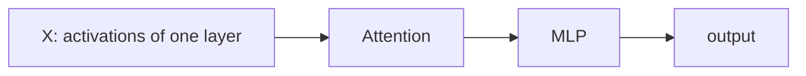
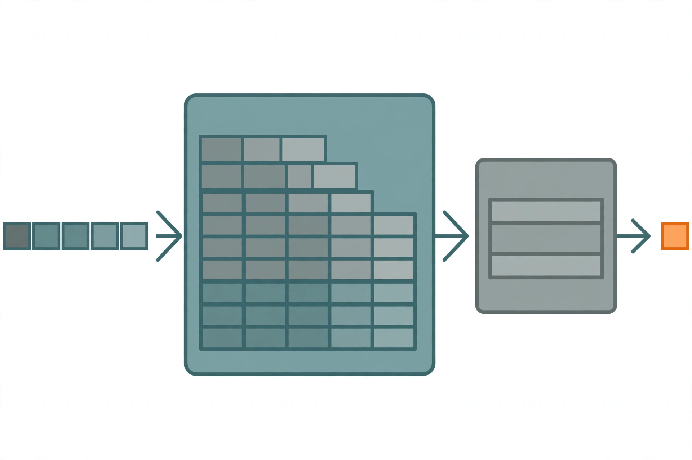
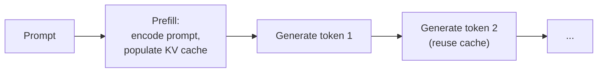
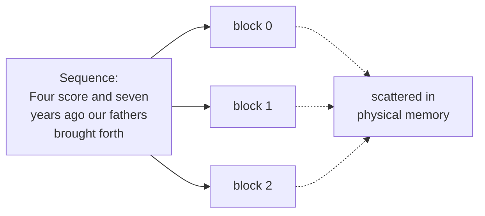

## Why inference matters

The inference problem is simple to state. You trained a model. You receive a prompt. You produce the response as accurately and as quickly as possible [00:00:14](ts:00:00:14).

Inference gets one lecture, but it is growing in importance. It shows up everywhere [00:01:00](ts:00:01:00):

- Actual use: chatbots, code completion, agents, batch data processing.
- Evaluation, when the evaluation requires generation.
- Inside training: reinforcement learning needs rollouts from the model before updating weights.

Training is a one-time cost. Inference is a repeated cost, incurred every day. OpenAI serves an estimated 8.6 trillion tokens per day. For reference, the lecture code cites a flagship training run on 32 trillion tokens. Under four days of inference output matches that entire training compute [00:02:02](ts:00:02:02).

The agentic shift makes this worse. In the chatbot world, humans read the output, so generation speed beyond reading speed buys nothing. In the agentic world, most generated tokens are never read by a human. The agent thinks, reasons, calls tools, and only then produces output. Tokens generated equal compute spent, with no natural limit [00:03:02](ts:00:03:02).

Serving is a real industry. Closed-model providers serve their own models. Open-weight providers (Together, Fireworks, Baseten, DeepInfra, Groq, Cerebras) serve the rest. Open-source stacks [00:04:00](ts:00:04:00):

| Package | Note |
|---|---|
| vLLM | Berkeley. Pioneered PagedAttention. The go-to default. |
| SGLang | Berkeley. Pioneered RadixAttention. Strong for agentic workloads. |
| TensorRT-LLM | NVIDIA. Very fast, narrower scope. |
| llama.cpp | C++ only. CPU inference, runs locally. |

## What "fast" means

Three metrics capture speed, and they trade off [00:05:00](ts:00:05:00):

| Metric | Definition | Matters for |
|---|---|---|
| Time to first token (TTFT) | Wait before any generation happens | Interactive apps |
| Latency (seconds per token) | Token rate for one query | Interactive apps |
| Throughput (tokens per second) | Token rate across many queries | Batch processing |

TTFT is pure waiting, so it dominates perceived quality. Once tokens stream, they do not need to be that fast, since humans read slowly. Latency and throughput look related, but they pull in opposite directions when you tune batch size. That tension is a core theme of the lecture.

> [!KEY] Inference is memory-bound. Training is compute-bound. This single difference drives almost every technique in the lecture.

## Why inference differs from training

In training you see all tokens at once. The Transformer treats the sequence as one tensor dimension, so you parallelize across the sequence. In inference, autoregression forces sequential generation, one token at a time. You cannot parallelize across the sequence dimension. So arithmetic intensity stays low and compute sits idle [00:07:01](ts:00:07:01).

The lecture plan [00:09:00](ts:00:09:00):

1. Math: arithmetic intensity, throughput, latency for a Transformer.
2. Lossy speedups: shrink the KV cache, quantize, prune.
3. Lossless speedup: speculative decoding.
4. Practical concerns: dynamic workloads, batching, paging.

Much of the analysis and several figures come from the scaling book chapter on inference (linked in sources).

## Notation and the Transformer, crisply

The lecture reuses a diagrammatic notation. Symbols name dimensions and their lengths. B is batch (number of sequences). T is sequence (number of tokens). D is model dimension. H is head dimension [00:10:01](ts:00:10:01).

Red dimensions contract: they appear in both operands and disappear from the result. Blue dimensions batch: they appear in both and stay. Example: `BT[D] x [D]H → BTH` contracts over D.

The Transformer block, stated as exact tensor shapes [00:11:02](ts:00:11:02):



Conventions used throughout [00:13:01](ts:00:13:01):

- Q, K, V projections: N query heads of dimension H. With grouped-query attention, K key/value heads, where K ≤ N.
- F = 4D. The MLP up-projects the model dimension to four times itself.
- D = N·H. The model dimension splits across heads.
- N = K·G. For GQA, heads split into K groups with G query heads per group.
- S counts input tokens, T counts output tokens. In training S = T. In inference T = 1.

> [!PROF] The lecture corrects its own notation live: K is the number of groups (KV heads), and G is the number of query heads per group. Percy says he will fix the slide [00:20:02](ts:00:20:02).

## Arithmetic intensity warmup

Arithmetic intensity is compute done per byte transferred. High is good. Take the matrix product X (B×D) times W (D×F) in BF16 [00:15:00](ts:00:15:00):

1. Read X from HBM: 2·B·D bytes.
2. Read W from HBM: 2·D·F bytes.
3. Compute: 2·B·D·F FLOPs.
4. Write Y back.

Memory movement grows quadratically in dimensions. Matmuls grow cubically. That cubic-vs-quadratic gap is what produces high intensity. When B is much smaller than D and F, the intensity simplifies to B [00:16:00](ts:00:16:00).

The H100 does 989e12 FLOPs per second and moves 3.35e12 bytes per second. Its accelerator intensity is 989 / 3.35 ≈ 295 FLOPs per byte. Your operation is compute-bound only if its intensity exceeds 295. So this matmul is compute-bound iff B > 295 [00:17:02](ts:00:17:02).

The extreme case is B = 1, a matrix-vector product. Intensity is 1. You read a whole D×F matrix to do only 2·D·F FLOPs. That is memory-bound, and it is basically what inference looks like: thin matrices instead of full ones [00:18:03](ts:00:18:03).

## Naive inference and the KV cache

The naive approach: feed the whole history into the Transformer, sample one token, append it, repeat. Each pass costs O(T²) from attention, and you run it T times. Total cost is O(T³) [00:21:01](ts:00:21:01).

But the work is shared across prefixes. The model is causal, so appending a token does not change any earlier activations. Store the keys and values in HBM and reuse them. That is the KV cache [00:22:00](ts:00:22:00).




Two stages [00:24:01](ts:00:24:01):



- **Prefill.** Encode the prompt and build the KV cache. Parallelizable, like training, because you see the whole prompt.
- **Generation.** Emit one token at a time. Each step reads the cache, produces the next-token distribution, and appends the new token's KV pair.

Formally, the cache holds one H-dimensional vector per sequence (B), per token (S), per layer (L), per KV head (K). Two vectors each (key and value), two bytes each in BF16: B·S·L·K·H·2·2 bytes [00:24:01](ts:00:24:01).

## MLP vs attention: finding the bottleneck

Now compute intensity for each layer type, with S input tokens and T generated tokens [00:25:01](ts:00:25:01).

**MLP.** Only the matmuls matter. The rest can fuse into them. Under the usual assumption B·T ≪ D, F, the intensity is B·T. Prefill (large B·T) reaches compute-bound easily. Generation sets T = 1, so intensity is B, the number of concurrent requests. That is fine for batch jobs and unpredictable for chatbots [00:27:00](ts:00:27:00).

**Attention.** FLOPs are 4·B·S·T·D. Bytes moved are 4·B·S·D + 4·B·T·D. The intensity is S·T/(S+T). Prefill sets T = S, giving S/2. Good. Generation sets T = 1, giving S/(S+1), which is below 1. You need roughly 295. That is the bottleneck [00:30:01](ts:00:30:01).

Why does batching not rescue attention? Every sequence hits the same MLP weights, so a bigger B amortizes one weight load across many sequences. But every sequence owns its own KV cache. All the attention terms depend on B, so raising B just runs more independent dot products. No amortization [00:32:02](ts:00:32:02).

| Stage | MLP intensity | Attention intensity | Regime |
|---|---|---|---|
| Prefill | B·S | S/2 | Compute-bound |
| Generation | B | < 1 | Memory-bound |

> [!KEY] Whenever someone says inference is memory-bound, this is why: generation-time attention has intensity below 1, and no amount of batching fixes it [00:34:00](ts:00:34:00).

## Worked example: Llama 2 13B on an H100

Instantiate the math for Llama 2 13B (no GQA, so K = N) [00:36:00](ts:00:36:00):

| Symbol | Value |
|---|---|
| S (sequence length) | 1024 |
| D (model dim) | 5120 |
| F (feed-forward dim) | 13824 |
| N (query heads) | 40 |
| K (KV heads) | 40 |
| H (head dim) | 128 |
| L (layers) | 40 |
| V (vocab size) | 32000 |
| H100 bandwidth | 3.35e12 bytes/s |

Memory holds parameters (2 bytes each in BF16) plus the KV cache (B × per-sequence cache). Latency equals memory divided by bandwidth, since inference is memory-bound and compute can overlap. Throughput equals B divided by latency, since B tokens generate in parallel [00:38:01](ts:00:38:01).

| Batch | Latency (s/token) | Throughput (tok/s) |
|---|---|---|
| 1 | 0.008 | 124 |
| 64 | worse | better |
| 256 | worse still | better still, but the KV cache exceeds 80 GB |

Larger batches worsen latency (bigger KV cache to shuffle) but improve throughput (parameter reads amortized over B). Gains diminish, and you hit the memory wall. The lecture uses a bus analogy: waiting for a full bus is slow for you, but the bus moves many people at once [00:43:00](ts:00:43:00).

Two more notes [00:44:02](ts:00:44:02). Launching M independent model copies keeps latency flat and multiplies throughput by M. And TTFT is essentially prefill time, so smaller batches during prefill give faster first tokens, while larger batches during generation give better throughput [00:45:00](ts:00:45:00).

## Reducing the KV cache

The theme for the rest of the lecture: shrink the KV cache, because inference is memory-bound, but do not lose accuracy [00:46:01](ts:00:46:01).

**Grouped-query attention.** N query heads, but only K key/value heads, each shared by N/K query heads. Multi-head attention is K = N. Multi-query attention is K = 1, which nobody uses because it is too lossy. GQA sits between. The 2023 paper shows the KV cache shrinking by N/K, with latency and throughput both improving [00:47:01](ts:00:47:01).

On the Llama 2 13B example at batch 64, moving to K:N = 1:5 cuts memory enough to fit comfortably, and both metrics improve. Then you can raise the batch to 256, which previously ran out of memory: throughput rises proportionally while latency degrades a bit [00:49:00](ts:00:49:00).

> [!CAVEAT] Check accuracy for every lossy change. The GQA paper's evals look fine, but take them with a grain of salt: the DeepSeek paper later showed GQA does hurt [00:51:00](ts:00:51:00).

**Multi-head latent attention.** DeepSeek V2 compresses the KV representation instead of dropping heads. Project activations down from about 16K dimensions to C = 512, store only that, and materialize K and V on demand. One wrinkle: MLA is incompatible with RoPE, which operates directly on keys and values, so they add 64 extra dimensions for RoPE, totaling 576 [00:52:00](ts:00:52:00).

DeepSeek's results put this in tension with the GQA paper: MHA beats GQA, and MLA matches or slightly beats MHA at far lower cost [00:54:00](ts:00:54:00).

> [!PROF] Asked why not just shrink the model dimension, Percy answers: indiscriminate shrinking hurts. The trick is finding the specific places you can squeeze, which takes experimentation [00:55:00](ts:00:55:00).

**Cross-layer attention.** Share KVs across layers, just as GQA shares them across heads. Compute KV for a subset of layers and reuse them elsewhere. This improves the accuracy-vs-cache Pareto frontier [00:56:01](ts:00:56:01).

**Sliding window attention.** Each token attends to only the last K tokens. The KV cache no longer depends on sequence length, which is excellent for long context. The effective context still exceeds K because information propagates down the layers. Variants add global tokens on a fixed grid. The cost is accuracy, so production models interleave local and global layers (hybrid) [00:57:02](ts:00:57:02).

**Linear attention.** Instead of storing the KV cache, compress history into a fixed-size representation. The naive version sums KV pairs into a single vector. Mamba, GatedDeltaNet, and DeltaNet do this more powerfully. Compared with sliding windows: linear attention suits broad summaries of the past, sliding windows suit local high-resolution detail. Mamba-style layers are strictly more expressive than sliding windows [00:59:02](ts:00:59:02).

**DeepSeek V4 attention.** Supports 1M context with three ideas: compressed sparse attention (compress every m tokens into one), DeepSeek sparse attention (pick the top-k tokens using lightweight query/key scoring), and heavily compressed attention [01:02:00](ts:01:02:00).

## Quantization

Quantization is the systems view of the same game: reduce precision, reduce memory, go faster [01:04:01](ts:01:04:01).

| Format | Bytes | Range / note |
|---|---|---|
| fp32 | 4 | Training parameters and optimizer states |
| bf16 | 2 | Inference default |
| fp8 | 1 | e4m3, [-240, 240] on H100, trainable if you dare |
| int8 | 1 | [-128, 127], cheaper than fp8, inference only |
| int4 | 0.5 | [-8, 7], cheapest, least accurate |

Two regimes [01:05:01](ts:01:05:01):

- **Quantization-aware training.** Quantize and dequantize in the forward pass during training, simulating the error. Weights adapt. Pro: works better. Con: expensive large-scale training.
- **Post-training quantization.** Quantize after training. Much cheaper. The naive version picks one scale and zero point per tensor, which works poorly. GPTQ instead uses Hessian information, quantizes layer by layer, and propagates the error into the remaining weights to compensate.

**Activation-aware quantization (AWQ).** Observation: some activation channels are large, and the weights touching them matter more. So keep 0.1-1% of weights in high precision and quantize the rest. FP16 to INT3 gives 4x lower memory and 3.2x speedup [01:07:02](ts:01:07:02).

## Pruning

Pruning rips pieces out of a large model and heals the wound. The NVIDIA recipe [01:08:02](ts:01:08:02):

1. Estimate importance of layers, heads, and hidden units on a small calibration set (1024 samples). Importance is activation magnitude. Dead units sit near zero.
2. Remove the unimportant parts.
3. Post-train (distill) on the data or task you care about to heal the model.

This turned a 15B model into an 8B model with little accuracy loss, using far less compute than training 8B from scratch [01:09:00](ts:01:09:00).

> [!PROF] A constant-high neuron cannot simply be deleted, but high mean with low variance can be folded into a bias term [01:11:01](ts:01:11:01).

The lecture gives two recipes. From scratch: define a faster architecture, train it. Distillation: define a faster architecture, initialize its weights from the original model (a Frankenstein), then repair it with distillation.

## Speculative decoding

All the methods so far are lossy. Speculative decoding is lossless. Recall the asymmetry: prefill processes tokens in parallel and is compute-bound. Generation is sequential and memory-bound. Checking a sequence is faster than generating it [01:12:02](ts:01:12:02).

The algorithm [01:14:00](ts:01:14:00):

1. A cheap draft model p guesses K tokens (say 4).
2. The target model q scores all K in parallel.
3. Accept each token with probability min(1, q/p). On rejection, sample from the residual distribution and stop.

This is modified rejection sampling, with one change: you always get at least one token out. The math guarantees an exact sample from the target model. The lecture sketches the proof on a two-token vocabulary {A, B} where the draft oversamples A:

```
P[sample A] = p(A)·(q(A)/p(A)) + p(B)·1·0 = q(A)
P[sample B] = p(B)·1 + p(A)·(1 − q(A)/p(A))·1 = q(B)
```

Both equal the target probabilities exactly. Too few draft tokens wastes the target's parallelism. Too many get rejected. The sweet spot is around 3-4 [01:16:00](ts:01:16:00).

In practice the draft is much smaller than the target (70B/8B, 8B/1B pairs), and it should be distilled to stay close to the target. Extensions: Medusa (draft generates multiple tokens in parallel), EAGLE (draft consumes the target's high-level features). Note the loop closing: every lossy technique from earlier in the lecture makes a good draft model.

## Dynamic workloads

Live serving is messy. Requests arrive at different times. Sequences share prefixes (system prompts, multiple samples). Sequences have different lengths [01:17:00](ts:01:17:00).

**Continuous batching (Orca).** Decode one token per sequence per step. When a sequence finishes, eject it. When a request arrives, admit it immediately. No waiting for the whole batch [01:18:00](ts:01:18:00).

**Selective batching.** Jagged lengths break tensor batching, but only for attention, which depends on sequence length. So process attention per sequence, and concatenate all sequences into one mega-sequence for the MLP layers. Lengths [3, 9, 5] become a single [17, H] tensor [01:19:00](ts:01:19:00).

**PagedAttention (vLLM).** The old approach reserves a contiguous KV-cache region per request up to max length. Two wastes: internal fragmentation (you reserve 1024 tokens but generate 50) and external fragmentation (unusable gaps between regions). The fix borrows from operating systems: split each sequence's KV cache into non-contiguous blocks [01:20:02](ts:01:20:02).



Blocks enable sharing: identical system prompts share one cached prefix across all requests, and parallel samples share the prompt prefix with copy-on-write at the block level. When two samples diverge, the block splits [01:22:02](ts:01:22:02).

## Summary

The lecture's own closing [01:24:03](ts:01:24:03):

- Inference matters: actual use, evaluation, reinforcement learning.
- It differs from training: memory-bound and dynamic.
- Techniques: new architectures, quantization, pruning and distillation, speculative decoding.
- Systems ideas transfer: speculative execution, paging.
- New architectures (state-space models, linear attention, diffusion) have huge potential, because the Transformer is fundamentally inference-unfriendly.

> [!INTERVIEW] This lecture is high-yield for systems interviews. Know the three metrics (TTFT, latency, throughput) and their tradeoff, the KV cache size formula, why generation attention has intensity below 1, and how speculative decoding stays exact. PagedAttention is the standard answer to "how do you serve LLMs efficiently."
