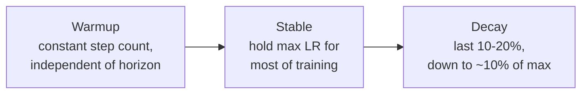

## The question

Two lectures ago we covered the classical scaling canon: Kaplan, Hoffmann, Chinchilla, up to about 2022. Since then, fewer scaling papers have appeared, and most come from the Chinese open-source community. This lecture speed-runs from Chinchilla to Kimi K2, the most recent release with scaling details [00:02:01](ts:00:02:01).

The practical question: when you scale up, which hyperparameters stay put and which drift? Initializations, learning rates, batch sizes, and optimizer behavior are all scale-sensitive. Get them wrong and you waste a training run. Two serious groups answered this question in opposite ways. MiniCPM tried to make hyperparameters scale-invariant. DeepSeek fit the drift and extrapolated it [00:00:05](ts:00:00:05).

## MiniCPM: stabilize with μP

MiniCPM (2024) is a high-performance small language model from the Chinese open-source community. At release it was state of the art in the 1-2B bracket and competitive with many 7B models. What matters for this course is not the model but the scaling discipline: extensive small-scale computation plus μP (maximal update parametrization) to stabilize tuning [00:04:01](ts:00:04:01).

The goal of μP: make the optimal learning rate the same as you scale up and down. MiniCPM's recipe [00:05:01](ts:00:05:01):

| Knob | Setting |
|---|---|
| Embedding output scale | 12 |
| Residual connections | scale by sqrt of number of layers (1.4) |
| Matrix tensor initialization | by fan-in/fan-out ratio (init std 0.1) |
| Learning rates | per-tensor, not global (lr 0.01) |
| LM head | scaled |

The derivation of these settings comes later in the lecture. What matters first is that they work. Sweeping the learning rate across model sizes, every size reaches its minimum loss at about 1e-2. The optimum barely moves. That removes learning-rate tuning from the scaling problem [00:07:02](ts:00:07:02).

The rest of the strategy: fix the aspect ratio, train a ladder of small models, and read off the sensitive parameters once. The ladder tops out about 5X below the final model. You nail the optimal batch size, the learning rate, and the token-to-size ratio on cheap models, then commit to one big run [00:06:00](ts:00:06:00).

Learning rate is now stable, but batch size is not. Across 9M, 30M, and 170M models, the optimal batch size follows a power law against target loss, in the style of Kaplan's critical batch size analysis. Lower loss target, larger batch [00:09:00](ts:00:09:00).

## WSD learning rates

Chinchilla-style analysis has an annoying cost. To vary the data-vs-model tradeoff at fixed FLOPs, you retrain from scratch every time, because cosine schedules need the terminal budget fixed in advance. You cannot resume a 4M-sequence run to make an 8M-sequence run. The fitting cost goes from n to roughly n² [00:10:01](ts:00:10:01).

The MiniCPM solution is the warmup-stable-decay schedule: a trapezoid [00:11:01](ts:00:11:01).

Because the stable phase holds a constant learning rate, you can restart from the last stable checkpoint and re-decay to any horizon. Sweeping the data dimension costs one long run plus cheap decays, not a pile of full retrains [00:12:01](ts:00:12:01).

WSD curves look bad during the stable phase, then reclaim everything in the decay. They match or sometimes beat a well-tuned cosine. Anecdotally cosine is slightly better in many cases, but WSD is the versatile default. The striking lesson: the decay phase does most of the final annealing work. Learning-rate decay matters enormously [00:13:01](ts:00:13:01).

Equipped with WSD, MiniCPM replicates Chinchilla methods 1 (lower envelope) and 3 (joint fit). The curves look clean. But the fitted exponents differ from Chinchilla's, and the authors claim they need far more tokens than Chinchilla prescribes. Tatsu is openly skeptical: it is unclear whether that claim is real or the fit is strange [00:15:01](ts:00:15:01).

> [!CAVEAT] Treat Chinchilla exponents as contingent, not universal. Different data, tokenizers, and architectures move them. Refit for your own setup or treat published numbers as starting points [00:15:01](ts:00:15:01).

## DeepSeek: fit the drift

The original DeepSeek LLM paper takes the opposite strategy. No μP, no invariance tricks. Instead, directly fit scaling laws for the optimal batch size and learning rate, then extrapolate [00:16:01](ts:00:16:01).

The method: grid-search learning rate and batch size at several compute scales, mark each optimum (the stars on their heatmaps), and fit lines against non-embedding FLOPs. Higher compute gets larger batches and smaller learning rates. The batch-size fit looks clean. The learning-rate fit is visibly noisier, partly because a coarse grid quantizes the optima [00:18:00](ts:00:18:00).

DeepSeek also uses a WSD-style schedule, with an odd variation: two decay phases of 10% each instead of one. That variant never caught on. Their Chinchilla replication uses isoFLOPs and looks cleaner than MiniCPM's. The punchline of the paper: the fitted laws predict the final trained models' losses well. Small curated runs plus a power law extrapolate to reality [00:20:01](ts:00:20:01).

> [!KEY] Two strategies for scale-sensitive hyperparameters. Stabilize them (MiniCPM, μP) or fit their drift (DeepSeek, scaling laws). Both are live options in 2026 [00:22:01](ts:00:22:01).

## Recent recipes in the wild

A fast tour of what open-source labs actually publish now [00:23:00](ts:00:23:00):

| Release | Scaling work |
|---|---|
| Qwen 2.5 | LR and batch scaling fits, extended to MoEs |
| Qwen 3 | Reuses the Qwen 2.5 recipe verbatim |
| Chinchilla 2 | MoE sparsity scaling. More sparsity wins per FLOP, with diminishing returns. They pick sparsity 48. |
| Hunyuan | MoE isoFLOPs. Lands on a 96:1 data-to-active-parameter ratio at fixed sparsity. |
| Llama 3 | IsoFLOPs, roughly 39:1 ratio. Most interesting plot: log loss maps to downstream accuracy through a sigmoid, with systematic deviations from the curve. |
| MiniMax-01 | Architecture scaling: lightning attention vs full softmax vs hybrid. All comparable, all need similar model sizes. This justifies shipping the hybrid. |

The trend: Chinchilla and LR scaling are now assumed knowledge. Papers show fewer details because everyone is presumed to know the machinery. That is exactly why the older MiniCPM and DeepSeek papers remain worth reading [00:29:00](ts:00:29:00).

> [!PROF] Asked how post-training changes all this, Tatsu says it is a big open question. There is no good integrated scaling analysis that includes post-training, because post-training can change what pretraining you should have done. The closest work studies pretraining coverage and diversity as predictors of post-training outcomes. Nascent [00:30:00](ts:00:30:00).

## StepFun: mapping the hyperparameter space

The most careful recent study of LR and batch scaling comes from StepFun, who burned serious compute gridding the space [00:31:00](ts:00:31:00).

First, the published formulas do not even agree on inputs. Kaplan's critical batch size is a function of terminal loss. DeepSeek's is a power law in compute. StepFun's is a function of data. Treat no single formula as gospel. Learn the phenomena instead [00:32:02](ts:00:32:02).

The design mirrors DeepSeek: train many models, grid learning rate against batch size, find minima. With a high-resolution grid they can draw clean contour plots. The key observation: each slice is convex and smooth. Minima are identifiable, and the hyperparameter space is not jagged [00:34:00](ts:00:34:00).

Findings [00:35:00](ts:00:35:00):

- **Batch size depends only on data.** Different model sizes land on the same trend line against total training data. Expect a power law in D.
- **Learning rate is two-sided.** Bigger models want smaller LRs. More data wants higher LRs, which is counterintuitive. The data dependence is fragile: other work (InternLM, Zhou et al. 2026) argues it reverses under WSD schedules.
- **Learning rates are forgiving in practice.** The 1e-3 to 1e-4 range is a good starting point for most setups.
- **Transfer is conditional.** The laws transfer to MoEs when you control for active parameters. But shifting the training data shifts the optima, so every constant in these laws is data-contingent.

Distilled: batch size scales roughly as the square root of data times a constant. Learning rate rises with batch size and data, falls with model size. Under Chinchilla scaling, where model and data grow together with compute, the net effect is learning rate falling with compute, matching the DeepSeek law with different exponents [00:39:03](ts:00:39:03).

> [!PROF] Should you just use published laws instead of gridding? Depends on your regime. Near the study's compute range, a published law beats a guess. For your own big run, minor differences in architecture, data, and weight decay mean you will likely redo the key sweeps. Scaling laws are science-flavored, but transfer is still vibes: you cannot know the settings match until you check [00:40:00](ts:00:40:00).

## Optimizers are scale-dependent

Optimizers deserve their own section because they are the most scale-sensitive choice of all. The nanoGPT speedrun, which inspired this course's Assignment 1, is the small-scale benchmark. On it, Muon beats Adam by a wide margin at the same wall-clock cost. The question is whether that survives scale-up [00:42:02](ts:00:42:02).

A large study by Kai Yu, Tengyu Ma, Percy Liang, and David Hall compares optimizers across scales with careful tuning. Lessons [00:43:00](ts:00:43:00):

- Tuning confounds everything. A badly tuned Adam looks terrible next to a tuned challenger. Fixing Adam's learning rate erases the gap. Weight decay tuning does the same.
- Muon's advantage over Adam shrinks as compute grows. Adam is normalized to 1.0, and the challengers' relative speedups decay along the compute axis.
- Always check two axes: compute, and the Chinchilla ratio (data per parameter). Some algorithms win in the over-parameterized regime and lose when data is plentiful. The ratio is a major confounder that most scaling studies ignore [00:46:00](ts:00:46:00).

Establishing scaling is itself hard. The Moraine project (Will Held, Percy's open training effort) published its failed runs: a beautiful scaling line held for orders of magnitude to 1e20 FLOPs, then blew up. The fix was more careful μP-style parametrization and optimizer changes. Good-looking trends can betray you without warning [00:48:02](ts:00:48:02).

> [!WARN] A small-scale optimizer win means little until you check it along both axes. Tune the baseline ruthlessly first. Most reported gains die at that step [00:44:01](ts:00:44:01).

## Muon

Muon starts from a simple observation: not all parameters are the same. Vector parameters (RMSNorm gains) differ from matrix parameters (attention, MLP). For matrices, you can look at the spectrum [00:50:01](ts:00:50:01).

The update: take the momentum buffer B_t, and orthogonalize it. Write the SVD as B_t = USV^T, set all singular values to 1, and use UV^T as the update. In practice nobody runs an SVD on GPUs. Newton-Schulz iteration (5 steps) approximates the orthogonalization using only matrix multiplications [00:51:00](ts:00:51:00).

Intuition: Adam divides by gradient magnitude per coordinate, so every coordinate ends up roughly the same size. Muon normalizes the spectral norm instead, so every direction ends up unit size. This only makes sense for matrices. So Muon handles matrix parameters and AdamW keeps the vectors [00:52:00](ts:00:52:00).

The story arc is instructive. Muon looked great on nanoGPT. Scaling studies then showed the gains fading. The story seemed closed. Then Kimi K2 shipped, trained entirely with Muon plus stability fixes, and it is an outstanding model. Muon works at scale. Whether it beats AdamW there is still unanswered, because Kimi K2 has no such ablation [00:53:01](ts:00:53:01).

On hyperparameters: Muon's differ from Adam's. Jeremy Bernstein's μP-style program pushes this to the limit, arguing every layer should get its own learning rate, even its own optimizer. In practice, grid the sensitive parameters (learning rate first), then do univariate sweeps for the rest like weight decay. You cannot grid the full joint space [00:55:00](ts:00:55:00).

## μP in depth

Return to the stabilize strategy with the full derivation. The game: as width grows, keep the optimal learning rate fixed. The knobs: per-layer initializations, per-parameter learning rates, and residual scaling [00:57:01](ts:00:57:01).

Evidence it works at scale: Cerebras-GPT (0.1B to 13B, run by Hoffmann of Chinchilla fame at Cerebras) trained a μP variant alongside the standard recipe. The μP scaling fits were more stable, and the projected trends landed on the actual models. The standard parametrization fluctuated [00:59:01](ts:00:59:01).

For reading, Tatsu recommends Jeremy Bernstein's review paper as the accessible entry ("μP for babies"). Greg Yang's tensor program papers originated the theory but are inscrutable. Several physicists' expositions also exist [01:00:02](ts:01:00:02).

The theory asserts two invariants as width n_l grows [01:01:01](ts:01:01:01):

- **A1.** Activations at initialization stay Θ(1).
- **A2.** After one gradient step, the change in activations is Θ(1). This is feature learning. Neural tangent kernels do the opposite: their changes vanish with width, which is what you do not want.

**Deriving A1.** Take a deep linear network with Gaussian weights of variance σ². Matrix concentration gives the spectral norm as σ(√n_{l-1} + √n_l). In high dimensions the layer output norm is roughly the input norm times the operator norm. Solve for the σ that keeps every layer's activation norm at Θ(√n_l), by induction from the previous layer. The answer is the μP initialization [01:03:00](ts:01:03:00).

**Deriving A2.** For SGD on one example, the weight update is rank one: ΔW_l = -η_l ∇_{h_l}ℓ · h_{l-1}^T. The activation change splits into three terms: the propagated activation change, the weight change applied to old activations, and their cross term. Demand each term be Θ(√n_l). That forces the operator norm of the update to be Θ(√(n_l/n_{l-1})) [01:06:01](ts:01:06:01).

One more assumption, the least palatable: the loss change per step is O(1), meaning the model makes appreciable progress at every scale. Taylor-expand the loss change, use the rank-one structure to rewrite it with Frobenius and operator norms, and solve for the learning rate: η_l = Θ(n_l/n_{l-1}) for SGD. For Adam the derivation shifts, giving η_l = Θ(1/n_{l-1}): layers with big fan-in get smaller learning rates [01:10:00](ts:01:10:00).

The recipe, against the standard parametrization [01:11:00](ts:01:11:00):

| | μP | Standard |
|---|---|---|
| Init stdev | Θ(√(min(1, n_l/n_{l-1})) / √n_{l-1}) | 1/√n_{l-1} |
| LR (SGD) | n_l/n_{l-1} | Θ(1) |
| LR (Adam) | 1/n_{l-1} (per-layer) | Θ(1) (global) |

When fan-out equals fan-in, μP matches the standard init. The differences appear exactly where width changes.

The general principle is the real takeaway: assert invariants at the scaling limit, add explicit assumptions, and read off the constraints on your hyperparameters. It is a different kind of math from typical CS theory, closer to physics [01:12:02](ts:01:12:02).

## Stress-testing μP

An independent researcher stress-tested μP across the deviations real models contain: SwiGLU, squared ReLU, RMSNorm, init variations, batch sizes. The headline MiniCPM result replicates in controlled settings, and per-component scalings (embeddings, attention, MLPs, softmax linears) transfer [01:13:01](ts:01:13:01).

What breaks it:

- **Learnable RMSNorm gains.** Breaks μP, but the gains are removable with little performance loss.
- **Exotic sign-based optimizers like Lion.** Spiritually similar to Muon, and they break the transfer.
- **Strong decoupled weight decay (0.1).** The one significant failure in the stress test.

So μP is useful but not settled: one real tool for controlling hyperparameter drift, alongside fitting scaling laws. An active research area, not a closed one [01:15:00](ts:01:15:00).

## Recap: scaling in the wild

The lecture's closing frame [01:16:00](ts:01:16:00):

| Challenge | Solutions |
|---|---|
| Setting architecture hyperparameters (width, etc.) | Assume stability, or use μP |
| Setting optimizer hyperparameters (LR, batch) | Search small, keep fixed or extrapolate |
| Cost of the big Chinchilla sweep | WSD-style schedules that restart cheaply |

Scaling laws look like science: fit the line, extrapolate, know the future. In practice they are messier. People use them to pick architectures, optimizers, and hyperparameters, but extrapolation is an art with no silver bullet yet.

> [!INTERVIEW] Expect questions on μP (what problem it solves, the A1/A2 invariants, the per-layer LR rule for Adam), WSD schedules (why they beat cosine logistically), and batch-size scaling (depends on data, not model size). The Muon story is a good "tell me about a recent optimizer" answer: mechanism, small-scale win, scale-up controversy, Kimi K2 resolution.
