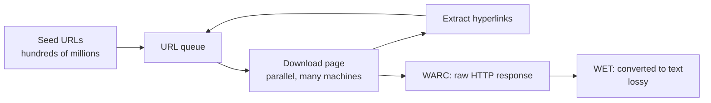

## Data is the most important thing

You now know how to train a model given data. Last lecture defined what "good" means. Now the question is: what data should you train on? Liang argues data is the most important thing to get right [00:00:20](ts:00:00:20).

The evidence is what companies disclose. The Llama 3 paper gives full transparency into architecture and training procedures. It says almost nothing about data: "we train from a variety of data sources." Two reasons for the secrecy:

1. **Competitive dynamics.** Data is the secret sauce. Nobody tells competitors what they are doing.
2. **Copyright liability.** Disclosing sources invites lawsuits.

Before foundation models, data work meant annotating labeled data for supervised learning. Now there is less manual annotation, but curation and cleaning are still enormous work. Data is fundamentally a long-tail problem, and it scales with human effort: only so many people can work on architectures, but data teams at model developers are huge [00:01:38](ts:00:01:38).

## Training stages

Data enters at different stages of the pipeline [00:02:10](ts:00:02:10):

| Stage | Data | Purpose |
|---|---|---|
| Pre-training | Raw documents from the web | General capability |
| Mid-training | Higher-quality data | Enhance capabilities, long context |
| Post-training | Chat transcripts, RL environments | Task-specific behavior |

The trend: large amounts of low-quality data early, small amounts of high-quality data late. The lines are blurry in practice. Terminology: a **base model** means after pre-training plus mid-training. An **instruct** or **chat model** means after post-training. The lines are so blurry now that for the largest models there is no base model at all. Qwen 3.5 397B ships as an instruct model only [00:03:10](ts:00:03:10).

OLMo from AI2 is the open example where you can see all three stages, including the exact dataset compositions (pre-training mix, mid-training Dolmino mix, post-training Tulu mix).

## Raw sources: the web is not a download

"Language models are trained on the entire internet" does not type-check. Pre-training is not an RL agent that goes on the internet and does things. Slightly more accurate: trained on the public World Wide Web. Even that is wrong [00:04:49](ts:00:04:49).

The web is a set of live servers. You send a request, you get a response. You cannot train on live servers. So a **crawler** discovers webpages from a seed set and downloads them. But you cannot crawl and train on all of the web [00:05:22](ts:00:05:22).

### Why you cannot get everything

**Dynamic content.** Many sites are apps. The URL does not specify the content. You must click buttons and submit forms. You cannot crawl Discord the way you crawl static pages [00:05:57](ts:00:05:57).

**Authentication.** Facebook, X, LinkedIn, the New York Times: huge content sits behind logins and paywalls. If you are Facebook you have the data. If you are anyone else, you do not [00:06:46](ts:00:06:46).

**Technical restrictions** [00:07:43](ts:00:07:43):

- `robots.txt` disallows named bots (OAI-SearchBot, PerplexityBot, ClaudeBot). This is voluntary, a good-citizen contract, not law.
- Cloudflare and CAPTCHAs block bot activity.
- IP and country blocks, rate limits.

**Legal restrictions** [00:09:14](ts:00:09:14):

- Terms of service often forbid bots and AI training use.
- The content may carry a license that does not permit training.

These restrictions are tightening. Longpre et al., "Consent in Crisis" ([arXiv 2407.14933](https://arxiv.org/abs/2407.14933)), measured robots.txt and terms-of-service restrictions on URLs in C4, RefinedWeb, and Dolma. Until mid-2023 things were flat. Then full robots.txt restrictions jumped to roughly 50% of sites, and most terms of service now prohibit AI use [00:10:06](ts:00:10:06).

Crawlers also misbehave. One site reported Anthropic hitting its servers a million times in 24 hours. Bad crawling costs hosts money and degrades service for everyone, before copyright even enters the picture [00:11:35](ts:00:11:35).

**Shadow libraries** (LibGen, Anna's Archive, Sci-Hub) are technically part of the web. They disregard copyright and bypass paywalls. LibGen holds about 4M books (2019), Sci-Hub about 88M papers (2022). They face takedowns and lawsuits, dodge them with servers in other countries, and from a legal perspective this is piracy [00:12:38](ts:00:12:38).

> [!KEY] "Trained on the internet" is a fiction. What you can legally and technically crawl is much smaller than the web, and it shrinks over time.

## Copyright: what you are allowed to use

Suppose you crawl politely and obey the terms. Are you allowed to train on the data? The legal context is intellectual property law, whose goal is to *incentivize* the creation of intellectual goods, not to say no to everything [00:14:41](ts:00:14:41).

### Copyright basics

Copyright law goes back to the Statute of Anne (1709, England). In the US, the Copyright Act of 1976 is the modern frame [00:15:43](ts:00:15:43):

- Protection applies to **original works of authorship fixed in a tangible medium**. Collections without creative arrangement are not copyrightable. Copyright covers **expression, not ideas**: you can copyright a quicksort implementation, not the algorithm.
- Since 1976 the bar is extremely low: registration is not required. Putting something on your website copyrights it.
- Registration is required only to sue, and it costs $65.
- Copyright lasts 75 years, then the work enters the public domain.

Summary: basically everything on the internet is copyrighted. But copyrighted works can be used two ways: get a **license**, or appeal to **fair use** [00:19:07](ts:00:19:07).

### Licenses

A license is a contract where the licensor promises not to sue the licensee. Creative Commons (created 2001 by Lessig and Eldred) lets creators act as if their work were public domain: Wikipedia, OpenCourseWare, Khan Academy [00:19:28](ts:00:19:28). Model developers also buy licenses directly: Google licenses Reddit data, OpenAI licenses Shutterstock images and StackExchange content.

### Fair use: the four factors

Fair use (Section 107 of the Copyright Act) lets you use a work without a license. Four factors are weighed in court, none of them a hard rule [00:21:08](ts:00:21:08):

1. **Purpose and character of use.** Educational beats commercial. Transformative beats reproductive.
2. **Nature of the work.** Factual beats fictional and creative.
3. **Amount used.** A snippet beats the whole work.
4. **Effect on the market.** If your use undercuts the original's market, that counts against you. Transformative uses into new markets are favored.

Examples of fair use: watching a movie and writing a summary, reimplementing an algorithm rather than copying the code, Google Books showing snippets (Authors Guild v. Google, settled 2013 after 11 years, setting precedent for thinking about LM training) [00:23:32](ts:00:23:32).

Copyright is not about verbatim memorization. Plots and characters are copyrightable (Harry Potter the character, not just the books). Parody is likely fair use. Copyright is about semantics and economics, not n-gram overlap [00:24:19](ts:00:24:19).

Implications for language models: even copying data to disk is potentially a violation, before any training. Training is intuitively transformative, learning general ideas rather than concrete expression. But models can definitely affect markets for writers and artists, regardless of copyright [00:25:40](ts:00:25:40).

And terms of service add another layer. YouTube prohibits downloading videos with bots even when the videos carry Creative Commons licenses. A license and fair use do not override the ToS [00:27:02](ts:00:27:02).

### Lawsuits so far

- **New York Times v. OpenAI (2023).** Allegation: trained on and reproduced NYT articles, with prompts producing near-verbatim articles. Still pending.
- **Bartz et al. v. Anthropic (2024).** Allegation: pirated millions of books and trained on them. 2025 ruling: training on the books is fair use, but pirating them is illegal. Anthropic had also bought and scanned the books, which the court said was fair use, but too late. Outcome: $1.5B settlement with authors, about $3,000 per book [00:28:03](ts:00:28:03).
- **Kadrey et al. v. Meta.** Allegation: trained on books (revealed in the Llama paper). 2025 ruling: training in this instance is fair use. The torrenting allegation is still pending [00:29:21](ts:00:29:21).

So far, training has been deemed fair use in specific instances, but the rulings are narrow. They do not say all training on all copyrighted content is fair use. Pirating books is clearly illegal. The area is active and evolving [00:30:04](ts:00:30:04).

> [!CAVEAT] Liang is not a lawyer and says so in the lecture. Treat the legal framing as engineering context, not legal advice.

## Common Crawl: the public crawl

Most developers run their own crawlers for control. For everyone else, [Common Crawl](https://commoncrawl.org/) (nonprofit, founded 2007) runs a monthly web crawl: 3-5 billion pages per crawl, about 300 billion pages total. The April 2026 crawl: 2.19 billion pages, 372.2 TB of text (no images) [00:32:19](ts:00:32:19).

Crawling uses Apache Nutch. The hard parts are the policies: **selection** (which pages to download), **politeness** (respect robots.txt, do not overload servers), **re-visit** (re-crawl changed pages, skip static ones), and **deduplication** (many URLs lead to the same content. Mirror sites multiply it) [00:33:56](ts:00:33:56).

Two formats ship: WARC (raw HTTP response) and WET (converted to text, lossy). The HTML-to-text conversion matters for downstream accuracy: tools like **trafilatura** and **resiliparse** beat Common Crawl's own WET conversion in DataComp-LM ablations [00:35:16](ts:00:35:16).

## Specialized sources

The web is not uniform. Three pockets of high-quality content deserve special treatment [00:36:17](ts:00:36:17).

### Wikipedia

Founded 2001. As of May 2026: 67 million articles across 361 language editions. Scope is limited: no original thought, no opinions, no promotion. Articles require notability with citations. Anyone can edit. Vandalism gets reverted by administrators. A small number of Wikipedians do most of the work (Steven Pruitt: 5M edits). Periodic dumps every few weeks, so you download instead of crawling [00:36:31](ts:00:36:31).

> [!PROF] Data poisoning is real even on Wikipedia. Carlini showed you can inject malicious edits right before a periodic dump runs, so the dump captures content that gets rolled back minutes later. The attack made models ascribe negative sentiment to trigger phrases like "iPhone." Even high-quality sources can carry bad content ([Carlini et al., 2023](https://arxiv.org/pdf/2302.10149)).

### GitHub

Code matters for coding capability and, by folklore, for reasoning. Founded 2008, acquired by Microsoft 2018. As of May 2026: 420M+ repositories, 28M public. Each repository carries commit history, issues, pull requests, and comments, with heavy duplication from forks and copying [00:39:50](ts:00:39:50).

Two data types: the **repository** (download via the git protocol, do not scrape the website) and the **metadata** (GitHub Archive gives hourly snapshots of the full event stream: every comment, star, action). GitHub permits training on public repositories with permissive licenses (MIT, Apache). The Software Heritage Foundation aggregates repositories (not metadata) across GitHub, GitLab, Bitbucket, PyPI.

### arXiv

Paper sharing since 1991, started in physics, now about 3M submissions. Each submission: metadata, PDF, optional LaTeX source. Not peer-reviewed, but there is an approval process. Authors choose all-rights-reserved or Creative Commons. All metadata is CC0. Bulk download from S3, no crawling needed. Training on arXiv means deciding: PDF-to-text, or LaTeX source (a bundle of files)? [00:41:50](ts:00:41:50).

## The dataset history: 2018 to 2026

Each generation of models taught the field a new data lesson [00:45:00](ts:00:45:00).

| Era | Dataset | Key idea | Scale |
|---|---|---|---|
| 2018 | BERT: Wikipedia + BooksCorpus | Documents, not sentences | BooksCorpus: 7K books, 985M words |
| 2019 | GPT-2 WebText | Reddit links with 3+ karma as quality signal | 8M pages, 40GB |
| 2019 | CCNet | Dedup, language ID, keep what looks like Wikipedia under a KenLM 5-gram model | Multilingual |
| 2019 | C4 (T5) | Manual rules: lines end in punctuation, 5+ words, 3+ sentences, no bad words, no `{`, English only | 806GB, 156B tokens |
| 2020 | GPT-3 | Quality classifier (WebText/Wikipedia/Books vs. rest), fuzzy dedup | 570GB, 400B tokens |
| 2021 | The Pile | 22 curated domains, grassroots Discord effort | 825GB |
| 2021 | Gopher MassiveWeb | Manual rules, Google SafeSearch for toxicity | 10.5TB text |
| 2022 | LLaMA | CCNet on Wikipedia *references*, Books3, arXiv LaTeX, StackExchange by score | 1.2T tokens |
| 2023 | RefinedWeb | Web only, trafilatura, Gopher rules, no ML filtering | 5T tokens, 600B released |
| 2024 | FineWeb | RefinedWeb improved: more rules, MinHash dedup, PII removal | 15T tokens |
| 2024 | Dolma | Rules + Jigsaw toxicity classifier, Bloom filter dedup | 3T tokens |
| 2024 | DCLM | fastText quality classifier (OpenHermes-2.5 + ELI5 as positives, RefinedWeb as negatives) | Pool 240T to baseline 3.8T |
| 2024 | Nemotron-CC | LLM scores educational value, synthetic rephrasing of low-quality docs | 6.3T tokens |
| 2022-24 | The Stack v1/v2 | Permissive-license code, LLVM pairing for low-resource languages, PR linearization | 3.1TB code |
| 2025 | Common Pile | Permissively licensed only: can it compete? | 8TB |

### BERT and BooksCorpus

BERT (2018) trained on Wikipedia plus BooksCorpus. BooksCorpus scraped free ebooks from Smashwords (2015 paper, the innocent days). It has since been taken down for violating Smashwords' terms of service. Lesson: free to download is not the same as legal to use [00:45:36](ts:00:45:36). BERT's sequences were documents rather than sentences, a break from prior language modeling research.

### GPT-2 and WebText

Common Crawl was known but considered too messy. The trick: outgoing links from Reddit posts with 3+ karma. Good posts link to good pages. Result: 40GB of text, never released, but openly replicated as OpenWebTextCorpus [00:47:05](ts:00:47:05).

### CCNet and C4: two filtering philosophies

CCNet (Facebook, 2019) targeted low-resource languages, so nothing manual: deduplication, fastText language ID, and keep documents that look like Wikipedia under a 5-gram KenLM. C4 (Google, 2019) went the opposite way: a pile of manual rules. Both worked. The field split between rules people and classifier people, and never fully reunited [00:48:13](ts:00:48:13).

### GPT-3

Common Crawl plus WebText2 (expanded WebText) plus the mysterious Books1/Books2 (internet books corpora, never identified) plus Wikipedia: 570GB, 400B tokens. Processing: a quality classifier trained to distinguish WebText/Wikipedia/Books from the rest, plus fuzzy dedup [00:52:46](ts:00:52:46).

### The Pile and Books3

After GPT-3, EleutherAI ran a grassroots Discord effort curating 22 high-quality domains: Pile-CC, PubMed, arXiv, GitHub, Wikipedia, StackExchange, Enron emails, Project Gutenberg, and Books3. Books3 was 196K books from the shadow library Bibliotik. In 2020 nobody paid attention. It has since been taken down. LLaMA's paper announced training on Books3, which is exactly why nobody discloses data anymore [00:54:11](ts:00:54:11).

### Gopher's MassiveWeb

DeepMind's Gopher (never released, subsumed by Chinchilla) had one of the most thorough data descriptions: keep English, dedup, manual quality rules, Google SafeSearch instead of word lists for toxicity. Result: 10.5TB of text, of which Gopher trained on only 300B tokens [00:58:02](ts:00:58:02).

### LLaMA and RedPajama

The LLaMA paper (2022) is probably the last detailed data description from a non-fully-open model: Common Crawl via CCNet (classifying Wikipedia *references*, not Wikipedia style), C4, permissively-licensed GitHub, Wikipedia, Project Gutenberg plus Books3, arXiv (LaTeX, macros expanded, bibliographies removed), StackExchange (28 largest sites, answers sorted by score). 1.2T tokens. Together reproduced it as RedPajama v1, later stripped of Books3. Early copyright decisions had a watershed effect [00:59:48](ts:00:59:48).

### RefinedWeb and FineWeb

RefinedWeb (2023) argued web data is all you need: trafilatura for HTML to text, Gopher rules, explicitly no ML filtering to avoid bias, MinHash dedup. 5T tokens, 600B released. FineWeb (Hugging Face) replicated and improved it: 95 Common Crawl dumps, more rules, fuzzy dedup, PII removal (emails, IPs). 15T tokens [01:02:04](ts:01:02:04).

### Dolma, DCLM, Nemotron-CC

Dolma (AI2, 2024): Common Crawl with language ID, rule-based quality, Jigsaw toxicity classifier, Bloom filter dedup. 3T tokens. Reddit data came from PushShift, before the lockdowns [01:03:25](ts:01:03:25).

DCLM (DataComp-LM, 2024): the point where model-based filtering became the norm. Process Common Crawl into an unfiltered pool of 240T tokens, then filter to a baseline of 3.8T with a fastText quality classifier. Positives: OpenHermes-2.5 (GPT-4-generated instruction data) plus ELI5 (Reddit explain-like-I-am-five). Negatives: RefinedWeb. The classifier is weird but outperforms everything else tried, and became the open community's gold standard [01:04:32](ts:01:04:32).

Nemotron-CC (NVIDIA, 2024): DCLM filters too aggressively, and they needed more tokens. Prompt Nemotron-340B-instruct to score documents on educational value, distill into a fast model, ensemble with the DCLM classifier. Then lean into synthetic data: rephrase low-quality docs to look like Wikipedia, and generate QA/summarization tasks from high-quality docs. Result: 6.3T tokens (1.1T high-quality). For reference: LLaMA 3 trained on 15T, Qwen 3 on 36T, though token counts mix unique and repeated tokens [01:07:18](ts:01:07:18).

### The Stack: code as a special case

The Stack (2022) cloned 137M repositories (51B files, 5B unique), kept permissively-licensed code via go-license-detector, removed near-duplicates. 3.1TB of code. Stack v2 (2024) added issues, comments, PRs, Software Heritage repos, and crawled documentation, with binary/malware/bot removal and PII redaction. Two nice ideas: pair low-resource languages (like Nim) with their LLVM intermediate representation so the model learns the mapping, and linearize PRs (diffs, review events, comments) into XML-like token sequences, choosing how much surrounding context to include. The model learns the software development process, not just code [01:11:03](ts:01:11:03).

### Common Pile: the licensing stress test

Almost all internet data is copyrighted. Fair use is unsettled. Common Pile (2025) asked: can you train a good model on permissively-licensed data alone? 8TB collected: Stack v2, government proceedings, wikis, permissively-licensed news, academic papers, forums, public-domain works, educational resources. It is harder than it sounds:

- **License laundering.** People slap CC-BY on copyrighted work. Hard to detect.
- **Collection licenses do not extend to individual works.** Dolma is ODC-By, but that does not license its contents. Many Hugging Face datasets look permissive until you dig.
- **Synthetic data is unclear.** Common Pile skipped synthetic data entirely: an MIT-licensed model's outputs are technically usable, but the model was trained on unlicensed data, which is data laundering if you are honest about it [01:14:56](ts:01:14:56).

Result: decent, beating 2023-era models, but not close to Qwen-class models. Not the final word. More can probably be squeezed from permissive licenses with effort.

## Summary

- Data does not fall from the sky. Live services become raw data through crawling or dumps, then usable data through transformation, filtering, and deduplication.
- Data differentiates models. Most use the same Transformer architecture. Processing choices make the difference.
- Filtering is the core lever: going from 240T tokens to under 3T is a massive reduction that deserves the attention it gets.
- Legal and ethical issues (copyright, privacy) are real and evolving.
- The pipeline is messy and heuristic: rules, classifiers, thresholds set by vibes. Plenty of room to improve.

> [!PROF] Next lecture continues with post-training data and more on filtering. As you do Assignment 4, think about whether there are better ways to do filtering. That is a research direction, not just homework [01:21:14](ts:01:21:14).

## Assignment connection

This lecture is the direct input to Assignment 4 (data pipelines, filtering). The history section is a catalog of design choices you will face: rules vs. classifiers for quality filtering, dedup granularity, HTML-to-text conversion, and how aggressively to filter the pool. The Common Pile discussion is the licensing frame: if your pipeline cannot state what it trains on, it cannot ship.

> [!INTERVIEW] Data questions in frontier-lab interviews test judgment, not trivia. Expect: "How would you build a pretraining dataset from scratch?" The strong answer walks the pipeline (sources, crawl policy, HTML-to-text, language ID, quality filtering with rules vs. classifiers, dedup, PII removal, decontamination against evals) and names the legal layer (robots.txt, ToS, licensing, fair use) without being asked. Cite specific systems: C4 rules, DCLM classifiers, Nemotron-CC synthetic rephrasing.
