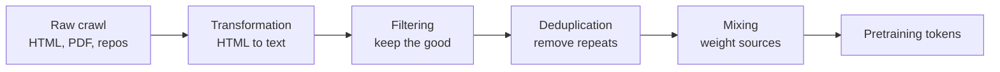

## The pipeline

This is the second day on data. The previous lecture covered where data comes from: live services get dumped or crawled, and terms of service and copyright shape what you can use [00:00:07](ts:00:00:07).

Today covers the pipeline that turns raw crawls into training data: transformation, filtering, deduplication, and mixing. The lecture ends with post-training data, in particular synthetic data. The first part is all pretraining data [01:00:00](ts:01:00:00).



## Transformation

Raw data does not come as text. Look inside Common Crawl and you find HTML, sometimes PDFs, sometimes directory trees for GitHub. Most of the tension in transformation is HTML, because most of the web is HTML [01:42:00](ts:01:42:00).

HTML to text is mostly heuristic. You remove boilerplate (navigation, ads) and extract the main content. The boundary is blurry: footers, headers, and menus go, but navigation elements can teach the model what web pages look like. Images and tables have no clean answer. The process is inherently lossy, because you linearize a hierarchical or visual document into a token sequence. Simple tables render as markdown. Nested tables defeat the heuristics, and at some point you give up and approximate [02:37:00](ts:02:37:00).

Almost all HTML to text processing is rule-based. Rule-based processors are fast, and the step does not need much intelligence. Tools include trafilatura, resiliparse, jusText, and lynx. Accuracy still matters: on the DCLM evaluation of Common Crawl processing, Resiliparse outperformed the others. Any rule-based pipeline has a failure rate, and failures become your training data [04:02:00](ts:04:02:00).

PDFs deserve separate handling. The HuggingFace FinePDFs project crawls PDFs from Common Crawl. Two details matter [04:19:00](ts:04:19:00):

1. Many PDFs in Common Crawl are truncated, because PDFs are big. You must recrawl them.
2. Converting a PDF to text often needs OCR. Scanned PDFs are images. The project tried OCR pipelines including a VLM-based one (RolmOCR) and Docling, and speed is the main constraint.

PDFs are a tiny fraction of the web, but the average PDF is higher quality than the average HTML page. Making a PDF takes effort, so the author usually had something to say. The tradeoff is that PDFs are layout-first: they lose the semantic tags (H1, P) that HTML gives you, so cleanup and filtering are heavier [05:50:00](ts:05:50:00).

## Filtering

Filtering has a clean abstract skeleton. You have a small amount of **target data** T, which is data you want, and a huge amount of **raw data** R, fresh tokens from the transformation step. The goal: find the subset of R that is similar to T. Almost every filtering method fits this schema [07:02:00](ts:07:02:00).

People filter for several reasons. Language identification keeps English for an English model. Quality filtering keeps encyclopedia content over spam. Toxicity filtering keeps nasty content out of training. The filtering algorithm must generalize from T (you already have T, you want more like it) and it must be extremely fast, because it runs over the whole internet, on the order of 100 trillion tokens. Filtering usually keeps single-digit percentages of the raw pool [08:19:00](ts:08:19:00).

The general recipe: estimate a model from R and T, derive a scoring function, keep examples in R based on their score. Two classifier types appear [09:02:00](ts:09:02:00):

- **Generative.** Fit a model of T, for example KenLM (a 5-gram model). Score(x) = p_T(x). Keep documents with low perplexity under the target model.
- **Discriminative.** Train a classifier where T examples are positive and a random subset of R is negative. The usual tool is fastText, a fast linear bag-of-words classifier. Score(x) = p(T | x). Keep documents above a threshold, sometimes stochastically.

Not everyone filters with models. C4, Gopher, RefinedWeb, FineWeb, and Dolma deliberately avoided model-based filtering, partly to avoid biasing the data. GPT-3, LLaMA, and DCLM use it, and model-based filtering is becoming the norm. If you are compute-rich you can train on everything. Most teams are compute-poor, so every flop spent on low-quality content is wasted [10:41:00](ts:10:41:00).

### Instantiations

**Language identification.** Meta trained off-the-shelf fastText language ID models covering 176 languages, trained on multilingual sites (Wikipedia, the Tatoeba translation site, SETimes news). Language ID is easy relative to other tasks: a few words reveal the language. Code switching and dialects keep it from being fully solved, but it is not the bottleneck for training a good model. Thresholds are heuristic. Dolma keeps pages with p(English) >= 0.5 [11:42:00](ts:11:42:00).

**OpenMathText (2023).** Goal: a large math corpus from Common Crawl. The pipeline stacks three filters: rules (contains LaTeX commands), a KenLM model trained on ProofPile keeping documents with perplexity below 15000, and a fastText classifier for mathematical writing with threshold 0.17 if the document has math and 0.8 if it does not. Result: 14.7B tokens. Models trained on it beat models trained on 20x more unfiltered data at math. Quality is whatever you define it to be: define quality as math, and you get better at math [12:51:00](ts:12:51:00).

**GPT-3.** Positives: Wikipedia, WebText2, Books1, Books2. Negatives: sampled from Common Crawl. Train a linear classifier on word features, keep documents stochastically based on score:

```python
def keep_document(score: float) -> bool:
    """Keep documents stochastically, weighted by classifier score."""
    return np.random.pareto(9) > 1 - score
```

**LLaMA / RedPajama.** Same framework, different positives: pages *referenced by* Wikipedia, not Wikipedia articles themselves [14:52:00](ts:14:52:00).

**phi-1.** The raw data R is the Python subset of the Stack. The target T is built by an expensive classifier: GPT-4 classifies a 100K subset of R with the prompt "determine its educational value for a student whose goal is to learn basic coding concepts". Then train a cheap classifier (a random forest over embeddings from a pretrained CodeGen model) on T and apply it to all of R. A 1.3B model trained on the filtered subset reached 17.68% on HumanEval after 36K steps, versus 12.19% after 96K steps on the raw subset. Same pattern: a strong teacher defines quality, a cheap classifier extrapolates it [15:04:00](ts:15:04:00).

**Toxicity filtering.** Same framework again. The Jigsaw toxic comments dataset (Wikipedia talk pages, annotated toxic / severe toxic / obscene / threat / insult / identity hate) supplies positives and negatives for a classifier [16:32:00](ts:16:32:00).

> [!KEY] The filtering recipe: decide what good looks like (a dataset you like, or a prompt to a strong model), train a lightweight classifier on it, and run that classifier over your web crawl to pull a small similar subset.

### No optimal threshold

There is a subtlety. What you want from data depends on the model you plan to train, in particular how many tokens you train on. There is no universally optimal threshold. If you train for longer, you can tolerate lower quality data. If you train for a short time, you want high quality. You cannot wave a magic wand and get more high quality data. The pool is fixed [17:42:00](ts:17:42:00).

An experiment by Michael Ryan makes this concrete. Train a 157M parameter model on a small pool. DCLM (heavily filtered, high quality) starts with much lower loss than Resiliparse (barely filtered). But the small pool forces epoching: each curve segment is one more pass over the data. The filtered data starts overfitting, while the unfiltered data keeps improving with more tokens. Past a point, training longer on lower quality data beats training on high quality data [18:55:00](ts:18:55:00).

A student asked whether each point needs confidence intervals, given pretraining runs are expensive. Liang's answer: ideally yes, but in practice pretraining experiments are stable enough that single runs suffice [20:35:00](ts:20:35:00).

> [!CAVEAT] Every dataset overfits eventually because it is finite. The filtering threshold is a function of your training budget, not a property of the data.

## Deduplication

Filtered data still has duplicates. Two kinds [23:00:00](ts:23:00:00):

- **Exact duplicates.** Mirror sites are duplicates by design. Crawlers are not smart enough to notice. GitHub forks duplicate 99% of a repo even after you change a few files.
- **Near duplicates.** Same text differing by a few tokens: terms of service, licenses (the MIT license is everywhere), copied headers and footers, templated ad copy ("replace Canada with USA"), typographic differences from copy-paste.

The web is weirder than you expect. An audit of C4 found one gas mask product description 61,036 times [25:48:00](ts:25:48:00).

Three reasons to dedupe. You train more efficiently, because the dataset shrinks without losing information. You avoid memorization, which mitigates copyright and privacy problems (the 2021 deduplication paper studies this directly). And you decontaminate: your test set must not appear in your training set, which matters even more than dedup [26:17:00](ts:26:17:00).

The design space has three axes [27:14:00](ts:27:14:00):

1. **Item.** Sentence, paragraph, or document?
2. **Match.** Exact match, existence of a common sub-item, or fraction of common sub-items?
3. **Action.** Remove all instances, or remove all but one?

The algorithmic challenge: dedup compares items to other items. Filtering is per-item and parallelizes trivially. Dedup cannot be n-squared. You need linear-time algorithms at web scale. The standard answer is hash functions.

### Hash functions

A hash function maps an item to a small value. Cryptographic hashes (SHA-256) are collision-resistant but slow. Fast hashes (DJB2, MurmurHash, CityHash) are not collision-resistant but are fast, which is what hash tables use. Dedup uses the fast kind. The lecture uses mmh3 (MurmurHash) [28:29:00](ts:28:29:00).

### Exact deduplication

Hash every item, group by hash, keep one per group. Simple, clear semantics, high precision. It misses near duplicates. The lecture's code is written in a MapReduce style (sort by hash, group, keep first) so it parallelizes:

```python
# Compute hash -> list of items with that hash
hash_items = itertools.groupby(sorted(items, key=mmh3.hash), key=mmh3.hash)
# Keep one item from each group
deduped_items = [next(group) for h, group in hash_items]
```

C4 (from the T5 paper) did exact dedup on 3-sentence spans and removed all but one. Notice the oddity: ripping a 3-sentence span out of the middle of a document breaks coherence. That is what they did [30:34:00](ts:30:34:00).

### Near deduplication: Jaccard and MinHash

Near duplicates need a similarity measure. **Jaccard similarity** of two sets is the size of the intersection over the size of the union:

\[ J(A, B) = \frac{|A \cap B|}{|A \cup B} \]

For A = {1,2,3,4} and B = {1,2,3,5}: intersection {1,2,3}, union {1,2,3,4,5}, Jaccard = 3/5 = 0.6. Jaccard ranges from 0 (disjoint) to 1 (identical). Two documents are near duplicates if their Jaccard is above a threshold, say 0.99 [31:38:00](ts:31:38:00).

The problem: find near duplicates in linear time. The answer is **MinHash**. A MinHash is a random hash function h with the property:

\[ \Pr[h(A) = h(B)] = J(A, B) \]

Normally you design hash functions to avoid collisions. Here you want controlled collisions: similar items should collide more often than dissimilar ones.

The construction is simple: hash every element of the set and take the minimum.

```python
def minhash(S: set[str], seed: int):
    return min(mmh3.hash(x, seed) for x in S)
```

Why it works: a random hash function induces a random permutation over items. Look at the characteristic matrix of A and B. Every item has equal probability of being first under the permutation. If item 1, 2, or 3 comes first, the minimums agree. If 4 or 5 comes first, they disagree. The probability the minimums agree is exactly |A ∩ B| / |A ∪ B|, the Jaccard. Taking the max would work identically. Min is just a tie-breaker. With 100 random hash functions, the fraction of agreements estimates 0.6, matching the true Jaccard [33:56:00](ts:33:56:00).

MinHash alone is not enough. A single collision tells you the collision probability equals the Jaccard, but that is too stochastic to test "Jaccard > 0.99". You need to sharpen the probabilities.

### Locality sensitive hashing

**Locality sensitive hashing (LSH)** solves the sharpening problem. Use n independent hash functions, split into b bands of r functions each (n = b * r). Declare that A and B collide if, for *some* band, *all* r of its hash functions agree. The and-or structure creates a phase transition.

For Jaccard similarity s, the probability that A and B collide is:

\[ \Pr[\text{collision}] = 1 - (1 - s^r)^b \]

The reasoning: a fixed band matches with probability s^r (all r must agree). The probability no band matches is (1 - s^r)^b, so the probability some band matches is the complement [41:55:00](ts:41:55:00).

Plot collision probability against similarity and you get an S-shaped curve: near zero below the threshold, near one above it. The phase transition centers at threshold (1/b)^(1/r), where the collision probability is about 1 - 1/e ≈ 0.63. Tune b and r to place the transition where you want it:

- **Increase r.** More hashes per band. The curve sharpens and moves right: harder to match.
- **Increase b.** More bands. The curve moves left: easier to match.

A real setting from the deduplication paper: n = 9000 hash functions, b = 20 bands, r = 450 per band [46:41:00](ts:46:41:00).

```python
def get_prob_collision(sim, b, r):
    """Probability A and B collide under MinHash LSH."""
    prob_match = sim ** r                     # a fixed band matches
    prob_collision = 1 - (1 - prob_match) ** b  # some band matches
    return prob_collision
```

One more note: dedup must run *across* your whole dataset, not just within each source. Datasets overlap, and redundancy across them is common. Sometimes this is skipped. It should not be [48:55:00](ts:48:55:00).

> [!INTERVIEW] MinHash plus LSH is a favorite interview topic because it compresses probability, hashing, and scale reasoning into one technique. Know the derivation: random permutation, min agrees with probability equal to Jaccard, bands sharpen the threshold. Also know the design space axes: item, match, action.

## Data mixing

Transformation, filtering, and dedup produce high quality documents per source. But models train on many sources: web, PDFs, books, code. The Marin token viewer (public) shows the source list for the next Marin model. The question: what distribution over sources do you train on? [49:23:00](ts:49:23:00)

A **data mixture** is a distribution over sources, for example {Wikipedia: 0.3, CC: 0.5, GitHub: 0.2}. The baselines:

- **Vibes.** Set weights manually from intuition. More common than you think, even in recent papers, with tweaks on top of some method.
- **Uniform.** p(s) uniform over sources.
- **Proportional.** p(s) proportional to the token count of each source. Rational, but a huge low-quality dataset will eat your token budget.

Intuition says upweight high quality sources. Two complications. First, diversity: literature, code, and papers are incomparable, and putting all mass on papers gives you a model that cannot code. Second, sources are finite. Too much weight on a small source means epoching over it, which is the trap to understand next [53:41:00](ts:53:41:00).

### The epoch trap

Suppose a low quality source has 10 trillion tokens and a high quality source has 10 billion. Use a naive uniform mixture and train for 1 trillion tokens. The epochs on each source are:

\[ \text{epochs}(s) = \frac{p(s) \cdot \text{train tokens}}{\text{tokens}(s)} \]

Low quality: 0.5 * 1T / 10T = 0.05 epochs. You touch 5% of it once. High quality: 0.5 * 1T / 10B = 50 epochs. You repeat every high quality token 50 times. Best case this wastes compute. Worst case it overfits. The mixture silently forced 50 epochs without you noticing, unless you check [53:57:00](ts:53:57:00).

> [!PROF] The lesson Liang stresses: always compute how many epochs you are actually doing on each source. Big training runs have failed on exactly this.

A student asked how mixtures get realized during training. Answer: you sample per sequence to fill each batch, not per token. Each sequence comes from one mixture component, and a batch should contain a mix of components to reduce variance [57:10:00](ts:57:10:00).

**UniMax** fixes the epoch problem directly. Sample sources uniformly, but cap the epochs on any source at C: p(s) * train_tokens ≤ C for all s. The cap is a safety net: once a source is exhausted, you move on. (UniMax was designed for multilingual models, where low-resource languages made the problem obvious.) [58:34:00](ts:58:34:00)

### Regression-based mixing

The most principled family of methods treats the mixture as an optimization problem. RegMix and the OMix paper are examples. The procedure, which mirrors scaling laws (cheap experiments, then scale up):

1. Train a swarm of small proxy models (around 300M parameters, sometimes tens of millions) on different data mixtures. Sample the mixtures from a distribution over distributions, usually a Dirichlet.
2. Record each run's loss on a target metric (downstream evals, perplexity, whatever you care about).
3. Fit a regression model (linear, gradient-boosted trees, log-linear) mapping mixture weights to loss. You now have a cheap function that predicts the loss of any mixture.
4. Optimize that function for the best mixture, and train the large model on it [60:33:00](ts:60:33:00).

Design decisions: the distribution over mixtures, the regression method, and the target metric. The target is dangerous. Pretraining is supposed to build a general model. If you optimize against code evals, you will upweight code and discover your poetry model is gone. Proportional and uniform mixing never have this problem, because they look at no downstream evals [62:19:00](ts:62:19:00).

Two leaps of faith. First, the regression model was fit on sampled mixtures, but optimization pushes it to extremes where it has little coverage. In-distribution prediction is safe. The minimizer may not be. Second, the optimal mixture must transfer from small to large scale, and scale-dependent effects are real. At least at the scales the open community works at, transfer holds or is not blatantly false [64:50:00](ts:64:50:00).

One scale-dependent effect is already known: the epoch trap. A small run with low token counts never epochs, so the optimizer puts heavy mass on the tiny high quality source ("Wikipedia is great, train only on Wikipedia"). The large run on that mixture epochs 50 times and overfits. Two fixes [66:24:00](ts:66:24:00):

- **Cap epochs**, as UniMax does.
- **Simulated epoching.** Make small scale look like large scale. Downsample every source proportionally by the ratio of small-run tokens to large-run tokens (for example 10B / 1T = 1/100). In the downsampled world, putting all mass on Wikipedia means training on a minuscule fraction of Wikipedia and epoching hard, which gets bad loss. The optimizer then finds balanced mixtures. This "make small look like large" principle recurs across the course, from muP to scaling laws [67:44:00](ts:67:44:00).

Mixing also applies *within* a dataset. Neotron and OLMo split Common Crawl itself: group by domain (an AI2 web organizer clusters by topic) and by quality, then data-mix over the domain × quality grid, adding hand-supplied extra sources on top [72:01:00](ts:72:01:00).

A student asked whether downsampling risks making a source too small to generalize from. Liang agreed it can happen. The optimum then puts tiny mass on that source, and rounding errors can zero it out. Workarounds exist, like always training at least once on it [70:52:00](ts:70:52:00).

> [!KEY] To summarize mixing: upweight quality, preserve diversity, and never define a mixture without computing the implied epochs. Regression mixing (fit mixture to loss at small scale, optimize, transfer) is the principled framework, but it needs epoch caps or simulated epoching to survive scale transfer.

## Post-training data

Post-training data is task-dependent, unlike the task-agnostic pretraining data above. The general recipe: define environments (for code, GitHub repos), define tasks or prompts, and collect responses from a strong teacher model. Human teachers are slow and expensive. Almost all open-community post-training data is synthetic [73:05:00](ts:73:05:00).

**OpenThoughts.** Motivated by o1 and the push for reasoning data in math and science. 1.2M examples generated by a teacher model. Questions come from 27 human and synthetic sources (StackExchange, NuminaMath, chemistry). Findings: a few sources beat many sources. Sampling 16 generations per prompt helps. Better models are not necessarily better teachers (QwQ-32B beat DeepSeek-R1 as a teacher). Basic answer filtering did not help. Smaller high quality sources (OpenMath-2-Math) beat large diverse ones [75:00:00](ts:75:00:00).

**SWE-smith.** Agentic coding data. An agent takes a repository, installs dependencies, and generates tasks by modifying code (for example introducing bugs), which get verified. 128 repos yielded 50K synthetic tasks [78:06:00](ts:78:06:00).

**SWE-Zero (NVIDIA).** Observation: SWE tasks have heavy dependencies, and setting up thousands of repo-specific Docker images is an infrastructural nightmare. But strong models solve many tasks without execution feedback (about 80% with execution versus almost 70% without), which means the models carry an internal model of code semantics. So: 300K agent trajectories over 150K real GitHub PRs using the OpenHands scaffold, with execution disabled (only sed, grep, basic operations) and future git commits removed to prevent the agent from "git hacking" the answer. Distilled from Qwen3-Coder-480B with filtering for cases where the model tried to execute anyway. SWE-Hero adds 13K trajectories that do use execution feedback [79:04:00](ts:79:04:00).

**SWE-rebench.** Another large attempt: 21K interactive Python SWE tasks from 3.4K repos, mined from 450K PRs, using Qwen2.5-72B-Instruct to install dependencies and assess PR quality [81:43:00](ts:81:43:00).

**SWE-ZERO-12M.** Scales the SWE-Zero idea to 12M agent trajectories, using SWE-rebench-v2 tasks (32K executable plus 120K non-executable). The generator is mini-coder-1.7b, a very small model. Released the same day as the lecture [82:12:00](ts:82:12:00).

The spectrum: fully synthetic prompts (math), semi-synthetic (real environment, synthetic tasks), and real (GitHub PRs). Responses come from capable models that are also good teachers. Code environments are painful, and the pipelines need heavy filtering [83:13:00](ts:83:13:00).

> [!PROF] Liang's closing caveat: real data work is grungy and domain-specific. It means staring at concrete examples to build high quality datasets. This lecture sketches the main ideas. It is not representative of the work itself [84:15:00](ts:84:15:00).

## Summary

- **Filtering.** Define what good looks like, train a lightweight classifier (fastText, KenLM), and pull a small similar subset from the crawl. The threshold depends on your training budget.
- **Deduplication.** Exact dedup uses hashing. Near dedup uses MinHash plus LSH for linear-time fuzzy matching. Dedupe across datasets, not just within them. It saves flops and avoids memorization.
- **Mixing.** Try mixtures at small scale and extrapolate. Always compute implied epochs. Use caps or simulated epoching so the optimum survives scale transfer.
- **Post-training data.** Looks like evaluations. Almost all of it is synthetic: environments, prompts, and a strong teacher.

## Assignment connection

Assignment 4 is the data assignment: build data pipelines with filtering, following the recipes in this lecture. The filtering classifiers and the mixing math above are the core tools. The MinHash/LSH derivation is the algorithmic centerpiece to implement correctly.
