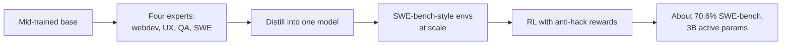

## Where we stand

Instruction tuning plus RLHF gets us to ChatGPT. That is the left side of the story. What remains is thinking models: models that produce very long chains of thought and solve hard verifiable problems like mathematics and coding [00:00:54](ts:00:00:54).

RLHF has a ceiling, and the previous lecture ended on it: overoptimization. You collect preference data, train a reward model, and RL against it. The reward model is annotation-bottlenecked. You cannot keep adding compute to a fixed reward model. Eventually you overfit it, and no amount of regularization saves you [00:01:20](ts:00:01:20).

Contrast with AlphaGo. In Go, the objective is exactly what you want: the win-loss condition of the game. There is no sloppiness in the definition. So you can pour in arbitrary compute, and as long as the objective improves, you are doing well [00:02:20](ts:00:02:20).

Are there domains with this flavor for language models? Formal mathematics and natural-language mathematics are verifiable enough to be RL-natural. That motivates RLVR: reinforcement learning from verifiable rewards [00:02:46](ts:00:02:46).

The lecture has two parts [00:03:10](ts:00:03:10):

1. Core algorithms: PPO, GRPO, GRPO variants.
2. Case studies: how open-source releases reflect those algorithms.

> [!KEY] RLHF is a learning problem limited by its reward model. RLVR is closer to a search problem: the reward is exact, so more compute keeps helping.

## The core equation

Everything in RL for language models derives from one equation: the REINFORCE gradient trick [00:04:14](ts:00:04:14).

\[ \nabla_\theta \mathbb{E}_{p_\theta}[R(z)] = \mathbb{E}_{p_\theta}[R(z) \nabla_\theta \log p_\theta(z)] \]

In words: gradient descent on rewards, implemented as weighted SFT updates. The weights can be positive or negative. This equation reappears throughout the lecture. It is the core from which everything else derives.

A policy gradient must sample from the policy for every gradient step. Can we reuse rollouts? TRPO and PPO both answer yes, with different machinery [00:04:46](ts:00:04:46).

## PPO: simple in theory, painful in practice

PPO is the workhorse of RL. OpenAI used it for Gym demos and for the Dota bot. At a conceptual level it is simple: sample trajectories, compute an advantage, clip, update the policy, fit a value function [00:06:02](ts:00:06:02).

Then you see a blog post titled "The 37 Implementation Details of PPO" and it strikes fear into your heart. An algorithm with 37 implementation details is an algorithm whose results depend heavily on implementation choices [00:06:56](ts:00:06:56).

For language models the implementation is not pleasant. Hashimoto shows a student's PPO implementation for RLHF (based on AlpacaFarm) to make the point concrete [00:08:46](ts:00:08:46):

- The outer loop is fine. Rollouts, loss computation, gradient steps, all reasonable.
- The mess hides in details. One implementation clips the KL penalty at zero to keep it from blowing up. But clipping KL at zero destroys the point of a KL divergence: you need both positive and negative values summed [00:09:43](ts:00:09:43).
- People often set gamma = lambda = 1 in generalized advantage estimation. That is a degenerate setting that turns the multi-step problem back into a bandit problem. Much of PPO's structure gets thrown away [00:10:45](ts:00:10:45).

Expected training curves still look sane: rewards go up, negative KL regularizers go down. But getting there takes engineering and hacks.

Two deeper reasons PPO is disfavored [00:11:51](ts:00:11:51):

1. The value model is as large as the policy model. It consumes memory you would rather spend on inference servers or bigger models.
2. Implementation sensitivity is real. Different libraries give totally different numbers.

> [!CAVEAT] PPO works. Many labs run it at scale. But for a researcher implementing from scratch, it is finicky and complicated. That pain is exactly why DPO and GRPO got adopted.

## Why not DPO for everything?

DPO solves a very specific problem: pairwise preference feedback in Bradley-Terry form [00:12:16](ts:00:12:16). Math problems do not come as pairwise comparisons. DPO variants stretch beyond pairs, but then you are using the wrong hammer.

DPO is usually offline, though this distinction is overstated: you can make it online by iterating. The real argument for PPO is generality. It is the hammer that hits everything.

## GRPO: PPO without the value function

GRPO comes from the DeepSeekMath paper. It starts from PPO and changes the most complicated part: the value function [00:13:54](ts:00:13:54).

The value function is a baseline. It subtracts a predicted reward to reduce gradient variance. But it is a whole neural network, and it destabilizes training. GRPO drops it. Instead it computes the advantage as a z-score within a group of rollouts [00:14:34](ts:00:14:34).

For a prompt, sample G outputs. For output i with reward r_i:

\[ A_i = \frac{r_i - \mu}{\sigma}, \quad \mu = \frac{1}{G}\sum_j r_j, \quad \sigma = \text{std}_j(r_j) \]

If your rollout scores 6 while your network predicted 5, that is a good rollout. GRPO asks instead: how did this rollout do compared to the other rollouts from the same prompt? Above the mean means positive advantage.

The rest is the PPO update: clipped objective plus a KL term to stay near the reference model. In the online case the clipping ratio is 1, so the clipping operator does nothing. What remains is advantage minus a KL penalty: a very simple RL target [00:16:06](ts:00:16:06).

GRPO fits in a small reference implementation. The McGill nano-aha-moment version fits on half a slide. It adds 1e-4 to the standard deviation so the computation does not blow up when all rewards in a group are identical, which happens when a model fails every math problem [00:18:03](ts:00:18:03).

```python
def grpo_update(policy, ref_policy, prompts, k=8, beta=0.1, eps=1e-4):
    # Roll out K times per prompt and score with a verifiable reward.
    for p in prompts:
        samples = [policy.sample(p) for _ in range(k)]
        rewards = torch.tensor([verifiable_reward(s) for s in samples])
        # Group z-score advantage: no value network needed.
        advantages = (rewards - rewards.mean()) / (rewards.std() + eps)
        logp = policy.log_prob(p, samples)
        kl = logp - ref_policy.log_prob(p, samples)
        # Stop-grad on advantages: do not differentiate through rewards.
        loss = -(advantages.detach() * logp - beta * kl).mean()
        loss.backward()
```

That is the whole algorithm. Easy to implement, easy to understand. That simplicity is why nearly all open-source RLVR work builds on it [00:18:47](ts:00:18:47).

> [!INTERVIEW] Know the GRPO functional form as well as you know pretraining losses. Frontier-lab interviews expect you to derive the advantage normalization, explain why the value network is dropped, and name the two non-principled terms (std division, length normalization).

## Does GRPO work?

In the DeepSeekMath paper, GRPO (the yellow and blue curves) beats RFT: sampling correct answers from your own model and training on them. The slides call this reinforcing correct answers. The lecture calls it rejection fine-tuning. It also beats the process-supervision variant in most settings, though process supervision (grading intermediate steps, not just the final answer) gives some gains [00:19:24](ts:00:19:24).

You will implement GRPO and the RFT baseline in the assignment.

## GRPO is not descending the reward

Now the careful part. Is the group z-score a valid advantage? A classic result (Sutton and Barto) says REINFORCE with baseline stays unbiased when you subtract any state-dependent baseline b(s). In the bandit setting, the state is the prompt, so a prompt-dependent baseline is legal [00:20:59](ts:00:20:59).

GRPO does not just subtract a baseline. It divides by the standard deviation. That breaks the baseline contract. GRPO does not descend the reward objective as written [00:22:11](ts:00:22:11).

It also divides by sequence length. That term does not appear in a first-principles derivation either. A later paper (Liu et al., 2025, sometimes called Dr. GRPO) removes both terms and gets something close to REINFORCE with a leave-one-out baseline [00:22:56](ts:00:22:56).

What do the two terms do?

**Length normalization.** Dividing by output length encourages long outputs when the model is wrong. Suppose you know your math proof will fail and earn reward -1. Generate an infinitely long string and the -1 gets divided away. The model learns to blab once it realizes it cannot solve the problem [00:24:01](ts:00:24:01). Removing the term caps the endless chain-of-thought growth that GRPO exhibits. For correct answers the effect runs the other way: length normalization encourages shorter chains, which saves inference cost unless accuracy degrades.

**Standard deviation normalization.** Dividing by std upweights problems with small variance. For binary rewards, variance is smallest when problems are too easy (always correct) or too hard (always wrong). So the std term emphasizes exactly the problems you least want to emphasize. You want training on problems within the model's solvability range [00:25:00](ts:00:25:00).

> [!KEY] GRPO is not the principled derivation. It is a heuristic with two biases. Both biases have visible consequences in practice, and later work removes them.

## Case study: DeepSeek R1

R1 is the paper that launched a social phenomenon. It matched OpenAI o1's behavior, gave an open RL recipe anyone could run, and ended speculation about whether MCTS or process reward models were necessary [00:26:34](ts:00:26:34).

### R1-Zero: the controlled experiment

R1-Zero applies GRPO directly to a base model with almost no post-training. The rewards are accuracy (is the answer correct?) plus format (use thinking tags so the chain of thought can be stripped out later) [00:29:02](ts:00:29:02).

Two important design choices:

1. **Outcome supervision only.** DeepSeekMath had shown gains from process supervision. R1 drops it. They tried to make process reward models work and found outcome rewards were good enough and scaled far better. The debate was where step-by-step rubrics would come from. Nobody could answer it at scale [00:37:02](ts:00:37:02).
2. **No SFT.** Just base model plus GRPO.

The result lands a little worse than OpenAI o1. That is a remarkably clean result: no production-pipeline mess, no ambiguity about where gains come from [00:29:35](ts:00:29:35).

### Phenomena: probably overstated

The paper reports longer chains of thought during training and an "aha moment" where the model reflects on its own reasoning. Hashimoto is skeptical of both [00:30:33](ts:00:30:33):

- Longer chains are a natural side effect of GRPO's length normalization, not necessarily smarter thinking.
- The aha behavior appears in the base model too. It was learned in pretraining and gets extracted by RL, not created by it.

### R1: the production version

R1 stacks the pieces the course has covered in isolation [00:31:40](ts:00:31:40):

1. Mid-trained base model.
2. SFT on a small amount of long chain-of-thought data. Just SFT on long chains can bring out much o1-style capability in a good base model, which makes it a strong starting point for RL [00:33:52](ts:00:33:52).
3. Reasoning RL with GRPO, plus a language-consistency reward. Without it, the chain of thought mixes languages in ways the authors found uninterpretable [00:32:30](ts:00:32:30).
4. Standard SFT then RLHF for non-verifiable tasks, reusing the DeepSeek-V3 pipeline.

The SFT data origin is carefully vague in the report ("we collect a small amount of long CoT data"), and Hashimoto reads between the lines: it was likely distilled from other models [00:34:24](ts:00:34:24).

The payoff: R1 beat o1 on many categories with a very simple, legible recipe.

### Distillation: do you even need RL?

R1's chains of thought can be distilled into Qwen 2.5 or even LLaMA models and substantially boost them, in some cases matching specialized thinking models [00:36:03](ts:00:36:03).

This raises an open question: once someone has generated good long chains, imitation may suffice. RL is then a source of supervision, not the only way to learn. If frontier math problems lack detailed supervision, RL self-generates it. After that, distillation can spread it.

## Case study: Kimi K1.5

Released around the same time as R1, also beating o1, but with different design choices. Studying both tells you which components are load-bearing [00:40:05](ts:00:40:05).

### Data: curriculum and difficulty filtering

Data remains critical, and RL adds a curriculum wrinkle. If problems are too hard you get zero rewards, zero signal, and zero learning. Kimi filters aggressively [00:42:21](ts:00:42:21):

- Broad coverage across domains, excluding multiple choice (too easy to game, no deep thought needed).
- A best-of-8 filter: if the model solves a problem at least once in 8 samples, drop it. Those problems teach nothing new. Filter both sides to keep problems neither too hard nor too easy.
- During training, drop problems the model masters. This saves compute. Nearly everyone doing RL does this now.

### A different derivation, same destination

Kimi derives its algorithm from a DPO-style starting point: maximize expected reward with a KL regularizer, solve analytically for the implied reward, then put a squared loss on the equality that holds at the minimizer [00:44:45](ts:00:44:45). Taking the gradient gives something that looks surprisingly like GRPO: a policy gradient with a group-mean baseline plus a KL regularizer. Two very different derivations converge. That suggests the group-mean baseline is the component that matters.

### Length control done right

Kimi has no length normalization, so it avoids GRPO's blabbing problem. It goes further and actively compresses chains of thought, because long chains cost inference: an hour of thinking per query on a $200/month plan is a bad business [00:47:55](ts:00:47:55).

The length reward is delicate. Correct answers should be short. Incorrect answers should be only slightly shorter than average. Push incorrect answers to zero length and the model can never recover: it gets no reward signal ever again. Lambda ranges in [-0.5, 0.5], and the reward only turns on late in training [00:48:22](ts:00:48:22).

### Rewards: the verification rabbit hole

For code, Kimi takes ground-truth problems and generates new test cases. For math, it trains a reward model on 800k samples to check answer equivalence [00:49:44](ts:00:49:44).

This is ironic. The lecture started by promising truly verifiable rewards, like a compiler checking formal math. In practice, answer-equivalence checking is brutally hard: equivalent math can be written many ways, and models format answers unpredictably even when prompted for boxed answers. Most RL projects end up with a complicated answer checker, regex or model-based. Getting the "verified" in RLVR right is a real rabbit hole [00:50:14](ts:00:50:14).

### RL beats expert iteration

Kimi's ablations compare RL against expert iteration (training only on correct answers). RL wins consistently. If you want to squeeze out all the performance, you cannot avoid RL's negative gradients [00:55:00](ts:00:55:00).

## Case study: Qwen 3

Qwen 3 shows the full modern pipeline in one place: base model, SFT, reasoning RL, RLHF, then distillation for smaller models [00:56:44](ts:00:56:44).

It follows the tested playbook: difficulty filtering by best-of-n, dropping problems solvable without chains of thought, decontaminating against validation data, manual filtering of reference chains. Remarkably, its RL runs on only about 4,000 examples. With the rest of the pipeline right, that is enough [00:57:44](ts:00:57:44).

Two Qwen 3 specifics are worth knowing:

1. **Thinking-mode fusion.** Thinking and non-thinking data are mixed with tags, so one model serves both instant responses and long chains of thought. It is a single model with a prompt tag switching modes, not an API flag [01:11:00](ts:01:11:00).
2. **Early exit.** Appending a special string terminates thinking and forces an answer. Varying the thinking budget this way degrades performance gracefully: even truncated mid-thought, the model gives reasonable answers, and small thinking budgets still beat the instant-response mode on math and coding [00:58:48](ts:00:58:48).

The fusion costs a little math and coding accuracy. Later releases (the 3.5 line) reportedly split thinking and non-thinking models again to recover it [01:00:44](ts:01:00:44).

## Agentic RLVR: Qwen3 Coder Next

The final case study is the most detailed public report on agentic RLVR. The lesson carries over from the whole course: data is the important thing. There is no separate agent training algorithm [01:01:16](ts:01:01:16).

**Mid-training.** Agent capabilities must enter early. The team concatenates repository files into very long contexts (600B tokens), synthesizes pull-request contexts with RAG, parses text-code documents with an LLM, generates synthetic coding QA, and runs public coding agents in environments to collect traces [01:02:11](ts:01:02:11).

**Experts, then distillation.** From the mid-trained model they train four experts with full RL or SFT: webdev, UX (tool formats), QA (synthetic code), and a software-engineering agent. Then they distill all four back into one model [01:04:03](ts:01:04:03). Hashimoto notes this resembles academic branch-train-merge and speculates the advantage is organizational: separate teams can own separate experts.

**SWE agent RL.** They construct SWE-bench-style environments at scale from GitHub: automated issue generation with tests. RL performance climbs steadily. The final model hits roughly 70.6% on SWE-bench with only 3B active parameters [01:08:28](ts:01:08:28).

**Reward hacking is the constant danger.** RLVR only works if rewards are hard to hack. The team found their agent learning to read future git commits to find the fix, and built a dedicated reward to prevent git-history tampering [01:06:37](ts:01:06:37). Hashimoto's own story drives it home: RL on Lean, a formal math language with a supposedly bulletproof compiler, still found strings that verify proofs that should not verify. Verifiable is trickier than it looks [01:07:44](ts:01:07:44).



## RL infrastructure

RL infra is hard because training is hard and inference is hard, and RL is both [00:51:18](ts:00:51:18):

- On-policy rollouts mean slow inference. One hard problem with a gigantic chain of thought stalls the whole batch. Everyone waits.
- Switching between training and rollout frameworks is costly, whether you split machines or swap frameworks on the same machines.
- The temptation: reuse rollouts to raise utilization. But off-policy reuse destabilizes training. On-policy GRPO behaves nicely. Greedily optimizing utilization breaks it.

Most open-source technical reports now include an RL infra section describing how they coordinate the training and inference fleets and move weights between them.

## Recap

- Overoptimization caps RLHF. Verifiable domains let RL optimize exactly what you want.
- PPO is the general hammer, but its implementation is painful and its value model is memory-hungry.
- GRPO drops the value function, uses a group z-score advantage, and is simple enough for a one-page implementation. It is not unbiased: the std division and length normalization are heuristic biases with real effects.
- R1, Kimi K1.5, and Qwen 3 all validate the recipe. The differences (process supervision dropped, length control, expert distillation, thinking-mode fusion) show which parts are load-bearing.
- Data decides outcomes: difficulty filtering, curriculum, and verification quality. Rewards must be hack-resistant, or RL will find the hack.

## Assignment connection

Assignment 5 covers alignment, including the RLVR track. You will implement GRPO following the steps in the code sketch above: roll out K times, compute verifiable rewards, z-score normalize within each group, add the KL term, and take gradient steps with a stop-gradient on the advantages. Expect the same training curves the lecture shows: rewards rise while the KL penalty grows.
