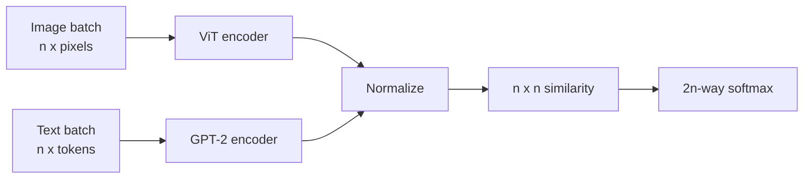

## The goal: an omni model

So far the course has covered language models: text in, text out. But the world is multimodal: text, images, audio, video. The north star is an **omni model**: any combination of modalities in, any combination out [00:01:00](ts:00:01:00).

Transformers work well across modalities, so the practical question is how to use them. Transformers speak tokens. Expand the notion of a token beyond discrete text tokens to continuous tokens: embeddings that represent some semantic unit of information. A subword is meaningful. A single pixel is not. So everything must be converted into discrete or continuous tokens [00:02:18](ts:00:02:18).

We did this for text in Lecture 1 with BPE. For non-text modalities, the equivalent of the BPE tokenizer is harder to find [00:03:15](ts:00:03:15).

Two questions, and this lecture mostly answers the first [00:04:01](ts:00:04:01):

1. How do we input non-text data, like images?
2. How do we output non-text data, like audio?

## CLIP: contrastive language-image pretraining

Rewind to 2021. Language models had entered the foundation-model era. Vision was still trained on annotated datasets like ImageNet with ResNets. The OpenAI researchers asked: can we do for images what web text did for language, using the huge supply of (image, caption) pairs? [00:04:46](ts:00:04:46)

The idea is simple [00:05:54](ts:00:05:54):

1. Take a batch of (image, text) pairs, say 32,768.
2. Encode each image into a vector i_k and each text into a vector t_k.
3. Make the dot product of aligned pairs large: i_1 dot t_1 should beat i_1 dot t_j for all j not equal to 1.
4. Do the same in the other direction: t_1 dot i_1 should beat t_1 dot i_j.

That is 2n softmax classification problems over an n-by-n similarity matrix.

```python
def clip_loss(image_embeds, text_embeds, temperature):
    # (n, d) inputs, L2-normalized
    logits = (image_embeds @ text_embeds.T) / temperature  # (n, n)
    labels = torch.arange(len(logits))
    loss_img = F.cross_entropy(logits, labels)    # image -> text
    loss_txt = F.cross_entropy(logits.T, labels)  # text -> image
    return (loss_img + loss_txt) / 2
```

### Data

OpenAI mined roughly 500K queries, about 20K (image, text) pairs per query, for 400M pairs total. The dataset was never released. OpenCLIP replicated the work on LAION-5B, which itself used CLIP for data filtering: a bootstrapping loop [00:08:47](ts:00:08:47).

### Preprocessing

Images come at arbitrary resolutions. Neural networks want fixed sizes. The pipeline resizes with bicubic interpolation so the shorter side is 336 pixels, then center-crops to 336 by 336 [00:10:00](ts:00:10:00). This is expediency, not principle. Later models do better.

### The vision encoder

The team tried ResNets and vision transformers (ViT). ViTs won. A ViT splits the image into patches, treats each patch as a token, adds positional embeddings, and runs a standard transformer over them [00:12:36](ts:00:12:36).

CLIP's best model is ViT-L/14 at 336px: large ViT, 14-by-14 patches, RGB channels, trained at 336-by-336 resolution [00:14:42](ts:00:14:42).

Instead of averaging patch vectors, CLIP uses attention pooling: take the global average of activations as the query, attend over all positions, and return the result. This beat plain averaging [00:14:07](ts:00:14:07).

### The text encoder

A GPT-2-style transformer. Encode [BOS] ... [EOS] and take the EOS activation at the top layer as the sequence representation [00:16:24](ts:00:16:24).

> [!PROF] Why pair images with text instead of using image-only contrastive learning like SimCLR? Augmentation teaches low-level invariances, but no augmentation turns one dog into another dog. Text supplies high-level semantics that augmentation cannot [00:12:00](ts:00:12:00).

### Headline result

On ImageNet, zero-shot CLIP outperformed a ResNet-50 trained on 1.2M labeled ImageNet images. Years of Mechanical Turk annotation, beaten by web data plus contrastive learning [00:17:18](ts:00:17:18).

Zero-shot prediction is a dot product: encode the image, encode each candidate label as text, pick the highest score.

An ablation tried predicting text from images directly (as a bag of words or a language model) instead of contrastive ranking. Stronger predictors did worse, or at least cost more for the same accuracy. Modeling exact caption tokens is not what builds good image representations [00:20:00](ts:00:20:00).

### What CLIP gets you, and its limits

CLIP image encodings capture semantics, because text describes semantics. But every design decision was tuned for classification: not very fine-grained. Still, it became the standard starting point for everything that follows [00:21:24](ts:00:21:24).

The technical downside: CLIP needs huge batches, around 32K. The softmax runs over the full batch, so the loss is not decomposable the way language-model batches are. That motivates SigLIP [00:22:01](ts:00:22:01).



## SigLIP: sigmoid loss

Google's SigLIP asks a simpler question than CLIP. For each (image, text) pair: aligned or not? Binary classification instead of multiclass [00:22:37](ts:00:22:37).

Diagonals are positive, off-diagonals negative:

```python
def siglip_loss(image_embeds, text_embeds, temperature, bias):
    logits = (image_embeds @ text_embeds.T) * temperature + bias
    labels = 2 * torch.eye(len(logits)) - 1  # +1 diagonal, -1 elsewhere
    return -torch.log_sigmoid(labels * logits).sum() / len(logits)
```

Data: the WebLI dataset, on the order of a billion (image, text) pairs, multilingual (100 languages), with OCR-extracted text from images, keeping the top 10 percent by quality [00:24:54](ts:00:24:54).

Efficiency is the headline. CLIP trained 10 days on 256 TPUv3. SigLIP trained 5 days on 32 TPUv4, which are slower per chip than v3, so the real speedup is larger. The trick: each device computes local losses, then text embeddings rotate between devices to cover the off-diagonal blocks [00:25:36](ts:00:25:36).

The loss decouples from batch size. Below 16K, SigLIP beats CLIP because CLIP's loss degrades when the batch shrinks. 32K is roughly the critical batch size. Going larger does not help [00:27:43](ts:00:27:43).

## LLaVA: stitching CLIP into an LLM

LLaVA (2023) showed open models could do visual reasoning like GPT-4V. The template is the standard VLM: vision encoder plus projector plus language model [00:28:37](ts:00:28:37).

- **Vision encoder:** CLIP ViT-L/14.
- **Text decoder:** Vicuna, the first LLaMA fine-tuned on ShareGPT conversations.
- **Projector:** a single matrix W mapping image vectors into the text embedding space. Flamingo and Q-former are more complex alternatives.

### Data

MS COCO has images with bounding boxes and Mechanical Turk captions. LLaVA prompts GPT-4 with captions or detected objects and asks it to generate questions, conversations, and detailed descriptions. Pair the generations with the original images. Result: 158K training examples [00:30:41](ts:00:30:41).

### Training: two stages

1. **Alignment.** Freeze the vision encoder and the language model. Train only W, so image vectors start looking like natural language token embeddings.
2. **Fine-tuning.** Keep the vision encoder frozen. Train W and the language model on the 158K examples [00:33:24](ts:00:33:24).

The paper's demo: an image of someone ironing on the back of a minivan. Asked what is unusual, the model answers that you do not usually iron on a minivan [00:34:44](ts:00:34:44).

## LLaVA-OneVision: multiple images and video

LLaVA-OneVision (2024) keeps the recipe and upgrades the parts: SigLIP as the vision encoder, Qwen2-72B as the text decoder, and a two-layer MLP projector [00:36:26](ts:00:36:26).

### AnyRes: handling resolution

OCR needs fine detail, and CLIP's 336-by-336 resize-crop destroys it. AnyRes (from LLaVA 1.5) tiles the image at the encoder's native resolution, encodes each tile, and concatenates the vectors. If the image is enormous, interpolate down [00:37:40](ts:00:37:40).

### Token budgets per modality

Videos would drown everything else, so each modality gets a budget [00:40:08](ts:00:40:08):

| Input | Resolution policy |
|---|---|
| Single image | Full image downsampled plus up to 9 high-res crops |
| Multiple images | Base resolution per image |
| Video | Lower resolution per frame, up to 32 frames |

The idea is adaptive: language already handles variable lengths, and images can too.

### Training: three stages

1. Train only the projector (alignment).
2. Train the full model on high-quality knowledge data.
3. Train on downstream-style instruction data [00:42:40](ts:00:42:40).

The data philosophy is quality and targeting: visual question answering, chart QA, table QA. Much of it is GPT-4-distilled, which Liang notes is not ideal but is what you do without an annotation budget.

### Transfer across modalities

The interesting finding: transfer happens across modalities without paired training data [00:43:33](ts:00:43:33).

- Diagram and chart data exists only for single images, yet the model answers questions about a table image plus a chart image.
- OCR data is single-image only. Relational reasoning is multi-image only. Combined, the model drives GUI agents from screenshots.
- Visual prompting (a circle drawn on a single image) generalizes to videos: describe the highlighted player across frames.

LLaVA's open release of weights and data makes it one of the few series you can fully replicate.

## Qwen-VL

Qwen-VL (2023) follows the same template with its own choices [00:46:01](ts:00:46:01):

- Vision encoder: OpenCLIP ViT-bigG, 14-by-14 patches.
- Adapter: one cross-attention layer with 2D positional embeddings, compressing to a fixed 256 tokens.
- Special tokens: ``, `<box>` for bounding boxes, `<ref>` for referring expressions.

Training has three stages with different freezes:
1. Large-scale low-quality data. Freeze the LM. Train vision encoder and adapter on 1.4B examples.
2. Higher-quality task-specific data. Train everything.
3. Instruction tuning. Freeze the vision encoder. Train adapter and LM.

Qwen-VL can output bounding boxes and do OCR, including Chinese. It generates text descriptions of boxes, not images.

## Qwen2-VL: dynamic resolution

The big idea in Qwen2-VL is dynamic resolution [00:49:20](ts:00:49:20):

- Each 224-by-224 region is encoded with a ViT.
- Every 2-by-2 block of patch features is compressed into one, so each region yields 66 tokens.
- A large image can produce about 11K tokens. A tiny equation image produces 8.
- Video: 2 frames per second, capped at 16K tokens.

Positional embeddings get the multimodal treatment. M-RoPE extends RoPE to three dimensions: time, height, width. Each patch position becomes a (t, h, w) triple, RoPE is computed per axis, and the results are concatenated [00:51:01](ts:00:51:01).

Training mirrors Qwen-VL: train the visual encoder, then everything, then the LM on instruction data. The vision encoder starts from OpenCLIP and is fine-tuned. The LM starts from Qwen2.

## Qwen3-VL: the current frontier

Qwen3-VL refines the template rather than replacing it. Qwen3 dense and MoE models (up to 235B-A22B) plus 256K context do much of the work [00:52:54](ts:00:52:54).

- **Vision encoder:** SigLIP2, architecturally identical to SigLIP for backward compatibility.
- **Interleaved M-RoPE.** Qwen2-VL allocated whole frequency blocks to time, then width, then height. That puts all temporal dimensions at low frequencies and all height dimensions at high frequencies. Qwen3-VL interleaves the axes so each axis sees both low and high frequencies [00:54:48](ts:00:54:48).
- **Explicit video timestamps.** Time used to be implicit in positional encodings. Now timestamp tokens like "2 seconds" are real tokens the model can reference directly [00:55:02](ts:00:55:02).
- **Square-root-normalized per-token loss.** Video examples are long and would dominate training. Normalizing each example by the square root of its length downweights the long ones [00:56:04](ts:00:56:04).
- **DeepStack adapter.** Instead of a projector that hands vectors to the LM, visual features from multiple vision-encoder layers are injected into multiple LM layers: a deeper fusion [00:56:48](ts:00:56:48).

Training is now a systems pipeline: four pretraining stages (adapter first, then 8K to 32K to 256K sequence lengths) and three post-training stages (SFT on long chains of thought, knowledge distillation, RL) [00:57:54](ts:00:57:54).

On benchmarks against Gemini, GPT-5, and Claude Opus 4.1, Qwen3-VL is competitive or best in the bolded rows. Liang's read: mostly scaling, data curation, and long-context handling, with minor but potentially important architectural improvements [00:59:01](ts:00:59:01).

> [!INTERVIEW] VLM interviews test systems thinking, not architecture trivia: why CLIP needs 32K batches, how AnyRes preserves OCR detail, why video examples get loss-normalized, and how token budgets trade resolution against context length.

## Chameleon: everything as discrete tokens

Chameleon (Meta, 2024) takes the opposite bet: map every modality into discrete tokens, then train one autoregressive model over all of them [01:07:19](ts:01:07:19).

So far, VLMs inject continuous image vectors into an LM and can only generate text. Chameleon makes images look like text, so the model can analyze and generate images uniformly. Prompt it with "I am bored, show me some birds" and it interleaves text and images. That is the omni-model vision with text and images living in the same space.

The key piece is the image tokenizer. A VQ-VAE (vector quantized variational autoencoder) maps an image to a continuous vector, rounds it to the nearest entry in a learned codebook, and trains a decoder to reconstruct the image from the code. Chameleon encodes 512-by-512 images into 1024 tokens from an 8192-entry codebook, then trains a fresh BPE tokenizer over the mixed text-image data [01:10:46](ts:01:10:46).

Training is plain language modeling in two stages: 80 percent bulk training (2.9T text tokens, 1.5T text-image tokens, 400B interleaved tokens), then 20 percent mixing in high-quality data [01:12:01](ts:01:12:01).

Three problems emerged:

1. **Instability.** Text tokens have low entropy. Image tokens have high entropy. Mixing them grows parameter norms and destabilizes loss. The fixes: QK normalization and z-loss regularization [01:12:10](ts:01:12:10).
2. **Discretization loses information.** Fine detail like small print does not survive an 8192-codebook. OCR suffers [01:13:34](ts:01:13:34).
3. **Multimodal training is finicky.** Balancing modalities by data weight is harder here than in the continuous-encoder models.

Diffusion models took over image generation, so the VQ-VAE route faded for generation use. But Chameleon remains the cleanest demonstration of the discrete-token philosophy.

## Where the field stands

Frontier models are expected to be multimodal, ideally natively. The public recipe that works today [01:14:43](ts:01:14:43):

- **Understanding:** continuous encoders, even five-year-old CLIP-style ideas, still capture image semantics well.
- **Backbone:** transformers, with tokens as the universal interface.
- **Generation:** diffusion models, not discrete token prediction.
- **Open problems:** encoding non-text modalities without losing detail, and balancing modalities. Video carries less information per token than text, so it must not dominate training.

Understanding and generation demand different things from an encoder. CLIP vectors are small and semantic because they were built for classification. OCR and generation need fine-grained detail. No single universal encoder exists yet.
