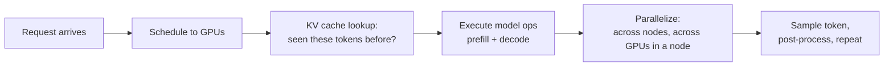
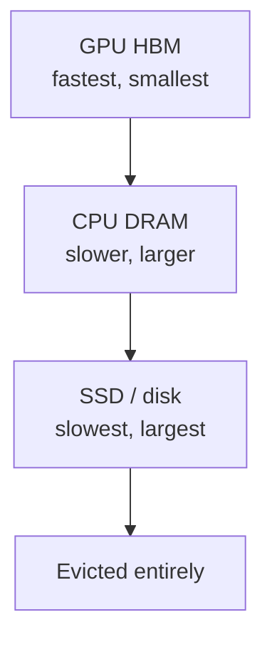
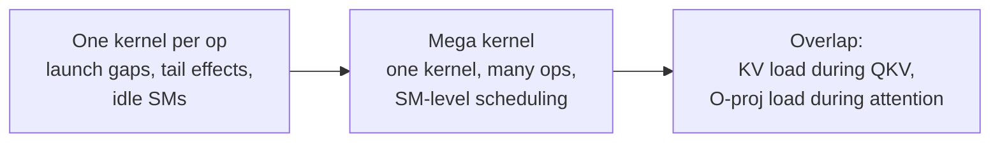

## The other side of the model

This class has covered training. Dan Fu covers the other side: what serving a model looks like once training is done [00:00:05](ts:00:00:05). He frames inference as the engine that turns electricity into tokens, and tokens into intelligence.

The thesis of the talk [00:05:52](ts:00:05:52):

> [!KEY] If you understand inference engines and the GPU kernels underneath them, you can drive full-stack innovation in machine learning algorithms. Routing, kernels, and architectures are all design choices that serving exposes.

Dan Fu represents two organizations: his lab at UCSD, and Together AI, an AI cloud for GPUs, inference, and fine-tuning [00:06:46](ts:00:06:46). He notes the slides are AI generated and to trust the concepts, not the fine print of the figures.

## Motivation: scale and the 1912 moment

The driving question of his research: what made recent capability jumps possible, and how do we push the next generation [00:00:58](ts:00:00:58). The abundant driver is scale.

| Year | Scale (his numbers) |
|---|---|
| 2018 | Largest models around 100M parameters |
| 2019 | GPT-2, judged too risky to release |
| 2026 | Open models at a trillion parameters and above, and the frontier at an estimated 5 to 10 trillion [uncertain: his estimate] |

He draws an analogy to the car replacing the horse [00:02:59](ts:00:02:59). In 1902 Manhattan had 130,000 working horses. An 1898 conference on the horse-manure problem concluded there was nothing to do but hold your nose. By 1912, cars had already outnumbered horses in Manhattan. For language models, he places that 1912 moment at last year: most of his team now writes the majority of their code with model assistance.

The scale is driven by GPUs. Hundreds of billions of dollars are flowing into GPU investment [00:03:54](ts:00:03:54). But GPUs alone do nothing. The inference engine, the kernels, the scheduling: those are the parts that convert raw compute into usable capability.

## The lifetime of a token

When you send a request, this is the path it travels [00:07:42](ts:00:07:42):

The scheduler decides placement first. You may run prefill and decode on disaggregated machines. Then the system checks the KV cache for reusable activations. Then it executes the model code, possibly split across machines or across GPUs in a node. Finally it loops: schedule, execute, sample.

## Workload shapes differ

Production traffic does not look like training traffic, and it does not look like one uniform distribution [00:09:31](ts:00:09:31). A coding workload (Cursor-style, whole codebase in context) means tens of thousands of input tokens and a short output. A book-pasted-into-chat workload means a huge input and a long back-and-forth. A plain chat question is short on both sides.

Today's usage is turn-based and agentic. You go back and forth with a coding agent. The agent itself iterates: it calls tools, searches the codebase, feeds results back into the model. Sessions vary: one user asks one question and leaves, another keeps a weeks-long conversation about workout planning.

Latency targets follow the application. An interactive chat wants the first token in under a second. A batch job cares about total time for the whole response. The serving system must meet these targets while packing as much traffic as possible onto the GPUs.

## Prefill and decode are different workloads

The two phases of generation have opposite hardware profiles [00:13:56](ts:00:13:56):

| Phase | What happens | Bound by | Resembles |
|---|---|---|---|
| Prefill | 10,000 new tokens in, compute all activations, one token out | Compute (FLOPs) | Training, minus the backward pass |
| Decode | Generate one token at a time, reusing cached activations | Memory bandwidth | Nothing in training |

During decode, the arithmetic per step is small, but you must load the entire model from memory for every single token. The GPU stops being a compute engine and becomes a glorified memory loader [00:34:16](ts:00:34:16).

After each step comes light post-processing: check for stop tokens, run safety checks, then repeat the schedule-execute-sample loop.

## Serving many requests at once: continuous batching

GPUs serve many requests simultaneously through continuous batching [00:16:29](ts:00:16:29). Time flows downward in his figure: a long request starts, a short one joins and finishes, a new one arrives. The requests share two scarce resources: compute and KV cache memory. When the KV cache fills, new requests queue.

Two mechanisms make this efficient.

**KV cache with prefix sharing.** Many users type the same system prompt. Many turns repeat the same conversation prefix. A tree data structure over token prefixes finds activations you have already computed, so you never recompute them [00:17:24](ts:00:17:24).

**Parallelism choices.** A trillion-parameter model does not fit on one GPU. You can split every tensor across four GPUs (tensor parallelism), or split mixture-of-experts experts across GPUs (expert parallelism). These choices set the bottleneck: how many GPUs you need, how many sessions you can serve [00:18:21](ts:00:18:21).

Because prefill is compute-bound and decode is memory-bandwidth-bound, production systems disaggregate them: prefill runs on one set of workers, decode on another [00:19:16](ts:00:19:16). Each phase then gets hardware suited to its profile. This split motivates new chips: Nvidia's purchase of Groq was driven by decode, where the Groq LPU fits better than a GPU, and OpenAI's Cerebras partnership targets the same decode-heavy profile [00:21:04](ts:00:21:04).

> [!CAVEAT] Something that works at small scale will break at large scale. At trillions of tokens per day you meet 0.001% events. Three real ones: a slightly wrong kernel produced NaNs, and the model fell into "hi hi hi hi" loops. A tool-call handling bug made completions spiral into tens of thousands of tokens repeating "make an internet search". An off-by-one error read uninitialized GPU memory, ran it through attention, and the model started answering in Chinese for no reason [00:22:05](ts:00:22:05).

## The KV cache memory hierarchy

You want the largest KV cache possible, because cache hits skip prefill work. The hierarchy [00:24:57](ts:00:24:57):

When GPU memory fills, KV entries move to CPU DRAM, then to SSD. Now you care about CPU memory bandwidth and SSD capacity. This is part of why GPU cluster operators obsess over CPU and DRAM performance, and why hyperscalers buy up DRAM and SSD supply.

Eviction is a classic operating systems problem. LRU is a decent heuristic. The optimal policy would predict the future: reopening a month-old conversation is a strong signal you will ask about it, so prefetch its cache back to the GPU [00:27:50](ts:00:27:50).

## A two-line routing optimization

Cache-aware prefill/decode disaggregation is a routing change with outsized payoff [00:31:34](ts:00:31:34). The observation: most traffic is warm (mid-conversation, high cache hit rate), but a fraction is fresh (a user pastes a whole book, low cache hit rate). Mixing a 10,000-token fresh prefill with a tiny warm request wastes the warm request's time.

The fix: route low-cache-hit-rate requests to one set of prefill GPUs and warm requests to another. Two lines of code in the routing layer. Up to 40% faster serving.

> [!PROF] Research here is early. These techniques will look obvious in ten years, but only because production traffic keeps revealing new patterns [00:33:20](ts:00:33:20).

## Mega kernels: fusing decode down to one kernel

Decode is memory-bandwidth bound, but conventional kernels leave the GPU idle much of the time. Kernels are written one operation at a time (norm kernel, matmul kernel, attention kernel), because kernels are hard to write [00:34:16](ts:00:34:16). The costs:

- **Launch overhead.** Every kernel launch and teardown leaves gaps.
- **Tail effects.** Batching a short prompt with a long prompt means SMs wait for the long one. This applies inside attention itself.
- **Inter-kernel gaps.** Gaps between successive kernels accumulate.

A mega kernel fuses many operations into one kernel, similar to FlashAttention's fusion but more aggressive [00:37:09](ts:00:37:09). Instead of treating the GPU as one operation at a time, you treat it as a distributed system: the H100 has 132 streaming multiprocessors, the B200 has 148. You schedule work across them with explicit dependency tracking.

The payoff is fine-grained overlap that separate kernels cannot express. During decode you can start loading the KV cache before QKV projections plus RoPE finish, because the load has no dependency on them [00:38:56](ts:00:38:56). You can start loading the O-projection weights before attention finishes.

Fusing just the attention inference kernel gives 30 to 70% speedups. Fusing a full Llama 1B layer into one kernel shows the same overlapping structure across the whole layer. The implementation uses ThunderKittens, a kernel-writing library positioned as lower-level and more fine-grained than Triton [00:39:53](ts:00:39:53). On the H100 the mega kernel reaches 72% of peak memory bandwidth, close to the physical speed limit for the operation [00:41:02](ts:00:41:02).

> [!CAVEAT] Mega kernels cost blood, sweat, and tears. A talented kernel engineer writes mega kernels for two or three models on one hardware generation per year, for batch sizes 1 to 16. Batch size 17 means starting over. Together is building compilers to automate the process [01:03:17](ts:01:03:17).

On multi-GPU setups, early work fuses NCCL communication calls into the mega kernel too. DeepSeek released a mixture-of-experts inference mega kernel with fused communication. In practice, expect partial mega kernels over hot regions rather than whole-model fusion [01:09:52](ts:01:09:52).

## PERS: looped transformers

The second research project asks whether scaling parameters and data is the only way to scale quality [00:41:59](ts:00:41:59). PERS (from his UCSD lab) takes a loop-transformer approach: run a block of the model in a loop, so the same activation passes through the same layers multiple times.

Why loop:

- **FLOPs dial.** Parameters stay constant while you increase compute. If more FLOPs means higher quality, looping buys quality without a parameter bill.
- **Expressivity.** Prior work suggests looped models can express things same-sized non-looped models cannot.
- **Quality per parameter.** The driving question is intelligence per parameter, not raw scale.

Promising signs existed: a paper from Tom Goldstein's group at Maryland showed strong results on ARC tasks, and a (later retracted, admitted as fabricated) rumor claimed a frontier model used looping.

### The instability problem

Naive looped models blow up. Change the learning rate slightly and 9 out of 10 runs fail to converge: NaNs, giant loss spikes [00:45:36](ts:00:45:36). Old fixes were hacks, like adding norms to every layer or pinning the learning rate to exactly 2e-4.

### A dynamical systems view

The key empirical observation: the residual barely changes from block to block. Each residual block nudges the vector a little [00:47:20](ts:00:47:20). So box up all the nonlinearity (attention, MLP, RoPE) into one term r, and the loop reduces to a linear dynamical system over the residual with two matrices:

- **B**: injects the initial vector into the loop.
- **A**: transforms the residual on each loop iteration.

Drop r and the system has a closed-form solution from basic calculus. The behavior is dominated by A raised to the loop count. If the spectral radius of A exceeds 1, activations explode: with A behaving like 2 over 16 loops, you get 2^16 amplification [00:50:13](ts:00:50:13). That is the loss spike. Prior loop transformers used A and B choices that are marginally stable or outright unstable.

PERS constrains both matrices [00:51:10](ts:00:51:10):

- **A** becomes a negative diagonal matrix. Powers of it decay to zero, so nothing blows up.
- **B** gets a simple linear norm. It is applied once, so it cannot compound.

The spectral radius drops below 1 and the system is stable. Training curves stay stable even at the 6e-4 learning rate that killed the baselines. The unconstrained baseline's activations blow up to 1e19. Merely normalizing is not enough either: the model pushes activations outward to separate concepts, the norm pushes back, and the fight produces loss spikes. PERS avoids the fight by construction.

### Results and scaling laws

PERS beats the previous loop transformer (recurrent depth models) and a strong NanoChat transformer baseline on perplexity and end-to-end quality [00:52:55](ts:00:52:55).

The scaling analysis varies data and recurrence at fixed parameters and fixed FLOPs [00:54:51](ts:00:54:51). The curves run down and to the right: as you increase data, you should also increase recurrence. Recurrence follows clean power laws, so you can predict quality from recurrence and token counts jointly. A fixed-FLOP comparison shows the looping model reaching lower validation loss than the fixed-depth model. The implication: today's models, with zero recurrence and huge data, sit at the far left of these curves, possibly leaving quality on the table.

### Q and A highlights

- **Looping pretrained models.** A blog post claimed looping two or three layers of a Qwen model improved math scores with no training at all. The team is investigating why, but it is not yet understood [01:00:37](ts:01:00:37).
- **Inference benefits of looping.** Fewer parameters means more room for KV cache and less cross-GPU communication. The dream: a recurrent block small enough to fit inside one fast mega kernel. Future LPUs carry very little on-chip memory, so tiny models that fit entirely on chip become interesting [01:01:33](ts:01:01:33).
- **Compute optimality.** Given a FLOP budget, bigger model plus more data always wins. Looping matters when model size is constrained by serving cost or by what fits on a laptop [01:06:14](ts:01:06:14).
- **Architecture follows the serving target.** Size the model to fit the deployment hardware with KV cache to spare. Quantization formats follow the chip: Nvidia's Neotron trains in NV FP4 (Nvidia-proprietary). On AMD you would use MX FP4. Recent Chinese models show choices suggesting Huawei-targeted design [01:04:22](ts:01:04:22).
- **Workload shapes architecture.** Agentic loops need a hot KV cache, which is why DeepSeek's MLA radically compresses it and why FP8/FP4 KV caches matter. One-shot batch processing does not need generation at all, which is why search-style systems still use BERT-like bidirectional encoders [01:08:03](ts:01:08:03).

> [!INTERVIEW] This lecture is a systems-thinking goldmine for interviews. Know why prefill is compute-bound and decode is memory-bandwidth-bound, why production systems disaggregate them, what continuous batching and KV cache prefix sharing buy, and the mega kernel idea (fuse ops, schedule across SMs, overlap loads with compute). For PERS: looping trades parameters for FLOPs, instability comes from the spectral radius of the loop matrix exceeding 1, and the fix is constraining the recurrence to be contractive.
