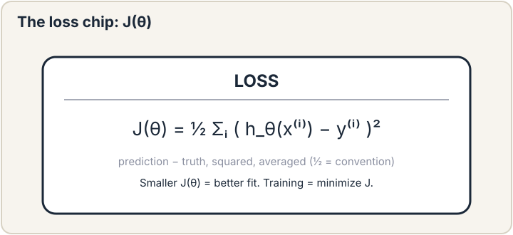
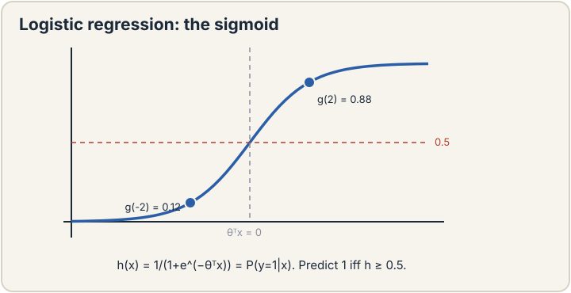
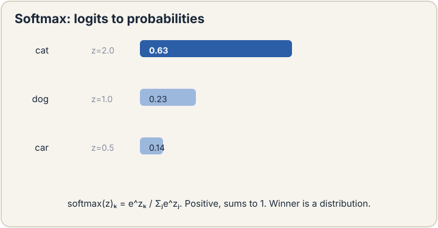
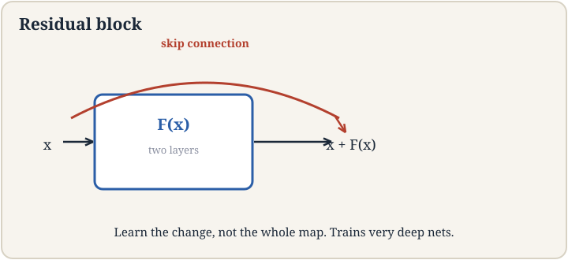
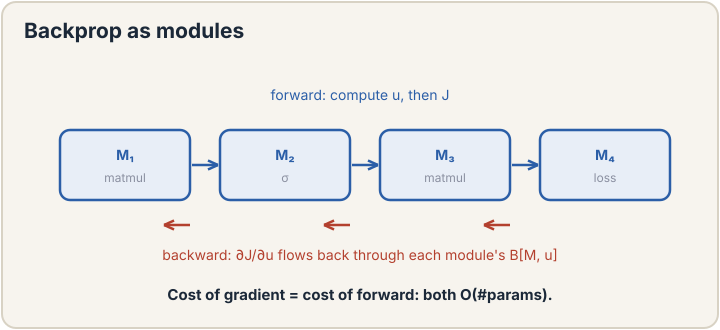
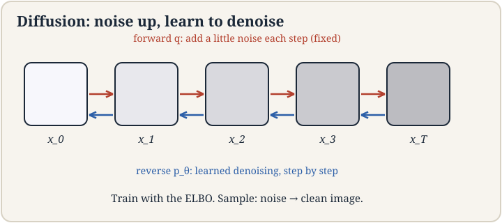
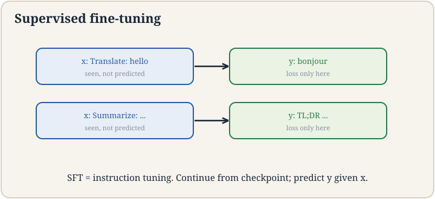
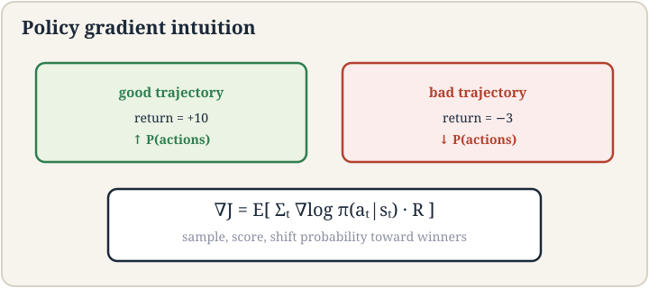
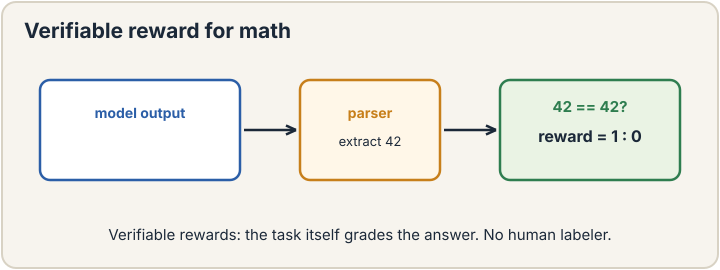

Machine learning rebuilt from zero: loss, probability, optimization,
neural nets, generative models, modern LLM machinery, and reinforcement
learning. Seventeen lectures, Spring 2026 (Ma and Ré). No background
assumed: every term is defined at first use.

**Start:** [Lecture 1](l01-introduction.html) → the three paradigms.
**Fast review:** [Cheatsheet](cheatsheet.html) · [Crash course](crash-course.html)

<strong><a href="l01-introduction.html">L1. Introduction</a></strong>

Mitchell's definition, supervised vs unsupervised vs RL, the course
arc. Machine learning in one sentence.

<strong><a href="l02-linear-regression.html">L2. Linear Regression</a></strong>

Hypothesis, the loss chip, gradient descent, SGD, normal equations.
The cross-course loss symbol debuts.

<strong><a href="l03-logistic-regression.html">L3. MLE, Logistic Regression</a></strong>

Maximum likelihood as bedrock. Sigmoid, Newton, IRLS. Every loss is a
probabilistic story.

<strong><a href="l04-glms-softmax.html">L4. GLMs, Softmax</a></strong>

Exponential family unifies regression and classification. Softmax,
cross-entropy, label smoothing.

<strong><a href="l05-gda-naive-bayes.html">L5. GDA, Naive Bayes</a></strong>

Generative vs discriminative. Gaussians, quadratic boundaries,
Bayes' rule flips, Laplace smoothing.

<strong><a href="l06-bias-variance.html">L6. Bias, Variance, Selection</a></strong>

Bias-variance, double descent, train/dev/test, Hyperband. Test sets
rot. Use them once.

<strong><a href="l07-neural-networks-1.html">L7. Neural Networks</a></strong>

Neurons, ReLU, MLPs, universal approximation, residuals. Bend every
layer or depth is pointless.

<strong><a href="l08-backpropagation.html">L8. Backpropagation</a></strong>

O(N) theorem, modules, rank-1 gradients, Hessian-vector products.
One walk, all gradients.

<strong><a href="l09-kmeans-gmm.html">L9. K-means, GMM</a></strong>

Clustering: hard assignments, k-means++, soft responsibilities,
EM for mixture weights.

<strong><a href="l10-em-pca.html">L10. EM, PCA</a></strong>

ELBO and the E/M steps. PCA: center, rescale, eigenfaces. Variance
kept is the headline.

<strong><a href="l11-diffusion-models.html">L11. Diffusion Models</a></strong>

Fixed noising forward, learned denoising back, ELBO training. A
thousand easy steps beat one jump.

<strong><a href="l12-foundation-models.html">L12. Foundation Models</a></strong>

Pre-train once, adapt everywhere. Embeddings, linear probing, LoRA.
The paradigm shift, named here.

<strong><a href="l13-contrastive-rag.html">L13. Contrastive, RAG</a></strong>

Self-supervision without labels. RAG: private knowledge, no
training. Behavior vs knowledge, split.

<strong><a href="l14-transformers.html">L14. Transformers</a></strong>

Autoregressive modeling, attention, causal masks, O(T^2 d). The
engine under everything modern.

<strong><a href="l15-efficient-icl-sft.html">L15. Efficiency, ICL, SFT</a></strong>

KV cache, MoE, zero/few-shot, instruction tuning. Prompt for
flexibility, train for reliability.

<strong><a href="l16-reinforcement-learning.html">L16. RL Basics</a></strong>

MDPs, values, Bellman, REINFORCE. Sequential decisions, policy
gradient, stochasticity is load-bearing.

<strong><a href="l17-rl-for-llms.html">L17. RL for LLMs</a></strong>

PPO, advantages, verifiable rewards, chain-of-thought. The course
ends at the frontier.

