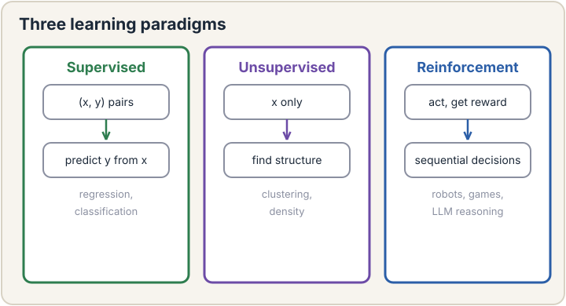
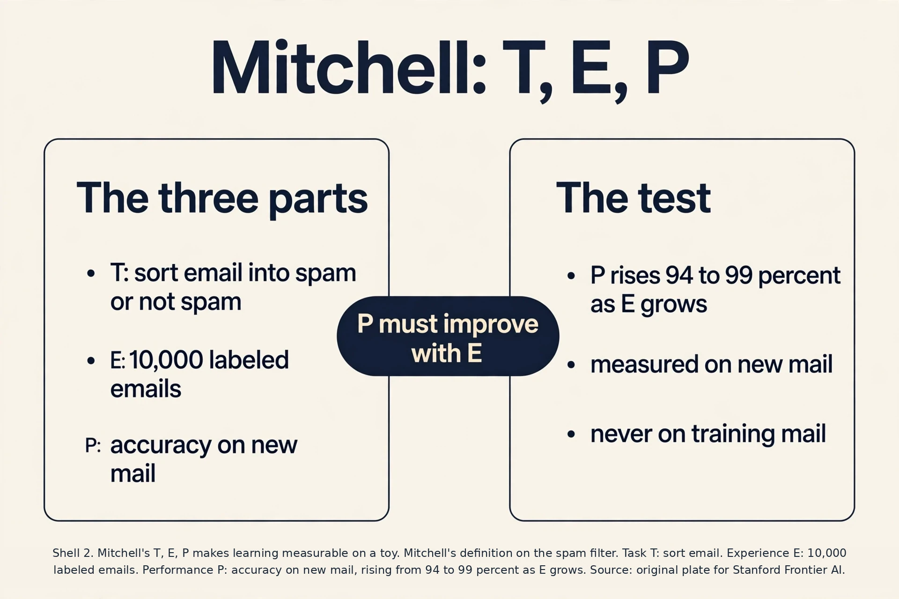
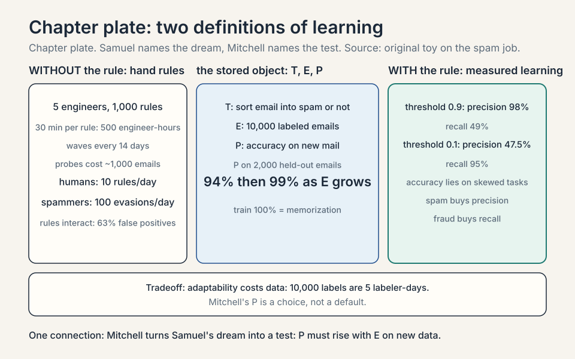
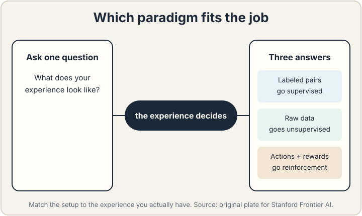
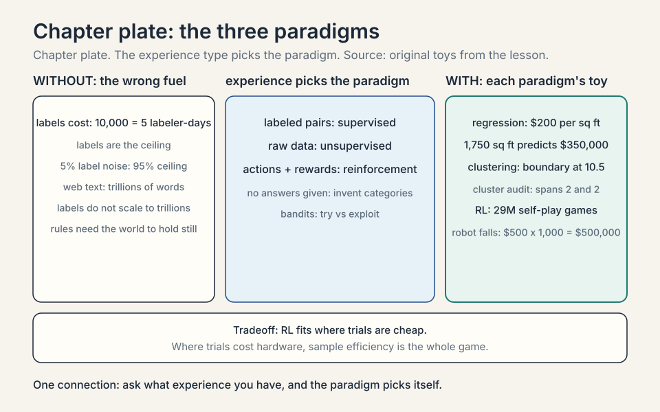
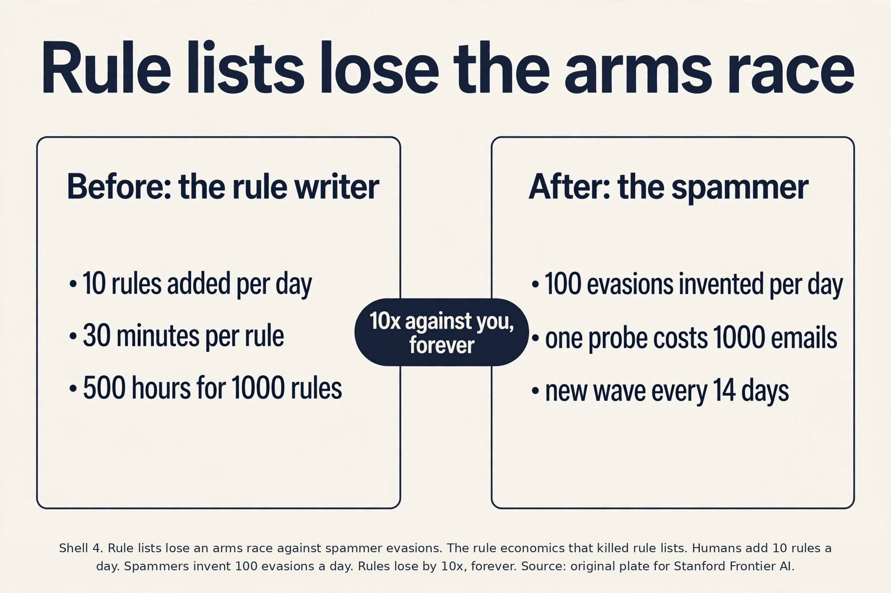
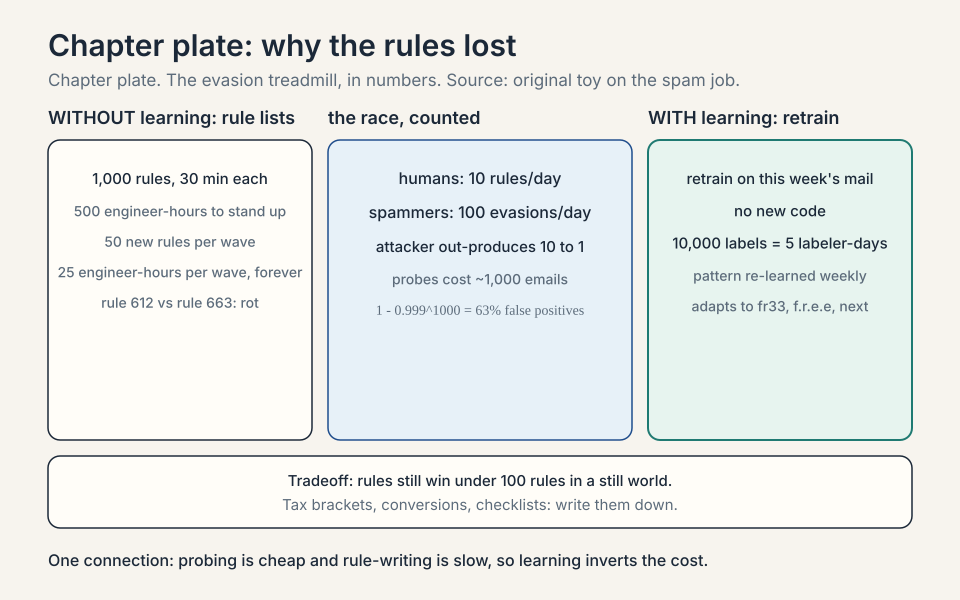
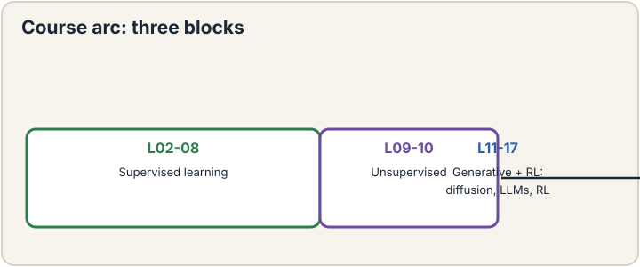
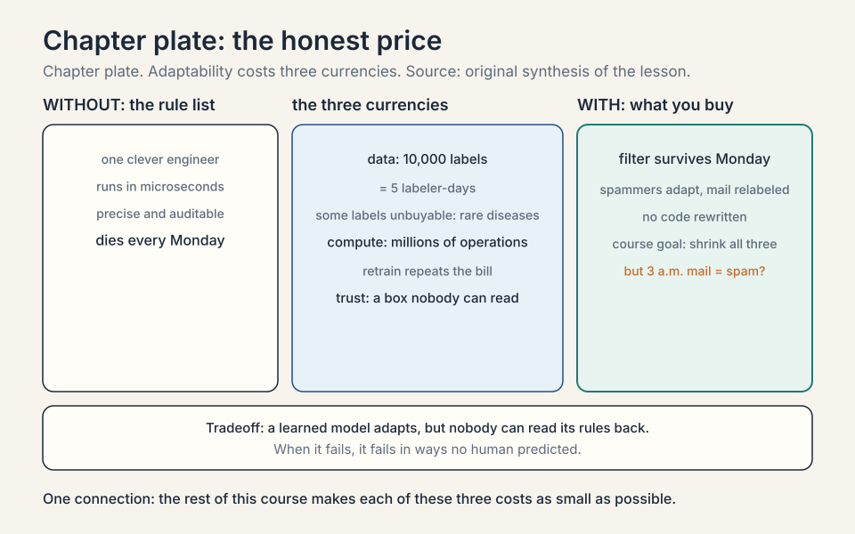

## The job: a filter that survives Monday

In 2004, a spam filter at a large email company had a bad Monday. The
weekend's filters worked fine. By Monday noon, inboxes were full of
junk. The spammers had changed one word: "free" became "fr33". Every
hand-written rule that matched the word "free" went blind at once.

This is the job machine learning was invented for. A **task** is work
you want a computer to do: sort spam from real mail, price a house,
transcribe speech. The old way to do the task is explicit
programming: a human writes the rules. "If the subject contains
'free' and the sender is unknown, mark as spam." It works until the
world changes, which it does every Monday.

The first attempt at spam filtering was exactly this: rule lists.
Build one by hand. Watch it fail. Count the cost. A team of five
engineers wrote about 1,000 rules. Each rule took roughly 30 minutes
to write, test, and deploy. That is 500 engineer-hours. The rules held
for about two weeks. Spammers probe the filter, learn which words it
checks, and invent new ones. "Free" becomes "fr33" becomes "f.r.e.e"
becomes "complimentary". Each wave forces a new round of rule
writing. The arithmetic is brutal: the humans add rules at 10 per
day. The spammers generate evasions at 100 per day. Hand-written
rules lose by an order of magnitude, forever.

Here is the key question. What if the machine writes the rules
itself, from examples? Nobody writes a rule about "fr33". Instead,
you show the machine 10,000 emails that humans already labeled spam
or not spam. The machine finds the patterns on its own. When
spammers switch to "f.r.e.e", you do not rewrite code. You feed the
machine this week's labeled emails and it adjusts. The examples do
the teaching. The human never enumerates the rules.

That sentence is the whole field. **Machine learning** is the study
of algorithms that improve at a task from experience instead of from
hand-written instructions. Two classic definitions make this precise,
and both still hold after decades.

### Subchapter: Samuel, 1959, the first definition

Arthur Samuel wrote the first definition in 1959, before the term
"software" was common. He said machine learning is "the field of
study that gives computers the ability to learn without being
explicitly programmed." The key phrase is "without being explicitly
programmed". Nobody programmed the "fr33" rule. The machine learned
it from data.

Samuel built the first famous learning machine: a checkers program
that learned to play by playing itself. The program did not contain
a rule for every board position. It contained a scoring function with
knobs, and the knobs turned as the program won and lost games. In
1962, three years after the paper, the program beat Connecticut
checkers champion Robert Nealey. The definition and the demo arrive
together: learning means the program's behavior changes because of
experience, not because a human edited the code.

The definition has one soft spot. "Explicitly programmed" draws a
line that is hard to see in modern systems. A neural network's
architecture is hand-designed. Its training loop is hand-written
code. What is "learned" is the numbers inside, the weights. Samuel's
definition survives because the behavior that matters, the spam
decision, comes from the learned numbers, not from a rule a human
typed.

### Subchapter: Mitchell, 1997, the testable definition

Tom Mitchell wrote the second definition in 1997, and it is sharper
because it names the three moving parts. "A computer program is said
to learn from experience E with respect to some class of tasks T and
performance measure P, if its performance at tasks T, as measured by
P, improves with experience E."

Unpack it with the spam filter. The task T is "sort email into spam
and not spam". The experience E is 10,000 labeled emails. The
performance measure P is accuracy: the fraction of emails sorted
correctly. Learning happened if accuracy on new mail rises as the
machine sees more labeled examples. Mitchell's definition turns a
vague hope into a testable claim. Measure P before and after E. If P
went up, the machine learned.

Notice how broad "experience" is. It covers human-labeled data, but
also web text, sensor readings, synthetic data a model generates for
itself, and the sequence of rewards and punishments in a game. The
lecture stresses this breadth because modern models drink from all of
these sources at once.

### Subchapter: the experience zoo

Five kinds of E, each with its flagship. Human labels: 10,000
spam tags, the classic supervised fuel. Web text: trillions of
words scraped from the internet, the fuel of base language models
(each next word is its own label). Sensor readings: robot joint
angles and camera frames, the fuel of control policies. Synthetic
data: a model generating its own training examples, the fuel of
self-play. Rewards: win/loss signals from games, the fuel of RL.

The trend the lecture points at: the field moved from the first
kind (expensive, human) toward the middle kinds (cheap, abundant).
Pre-training drinks web text because labels do not scale to
trillions. The interview question this answers: "where does the
data come from" has five answers, and the cheapest abundant one
wins at scale.

### Subchapter: beyond accuracy, precision and recall

Accuracy is one P among many, and on skewed tasks it lies. A fraud
filter on 1% fraud: predict "not fraud" always, score 99% accuracy,
catch zero fraud. Two better measures. **Precision**: of the emails
flagged spam, how many were spam? 90 flagged, 81 true spam:
precision 90%. **Recall**: of the true spam, how many got flagged?
100 true spam, 81 flagged: recall 81%.

Work the tradeoff. Threshold at 0.9 (flag only sure spam): 50
flagged, 49 true: precision 98%, recall 49%. Threshold at 0.1:
200 flagged, 95 true: precision 47.5%, recall 95%. Lowering the
threshold trades precision for recall, always. The decision rule:
pick P from the product cost. Spam filters buy precision (missing
spam is cheap, hiding real mail is expensive). Fraud and cancer
screening buy recall (a missed case is the catastrophe). Mitchell's
P is a choice, not a default.

Three traps hide in Mitchell's definition, and interviewers love
them. First, P must be measured on data the machine has not trained
on. Accuracy on the 10,000 training emails can reach 100 percent by
memorization. That is not learning. Lecture 6 is entirely about this
trap. Second, E must actually cause the improvement. If P rises
because the test got easier, nothing learned. Third, the definition
says nothing about how the improvement happens. Any method counts:
rules, tables, neural networks. The definition tests the outcome, not
the mechanism.

### Subchapter: the testable experiment, worked

Run Mitchell's definition as an experiment. T: sort email into spam
and not spam. E: labeled emails. P: accuracy on mail the machine has
never seen. Split 10,000 labeled emails into 8,000 for training and
2,000 held out for testing. The machine never trains on the 2,000.

Before any E, the machine guesses: 50% on the held-out 2,000, coin
flip. Train on the 8,000. Held-out accuracy: 94%. Add 72,000 more
labeled emails and retrain. Held-out accuracy: 99%. P rose with E on
unseen data, twice. Learning happened, by Mitchell's test.

Now the trap, demonstrated. Measure P on the 8,000 training emails
instead: 100%. A lookup table of the training set scores 100% and
learned nothing. The honest experiment has three parts: a held-out
set, two training sizes, one comparison. Anything less is a story,
not a test.

## The three paradigms

Every learning algorithm in this course fits one of three setups.
The setups differ in what the experience looks like.

### Subchapter: supervised, the labeled pair

**Supervised learning** is learning from labeled examples. Each
experience is a pair: the input and the correct answer. For spam:
("Win fr33 money now!!!", spam). For house prices: (3 bedrooms, 2
baths, 1,800 sq ft. Sold for $812,000). The machine's job is to
predict the answer for new inputs it has never seen.

Two flavors cover almost all supervised work. **Regression**
predicts a number: the house sells for $812,000. **Classification**
predicts a category: the email is spam. A toy makes the difference
concrete. Four houses: 1,000 sq ft sold for $200,000. 1,500 sq ft
sold for $300,000. 2,000 sq ft sold for $400,000. The pattern is
$200 per square foot, and a 1,750 sq ft house predicts $350,000.
That is regression: the answer lives on a number line. Four emails
labeled spam or not spam: the answer is a category, and the machine
outputs a probability of spam. That is classification.

Supervision is expensive. Every label costs human time. One labeler
tags about 2,000 emails per day. Ten thousand labels cost five
labeler-days. The labels are also the ceiling: the machine cannot
learn a distinction the labels never make. Lectures 2 through 8
build supervised learning from zero.

### Subchapter: the label ceiling, worked

The ceiling is literal. Suppose the labels say only spam or not
spam. The machine can learn the spam boundary to perfection, and it
will never learn the difference between phishing and marketing
spam, because no label ever marked it. Add the distinction and you
relabel everything: the old 10,000 labels do not transfer.

Label noise sets a second ceiling. Suppose 5% of labels are wrong:
tired labelers, ambiguous mail. A perfect model of the true task
scores at most about 95% against the noisy labels, because 5% of the
answers it is graded on are wrong. The machine cannot beat the
label quality. The decision rule: budget for labels the way you
budget for compute. Bad labels are not a data problem. They are a
ceiling on everything downstream.

### Subchapter: unsupervised, structure without answers

**Unsupervised learning** is learning from unlabeled data. Nobody
tells the machine the right answer. The machine finds structure on
its own: which items group together, which patterns repeat. Give it
one million emails with no labels and it might discover that
"pharmacy" emails form one cluster and "invoice" emails form
another. The answers are not given, so the machine invents its own
categories.

A toy shows what "finds structure" means. Six points on a line: 1,
2, 3, 20, 21, 22. No labels. A clustering algorithm with two groups
puts {1, 2, 3} together and {20, 21, 22} together, because points
within a group sit close and points across groups sit far. Nobody
told it that 10.5 was the boundary. The boundary fell out of the
geometry.

Evaluation is the hard part. With no labels, there is no accuracy to
measure. You judge unsupervised results by usefulness: do the
clusters help a human, do the compressed features keep the signal.
Lectures 9 and 10 cover this: clustering with k-means and Gaussian
mixtures, then EM and PCA.

### Subchapter: the cluster audit, worked

Judge the six-point toy without labels. Points: 1, 2, 3, 20, 21,
22. Candidate A groups {1,2,3} and {20,21,22}. Candidate B groups
{1,2} and {3,20,21,22}. Score each by compactness: the largest gap
inside a group. Candidate A's groups span 2 and 2. Candidate B's
second group spans 19, from 3 to 22. Candidate A wins: tight groups,
a clean gap at 10.5.

No label said so. The geometry judged. This is the honest version
of unsupervised evaluation: internal measures like compactness and
separation, plus the downstream test (do the groups help a human
task?). The lecture's warning stands: a beautiful clustering of a
useless grouping is still useless.

### Subchapter: reinforcement, the score that teaches

**Reinforcement learning** is learning from trial and error. The
machine acts in an environment and gets rewards or punishments back.
Nobody shows it the right move. It plays thousands of games, wins
some, loses some, and shifts toward the moves that won. The
experience is a history of actions and rewards.

A toy makes the loop concrete. A robot stands in a corridor with
three doors. It picks door 2 and finds a reward of +10. It picks
door 1 and finds -5. After 1,000 tries, door 2 paid +10 most of the
time, door 1 paid -5, door 3 paid 0. The machine's policy shifts
toward door 2. No label said "door 2 is correct". The rewards taught
it.

The price of trial and error is the trials. A chess program plays
millions of games against itself. A robot breaks hardware learning
to walk. Sample efficiency, learning from few trials, is the field's
central pain. Lectures 16 and 17 cover this, with language models as
the flagship application.

### Subchapter: the price of trials, in numbers

Count the trials. AlphaGo Zero played about 29 million self-play
games over 40 days to reach superhuman Go (Nature, 2017). Twenty-nine
million games is free when the games are simulated: no board wears
out, no opponent bills by the hour. The simulator is the cheat code
that makes game RL affordable.

Robots have no cheat code. Each trial is a physical fall. Suppose a
walking robot falls 1,000 times while learning, and each fall risks
$500 in repairs and downtime. The training bill is $500,000 before
the first useful step. This is why robot learning borrows so heavily
from simulation and from human demonstrations: the trials are too
expensive to spend freely. The decision rule: RL fits where trials
are cheap (games, simulators, logged user clicks). Where trials cost
money or hardware, sample efficiency is the whole game.

Which setup fits a job? Ask what experience you have. Labeled pairs
means supervised. Raw data with no answers means unsupervised. A
world you can act in and get scored means reinforcement.

## Why the old way broke, in numbers

The rule-list failure deserves one more look, because it explains why
the field exists. Suppose you maintain N rules. Spammers test each
rule with probes. Each probe costs them about 1,000 emails. A wave
of evasion arrives roughly every 14 days. Each wave breaks about 5
percent of your rules and needs about 50 new rules.

Your team writes a rule in 30 minutes. Fifty rules cost 25
engineer-hours per wave, every two weeks, forever. Worse, the rules
interact: rule 612 ("mark as spam if sender unknown AND subject has
numbers") starts flagging real receipts after you add rule 663. The
false-positive rate climbs with the rule count. You are patching a
system whose complexity grows every wave while the attacker pays
nothing to probe it.

The learning approach inverts this. The machine retrains on this
week's labeled mail. No new code. The labeling is the only human
work, and one labeler tags about 2,000 emails per day. Ten thousand
labels cost five labeler-days and produce a filter that adapts to
"fr33", "f.r.e.e", and whatever comes next, because the pattern is
re-learned from fresh examples each time.

### Subchapter: the evasion treadmill, worked

Work the rule-list arithmetic to the end. Five engineers, 1,000
rules, 30 minutes per rule: 500 engineer-hours. That is 100 hours
per engineer, about 20 working days, just to stand the filter up.
Then the treadmill starts. A wave of evasions arrives every 14
days. Each wave needs about 50 new rules: 25 engineer-hours, roughly
3 engineer-days, every two weeks, forever. The build cost is a
one-time tax. The maintenance cost is a subscription that never
cancels.

Now the race. The team adds rules at 10 per day. Spammers probe
with test emails that cost them almost nothing and invent evasions
at 100 per day. The attacker out-produces the defender 10 to 1, and
every evasion the team has not seen yet sails through. This is not
a gap the team closes by working harder. It is structural: probing
is cheap, rule-writing is slow.

Rules also rot each other. Suppose each rule misfires on 0.1% of
real mail. One rule is fine. With 1,000 independent rules, the
chance a real email trips at least one is 1 - 0.999^1000, about
63%. The filter drowns in its own false positives. Every new rule
buys a little recall and sells a little precision, and the terms of
that trade get worse with every wave.

### Subchapter: where rules still win

Learning is not always the answer. Hand-written rules still win when
the world does not change and the rules are few. Tax brackets are
exact and stable: income over $44,725 pays 22 percent. No learning
needed. Unit conversions are exact. Chess move legality is exact.
Aircraft checklists are exact.

The decision rule: if the correct behavior can be written down in
under 100 rules and the world will not move under them, write the
rules. They are precise, auditable, and free to run. If the pattern
is too complex to write down (what does a cat look like) or the
world adapts against you (spammers, fraudsters), learn it from
data. The mistake is using learning where rules would do. The
opposite mistake is hand-writing rules for a moving target.

## What is used where

Each paradigm runs real production systems today. The mapping is
public and stable.

**Supervised learning runs the revenue.** Search ranking, ad
click prediction, fraud scoring, and recommendation feeds are
supervised models trained on logged user behavior [uncertain:
company internals, not public]. The workhorse for
tabular data is gradient-boosted trees: XGBoost and LightGBM win
most tabular competitions and production benchmarks on structured
data, a public and long-standing result. Linear and logistic models
still serve enormous traffic where speed and interpretability
matter: ad systems score billions of impressions a day with models
simple enough to update in minutes [uncertain: internal serving
details, not public]. Deep supervised models own
perception: vision and speech systems train supervised on labeled
datasets [uncertain: stated as field consensus, not sourced].

**Unsupervised learning runs the plumbing.** Embeddings from
contrastive and self-supervised training power search and
recommendation retrieval at every large tech company [uncertain:
internal deployment details, not public]. PCA and its
cousins compress features before models train. Clustering segments
users and detects new fraud patterns without labels [uncertain:
stated as common practice, not sourced].

**Reinforcement learning runs the frontier.** RLHF, reinforcement
learning from human feedback, aligns every major chat model
(InstructGPT and ChatGPT, OpenAI 2022). Game
systems like AlphaZero and OpenAI Five are pure RL. AlphaZero learned
tabula rasa from self-play with no human games (Silver et al. 2018)
[uncertain: OpenAI Five details not re-verified here]. Recommender
systems use bandit algorithms, RL's one-step cousin, to balance
showing what works against trying what might work better [uncertain:
internal recommender details, not public]. [uncertain]
on exact production details inside any specific company: the public
record confirms the techniques, not the internal configs.

Sources (checked Oct 2026): RLHF alignment, OpenAI InstructGPT 2022. AlphaZero tabula-rasa self-play, Silver et al. 2018. XGBoost and LightGBM as the tabular standard, industry benchmarks 2025-2026.

## Watch next

<iframe src="https://www.youtube-nocookie.com/embed/peBnLUBaXzI" title="How Machine Learning Works (With Real Examples)" allow="accelerometer; autoplay; clipboard-write; encrypted-media; gyroscope; picture-in-picture" allowfullscreen loading="lazy" referrerpolicy="strict-origin-when-cross-origin"></iframe>

Explainer: How Machine Learning Works (With Real Examples). Supervised vs unsupervised vs reinforcement, spam detection, and house-price prediction, all in one mental model. Watch after the three-paradigms section.

## The map of the course

This course teaches the technology that trains models, not the
technology that uses them. The lecture is explicit: you will not
learn how to prompt Claude Code. You will learn what happens inside
training, from first principles.

The order is deliberate. Lectures 2 through 6 build the classical
core: linear regression, logistic regression, generative models,
model selection. Lectures 7 and 8 build neural networks and the
algorithm that trains them, backpropagation. Lectures 9 and 10 turn
to unsupervised learning. Lectures 11 through 15 cover modern deep
learning: diffusion models, foundation models, contrastive learning,
transformers, and how large models are trained and adapted.
Lectures 16 and 17 close with reinforcement learning and its role in
training reasoning models.

Every concept in this system builds on this lesson. **Supervised
learning** is the setup of lectures 2 through 8. **Loss** is the
performance measure P made into a number the machine can minimize.
Lecture 2 builds it from zero. **Overfitting** is what happens when P
rises on the training experience but falls on new data. Lecture 6
dissects it. **Gradient descent** is the workhorse that improves P.
Lecture 2 derives it.

## The honest price

Machine learning buys adaptability and pays in three currencies.

, compute (millions of repeated operations), and trust (a box nobody can read). Source: original plate for Stanford Frontier AI.")

First, data. The machine needs thousands of labeled examples where
the rule list needed one clever engineer. Ten thousand spam labels
cost five labeler-days. Some tasks cannot buy labels at any price:
rare diseases, novel fraud.

Second, compute. Training scans those examples again and again,
millions of arithmetic operations. The rule list ran in
microseconds. A trained model also runs fast, but producing it is
expensive, and the bill repeats every retrain.

Third, trust. A learned model is a black box: nobody wrote its
rules, so nobody can read them back. When it fails, it fails in ways
no human predicted. The spam filter that learned "fr33" might also
have learned that emails sent at 3 a.m. are spam. The rest of this
course is about making each of these three costs as small as possible
while keeping the adaptability.

> [!QA]
> Q: What is the difference between the Samuel and Mitchell definitions of machine learning?
> A: Samuel (1959) says machine learning gives computers the ability to learn without being explicitly programmed. The key contrast is with hand-written rules. Mitchell (1997) says a program learns from experience E on tasks T under performance measure P when its performance at T, measured by P, improves with E. Mitchell's version is testable: measure P before and after E. Use Samuel for the intuition and Mitchell when you need to check whether learning actually happened.
> Follow-up: Give a concrete T, E, P for house-price prediction.
> A: T is "predict the sale price of a house from its features". E is 10,000 past sales with known prices. P is mean squared error on new sales. Learning happened if the error drops as the machine sees more past sales.

> [!QA]
> Q: How do I tell which of the three paradigms a problem belongs to?
> A: Look at the experience you have. If each experience is an input paired with its correct answer, it is supervised: spam labels, house prices. If the data has no answers and you want structure, it is unsupervised: clustering customers, compressing images. If the machine acts and gets rewards back, it is reinforcement: game playing, robot control. The same task can fit two paradigms with different experience: email sorted by humans is supervised, raw email clustered by topic is unsupervised.
> Follow-up: Is training a chatbot supervised or reinforcement learning?
> A: Both, in sequence. The base model trains supervised on next-word prediction: each experience is text with the correct next word. Then post-training uses reinforcement: the model generates answers and gets rewards for helpful, correct responses. Lectures 14 through 17 trace exactly this pipeline.

> [!QA]
> Q: Why did hand-written rules lose to learning for spam?
> A: The attacker moves faster than the rule writer. Spammers probe the filter with cheap test emails and invent a new evasion roughly every two weeks, while each rule costs a human 30 minutes to write and test. Rules also interact: adding rule 663 breaks rule 612, so false positives climb with the rule count. Learning inverts the cost: relabel this week's mail, retrain, and the new evasions are handled with no new code.
> Follow-up: When do hand-written rules still win?
> A: When the world does not change and the rules are few. Tax brackets, unit conversions, and chess move legality are stable and exact. Rules win on precision and auditability there. Learning wins where the world adapts or the pattern is too complex to write down.

> [!QA]
> Q: Walk me through Mitchell's definition on a task I have never seen: predicting subway delays from weather data.
> A: Name T first: "predict whether each scheduled train is delayed more than 5 minutes, given the weather at departure time". E is the experience: two years of paired records, each a (weather snapshot, delayed-or-not label). P is the performance measure: accuracy on future weeks the model has never seen, or better, the cost of wrong predictions in passenger-minutes. Learning happened if P on unseen weeks improves as you add more months of E. The trap to name: P measured on the same two years is memorization, not learning.
> Follow-up: What if P improves but the world changed, not the model?
> A: Then Mitchell's test fails its intent. If delays drop because the transit agency fixed the signals, P rises with no learning. Always compare against a baseline on the same time window, and check that the improvement comes from E, not from an easier test.

> [!QA]
> Q: Give me a product decision: a startup wants to flag fraudulent transactions with 200 confirmed fraud cases and 10 million unlabeled transactions. Which paradigm, and why?
> A: Start unsupervised, graduate to supervised. Two hundred labels are too few to train a supervised fraud classifier that generalizes. It will memorize the 200. First cluster the 10 million transactions unsupervised and look for the clusters where the 200 known frauds concentrate. Use those clusters to prioritize human review, which produces more labels. Once labeling reaches thousands of confirmed frauds, train supervised. This is the standard production ramp: unsupervised triage buys the labels that supervised learning needs.
> Follow-up: Why not reinforcement learning here?
> A: There is no environment to act in and no cheap reward signal. Each "action" would mean blocking a real customer's transaction, which costs money and trust. RL needs thousands of trials. Fraud blocking cannot afford them.

> [!QA]
> Q: Why is accuracy on the training data not enough to claim learning?
> A: Because memorization scores 100 percent without generalizing. A lookup table of the 10,000 training emails gets every one right and fails on email 10,001. Mitchell's P must be measured on new data drawn from the same task. The gap between training P and new-data P is the whole subject of lecture 6: overfitting is exactly a model that memorized instead of learned.
> Follow-up: What is the minimum honest experiment to claim learning happened?
> A: Split E into train and held-out test before any training. Train on one part, measure P on the other. Then train on twice as much and measure again. If held-out P rises with more E, learning happened. One split, two training sizes, one comparison.

> [!QA]
> Q: The lecture says the old ML workflow changed with pre-trained models. What changed, exactly?
> A: The old workflow was per task: collect labels for your task, train a model on them, ship it. The new workflow is pre-train once, adapt many times: one foundation model trains on internet-scale experience, then each task adapts it with a small amount of task data or just a prompt. Mitchell's definition still applies, but E is now two-stage: massive general E for pre-training, small task E for adaptation. Lecture 12 covers this shift.
> Follow-up: Does prompting a model count as learning under Mitchell's definition?
> A: Usually not. A prompt does not change the model's weights, so P on the task does not improve with E in any lasting way. The context helps one conversation. The next starts fresh. Fine-tuning on the task's E does count: the weights change and P rises permanently.

## Coverage map: every lecture claim and where it lives

| Lecture claim | Covered in | File line |
|---|---|---|
| Samuel 1959: learn without being explicitly programmed | Samuel, 1959, the first definition | L71 |
| Checkers program; beat champion Robert Nealey 1962 | Samuel, 1959, the first definition | L71 |
| Mitchell 1997: learn from E on T under P | Mitchell, 1997, the testable definition | L97 |
| Five kinds of experience (labels, web text, sensors, synthetic, rewards) | the experience zoo | L119 |
| Precision and recall as the performance measure | beyond accuracy, precision and recall | L136 |
| Held-out test: 94% then 99%; training 100% is memorization | the testable experiment, worked | L166 |
| Supervised: labeled pairs; regression vs classification | supervised, the labeled pair | L189 |
| Label cost (5 labeler-days) and the label ceiling | the label ceiling, worked | L213 |
| Unsupervised: structure without answers | unsupervised, structure without answers | L229 |
| Judging clusters by compactness, no labels | the cluster audit, worked | L252 |
| Reinforcement: actions and rewards | reinforcement, the score that teaches | L267 |
| Trial cost: 29M self-play games; robot falls at $500 each | the price of trials, in numbers | L288 |
| Rule-list economics: 500 engineer-hours, waves every 14 days | Why the old way broke, in numbers | L311 |
| Evasion treadmill: 10 rules/day vs 100 evasions/day; 63% false-positive math | the evasion treadmill, worked | L336 |
| When hand-written rules still win (under 100 rules, still world) | where rules still win | L361 |
| Paradigm production map (Oct 2026) | What is used where | L377 |
| Course map: lectures 2-17 order | The map of the course | L422 |
| Old per-task workflow vs pre-train-then-adapt | Official sources caveats; Q&A 7 | L509 |

Lecture video DATnpGoGhM8 verified real via YouTube search (Lecture 1:
Introduction, Stanford Online). oEmbed returns 401 because the owner
disabled embedding, so it is linked, not embedded. Explainer embed
peBnLUBaXzI verified via oEmbed.

## Recap: the whole lesson on one screen

1. **The job.** Sort spam when spammers change tactics every two
   weeks. Hand-written rules cannot keep up.
2. **The first attempt.** Rule lists: 1,000 rules, 30 minutes each,
   500 engineer-hours. Broken by "fr33" in one wave.
3. **Where it breaks.** Attackers generate evasions at 100 per day.
   Humans add rules at 10 per day. Rules interact and false
   positives climb.
4. **The key question.** What if the machine writes its own rules
   from labeled examples?
5. **The new idea.** Learn from experience. Samuel: without explicit
   programming. Mitchell: T, E, P, and P must improve with E on new
   data.
6. **The three paradigms.** Labeled pairs (supervised), raw data
   (unsupervised), actions and rewards (reinforcement). Subchapters
   work a toy for each.
7. **Where rules still win.** Stable, exact, few rules: taxes,
   conversions, checklists. Under 100 rules and a still world, write
   them.
8. **What is used where.** Supervised runs revenue (XGBoost,
   logistic CTR models, perception). Unsupervised runs plumbing
   (embeddings, compression). RL runs the frontier (RLHF, games,
   bandits).
9. **The honest price.** Data, compute, and trust. Learned models
   adapt but cannot be read back like rule lists.
10. **The map.** Lectures 2 to 8 build supervised learning and
    neural nets. Lectures 9 to 10 cover unsupervised learning.
    Lectures 11 to 17 cover modern deep learning and reinforcement.

## Official sources and further reading

**Official:**
- Lecture 1 video, Stanford Online YouTube:
  - [Tengyu Ma's](https://www.youtube.com/watch?v=DATnpGoGhM8)
  introduction, definitions, and course map.
- Official subtitle transcript (en-US): the lecture's spoken text.
- CS229 Spring 2026 official course notes (local PDF): the rigorous
  companion to the lectures.

**Go deeper:**
- Samuel, A. L. (1959). "Some Studies in Machine Learning Using the
  Game of Checkers." IBM Journal of Research and Development.
  - [the original paper](https://ieeexplore.ieee.org/document/5392560)
  behind the 1959 definition.
- Mitchell, T. (1997). Machine Learning. McGraw Hill, Chapter 1.
  - [the T, E, P](https://www.cs.cmu.edu/~tom/mlbook-chapter-slides.html)
  definition with worked examples.
- Explainer: How Machine Learning Works (With Real Examples):
  - [the three paradigms](https://www.youtube.com/watch?v=peBnLUBaXzI)
  and the ML workflow in one visual pass.

**Caveats from these sources.** The lecture says the definitions from
1959 and 1997 "still kind of hold", but the *use* of models changed:
in the old days you built data pipelines and trained per task. Now
you often prompt a pre-trained model. The course teaches the training
technology underneath, not prompting. The Mitchell definition on the
lecture slide carries a small wording typo. The standard textbook form
is given in this lesson.

## Connections to the other courses

- **CS229 L02:** builds supervised learning from zero: the loss, the
  gradient, the fit. Read it next.
- **CS229 L09-L10:** the unsupervised paradigm: clustering and
  dimensionality reduction.
- **CS229 L16-L17:** the reinforcement paradigm: MDPs, policy
  gradient, PPO, and RL for language models.
- **CS224N:** the same three paradigms applied to language, with
  next-token prediction as the flagship supervised task.
- **CS336:** how the supervised training loop actually runs at
  scale on modern hardware.
