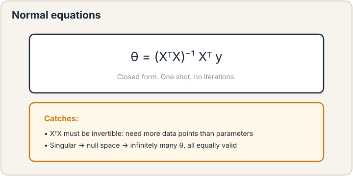

## How to read this lesson

This lesson has two levels. **Level 1 (Core)** contains what you need to
understand everything that follows in CS229 and the courses that build on
it. **Level 2 (Deep)** contains what you need for correct, interview-grade
understanding. Read Level 1 straight through. Return to Level 2 when you
want depth.

No prerequisites are assumed. Every term is defined at first use.

## Level 1: The supervised setup

A **hypothesis** is a function h that maps inputs to predictions. Write it
h: X -> Y. X is the input space. Y is the output space. The **training
set** is a list of pairs (x, y): inputs with their correct answers.
Supervised learning means: find a hypothesis that predicts y well on new
x, using only the training pairs.

Two flavors. **Regression**: y is a number, like a house price.
**Classification**: y is a category, like cat versus dog. This lecture is
regression. Classification starts in lecture 3.

The running example is the Ames housing dataset, real sale prices from
Ames, Iowa [10:58](ts:10:58). Input x: lot area, living space, and similar
features. Output y: the sale price. Before any mathematics, Chris Ré
gives the first rule of the course: look at your data [11:28](ts:11:28).
He says it twice. Plot it. Know its scale. Models built on unseen data
fail in ways no theorem predicts.

> [!QA]
> Q: What makes learning supervised?
> A: The training set. It contains the right answers as (x, y) pairs. The algorithm learns by comparing its predictions against those answers. Take the labels away and you are in unsupervised territory, no matter how obvious the pattern looks to a human.
> Follow-up: Regression or classification for predicting tomorrow's temperature?
> A: Regression. Temperature is a continuous number. Classification is for discrete choices. The boundary is the type of y, not the difficulty of the problem.

## Level 1: The linear hypothesis

Start with the simplest hypothesis that can work. A line.

h(x) = theta_0 + theta_1 x [12:36](ts:12:36)

Two numbers, theta_0 and theta_1, define the entire model. Theta_0 is the
intercept: the prediction when x is zero. Theta_1 is the slope: how much
the prediction rises per unit of x. Strictly, this is an affine function,
not a linear one, but the field says "linear" by convention.

This is a **parametric** model. Parametric means the hypothesis is fully
described by a fixed set of parameters, no matter how much data arrives.
Ten houses or ten million houses: still two numbers. That is a huge
reduction. The space of all possible functions is uncountably large. We
restrict to lines and search only two numbers.

The **parameters** theta are what learning adjusts. The **features** x
are what the data provides. Never confuse the two. Features come from the
world. Parameters come from training.

> [!QA]
> Q: Why start with a line when the world is not linear?
> A: Because a line is the simplest hypothesis with a closed-form solution and exact theory. It teaches the full machinery: loss, gradient, optimizer. Every later model reuses that machinery. Also, many problems are locally linear, and linear models on good features beat fancy models on bad features.
> Follow-up: What breaks when you add a second feature?
> A: Nothing structural. Theta gains one component per feature. The line becomes a plane, then a hyperplane. All the equations below generalize by replacing scalars with vectors.

## Level 1: The loss chip

How do you say one line is better than another? You need a score. The
score is the **loss function**. It measures how wrong the hypothesis is
on the training set. Training means choosing theta to make the loss as
small as possible.

 = 1/2 sum of squared errors. Prediction minus truth, squared, averaged. Smaller is better. Original plate.")

For linear regression the loss is **least squares** [24:15](ts:24:15):

J(theta) = (1/2) * sum over i of (h_theta(x^i) - y^i)^2

Read it inside out. For each house i, compute the prediction
h_theta(x^i), subtract the true price y^i, and square the error. Add up
over all houses. The 1/2 is pure convention: it cancels the 2 that appears
when you differentiate a square. The argmin does not care about constant
factors.

Why square at all? Three reasons, in increasing order of depth. First, the
squared loss is solvable: its gradient has a clean form and the optimum
has a closed form. Second, history: Gauss used it because squares were
computationally convenient before computers existed. Third, probability:
squared loss is exactly what you get from Gaussian noise, proved in
lecture 3. A student asks why not absolute value [26:15](ts:26:15). You
can. That is called value regression and it estimates the median, not the
mean. Different loss, different statistic.

This chip is the cross-course symbol for loss. CS336 and CS329H reuse
this exact design. Wherever you see the chip, it means: a scalar score of
wrongness, and training minimizes it.

> [!QA]
> Q: What does the 1/2 in J(theta) do?
> A: Nothing to the answer. It cancels the factor of 2 from differentiating the square, keeping the gradient clean. Any positive constant gives the same minimizer. It is convention, and interviewers ask about it precisely because beginners think it matters.
> Follow-up: Why is minimizing J(theta) called empirical risk minimization?
> A: Risk is the expected error on new data. You cannot compute it, so you minimize the error on the data you have: the empirical risk [15:28](ts:15:28). The gap between the two is the subject of lecture 6.

## Level 1: Gradient descent

J(theta) is a bowl in parameter space. The minimum sits at the bottom.
**Gradient descent** walks downhill: start at a guess, compute the
gradient (the direction of steepest increase), and step the opposite way.

theta := theta - alpha * gradient of J(theta)

**Alpha** is the **learning rate**, also called the step size
[37:33](ts:37:33). Chris Ré uses both names interchangeably. Too small and
training crawls. Too large and you overshoot the bottom and diverge.

For least squares the gradient has a memorable shape. Each component is a
sum over houses of (prediction - truth) times the feature value. The
error term (h - y) shows up multiplied by something. Watch for that
pattern. It recurs in logistic regression, in neural networks, in
everything. Error times input is the atomic update of machine learning.

Starting point does not matter for least squares: the bowl has one
bottom. Chris Ré warns that in modern models, where you start matters a
great deal. Convexity is a luxury. Enjoy it while it lasts.

> [!QA]
> Q: How do you pick the learning rate?
> A: Start with a standard value like 0.01 or 0.001 and watch the loss. If the loss explodes or oscillates, the rate is too big. If the loss barely moves, it is too small. Schedules that decay the rate during training are standard practice. There is no formula that works everywhere. Tuning it is empirical.
> Follow-up: Why does the gradient point uphill, not downhill?
> A: By definition. The gradient is the direction of steepest increase of the function. Descent negates it. If you ever see a plus sign in a gradient descent update, someone is maximizing instead, usually a likelihood.

## Level 1: Stochastic gradient descent

Batch gradient descent sums over every house before taking one step. On a
dataset the size of the internet, one step takes forever. **Stochastic
gradient descent** (SGD) estimates the gradient from a small random
**minibatch** and steps immediately [44:00](ts:44:00). Many noisy steps
replace few exact ones.

SGD rests on two statistical assumptions. One: the training set reflects
the real world. Two: each minibatch reflects the training set. Break the
second one and training breaks. Show the model all cats first, then all
dogs, and it gets stuck predicting cats. The fix is a **shuffle**: random
order, one full pass per **epoch**, every epoch.

Batch size interacts with the learning rate. A common folklore: normalize
by batch size, so larger batches pair with smaller steps. In production,
batch size is picked for GPU efficiency first. Labs report **MFU**,
model FLOPs utilization [64:02](ts:64:02): the fraction of the GPU's
theoretical speed actually achieved. Gigawatt training facilities must
stay busy. Chris Ré's punchline: tweaking batch size matters far less
than making the model bigger or training longer.

> [!QA]
> Q: Why does SGD work if each step uses the wrong gradient?
> A: Each minibatch gradient is an unbiased estimate of the true gradient: right on average, noisy per step. The noise averages out over many steps, and it even helps by shaking the parameters out of sharp bad minima. What matters is the average direction over an epoch, not any single step.
> Follow-up: Why shuffle instead of sampling with replacement?
> A: Both work and theory says they behave similarly. Shuffling guarantees each example is seen exactly once per epoch, which is slightly more efficient in practice. The non-negotiable part is randomness of order, not the sampling scheme.

## Level 2: The normal equations

Least squares is one of the rare problems with a closed-form answer. Set
the gradient to zero and solve. In matrix form:

theta = (X^T X)^(-1) X^T y

^-1 X^T y. Requires invertibility. Singular means infinite solutions. Original plate.")

No iterations. No learning rate. One shot. The catch is the inverse.
X^T X must be invertible, which needs more data points than parameters
[04:47](ts:04:47). If it is singular, there is a **null space**: directions
in parameter space that change nothing about the predictions
[76:00](ts:76:00). Then infinitely many thetas are equally valid. X^T X is
always positive semidefinite, so the bowl never curves downward, but flat
directions are allowed.

In practice, nobody inverts the matrix directly for large problems.
Inversion costs cubic time in the number of parameters. Gradient descent
wins past a few thousand features. The normal equations matter as theory:
they prove the optimum exists, is unique when X^T X is invertible, and
give the exact answer for small problems.

> [!QA]
> Q: When would you use the normal equations instead of gradient descent?
> A: Small problems: thousands of examples, hundreds of features. One exact solve beats a thousand iterative steps. Large problems: gradient descent or SGD, because matrix inversion scales cubically. Interviewers want the tradeoff stated with the complexity, not just a preference.
> Follow-up: What does a singular X^T X mean about your features?
> A: Redundancy. Some feature is a linear combination of the others, or you have fewer examples than features. The data cannot distinguish the redundant directions. Fix it by removing duplicate features or adding regularization, which is lecture 6.

## Level 2: Two asides that pay off later

**Learning rate schedules.** The step size need not stay constant.
**Cosine scaling** decays alpha along a cosine curve: zoom into a minimum,
then the schedule's shape kicks the parameters out to keep exploring
[59:36](ts:59:36). It is popular for image models. Linear and exponential
decay are older variants of the same idea. Schedules are refinements. The
dominant terms are model size and training time.

**Wrong loss, works anyway.** Chris Ré notes something surprising: the
squared loss sometimes works for classification, even though it makes no
sense there. The machinery tolerates the wrong loss in ways
theory does not fully explain. Keep this in mind when lecture 4 replaces
it with cross-entropy. The replacement is principled. The surprise is
that the unprincipled version often works anyway.

## Recap: the whole lesson on one screen

Eight ideas carry this lecture. Read each card. Say the core sentence out
loud. If you can, you own the lesson.

<strong>1. Supervised learning predicts from labeled pairs</strong>

Training data is (x, y) pairs. Regression predicts numbers. Classification
picks categories. The labels are the supervision.

Key: h: X to Y, learned from (x, y)

<strong>2. The loss chip scores wrongness</strong>

J(theta) = (1/2) sum of squared errors. Smaller is better. Training is
minimization. The 1/2 is convention. This chip reappears in every
course.

Key: J(theta) = 1/2 sum (h - y)^2

<strong>3. Gradient descent walks downhill</strong>

Theta moves opposite the gradient, scaled by the learning rate alpha.
Error times feature is the atomic update. Convex here, so start anywhere.

Key: theta := theta - alpha * grad J

<strong>4. SGD trades exact steps for fast noisy ones</strong>

Minibatch gradients are unbiased estimates. Shuffle every epoch. Never
show all of one class first. Batch size follows GPU efficiency.

Key: shuffle, epoch, unbiased noise

<strong>5. The normal equations solve it in one shot</strong>

Theta = (X^T X)^-1 X^T y. Needs more points than parameters. Singular
means a null space: infinite equally good thetas.

Key: closed form, cubic cost, needs invertibility

<strong>6. The learning rate is the step size</strong>

Too big diverges. Too small crawls. Schedules like cosine decay refine
it. Model size and training time dominate tuning.

Key: alpha; watch the loss curve

<strong>7. Production cares about MFU</strong>

Model FLOPs utilization: fraction of GPU speed actually used. Batch
size is chosen for hardware first. Gigawatt facilities must stay
busy.

Key: MFU = achieved / theoretical FLOPs

<strong>8. Look at your data</strong>

Ames housing, real prices. Plot before modeling. Said twice because
unseen data fails in ways no theorem predicts.

Key: plot first, model second

## Official sources and further reading

**Official:**
- Lecture 2 video: setup and Ames data [10:58](ts:10:58), least squares [24:15](ts:24:15), SGD [44:00](ts:44:00), MFU [64:02](ts:64:02), null space [76:00](ts:76:00).
- CS229 Spring 2026 official course notes: linear regression chapter, matrix identities appendix.

**Further reading:**
- De Cock (2011), "Ames, Iowa: Alternative to the Boston Housing Data": the dataset paper.
- Boyd and Vandenberghe, Convex Optimization, Chapter 4: least squares as the canonical convex problem.

**Caveats from these sources.** The Ames dataset is small and clean; real
housing data is messier and the lecture's plots flatter it. MFU numbers
are hardware and kernel dependent; compare only within one setup. The
normal equations are numerically unstable via explicit inverse; libraries
use QR or Cholesky. These are known limitations, not bugs.

## Connections to the other courses

- **CS336:** the loss chip defined here is reused verbatim; language modeling swaps in cross-entropy but the minimize-a-scalar machinery is identical.
- **CS224N:** word vectors are trained with SGD on the same update pattern: error times input.
- **CS329H:** preference optimization replays the loss-design questions of this lecture with human judgments as labels.

> [!CHEAT]
> **Linear regression cheatsheet.** Setup: h: X to Y, training pairs (x, y). Hypothesis: h = theta_0 + theta_1 x, parametric. Loss chip: J(theta) = (1/2) sum (h - y)^2; 1/2 is convention; squares for solvability, history, Gaussian noise. GD: theta := theta - alpha grad J; alpha is step size. SGD: minibatch, unbiased noise, shuffle per epoch. Normal equations: theta = (X^T X)^-1 X^T y; needs n > d; singular gives null space. Production: MFU, batch size for hardware. Rule zero: look at your data.

> [!MEMORY]
> **Error times input.** The gradient of the squared loss is (h - y) times x. Almost every update rule in this course has this shape. When you see a gradient, look for the error term first.
