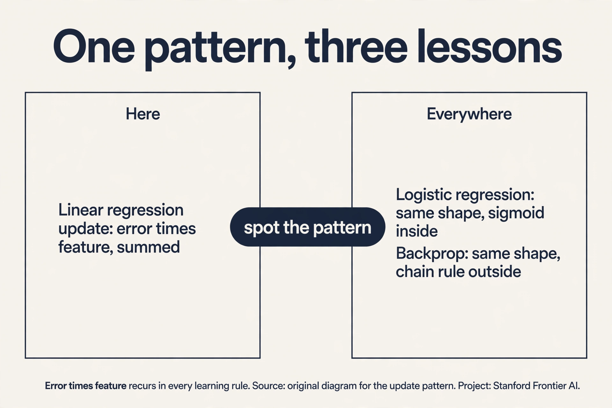
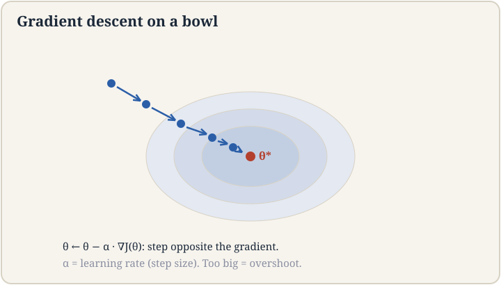
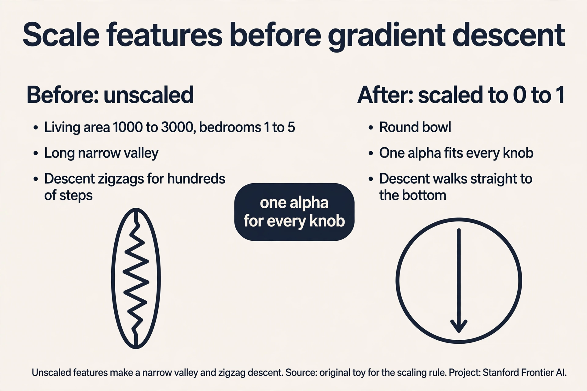
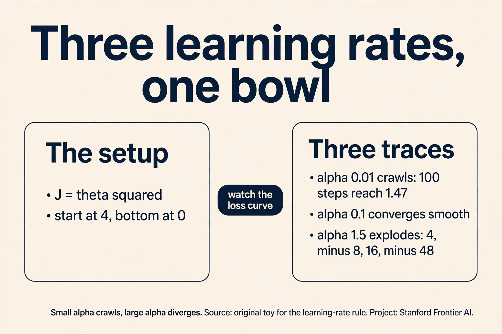
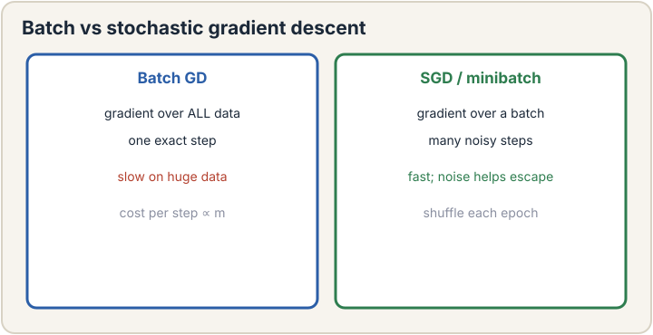
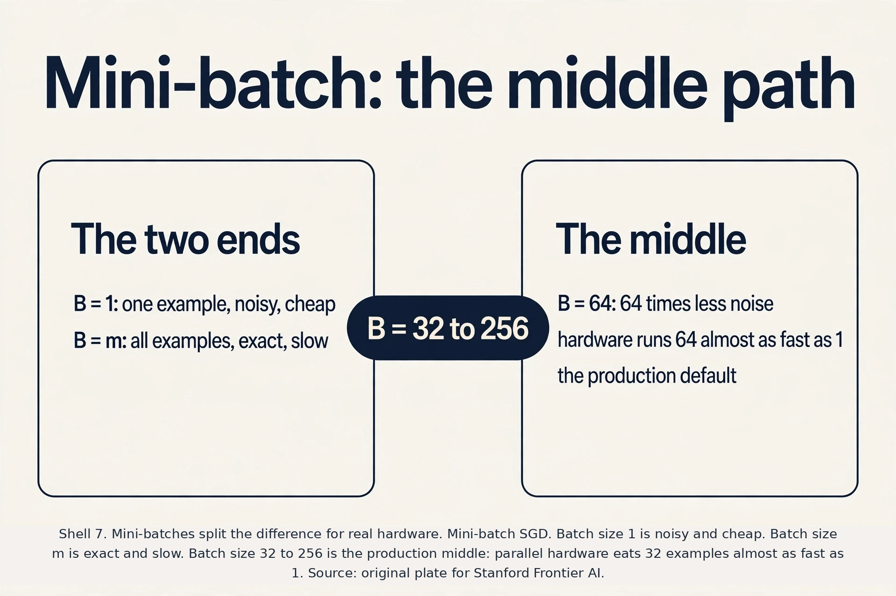

## The job: price a house in Ames, Iowa

A buyer asks you: "This house has 1,800 square feet of living area.
What should it sell for?" You have a spreadsheet of past sales in
Ames, Iowa: each row is one house, with its living area and the price
it sold for. This is the most canonical dataset in statistics, and the
lecture uses it to build the entire machinery of supervised learning.

Look at the data first. The lecture insists on this: look at your
data. Plot price against living area. The points slope upward: bigger
houses sold for more. The cloud of points is noisy but the trend is
clear. A line through the cloud would let you price any new house by
reading off the line.

So the job is: find the best line through the points. "Best" needs a
definition, "find" needs an algorithm. This chapter builds both from
zero, and every later course reuses what is built here.

## The supervised setup, piece by piece

Supervised learning has four characters. Meet each one with the
housing example.

An **example** is one labeled pair: the input features and the
correct answer. Write the i-th example as (x^(i), y^(i)). The input
x^(i) is a vector of **features**: measurable facts about the house.
For now, one feature: living area in square feet. The answer y^(i) is
the **target**: the sale price, the thing we want to predict. The
lecture's first dataset has hundreds of such pairs.

A **hypothesis** is the machine's guess at the rule mapping inputs to
answers. Write it h(x). It takes a feature vector and returns a
predicted price. The hypothesis is a function with knobs. The knobs
are the **parameters**, written theta. A line has two knobs: the
intercept theta_0 (where the line crosses the price axis) and the
slope theta_1 (dollars per square foot). The hypothesis is:

```ascii
h_theta(x) = theta_0 + theta_1 * x_1
```

Read it as: predicted price equals a base price plus slope times
living area. With theta_0 = 50,000 and theta_1 = 100, a 1,800 sq ft
house is predicted at 50,000 + 100 * 1,800 = $230,000. Different
knob settings give different lines. Learning means finding the knob
settings that fit the data best.

**Regression** is the name for this job: predicting a number. The
target is continuous: prices, temperatures, wait times. (Predicting a
category, like spam or not spam, is **classification**. It comes in
lecture 3.) The Ames job is regression.

. Prediction minus truth, squared, averaged over all examples. Smaller means the line fits better. Source: original plate for Stanford Frontier AI.")

Now define "best". The **loss** is a single number that scores one
knob setting. For each house, compute the prediction error: how far
the line's prediction missed the true price. Square it, so misses in
both directions count and big misses count a lot. Average over all
houses. The lecture's loss, with m examples, is:

```ascii
J(theta) = 1/(2m) * sum over i of (h_theta(x^(i)) - y^(i))^2
```

This is the **loss chip**: the symbol this course owns and every
later course reuses. Three things to notice. The square makes the
loss always positive and punishes a $100,000 miss one hundred times
more than a $10,000 miss. The 1/m averages over houses so the number
does not grow with the dataset. The 1/2 is cosmetic: it cancels a 2
that appears when you differentiate. The lecture calls this out
explicitly.

Minimizing J(theta) is the whole game of supervised learning. Pick
theta, score it with J, adjust theta to lower J, repeat.

## First attempt: solve it with calculus

The oldest idea: find where the loss bottoms out. At the bottom of a
smooth bowl, the slope is zero. Compute the derivative of J with
respect to each theta_j, set it to zero, solve for theta. For a line
through points, this gives a closed-form answer called the **normal
equations**, derived at the end of this chapter.

But there is a problem with the calculus-first approach, and the
lecture leads with the other route for a reason. The closed form
needs a matrix inverse. It works for lines. It does not work for
neural networks, where the loss is a rugged landscape with no closed
form. The field's real workhorse is iterative: start somewhere, walk
downhill, and stop at the bottom. That workhorse is **gradient
descent**, and it trains nearly every model you will ever meet,
including the giant language models of lectures 14 through 17.

## Gradient descent, by hand

A **gradient** is the direction of steepest uphill. At any point on
the loss surface, the gradient is a vector of partial derivatives,
one per knob. It points uphill. So to go downhill, step the opposite
way. The update rule, applied to every knob at once, is:

```ascii
theta_j := theta_j - alpha * (partial derivative of J / partial theta_j)
```

The new knob value equals the old one minus the step size times the
slope. **Alpha** is the **learning rate**, also called the step size:
how big each step is. Subtract the gradient, and you move downhill.
Repeat.

For linear regression the derivative has a clean form. Watch the
pieces: the derivative of the squared error brings down the error
term (prediction minus truth) times the feature:

```ascii
theta_j := theta_j - alpha * (1/m) * sum over i of (h_theta(x^(i)) - y^(i)) * x_j^(i)
```

The lecture highlights the shape: **error times feature, summed**.
The error (h - y) says how wrong the prediction was and in which
direction. The feature x_j says how much knob j contributed. Big
error on a house with big living area pushes the slope knob hard.
This error-times-something pattern recurs in every learning rule in
the course. Learn to spot it.



Now work it by hand. Three houses, one feature, and the knobs start
at zero.

```ascii
houses:  (x=1, y=2)   (x=2, y=3)   (x=3, y=5)
knobs:   theta_0 = 0, theta_1 = 0        alpha = 0.05

start:   predictions all 0.  J = 1/6 * (4 + 9 + 25) = 6.33

errors:  (0-2) = -2,  (0-3) = -3,  (0-5) = -5
grad_0 = (1/3) * (-2 - 3 - 5) = -3.33
grad_1 = (1/3) * (-2*1 - 3*2 - 5*3) = (1/3) * (-23) = -7.67

step:    theta_0 := 0 - 0.05 * (-3.33) = 0.167
         theta_1 := 0 - 0.05 * (-7.67) = 0.383

after:   h(1) = 0.55,  h(2) = 0.93,  h(3) = 1.32
         J = 1/6 * (2.10 + 4.28 + 13.54) = 3.32
```

One step cut the loss from 6.33 to 3.32. The line is still terrible,
but it moved in the right direction on every knob. Run this update
hundreds of times and the knobs settle near theta_0 = 0.33,
theta_1 = 1.5, the best line through the three points. That is
gradient descent: many small downhill steps, each one cheap.



### Subchapter: feature scaling, the hidden dial

One more dial hides inside gradient descent: the scale of the
features. Take two features: living area (1,000 to 3,000 sq ft) and
bedrooms (1 to 5). One gradient step moves each knob by alpha times
its gradient, and the living-area gradient is about 1,000 times
larger than the bedroom gradient. With one shared alpha, the area
knob leaps while the bedroom knob crawls.

Picture the loss surface. Unscaled, it is a long narrow valley:
steep across the area direction, flat along bedrooms. Gradient
descent zigzags across the valley walls, taking hundreds of steps to
drift down the flat floor. Scale both features to the range 0 to 1
(subtract the mean, divide by the range), and the valley becomes a
round bowl. The same alpha now works for every knob, and descent
walks straight to the bottom in a fraction of the steps.

The decision rule: always scale features before gradient descent.
The normal equations do not care about scale, but every iterative
method does. A model that will not converge at any alpha is often a
model with unscaled features.



## Where it breaks: the learning rate

Alpha is the one dial you must set, and both extremes fail. Watch
each failure on the simplest bowl: J(theta) = theta^2. The gradient
is 2*theta. Start at theta = 4. The bottom is at 0.

Alpha too small: alpha = 0.01. Each step moves 1 percent of the
distance. Step 1: theta = 4 - 0.01*8 = 3.92. After 100 steps you are
at about 1.47. After 1,000 steps, about 0.05. It converges, but you
paid 1,000 steps for a one-dimensional problem. On a real model with
millions of knobs, tiny alpha means training never finishes.

Alpha too large: alpha = 1.5. Step 1: theta = 4 - 1.5*8 = -8. Step 2:
theta = -8 - 1.5*(-16) = 16. Step 3: theta = -48. The steps explode:
4, -8, 16, -48, 144. Each step overshoots the bottom and lands
farther out than it started. The loss does not fall. It diverges to
infinity. The lecture shows this live: with alpha set too high, the
loss bounces around in a widening ball and never settles.

The working range is narrow and problem-dependent. In practice you
try a few values, watch the loss curve, and pick the largest alpha
whose loss falls smoothly. The lecture's rule of thumb: when the loss
bounces instead of falling, your alpha is too high. Turn it down.



## The key question

Each gradient step in the toy summed over all three houses. That is
**batch** gradient descent: every step scans the full dataset. Now
scale up. The lecture asks: what if the dataset is the entire
internet and the job is next-word prediction? One step would need to
score every page on earth before moving a single knob. That cannot
work. What if each step used just one example instead of all of
them?

## Stochastic gradient descent

**Stochastic gradient descent** (SGD) uses one training example per
step, picked at random. The update becomes:

```ascii
theta_j := theta_j - alpha * (h_theta(x^(i)) - y^(i)) * x_j^(i)
```

No sum over m. No 1/m. Just one example's error times its features.
Each step is m times cheaper. With m = 1,000,000 houses, one batch
step costs 1,000,000 error computations. One SGD step costs 1.

The price is noise. One example's gradient is a jittery estimate of
the true downhill direction. The knobs wiggle. The lecture shows the
trace: batch descent glides smoothly to the bottom. SGD bounces
around it, sometimes stepping the wrong way. But it bounces *while
moving*: in the time batch descent takes one exact step, SGD takes
one million noisy steps and gets much closer. For huge datasets the
noisy fast method beats the exact slow method, every time. This is
the algorithm that trains modern neural networks. The "stochastic"
part is not a hack. It is the reason training at internet scale is
possible at all.

One practical rule from the lecture: shuffle the data before each
pass (**epoch**), so the machine does not learn the order of your
spreadsheet. And a common trick when alpha is large: average the
knobs over the bouncing trajectory to simulate a steadier estimate.



### Subchapter: mini-batch, the middle path

Batch descent and SGD are two ends of a dial. The dial is the batch
size B: how many examples each step uses. Batch is B = m. SGD is
B = 1. The middle is **mini-batch** SGD: B = 32, 64, 128, or 256.

Count the tradeoff on m = 1,000,000 houses. A batch step costs
1,000,000 error computations and gives one exact direction. An SGD
step costs 1 and gives one noisy direction. A mini-batch step with
B = 64 costs 64 and gives a direction 64 times less noisy than SGD.
In the time batch descent takes one step, mini-batch takes about
15,000 steps, each nearly as good as the exact one.

Hardware adds a second reason. Modern chips compute 32 or 64
examples almost as fast as 1, because the arithmetic runs in
parallel. B = 32 costs barely more wall-clock time than B = 1 but
cuts the noise by a factor of 32. This is why every production
training loop uses mini-batches: the batch size is the one number
that trades noise against hardware at the same time.



## The normal equations: the exact answer for lines

For linear regression there is also a one-shot answer. Stack all
examples into a matrix X (m rows, one per house. N+1 columns, one per
knob including the intercept column of ones) and all targets into a
vector y. The loss in matrix form is J(theta) = (1/2m)(X theta -
y)^T (X theta - y). Set the gradient to zero and solve:

```ascii
theta = (X^T X)^(-1) X^T y
```

These are the **normal equations**. No alpha, no iterations, no
bouncing. One formula, exact bottom of the bowl.

Solve the toy by hand. Three houses, X has rows [1,1], [1,2], [1,3],
y = [2, 3, 5].

```ascii
X^T X = [[3, 6], [6, 14]]        X^T y = [10, 23]
det = 3*14 - 6*6 = 42 - 36 = 6
(X^T X)^(-1) = (1/6) * [[14, -6], [-6, 3]]

theta_0 = (1/6) * (14*10 - 6*23) = (1/6) * (140 - 138) = 1/3
theta_1 = (1/6) * (-6*10 + 3*23) = (1/6) * (-60 + 69) = 3/2
```

The best line is h(x) = 1/3 + 1.5x. Predictions: 1.83, 3.33, 4.83.
Errors: -0.17, -0.33, 0.17. Squared errors sum to 0.167, so
J = 0.083. This is the exact minimum. Gradient descent was crawling
toward this point. The normal equations jump straight to it.

^-1 X^T y. Exact in one shot. Needs an invertible X^T X and costs O(n^3). Source: original plate for Stanford Frontier AI.")

## Mapping back: three ways to fit a line

| Approach | How it finds theta | Cost per answer | When it wins |
|---|---|---|---|
| Gradient descent | Many small downhill steps, alpha dialed by hand | O(m*n) per step, many steps | Huge m, or loss with no closed form (neural nets) |
| SGD | One example per step, noisy but fast | O(n) per step | Internet-scale m; the only option when one pass over data is expensive |
| Normal equations | One matrix inverse, exact | O(n^3) to invert, needs X^T X invertible | Small n (hundreds of features), exact answer wanted |

Each answers a different pain. Batch descent is too slow per step on
huge data. SGD fixes the per-step cost. Iterative methods need alpha
tuning and many steps. The normal equations skip both when the
problem is small and linear. Nothing here works on neural networks
except the gradient idea itself, which is why lectures 7 and 8 exist.

## What is used where

**Linear regression runs in production more than any other model.**
It is the default baseline for pricing, forecasting, and
calibration layers. Ad systems fit linear models on billions of
impressions because a linear model scores in microseconds and
retrains in minutes. Every serious team fits linear regression first:
if a fancier model cannot beat it, the fancier model ships nothing.

**The normal equations never run at scale.** No production system
inverts X^T X on millions of rows. The formula survives in
textbooks and in small-data statistics, where n is hundreds and the
exact answer is free. Scikit-learn's LinearRegression uses an SVD
solver under the hood, which is the numerically stable cousin of the
normal equations, and it is the right call up to about n = 10,000
features.

**SGD and mini-batch SGD run everything else.** Every neural
network in production trains on a variant of the mini-batch update
from this lesson: PyTorch and JAX loops are mini-batch SGD with
adaptive step sizes (Adam). The step you hand-computed on three
houses is the great-grandfather of every LLM training run.

## Watch next

<div class="video-block"><div class="video-wrap"><iframe src="https://www.youtube-nocookie.com/embed/nk2CQITm_eo" title="StatQuest: Linear Regression, Clearly Explained" allow="accelerometer; autoplay; clipboard-write; encrypted-media; gyroscope; picture-in-picture" allowfullscreen loading="lazy" referrerpolicy="strict-origin-when-cross-origin"></iframe></div><p class="video-cap">Explainer: StatQuest, Linear Regression Clearly Explained. Josh Starmer fits the line by least squares with the same error-times-feature update. Watch after the gradient-descent section.</p></div>

## The honest price

The normal equations have two bills. First, inverting X^T X costs
O(n^3) in the number of features. With n = 10,000 features, that is
10^12 operations: the "exact" answer is slower than gradient descent.
Second, the inverse exists only if X^T X is invertible. If two
features are redundant (living area in sq ft and in sq meters), or if
m < n (fewer houses than knobs), the matrix is singular and the
formula breaks: infinitely many lines fit equally well, and the
equation cannot choose. Gradient descent has its own bill: the
learning rate. Too small crawls, too large diverges, and the right
value is found by trial, not theory. Every optimizer in this course
is a negotiation with these prices.

> [!QA]
> Q: What is the loss function for linear regression, and why the 1/2?
> A: J(theta) = 1/(2m) times the sum of squared prediction errors over all m examples. The square punishes big misses more than small ones and keeps the loss positive. The 1/m averages so the number does not grow with the dataset. The 1/2 is cosmetic: differentiating the square brings down a factor of 2, and the 1/2 cancels it, leaving clean update rules. In the hand toy, three houses gave J = 6.33 at theta = 0 and J = 3.32 after one gradient step.
> Follow-up: Why square the errors instead of taking absolute values?
> A: Squares are smooth and differentiable everywhere, so gradient descent applies directly. Absolute values have a kink at zero. Squares also punish large errors quadratically, which matches the Gaussian-noise story of lecture 3. The price: squared loss is sensitive to outliers, since one huge error dominates the sum.

> [!QA]
> Q: Derive the gradient descent update for linear regression.
> A: Start from J(theta) = 1/(2m) sum (h_theta(x^(i)) - y^(i))^2 with h = theta^T x. Differentiate with respect to theta_j: the 1/2 cancels the 2 from the square, leaving (1/m) sum (h - y) * x_j^(i). The update is theta_j := theta_j - alpha * (1/m) sum_i (h_theta(x^(i)) - y^(i)) x_j^(i). The lecture stresses the shape: error times feature, summed over examples. On the 3-house toy with alpha = 0.05, one step moved theta from (0, 0) to (0.167, 0.383) and cut J from 6.33 to 3.32.
> Follow-up: Why must all theta_j update simultaneously from the old values?
> A: Because the gradient is computed at the current point. If you update theta_0 first and then use the new theta_0 to compute theta_1's update, you are stepping along a stale-mixed gradient, not the true downhill direction. Simultaneous update keeps the step honest. Implementations compute all new values into a temporary copy, then assign.

> [!QA]
> Q: When would you use the normal equations instead of gradient descent?
> A: When n is small (hundreds of features) and you want the exact answer with no learning-rate tuning. The normal equations cost O(n^3) for the inverse, so at n = 10,000 features they lose to gradient descent. They also fail when X^T X is singular: redundant features or fewer examples than features give infinitely many solutions and no inverse. Gradient descent and SGD are the only options for neural networks, where no closed form exists at all.
> Follow-up: What do you do when X^T X is singular?
> A: Remove redundant features, get more data, or add a ridge penalty (lecture 6): minimize J(theta) + lambda * ||theta||^2, which makes the matrix (X^T X + lambda*I) invertible. The penalty also shrinks the knobs, which fights overfitting.

> [!QA]
> Q: Why does SGD work if each step uses a noisy gradient?
> A: Each single-example gradient is an unbiased estimate of the true gradient: wrong per step, right on average. The noise averages out over many steps while each step costs O(n) instead of O(m*n). On m = 1,000,000 examples, SGD takes a million cheap steps in the time batch descent takes one expensive step. The lecture's trace shows SGD bouncing around the optimum while batch glides. The bouncing still arrives far sooner. Shuffling each epoch keeps the noise honest.
> Follow-up: Why not use a huge batch instead, getting exact gradients with parallelism?
> A: That is mini-batch SGD, the practical middle ground: batches of 32 to 256 examples. Big enough to use hardware well and smooth the noise, small enough to step often. Full-batch on internet-scale data is still one step per eternity.

> [!QA]
> Q: Walk me through one gradient-descent step on a new toy: houses (x=2, y=4) and (x=4, y=6), theta = (0, 0), alpha = 0.1.
> A: Predictions are both 0. Errors: (0-4) = -4, (0-6) = -6. J = 1/4 * (16 + 36) = 13. Grad_0 = (1/2)(-4 - 6) = -5. Grad_1 = (1/2)(-4*2 - 6*4) = (1/2)(-32) = -16. Step: theta_0 := 0 - 0.1*(-5) = 0.5, theta_1 := 0 - 0.1*(-16) = 1.6. New predictions: h(2) = 0.5 + 3.2 = 3.7, h(4) = 0.5 + 6.4 = 6.9. Errors: -0.3 and 0.9. J = 1/4 * (0.09 + 0.81) = 0.225. One step cut the loss from 13 to 0.225.
> Follow-up: Why did this toy converge in one step while the lesson's toy did not?
> A: Alpha was larger relative to the curvature, and the two points nearly determine the line. It is luck of the numbers, not a property of the method. Do not generalize from one toy: the lesson's toy needed hundreds of steps at alpha = 0.05.

> [!QA]
> Q: Applied design: you have 2 billion logged ad impressions, 40 features, and a model that must retrain hourly. Batch, SGD, mini-batch, or normal equations?
> A: Mini-batch SGD, batch size 256 to 1024. Normal equations are dead: X^T X is 40 by 40, which is fine, but forming it over 2 billion rows every hour is the expensive part, and streaming mini-batches adapt to drift. Full-batch GD takes one step per hour, which cannot track a moving target. Pure SGD at B = 1 wastes the hardware: 256 examples cost nearly the same wall-clock as 1 on a GPU. Mini-batch is the only option that is fast, parallel, and adaptive.
> Follow-up: What breaks first as the feature count grows from 40 to 40,000?
> A: The O(n) per-step cost grows linearly, so steps get 1,000 times more expensive. At 40,000 dense features you need sparse representations or feature hashing, or the hourly retrain misses its window. The algorithm stays the same. The data plumbing changes.

> [!QA]
> Q: Why does feature scaling matter for gradient descent but not for the normal equations?
> A: Gradient descent uses one alpha for every knob. If living area spans 1,000 to 3,000 and bedrooms span 1 to 5, the area gradient is ~1,000 times larger, so one alpha cannot suit both: it either crawls on bedrooms or explodes on area. Scaling both to 0-1 makes the loss bowl round and one alpha works everywhere. The normal equations solve the linear system exactly in one shot. No steps means no step size, so scale is irrelevant. The price of scale-freedom is the O(n^3) inverse.
> Follow-up: What is the cheapest correct scaling?
> A: Subtract the mean and divide by the range or standard deviation, per feature, computed on the training set only. Apply the same transform at prediction time. Never compute scaling statistics on the test set: that leaks test information into training.

## Recap: the whole lesson on one screen

1. **The job.** Price Ames houses from past sales. Find the best
   line through the points.
2. **The setup.** Example (x, y). Hypothesis h_theta(x), a line with
   knobs theta. Regression predicts a number.
3. **The loss chip.** J(theta) = 1/(2m) sum of squared errors.
   Smaller is better. Owned by this course, reused everywhere.
4. **Gradient descent.** Step each knob opposite its gradient:
   theta_j := theta_j - alpha * error * feature, summed. Hand toy:
   J fell 6.33 to 3.32 in one step.
5. **The learning rate.** Too small crawls (1,000 steps for a
   1-D bowl). Too large diverges (4, -8, 16, -48). Watch the loss
   curve. Bouncing means turn alpha down.
6. **The key question.** What if one step used one example instead
   of the whole internet?
7. **SGD.** One example per step: m times cheaper, noisy, wins on
   huge data. Shuffle every epoch.
8. **Normal equations.** theta = (X^T X)^-1 X^T y. Hand toy: the
   best line is 1/3 + 1.5x, J = 0.083, exact. Costs O(n^3), needs
   invertibility.
9. **The honest price.** Exact answers need inverses. Inverses need
   small n and full rank. Iterative answers need alpha tuning.
10. **Feature scaling.** Unscaled features make a narrow valley.
    Scale to 0-1 and one alpha works for every knob.
11. **Mini-batch.** B = 32 to 256: 64 times less noise than SGD at
    nearly the same hardware cost. The production default.
12. **The pattern.** Error times feature, summed, recurs in logistic
    regression and backprop. Learn to spot it.

## Official sources and further reading

**Official:**
- Lecture 2 video, Stanford Online YouTube:
  - [Chris Ré builds the](https://www.youtube.com/watch?v=cmNIMjPYdgM)
  supervised setup on the Ames housing data, derives gradient
  descent and SGD, and sketches the normal equations.
- Official subtitle transcript (en-US): the lecture's spoken text.
- CS229 Spring 2026 official course notes (local PDF): the full
  rigorous treatment, including the matrix derivation of the normal
  equations.
- Ames Housing dataset documentation:
  - [the real dataset behind](https://jse.amstat.org/v19n3/decock.pdf)
  the lecture's example.

**Caveats from these sources.** The lecture presents the normal
equations briefly "just for notation" and points to the course notes
for rigor. The full derivation with matrix calculus lives there. The
lecture's gradient descent demo uses the Ames data with many
features. The 3-house toy in this lesson is an original miniature
with the same update rule. "Look at your data" is the lecture's
standing advice and applies before any fitting.

## Connections to the other courses

- **CS229 L03:** the same loss derived from probability: Gaussian
  noise makes least squares the maximum-likelihood answer.
- **CS229 L06:** what goes wrong when the line is too flexible:
  bias, variance, and ridge regression fixing the singular matrix.
- **CS229 L08:** the gradient idea scaled up: backpropagation
  computes gradients for millions of knobs at the cost of one
  forward pass.
- **CS336:** gradient descent at scale: how the update actually
  runs on GPUs, and what MFU measures.
- **CS224N L01:** the same SGD loop training word vectors and
  language models.
