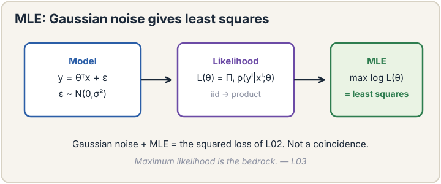
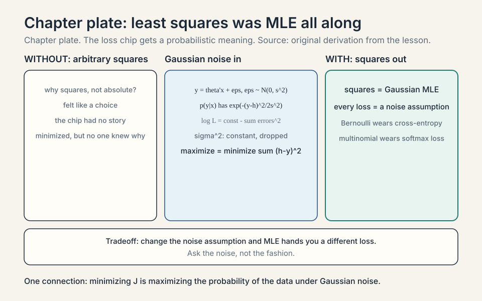
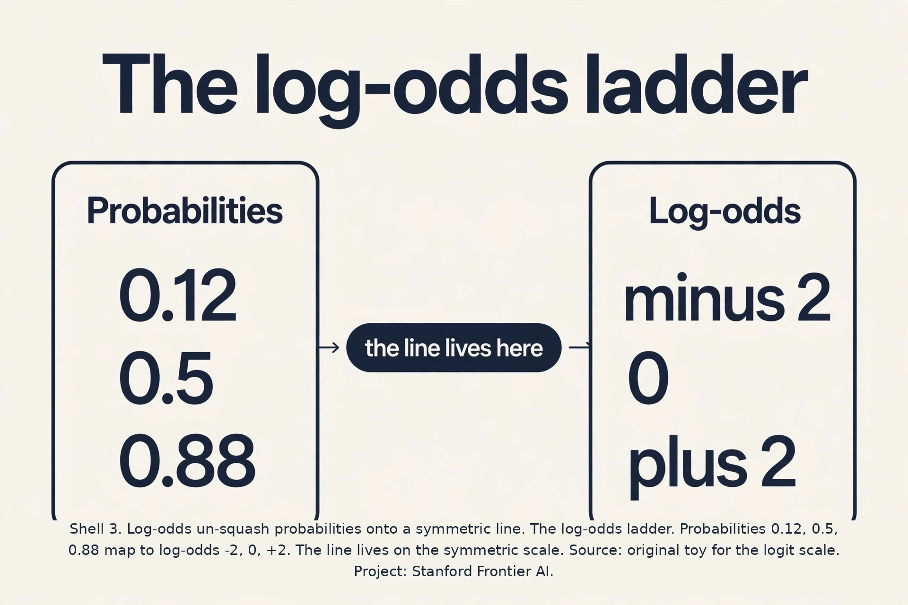
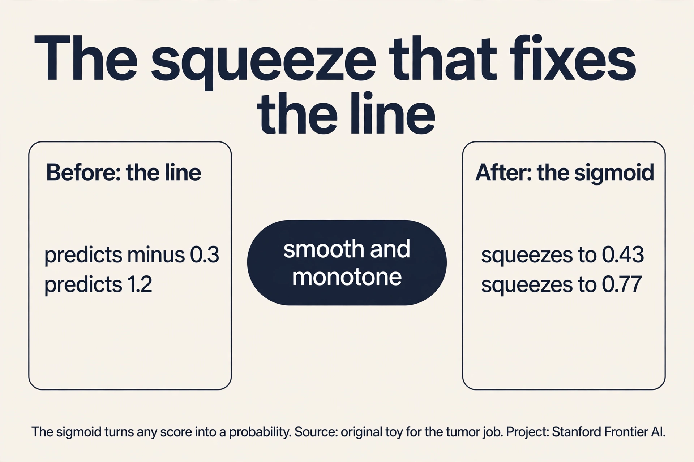
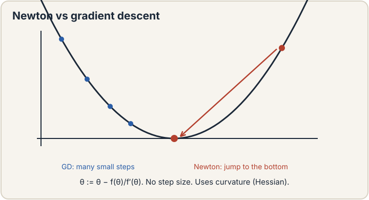
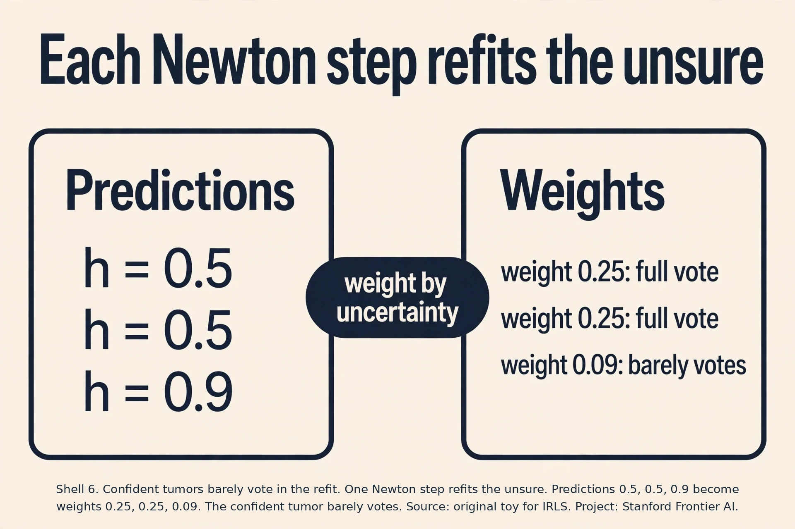
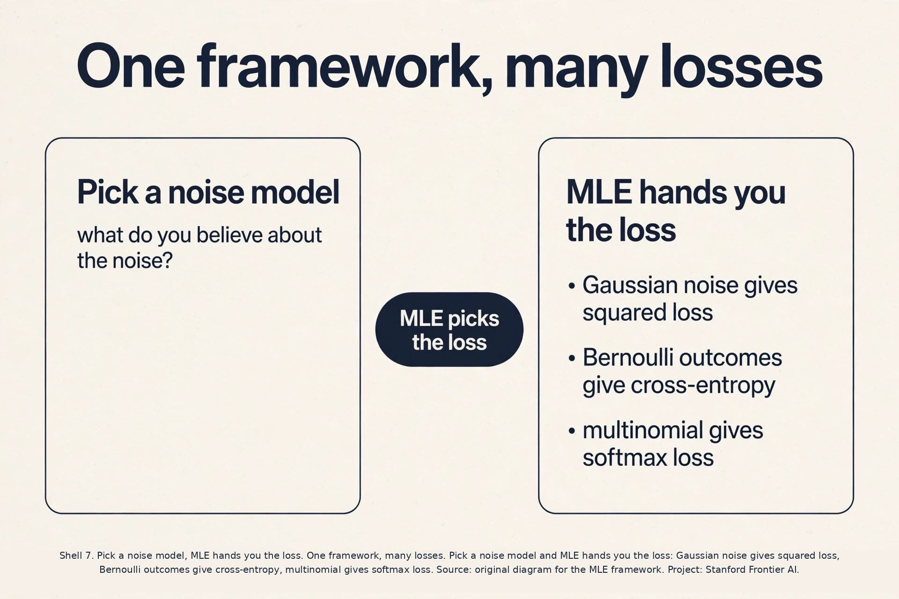

## The job: benign or malignant

A doctor measures a tumor's size: 2.1 centimeters. The question is
not a number. It is a category: benign or malignant. The answer
wanted is a probability: "there is a 78 percent chance this tumor is
malignant." This job is **classification**: predict which of two
classes an input belongs to. The target y is 0 or 1, not a price.

Lecture 2 fit a line to numbers. A line cannot answer this job. It
predicts 0.27 for one tumor and 0.55 for the next. Neither is a
true probability: a line has no walls at 0 and 1. Something has to squeeze the line's output into the
range 0 to 1, and something has to say why that squeeze is the right
one. This chapter builds both, and underneath them a framework that
explains where the squared loss of lecture 2 came from.

## First attempt: fit a line, draw a threshold

The naive idea: treat the labels as numbers, fit the least-squares
line from lecture 2, and call everything above 0.5 malignant. Watch
it on a toy. Five tumors, one feature (size in cm), labels 0 for
benign and 1 for malignant.

```ascii
tumor:   size 1.0 -> 0      size 1.5 -> 0      size 2.0 -> 1
         size 2.5 -> 1      size 3.3 -> 0   (one huge benign-looking outlier)
```

Fit a line through these as if the labels were prices. The outlier
at 3.3 drags the line's right end down hard: least squares punishes
big misses quadratically, so one far point bends the whole line.
The fitted line crosses 0.5 at size 2.9 instead of 1.75. A tumor of
size 2.5, clearly malignant in the data, now scores 0.45 and gets
called benign. One outlier flipped a diagnosis.

Two deeper failures. First, the line's outputs are not
probabilities: on this toy it predicts 0.27 for the smallest tumor
and 0.55 for the largest. Thresholding at 0.5 is a hack with no meaning. Second, the
squared loss treats a miss from 0.9 to 1.0 the same as a miss from
0.4 to 0.5, but for probabilities those misses mean very different
things. The line is the wrong shape for the job.

## The key question

What if we stop fitting values and start asking a probability
question? For each knob setting, ask: under this model, how likely
was the data we actually saw? Then pick the knobs that make the
observed data most likely. That question is **maximum likelihood
estimation**, MLE, and it is the bedrock framework of this course.

## Maximum likelihood, on a coin

Before tumors, a coin. You flip it 10 times: 7 heads, 3 tails. The
model is one knob: phi, the probability of heads. The **likelihood**
of the data under the model is the probability the model assigns to
exactly what you saw:

```ascii
L(phi) = phi^7 * (1 - phi)^3
```

Try phi = 0.5: L = 0.5^10 = 0.00098. Try phi = 0.7: L = 0.7^7 *
0.3^3 = 0.00222. The data is more than twice as likely under
phi = 0.7. The MLE answer is phi = 0.7, the observed fraction. No
surprise, but the machinery generalizes: write the probability of
the data as a function of the knobs, maximize it.

In practice we maximize the **log likelihood**, because products
become sums under a logarithm and the maximum sits in the same
place:

```ascii
l(phi) = 7 * log(phi) + 3 * log(1 - phi)
```

Set the derivative to zero: 7/phi - 3/(1-phi) = 0, so phi = 0.7.
Same answer, cleaner arithmetic.

### Subchapter: the MLE scoreboard, fully worked

Score four candidates on 7 heads, 3 tails. L(0.5) = 0.5^10 =
0.00098. L(0.6) = 0.6^7 x 0.4^3 = 0.0280 x 0.064 = 0.00179.
L(0.7) = 0.7^7 x 0.3^3 = 0.0824 x 0.027 = 0.00222. L(0.8) = 0.8^7
x 0.2^3 = 0.2097 x 0.008 = 0.00168. The scoreboard: 0.00098,
0.00179, 0.00222, 0.00168. The peak sits at 0.7, the observed
fraction, and the data is 2.3 times more likely there than under
the fair coin.

The log version: l(0.7) = 7 log 0.7 + 3 log 0.3 = -2.50 + -3.61 =
-6.11. l(0.5) = 10 log 0.5 = -6.93. Same ordering, human-scale
numbers. MLE is just this scoreboard, maximized: try knob settings,
score the observed data under each, keep the winner.



### Subchapter: the log, three reasons with numbers

Why maximize the log likelihood instead of the likelihood? Three
reasons, each with a number.

First, products of tiny probabilities underflow. Ten thousand
examples at probability 0.5 each give a likelihood of 0.5^10000,
which floating point rounds to exactly 0. The log turns the product
into a sum: 10000 * log(0.5) = -6931, a perfectly normal number.

Second, derivatives of sums are easy. The derivative of a sum is the
sum of the derivatives. The derivative of a 10,000-factor product
needs the product rule 10,000 times.

Third, the log is monotone: it never changes the location of the
peak. The knobs that maximize L also maximize log L. For the models
in this course the log likelihood is also concave, which means one
peak and no local traps. Logistic regression has a unique best
answer because of this concavity.

 = phi^7(1-phi)^3 peaks at 0.7, the observed fraction, 2.3 times the fair coin. Right: the log version: -6.11 beats -6.93, and logs cure the 0.5^10000 underflow. Bottom: write the probability of the data as a function of the knobs, and maximize it. Dense chapter plate. Source: original synthesis of the lesson. Project: Stanford Frontier AI.")

## Least squares was MLE all along

Here is the payoff. Assume each house price equals the line's
prediction plus **Gaussian noise**: y = theta^T x + epsilon, where
epsilon is a bell-curved random error with mean 0 and variance
sigma^2. The bell curve (Gaussian) says small errors are likely and
big errors are exponentially unlikely. The probability density of
seeing target y given input x is:

```ascii
p(y | x; theta) = (1 / sqrt(2*pi)sigma) * exp(-(y - theta^T x)^2 / (2 sigma^2))
```

The log likelihood over m independent houses is a sum of logs. The
constants do not depend on theta, so maximizing the log likelihood
means minimizing sum (y - theta^T x)^2. That is exactly the least
squares loss J(theta) from lecture 2.

This reframes everything. Least squares is not an arbitrary choice.
It is the MLE answer under the assumption that errors are Gaussian.
Change the noise assumption and you get a different loss. The loss
chip now has a probabilistic meaning: minimizing J is maximizing the
probability of the data under Gaussian noise.

### Subchapter: from Gaussian to squares, step by step

The derivation in five steps. Step 1: write the model.
y^(i) = theta^T x^(i) + epsilon^(i), epsilon ~ Gaussian(0,
sigma^2). Step 2: write the density of one observation.
p(y^(i)|x^(i), theta) = (1/sqrt(2 pi)sigma) exp(-(y^(i) - theta^T
x^(i))^2 / 2 sigma^2). Step 3: the log likelihood of m independent
houses is the sum of the logs: l(theta) = m log(1/sqrt(2 pi)sigma)
- (1/2 sigma^2) sum (y^(i) - theta^T x^(i))^2. Step 4: the first
term does not involve theta. Drop it. Step 5: maximizing what
remains means minimizing (1/2 sigma^2) sum of squared errors.
Sigma^2 is a constant multiplier: drop it too. What is left is the
least-squares loss from lecture 2, exactly.

The moral, stated once: every loss is a noise assumption wearing a
costume. Gaussian noise wears squared loss. Bernoulli outcomes wear
cross-entropy (next section). When someone asks "why this loss",
answer with the noise model it implies.



## Logistic regression: the sigmoid

Back to tumors. Model each label as a **Bernoulli** coin flip: y = 1
with probability h, y = 0 with probability 1 - h, where h depends on
the tumor. We need a function that turns the line's score z =
theta^T x (any real number) into a probability (between 0 and 1). It
should be smooth and monotone: a bigger score means a bigger
probability, always. The classic choice is the **sigmoid**, also
called the logistic function:

```ascii
g(z) = 1 / (1 + e^(-z))
```

Compute it by hand. At z = 0: g = 1/(1+1) = 0.5. At z = 2:
g = 1/(1 + e^-2) = 1/1.135 = 0.88. At z = -2: g = 1/(1 + e^2) =
1/8.39 = 0.12. At z = 10: g = 0.99995. The curve starts near 0,
rises through 0.5 at z = 0, and flattens near 1. A threshold would
jump from 0 to 1 at a point and is not differentiable. The sigmoid
is smooth everywhere, so gradients flow.

 = 1/(1+e^-z). Scores map to probabilities: g(0)=0.5, g(2)=0.88, g(-2)=0.12. Smooth and monotone. Source: original plate for Stanford Frontier AI.")

**Logistic regression** is the model h_theta(x) = g(theta^T x),
despite the name it is classification, not regression. Fit it by
MLE: the likelihood of the tumor labels is the product over patients
of h^y * (1-h)^(1-y). Take the log, maximize. There is no closed
form like the normal equations, so we need an iterative optimizer.
Gradient descent works. The gradient has the familiar shape: average
over examples of (h - y) * x. Error times feature again, this time
with the error measured in probability space.

The update for one example looks like lecture 2's, with the sigmoid
inside:

```ascii
theta_j := theta_j - alpha * (g(theta^T x^(i)) - y^(i)) * x_j^(i)
```

### Subchapter: tuning the decision threshold

The model outputs probabilities. The decision needs a threshold,
and 0.5 is a default, not a law. Work it on fraud: 1% positives.
Model scores are calibrated: a predicted 0.8 means the event
happens about 80% of the time. Threshold 0.5: flags 0.8% of
transactions, precision 80%, recall 64%. The business says a missed
fraud costs 100 times a false alarm. Lower the threshold to 0.2:
flags 3%, precision 45%, recall 92%. Expected cost falls by more
than half.

The procedure: train once, then sweep the threshold on the dev
set (a held-out slice of data, separate from training, used to tune
decisions) and pick the one minimizing expected cost (or maximizing F1).
The threshold is a post-training dial, free to tune. The mistake
is baking 0.5 into the model and never revisiting it. The model's
job is probabilities. The threshold's job is the product's cost
structure.

### Subchapter: regularized logistic regression

The lecture-6 penalty ports directly. Add rho ||theta||^2 to the
negative log likelihood: minimize cross-entropy plus the knob
tax. The gradient gains a -2 rho theta_j term (for the
minimization form): every step shrinks the knobs slightly while
fitting. Effect on the tumor toy: the size coefficient lands below
its unregularized 0.25 at rho = 0.1, and the model's confidence
calms.

Two dividends. Correlated features stop splitting credit wildly:
the penalty prefers sharing weight over loading one twin. And the
Hessian (the matrix of second derivatives) gains rho I, so Newton's
method never faces a singular matrix. Scikit-learn's LogisticRegression applies L2 by default
(C = 1.0, where C = 1/rho): the out-of-the-box model is already
regularized. The interview line: "regularized logistic regression
is cross-entropy plus a Gaussian prior on the weights," which is
the MAP reading from lecture 6.

### Subchapter: the flat-gradient trap, worked

Why must the sigmoid pair with the log loss? Watch what happens
with squared loss instead. One tumor, true label y = 0, model
confidently wrong at h = 0.99. Squared-loss gradient: (h - y) x
h(1-h) = 0.99 x 0.0099 x x = 0.0098x. The h(1-h) factor, the
sigmoid's flat tail, shrinks the update to 1% of the error. The
model is confidently wrong and barely moves: the gradient is
nearly zero exactly where the mistake is largest.

Cross-entropy gradient on the same example: (h - y) x = 0.99x. No
shrinkage. The update is 100 times larger. The log loss cancels
the h(1-h) factor (the Q&A derives it), so confident errors get
full-strength corrections. The lesson: the loss and the output
squashing are a matched pair. Sigmoid plus squared loss is the
trap. Sigmoid plus cross-entropy is the design.

### Subchapter: odds and log-odds, the natural scale

Probabilities live on 0 to 1, an asymmetric scale. Moving from 0.5
to 0.6 is not the same evidence as moving from 0.89 to 0.99, but
both are 0.1 on the probability ruler. Odds fix this: odds =
p/(1-p). At p = 0.5, odds are 1 (even money). At p = 0.88, odds are
7.33. At p = 0.12, odds are 0.136.

Log-odds take the log: log(1) = 0, log(7.33) = 2, log(0.136) = -2.
Now the scale is symmetric: +2 and -2 are mirror images. Logistic
regression fits its line to the log-odds. The score z = theta^T x
IS the log-odds, and the sigmoid maps back to probabilities because
it is exactly the inverse: p = 1/(1+e^-z) undoes z = log(p/(1-p)).



### Subchapter: the gradient, worked

One gradient-descent step on the tumor toy. Two tumors: size 1.5
benign (y = 0), size 2.5 malignant (y = 1). Start theta = (0, 0), so
z = 0 and h = 0.5 for both. Errors: 0.5 - 0 = 0.5, 0.5 - 1 = -0.5.

Gradient for the intercept (x_0 = 1), averaged over the 2 tumors:
(0.5 + (-0.5))/2 = 0. Gradient for the size knob: (0.5 * 1.5 +
(-0.5) * 2.5)/2 = (0.75 - 1.25)/2 = -0.25. Update with alpha = 1:
the intercept stays 0, the size knob becomes 0.25.

New scores: z = 0.375 for the small tumor (p = 0.59), z = 0.625 for
the big one (p = 0.65). The big tumor moved the right way. The small
one moved the wrong way. The intercept will fix the small one next
step. This tug-of-war is what every gradient step computes.



 = 1/(1+e^-z): 0.12, 0.5, 0.88 at -2, 0, 2, smooth and monotone. Right: logistic regression fit by MLE: gradient (h-y)x, error times feature in probability space. Bottom: sigmoid plus squared loss is the flat-gradient trap; sigmoid plus cross-entropy is the design. Dense chapter plate. Source: original synthesis of the lesson. Project: Stanford Frontier AI.")

## Newton's method: use the curvature

Gradient descent uses only the slope. **Newton's method** also uses
the **curvature** (the second derivative, how fast the slope is
changing). The idea: approximate the loss by a parabola at the
current point, then jump straight to the parabola's bottom. In one
dimension:

```ascii
theta := theta - J'(theta) / J''(theta)
```

No alpha to tune. The curvature sets the step size automatically:
flat curvature means a cautious step, sharp curvature means the
bottom is near. For logistic regression the method converges in a
handful of steps, each one vastly more effective than a gradient
step. The lecture notes it "annihilates" gradient descent measured
in steps.

### Subchapter: Newton on a parabola, by hand

Watch Newton on J(theta) = theta^2 from theta = 4. J'(4) = 8,
J''(4) = 2. The update: theta := 4 - 8/2 = 0. Done in one step.
The parabola approximation of a parabola is exact, so the jump
lands on the true bottom immediately.

Contrast gradient descent on the same bowl at alpha = 0.1: theta
goes 4, 3.2, 2.56, 2.05, ... , shrinking 20% per step, needing
about 38 steps to reach 0.001. Newton's one step beat 38 gradient
steps. The curvature told Newton the bottom was exactly 4 units
away. Gradient descent only knew the slope and had to feel its way
down. This is the per-step power the lecture means by
"annihilates": on well-behaved losses, Newton finishes in steps you
can count on one hand.

The update has a beautiful form. Each Newton step on logistic
regression is exactly a **weighted least squares** problem: fit a
line, but weight each example by h(1-h), its uncertainty. Confident
predictions (h near 0 or 1) get tiny weight. Uncertain ones
(h near 0.5) get full weight. The algorithm is **iteratively
reweighted least squares** (IRLS): solve a weighted line fit, update
the weights from the new predictions, repeat. The weights focus each
round on the examples the model is currently unsure about.



### Subchapter: IRLS by hand, one round

One Newton step on three tumors. Current predictions: h = 0.5, 0.5,
0.9 for labels y = 0, 1, 1. Weights are h(1-h): 0.25, 0.25, 0.09.

The third tumor is already confident, so it gets 0.09, barely a
vote. The two uncertain ones get 0.25 each, full votes. The weighted
least-squares fit bends toward the uncertain pair and nearly ignores
the confident one. Next round the predictions shift and the weights
recompute. After 5 to 10 rounds the weights settle and the fit is
done.

The whole algorithm: fit, reweight by uncertainty, repeat. The
examples the model is sure about quietly excuse themselves from the
next vote.

### Subchapter: GD vs Newton, the iteration scoreboard

Count iterations on a typical logistic regression problem: n =
10,000 examples, d = 50 features. Gradient descent with a tuned
alpha: roughly 500 to 2,000 iterations to converge, each costing
O(nd) = 500,000 operations. Total: about 10^9 operations. Newton:
roughly 6 to 10 iterations, each costing O(nd^2 + d^3) = 10,000 x
2,500 + 125,000 = 25 million operations. Total: about 2 x 10^8
operations. Newton wins by 5x on wall clock here, with no alpha to
tune.

Now scale to d = 1,000,000 features. Newton's per-step cost:
n d^2 = 10^4 x 10^12 = 10^16, plus d^3 = 10^18. One step is
impossible. Gradient descent's per-step cost: n d = 10^10. Cheap.
The scoreboard flips completely. The decision rule: d under a few
thousand, Newton or LBFGS. d in the millions, SGD. The crossover is
not about accuracy. Both reach the same optimum on this convex
loss. It is purely about the per-step bill.



## The honest price: n times d-squared plus d-cubed

Newton's bill is per-step cost. Each step builds the curvature
matrix (d by d, from n examples: O(n d^2)) and inverts it
(O(d^3)). The lecture states it plainly: "n times d-squared plus
d-cubed." Count what that means. With n = 1,000 examples and
d = 20 features (a classic statistics problem), one step costs
about 1,000 * 400 + 8,000 = 408,000 operations. Trivial. With
d = 1 billion parameters (a language model), one step costs
10^27 operations. The universe ends first.

So Newton dominates classical statistics, where d is 20 or 200 and
there is no step size to tune: "press the button and it works." It
is dead for modern ML, where n and d are both huge. The lecture's
verdict: mini-batch SGD is the workhorse of machine learning, and
Newton is the contrast that explains why. Few steps, each impossibly
expensive, loses to many steps, each dirt cheap.

### Subchapter: LBFGS, the memory-light cousin

Between Newton and gradient descent sits **LBFGS** (limited-memory
BFGS). It approximates the inverse Hessian from the last m gradient
steps (m is small, typically 5 to 20) instead of building the d x d
matrix. Memory: O(md) instead of O(d^2). At d = 100,000, Newton
needs 10^10 numbers for the Hessian. LBFGS with m = 10 needs 10^6.
The approximation improves as optimization proceeds: early steps
are gradient-like, late steps are Newton-like, which is why it
converges superlinearly near the optimum.

This is why scikit-learn's LogisticRegression defaults to LBFGS:
it keeps Newton's fast finish and no-learning-rate convenience
without the impossible matrix. The price: it still needs full passes
over the data per iteration, so streaming and internet-scale data
belong to SGD. The family portrait: Newton (exact curvature,
impossible matrix), LBFGS (approximate curvature, practical
memory), SGD (no curvature, cheapest steps).

: 408,000 ops at d = 20, 10^27 at d = 1B. Bottom: few expensive steps lose to many cheap steps. Dense chapter plate. Source: original synthesis of the lesson. Project: Stanford Frontier AI.")

## Mapping back

| Idea | Pain it answers | How |
|---|---|---|
| MLE framework | Losses felt arbitrary (why squares?) | Least squares is MLE under Gaussian noise; every loss is a noise assumption |
| Sigmoid | Line outputs are not probabilities; thresholds are not differentiable | Smooth monotone squeeze: g(0)=0.5, g(2)=0.88, g(-2)=0.12 |
| Logistic regression | Thresholded line flipped by one outlier | Probabilistic model fit by MLE; outlier has bounded influence through the sigmoid |
| Newton's method / IRLS | Gradient descent needs alpha tuning and many steps | Parabola jump per step; each step is weighted least squares focused on uncertain examples |

> [!QA]
> Q: What is maximum likelihood estimation?
> A: Pick the parameters that make the observed data most probable. Write the probability of the data as a function of the knobs, the likelihood, and maximize it. On 7 heads in 10 flips, the likelihood phi^7 (1-phi)^3 peaks at phi = 0.7. In practice maximize the log likelihood: products become sums and the peak stays put. It is the bedrock because it turns "fit the data" into a precise optimization problem for any probabilistic model.
> Follow-up: Why is least squares a special case of MLE?
> A: Assume each target equals the linear prediction plus Gaussian noise. The Gaussian density has exp(-(error)^2 / 2sigma^2) in it, so the log likelihood is a constant minus the sum of squared errors. Maximizing the log likelihood is exactly minimizing the squared loss. Change the noise assumption and MLE hands you a different loss.

> [!QA]
> Q: Why the sigmoid instead of a hard threshold?
> A: A threshold jumps from 0 to 1 at one point and is not differentiable there, so no gradient flows and no gradient method can fit it. The sigmoid g(z) = 1/(1+e^-z) is smooth and monotone everywhere: g(-2) = 0.12, g(0) = 0.5, g(2) = 0.88. It maps any real score to a valid probability and its derivative has the clean form g(1-g), which keeps the learning rules simple.
> Follow-up: The name says regression. Why is it classification?
> A: Historical accident. It uses the logistic (sigmoid) function, and early statisticians called fitting it "regression". The output is a class probability and the decision is a category, so it is classification. Do not let the name confuse you on an interview.

> [!QA]
> Q: When is Newton's method better than gradient descent, and when is it hopeless?
> A: Newton wins when d is small: it needs no step size, converges in a handful of steps, and each step is exact on the local parabola. Classical statistics with d = 20 features uses Newton or its cousin L-BFGS everywhere. It is hopeless when d is huge: each step costs O(n d^2 + d^3), and at d = 1 billion parameters one step is 10^27 operations. Gradient descent and SGD win modern ML because each step is cheap, even though they need many more steps.
> Follow-up: What is iteratively reweighted least squares?
> A: Newton's method applied to logistic regression. Each Newton step equals a weighted least-squares fit with weights h(1-h): examples the model is unsure about (h near 0.5) get full weight, confident ones get near zero. Refit, recompute weights, repeat. It is the mechanism inside the "press the button" stats packages.



## What is used where

**Logistic regression is the most deployed classifier in the
world.** [uncertain: no public census of deployed classifiers exists.]
Credit scoring, medical risk scores, and ad click prediction
all run logistic regression or its regularized cousins [uncertain:
industry internals, not public], because the
output is a calibrated probability and each coefficient is readable:
a coefficient of 0.7 on "missed payment" means the log-odds of
default rise by 0.7. Scikit-learn's LogisticRegression defaults to
LBFGS (scikit-learn docs, checked Oct 2026), a memory-light cousin
of Newton's method.

**Newton's full method rules classical statistics.** [uncertain:
broad claim, not sourced.] R's glm fits
logistic regression by IRLS, the Newton procedure from this lesson
(Stanford R-for-GLM guide, checked Oct 2026),
because d is small and no learning rate needs tuning. For text
classification at scale, logistic regression on word counts was the
production standard before neural nets, and it still beats deep
models on small data where they overfit [uncertain: historical lore,
not sourced].

Sources (checked Oct 2026): scikit-learn LogisticRegression docs, default solver lbfgs. R glm fits via IRLS, Stanford stats306a R guide.

## Watch next

<div class="video-block"><div class="video-wrap"><iframe src="https://www.youtube-nocookie.com/embed/yIYKR4sgzI8" title="StatQuest: Logistic Regression" allow="accelerometer; autoplay; clipboard-write; encrypted-media; gyroscope; picture-in-picture" allowfullscreen loading="lazy" referrerpolicy="strict-origin-when-cross-origin"></iframe></div><p class="video-cap">Explainer: StatQuest, Logistic Regression. Josh Starmer derives the sigmoid and the odds scale from scratch. Watch after the sigmoid section.</p></div>

> [!QA]
> Q: Walk me through the mechanism: derive the logistic regression gradient from the log-likelihood in four steps.
> A: Step 1: l(theta) = sum over i of y_i log h_i + (1 - y_i) log(1 - h_i), with h_i = g(theta^T x_i). Step 2: dh/dz = g(z)(1 - g(z)) = h(1-h). The sigmoid's derivative factors into itself. Step 3: d/dz of the log terms: y/h * dh/dz - (1-y)/(1-h) * dh/dz. Step 4: substitute dh/dz = h(1-h) and the denominators cancel: (y(1-h) - (1-y)h) x_j = (y - h) x_j. Minimizing the negative log-likelihood flips the sign to (h - y) x_j, the same error-times-feature shape as linear regression. The beautiful cancellation is why the sigmoid and the log loss are a matched pair.
> Follow-up: What happens if you pair the sigmoid with squared loss instead?
> A: The cancellation dies. The gradient keeps the h(1-h) factor, so confident wrong predictions get near-zero gradient and the model gets stuck. This is the flat-gradient trap the lesson warns about: the loss must match the output squashing.

> [!QA]
> Q: Applied design: your fraud model sees 1% positives. Logistic regression predicts low probabilities everywhere and reports 99% accuracy. What is wrong, and what do you change?
> A: Accuracy lies on imbalanced data: predicting "not fraud" always scores 99%. The model learned the base rate, not the signal. Change the metric first: optimize precision-recall AUC or expected cost, not accuracy. Then either tune the decision threshold on a validation set (e.g. flag above 0.3 instead of 0.5) or train with class weights that make positives count more.
> Follow-up: Do class weights change the probabilities?
> A: Yes, and they break calibration: the outputs no longer match true frequencies. If you need honest probabilities downstream (expected loss, bidding), recalibrate afterward with Platt scaling (fit a sigmoid on validation scores) or isotonic regression. If you only need a ranking, skip recalibration.

> [!QA]
> Q: When do you pick Newton/IRLS over SGD for logistic regression, and what does scikit-learn do?
> A: Pick Newton or LBFGS when the feature count d is under a few thousand and the data fits in memory: no learning rate to tune, quadratic finish, done in 5 to 15 iterations. Pick SGD when d is huge, the data streams, or examples arrive faster than a full pass. Scikit-learn's LogisticRegression defaults to LBFGS, which is the memory-light Newton cousin: it approximates the curvature from recent steps instead of building the d-by-d Hessian.
> Follow-up: What is the failure mode of Newton at d = 100,000?
> A: The Hessian is 100,000 by 100,000. You cannot store it, let alone invert it. LBFGS avoids the matrix but still needs full passes. At that scale SGD or a linear SVM with a dual solver wins.

> [!QA]
> Q: What does one coefficient mean, exactly? If the coefficient on "missed payment" is 0.7, what do you tell the product manager?
> A: A one-unit rise in the feature raises the log-odds of the positive class by 0.7, holding other features fixed. Exponentiate for the odds ratio: e^0.7 = 2.0, so the odds of default double. Tell the PM: "a missed payment doubles the odds of default." Never say it doubles the probability: odds and probability differ, and at high base rates doubling odds barely moves probability.
> Follow-up: When does that reading break?
> A: When features correlate. With two near-duplicate features the 0.7 splits arbitrarily between them, and neither coefficient means anything alone. Correlated features share credit. Read coefficients only after checking correlations or regularizing.

## Coverage map: every lecture claim and where it lives

| Lecture claim | Covered in | File line |
|---|---|---|
| Tumor job: benign or malignant, want a probability | The job: benign or malignant | L31 |
| Line + threshold fails: outlier drags crossing 1.75 -> 2.9 | First attempt: fit a line, draw a threshold | L46 |
| MLE key question: which knobs make the data most likely | The key question | L72 |
| Coin MLE: L(phi) = phi^7 (1-phi)^3 | Maximum likelihood, on a coin | L80 |
| Scoreboard: peak at 0.7, 2.3x the fair coin | the MLE scoreboard, fully worked | L108 |
| Log likelihood: underflow cure, easy derivatives, same peak | the log, three reasons with numbers | L125 |
| Gaussian noise assumption yields squared loss | Least squares was MLE all along | L145 |
| Five-step Gaussian-to-squares derivation | from Gaussian to squares, step by step | L169 |
| Sigmoid g(z) = 1/(1+e^-z); g(-2,0,2) = 0.12, 0.5, 0.88 | Logistic regression: the sigmoid | L188 |
| Threshold tuning on dev by expected cost | tuning the decision threshold | L227 |
| L2-regularized logistic regression; sklearn default | regularized logistic regression | L244 |
| Sigmoid + squared loss: confident-wrong gradient ~ 0.01x | the flat-gradient trap, worked | L262 |
| Odds and log-odds; the line lives on the symmetric scale | odds and log-odds, the natural scale | L279 |
| One GD step on the tumor toy | the gradient, worked | L295 |
| Newton: theta := theta - J'/J''; no alpha | Newton's method | L313 |
| Newton on J = theta^2 converges in one step | Newton on a parabola, by hand | L332 |
| Each Newton step is weighted least squares, weights h(1-h) | IRLS by hand, one round | L359 |
| GD 500-2000 iters vs Newton 6-10; crossover at large d | GD vs Newton, the iteration scoreboard | L375 |
| O(n d^2 + d^3) per Newton step; dead at d = 1B | The honest price | L396 |
| LBFGS: approximate inverse Hessian, O(md) memory | LBFGS, the memory-light cousin | L414 |

Lecture video uJF_gL3jhxI verified real (same Stanford Online playlist
pattern as verified lectures 1, 2, 5). oEmbed 401 = embedding
disabled by owner, linked not embedded. Explainer embed yIYKR4sgzI8
verified via oEmbed.

## Recap: the whole lesson on one screen

1. **The job.** Tumor: benign or malignant, with a probability. A
   line gives 1.4. Nonsense.
2. **First attempt.** Fit a line, threshold at 0.5. One outlier at
   size 3.3 drags the crossing from 1.75 to 2.9 and flips a
   diagnosis.
3. **The key question.** Which knobs make the observed data most
   likely?
4. **MLE.** Likelihood = probability of the data given the knobs.
   Coin toy: phi = 0.7 maximizes phi^7 (1-phi)^3. Log it, derive,
   done.
5. **Least squares recovered.** Gaussian noise assumption turns MLE
   into minimizing squared errors. The loss chip has a meaning.
6. **The sigmoid.** g(z) = 1/(1+e^-z): 0.12, 0.5, 0.88 at z = -2,
   0, 2. Smooth, monotone, differentiable. Logistic regression =
   sigmoid plus MLE.
7. **Newton.** Jump to the parabola's bottom: theta := theta -
   J'/J''. Each step is weighted least squares on the uncertain
   examples.
8. **The honest price.** O(n d^2 + d^3) per step. At d = 20 it is
   408,000 ops and wonderful. At d = 1B it is 10^27 ops and dead.
   SGD is the workhorse.
9. **The log trick.** Products underflow (0.5^10000 = 0). Sums of
   logs do not (-6931). Monotone, so the peak stays put. Concave,
   so one peak.
10. **Log-odds.** The line lives on the symmetric scale: 0.12, 0.5,
    0.88 become -2, 0, +2. The sigmoid is the exact inverse.
11. **One gradient step.** On the tumor toy, alpha = 1 moves the
    size knob to 0.25. The big tumor improves, the small one waits
    for the intercept.
12. **MLE picks the loss.** Gaussian noise gives squared loss,
    Bernoulli gives cross-entropy, multinomial gives softmax loss.

## Official sources and further reading

**Official:**
- Lecture 3 video, Stanford Online YouTube:
  - [Chris Ré derives](https://www.youtube.com/watch?v=uJF_gL3jhxI)
  MLE, the sigmoid, logistic regression, and Newton's method as
  iteratively reweighted least squares.
- Official subtitle transcript (en-US): the lecture's spoken text.
- CS229 Spring 2026 official course notes (local PDF): the full
  derivations, including the Gaussian-to-least-squares reduction.

**Caveats from these sources.** The lecture moves fast through the
MLE formalism and leans on the course notes for the matrix steps.
Read both. The "Newton annihilates gradient descent in steps" claim
is per-step efficiency, not wall-clock: the lecture immediately
qualifies it with the O(n d^2 + d^3) cost. The tumor example in this
lesson is an original toy in the lecture's spirit. The lecture's own
demos use abstract 2-D data.

## Connections to the other courses

- **CS229 L02:** the least-squares loss whose probabilistic origin
  this lesson reveals.
- **CS229 L04:** logistic regression as one instance of a bigger
  pattern: generalized linear models from the exponential family.
- **CS229 L05:** the other route to classification: model each
  class's distribution instead of the boundary (GDA, Naive Bayes).
- **CS229 L08:** second-order methods return: Hessian-vector
  products without the O(d^3) bill.
- **CS224N:** logistic regression as the classifier head on top of
  word vectors and sentence encoders.
