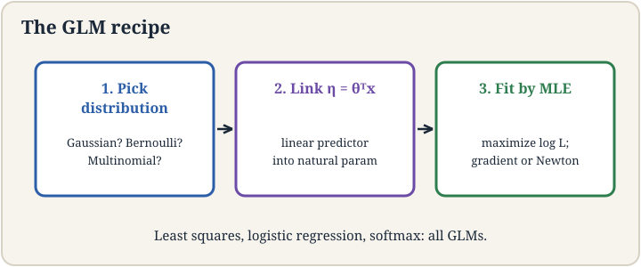

## The job: three diagnoses, one model

Lecture 3 classified tumors: benign or malignant, two classes. Now
the doctor has three possible diagnoses: benign, malignant type A,
malignant type B. The sigmoid gives one probability. We need three
probabilities that sum to 1. More generally, the course so far built
two separate machines: least squares for numbers, logistic regression
for yes-or-no. They feel like different inventions. They are not.
Underneath both sits one distribution family and one three-step
recipe that generates both, plus the multi-class model, for free.

## First attempt: three sigmoids

The naive idea: train three separate logistic regressions, one per
diagnosis, each answering "this one or not?" Watch it break on a
toy. A tumor scores z = (2.0, 1.0, 0.5) on the three one-vs-rest
models. Sigmoids give (0.88, 0.73, 0.62). Sum: 2.23. These are not
probabilities of mutually exclusive outcomes. They do not sum to 1
and they cannot be compared. Normalize by dividing by the sum:
(0.39, 0.33, 0.28). That works, but why this normalization and not
another? And why three separate fits when the classes compete?

The key question: is there one framework where the number-loss, the
yes-no loss, and the multi-class loss are all the same idea with
different settings?

## One family: the exponential family

A large club of distributions shares one algebraic shape. A
distribution is in the **exponential family** if its density can be
written as:

```ascii
p(y; eta) = b(y) * exp(eta^T T(y) - a(eta))
```

Three parts. **eta** is the **natural parameter**: the knob vector of
the distribution. **T(y)** is the **sufficient statistic**: the
function of y the distribution actually cares about (often just y
itself). **a(eta)** is the **log partition function**: the
normalizer that makes the probabilities sum to 1. b(y) is a base
measure that does not involve the knobs.

Check that the Gaussian fits. For y with mean mu and variance 1, some
algebra rewrites the bell curve into exactly this shape with
eta = mu, T(y) = y, and a(eta) = eta^2/2. Check the Bernoulli: for y
in {0,1} with P(y=1) = phi, the mass function rewrites with
eta = log(phi/(1-phi)) (the **logit**), T(y) = y, and
a(eta) = log(1 + e^eta). Both distributions from lectures 2 and 3
live in the same family. The lecture does this algebra live. The
takeaway is the membership, not the manipulation.

The family pays rent immediately. Differentiate the log partition
function a(eta) and you get the mean: d/d(eta) a(eta) = E[T(y)].
For the Gaussian, d/d(eta) (eta^2/2) = eta = mu. The mean falls out
of the normalizer by differentiation. This is not a coincidence for
one distribution. It holds for every member of the family. It is the
machinery the next section uses.

, log partition a(eta). Source: original plate for Stanford Frontier AI.")

## The GLM recipe: three steps

A **generalized linear model** builds a supervised learner from any
exponential-family distribution in three steps.

Step 1: pick the distribution. Model the target as
y | x ~ ExponentialFamily(eta). For house prices, the Gaussian. For
tumors, the Bernoulli.

Step 2: tie the knobs to the input linearly. Set eta = theta^T x.
The natural parameter is a linear function of the features. This is
the "linear" in the name: the model's one linear score drives
everything.

Step 3: read off the prediction. The predicted mean is E[T(y)] =
d/d(eta) a(eta) evaluated at eta = theta^T x.

Run the recipe on the Gaussian: a(eta) = eta^2/2, derivative eta,
so the prediction is theta^T x. Least squares appears. Run it on
the Bernoulli: a(eta) = log(1+e^eta), derivative e^eta/(1+e^eta) =
1/(1+e^-eta). The sigmoid appears, and with it logistic regression.
Two lectures of separate inventions collapse into one recipe with
two settings.



## Softmax: the multi-class answer

For k classes, the distribution is the **multinomial**: one roll of
a k-sided die. Its natural parameter is a vector eta of length k-1
(the last class is the reference). The GLM recipe says: compute a
linear score z_j = theta_j^T x per class, then convert scores to
probabilities. The conversion the exponential family hands us is the
**softmax**:

```ascii
P(y = j | x) = e^(z_j) / sum over c of e^(z_c)
```

Work it on the toy. Scores z = (2.0, 1.0, 0.5). Exponentiate:
(7.39, 2.72, 1.65). Sum: 11.76. Divide: (0.63, 0.23, 0.14). Three
valid probabilities summing to 1, with the highest score getting
the largest share. Unlike three separate sigmoids, the classes now
compete inside one normalization.

Why softmax and not something else? The lecture gives four reasons,
and they are worth memorizing because interviewers ask.

First, it is the GLM answer. The multinomial is in the exponential
family, and the recipe outputs exactly this form. It is not ad hoc.
It is what the framework says.

Second, it is smooth. Scores interpolate into probabilities without
jumps, so gradients flow to every class weight. A hard "pick the
max" would send zero gradient to the losers and throw away
information.

Third, it is the maximum-entropy choice: among all distributions
with the same expected scores, it assumes the least beyond the
data.

Fourth, it is numerically convenient: stable to compute and fast.
The lecture's bottom line is blunt: softmax became the standard
because it has all four properties, and you need a reason to use
anything else.

 become probabilities (0.63, 0.23, 0.14). One normalization, classes compete. Source: original plate for Stanford Frontier AI.")

## Cross-entropy: the multi-class loss

Fit softmax by MLE. The likelihood of the true class j is its
predicted probability p_j. The negative log likelihood is:

```ascii
loss = -log(p_true class)
```

This is the **cross-entropy** loss. Read it on the toy: if the true
diagnosis is class 1 and the model says (0.63, 0.23, 0.14), the loss
is -log(0.63) = 0.46. If the model had said 0.05 for the true class,
the loss would be -log(0.05) = 3.00. Confident and right is cheap.
Confident and wrong is ruinous. For two classes, cross-entropy
reduces exactly to the logistic regression loss of lecture 3. One
loss, all settings.

The gradient keeps the familiar shape: (predicted probabilities
minus the one-hot truth) times features. Error times feature, now
with vector-valued error. Every learning rule in the classical half
of this course is this shape.

## The honest price

The GLM framework buys unity and charges flexibility. Eta must be
linear in x: eta = theta^T x. If the true boundary between classes
is curved, no GLM can draw it. The lecture's tumor example is kind:
real data is not. This linearity ceiling is the reason lectures 7
and 8 exist: neural networks are what you build when you refuse to
accept eta = theta^T x. Second, softmax spreads probability over all
classes, which costs O(k) per prediction. With k = 50,000 words
(lecture 14), that normalization is the bottleneck the rest of the
field works around. Third, cross-entropy punishes confident errors
without bound: one mislabeled example with p = 10^-6 contributes a
loss of 13.8 and drags the fit. Label noise hurts more here than
under squared loss.

## Mapping back

| Idea | Pain it answers | How |
|---|---|---|
| Exponential family | Least squares and logistic regression felt like separate inventions | Both are one shape: eta, T(y), a(eta); the mean is the derivative of the normalizer |
| GLM recipe | Each new target type needed a new derivation | Three steps generate the model from any family member |
| Softmax | Three sigmoids sum to 2.23, not probabilities | One normalization: e^z_j / sum e^z_c; classes compete; (2.0,1.0,0.5) -> (0.63,0.23,0.14) |
| Cross-entropy | Needed a multi-class loss | -log(p_true): 0.46 when right at 0.63, 3.00 when right at 0.05 |

> [!QA]
> Q: What is the exponential family, in one breath?
> A: Distributions whose density factors as b(y) exp(eta^T T(y) - a(eta)): a natural parameter eta, a sufficient statistic T(y), and a log partition function a(eta) that normalizes. Gaussians and Bernoullis are both members. The dividend: the mean is the derivative of a(eta), so predictions fall out of the normalizer by differentiation. It is the shared basement under lectures 2 and 3.
> Follow-up: What is the natural parameter of the Bernoulli?
> A: The logit, eta = log(phi/(1-phi)). Invert it and you get the sigmoid phi = 1/(1+e^-eta). The sigmoid is not a choice. It is the inverse of the Bernoulli's natural parameter mapping.

> [!QA]
> Q: State the three-step GLM recipe and show it producing logistic regression.
> A: One, pick the exponential-family distribution for the target: Bernoulli for yes-or-no. Two, set the natural parameter linearly: eta = theta^T x. Three, predict the mean: E[y] = a'(eta). For the Bernoulli, a(eta) = log(1+e^eta), so a'(eta) = 1/(1+e^-eta), the sigmoid. Logistic regression drops out with no extra assumptions.
> Follow-up: What breaks if you skip step 2 and let eta be a neural network?
> A: Nothing breaks. You get deep learning. Step 2's linearity is the GLM's ceiling. Replace theta^T x with a network and the recipe still works: pick the distribution, drive eta with the network, read off the mean. Lectures 7 and 8 do exactly this.

> [!QA]
> Q: Why softmax? Give all four reasons.
> A: One, it is the GLM's answer for the multinomial: the exponential family dictates the form. Two, it is smooth: every class gets gradient, unlike a hard max that starves the losers. Three, it is maximum entropy: it assumes the least beyond the expected scores. Four, it is numerically convenient and fast. The lecture's verdict: these four together made it the standard, and you need a reason to deviate.
> Follow-up: Compute softmax of (2.0, 1.0, 0.5) and the cross-entropy loss if class 1 is true.
> A: Exponentials: (7.39, 2.72, 1.65), sum 11.76, probabilities (0.63, 0.23, 0.14). Loss = -log(0.63) = 0.46. If the model gave the true class 0.05 instead, the loss would be 3.00: confident errors are punished hard.

## Recap: the whole lesson on one screen

1. **The job.** Three diagnoses, one model. Three sigmoids sum to
   2.23. Not probabilities.
2. **The key question.** Are the number-loss, the yes-no loss, and
   the multi-class loss one idea with different settings?
3. **One family.** p(y. Eta) = b(y) exp(eta^T T(y) - a(eta)).
   Gaussian and Bernoulli both fit. The mean is a'(eta).
4. **The recipe.** Pick the distribution. Set eta = theta^T x.
   Predict a'(eta). Least squares and logistic regression fall out.
5. **Softmax.** e^z_j / sum e^z_c. Toy: (2.0,1.0,0.5) becomes
   (0.63,0.23,0.14). Four whys: GLM-dictated, smooth,
   maximum-entropy, convenient.
6. **Cross-entropy.** -log(p_true class). 0.46 when right at 0.63;
   3.00 when right at 0.05. Reduces to logistic loss at k=2.
7. **The honest price.** Eta is linear: curved boundaries are
   impossible. Softmax costs O(k) per prediction. One mislabeled
   example can dominate the loss.

## Official sources and further reading

**Official:**
- Lecture 4 video, Stanford Online YouTube:
  https://www.youtube.com/watch?v=8gVi4Rk21Eg — Chris Ré fits the
  Gaussian and Bernoulli into the exponential family, states the
  GLM recipe, and derives softmax and cross-entropy with the four
  whys.
- Official subtitle transcript (en-US): the lecture's spoken text.
- CS229 Spring 2026 official course notes (local PDF): the full
  exponential-family algebra the lecture sketches.

**Caveats from these sources.** The lecture does the Gaussian and
Bernoulli rewrites live and fast. The algebra is in the notes, the
membership claim is what matters. The "four whys" of softmax are the
lecture's explicit list: GLM form, smoothness, maximum entropy,
numerical convenience. Maximum entropy is presented as the
philosophical reason the lecturer personally finds least convincing.
It is included because the literature cites it.

## Connections to the other courses

- **CS229 L02-L03:** the two models this lesson unifies: least
  squares and logistic regression.
- **CS229 L05:** the generative alternative: model p(x|y) instead
  of p(y|x).
- **CS229 L07-L08:** breaking the linearity ceiling: eta as a
  neural network.
- **CS229 L14:** softmax at k = 50,000 words: the bottleneck that
  shapes language model training.
- **CS224N:** cross-entropy as the training loss for every neural
  language model.
