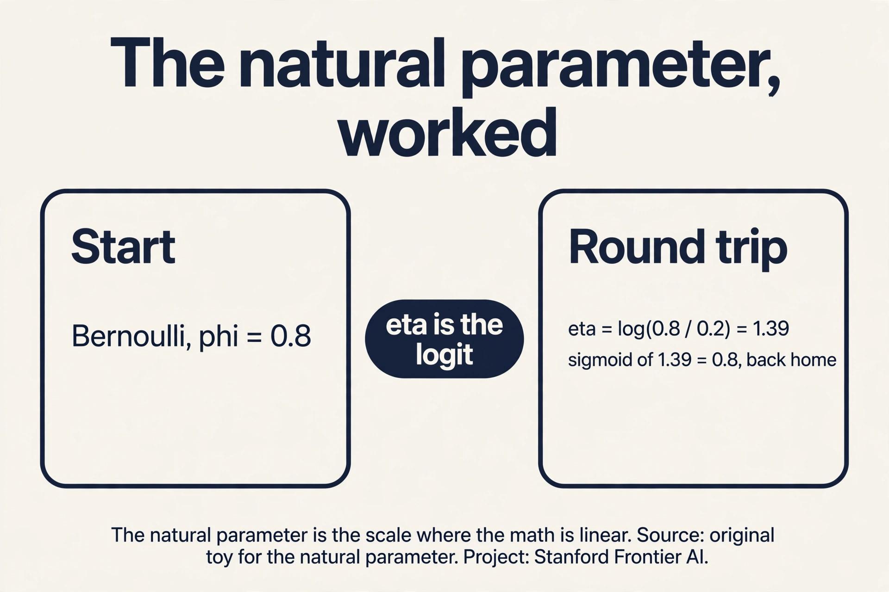
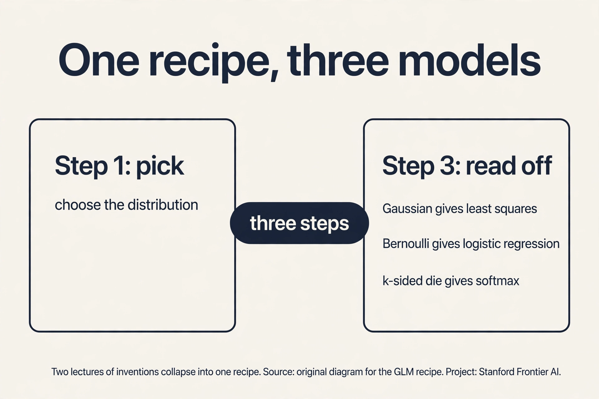

## The job: three diagnoses, one model

Lecture 3 classified tumors: benign or malignant, two classes. Now
the doctor has three possible diagnoses: benign, malignant type A,
malignant type B. The sigmoid gives one probability. We need three
probabilities that sum to 1. More generally, the course so far built
two separate machines: least squares for numbers, logistic regression
for yes-or-no. They feel like different inventions. They are not.
Underneath both sits one distribution family and one three-step
recipe that generates both, plus the multi-class model, for free.

## First attempt: three sigmoids

The naive idea: train three separate logistic regressions, one per
diagnosis, each answering "this one or not?" Watch it break on a
toy. A tumor scores z = (2.0, 1.0, 0.5) on the three one-vs-rest
models. Sigmoids give (0.88, 0.73, 0.62). Sum: 2.23. These are not
probabilities of mutually exclusive outcomes. They do not sum to 1
and they cannot be compared. Normalize by dividing by the sum:
(0.39, 0.33, 0.28). That works, but why this normalization and not
another? And why three separate fits when the classes compete?

The key question: is there one framework where the number-loss, the
yes-no loss, and the multi-class loss are all the same idea with
different settings?

## One family: the exponential family

A large club of distributions shares one algebraic shape. A
distribution is in the **exponential family** if its density can be
written as:

```ascii
p(y; eta) = b(y) * exp(eta^T T(y) - a(eta))
```

Three parts. **eta** is the **natural parameter**: the knob vector of
the distribution. **T(y)** is the **sufficient statistic**: the
function of y the distribution actually cares about (often just y
itself). **a(eta)** is the **log partition function**: the
normalizer that makes the probabilities sum to 1. b(y) is a base
measure that does not involve the knobs.

Check that the Gaussian fits. For y with mean mu and variance 1, some
algebra rewrites the bell curve into exactly this shape with
eta = mu, T(y) = y, and a(eta) = eta^2/2. Check the Bernoulli: for y
in {0,1} with P(y=1) = phi, the mass function rewrites with
eta = log(phi/(1-phi)) (the **logit**), T(y) = y, and
a(eta) = log(1 + e^eta). Both distributions from lectures 2 and 3
live in the same family. The lecture does this algebra live. The
takeaway is the membership, not the manipulation.

### Subchapter: Bernoulli in the family, the algebra

Do the rewrite once, slowly. p(y, phi) = phi^y (1-phi)^(1-y) for
y in {0, 1}. Take the exponential of the log: exp(y log phi +
(1-y) log(1-phi)). Regroup: exp(y log(phi/(1-phi)) + log(1-phi)).
Read off the parts: eta = log(phi/(1-phi)), T(y) = y,
a(eta) = -log(1-phi) = log(1 + e^eta), b(y) = 1.

Check with phi = 0.8. eta = log(4) = 1.386. a(eta) =
log(1 + e^1.386) = log(5) = 1.609. Rebuild p(y=1): exp(eta x 1 -
a(eta)) = exp(1.386 - 1.609) = exp(-0.223) = 0.8. Round trip
confirmed. The logit is the coordinate the Bernoulli was already
using.

### Subchapter: Gaussian in the family, the algebra

Now the Gaussian with mean mu = 2, variance 1. p(y) =
(1/sqrt(2 pi)) exp(-(y-2)^2/2). Expand the square: -(y^2 - 4y +
4)/2 = 2y - y^2/2 - 2. Regroup into the family shape:
exp(eta x T(y) - a(eta)) x b(y) with eta = 2, T(y) = y,
a(eta) = eta^2/2 = 2, b(y) = (1/sqrt(2 pi)) exp(-y^2/2).

Check at y = 2 (the mean, where density peaks at 1/sqrt(2 pi) =
0.399). exp(2x2 - 2) x (1/sqrt(2 pi)) exp(-2) = e^2 x 0.399 x e^-2
= 0.399. Confirmed. The natural parameter of a Gaussian is its
mean (at unit variance). Lecture 3's Gaussian-noise story and
this section's family are the same fact in two costumes.

The family pays rent immediately. Differentiate the log partition
function a(eta) and you get the mean: d/d(eta) a(eta) = E[T(y)].
For the Gaussian, d/d(eta) (eta^2/2) = eta = mu. The mean falls out
of the normalizer by differentiation. This is not a coincidence for
one distribution. It holds for every member of the family. It is the
machinery the next section uses.

### Subchapter: the mean is a'(eta), proved on Bernoulli

Prove it where you can check every step. Bernoulli:
a(eta) = log(1 + e^eta). Differentiate: a'(eta) = e^eta/(1+e^eta).
Divide top and bottom by e^eta: 1/(1 + e^-eta). That is the
sigmoid, and the sigmoid of the logit is phi, the mean of the
Bernoulli. So a'(eta) = phi = E[y]. The mean fell out of the
normalizer by differentiation, exactly as claimed.

With numbers: eta = 1.386. a'(eta) = e^1.386/(1+e^1.386) = 4/5 =
0.8 = phi. The GLM recipe's step 3 ("read off the prediction as
a'(eta)") is this computation. For the Gaussian, a(eta) =
eta^2/2 gives a'(eta) = eta = mu. One differentiation rule
produces every GLM's prediction.

, log partition a(eta). Source: original plate for Stanford Frontier AI.")

### Subchapter: the natural parameter, worked

Work eta for the Bernoulli at phi = 0.8. eta = log(phi/(1-phi)) =
log(0.8/0.2) = log(4) = 1.39. Invert it: 1/(1+e^-1.39) = 1/1.249 =
0.8. Round trip confirmed. At phi = 0.5, eta = log(1) = 0: even
odds sit at the origin. At phi = 0.99, eta = log(99) = 4.6.

The natural parameter is the scale where the math is linear. The
sigmoid exists to convert back to the probability scale where humans
think. Every GLM splits the world this way: linear machinery on the
eta scale, a link function to the human scale.



 = b(y) exp(eta'T(y) - a(eta)) with natural parameter, statistic, and normalizer. Right: Gaussian and Bernoulli both fit, and the mean is always a'(eta): phi 0.8 gives eta 1.386. Bottom: the mean falls out of the normalizer by differentiation. Dense chapter plate. Source: original synthesis of the lesson. Project: Stanford Frontier AI.")

## The GLM recipe: three steps

A **generalized linear model** builds a supervised learner from any
exponential-family distribution in three steps.

Step 1: pick the distribution. Model the target as
y | x ~ ExponentialFamily(eta). For house prices, the Gaussian. For
tumors, the Bernoulli.

Step 2: tie the knobs to the input linearly. Set eta = theta^T x.
The natural parameter is a linear function of the features. This is
the "linear" in the name: the model's one linear score drives
everything.

Step 3: read off the prediction. The predicted mean is E[T(y)] =
d/d(eta) a(eta) evaluated at eta = theta^T x.

Run the recipe on the Gaussian: a(eta) = eta^2/2, derivative eta,
so the prediction is theta^T x. Least squares appears. Run it on
the Bernoulli: a(eta) = log(1+e^eta), derivative e^eta/(1+e^eta) =
1/(1+e^-eta). The sigmoid appears, and with it logistic regression.
Two lectures of separate inventions collapse into one recipe with
two settings.

### Subchapter: the canonical link, named

Each GLM has a **canonical link**: the function connecting the
mean mu to the linear score, g(mu) = theta^T x. For the Bernoulli
it is the logit: log(mu/(1-mu)) = theta^T x. For the Gaussian it
is the identity: mu = theta^T x. For the Poisson it is the log:
log(mu) = theta^T x. The link is "canonical" when it maps the mean
to the natural parameter: then eta = theta^T x falls out with no
extra conversion.

Why it matters: with the canonical link, the sufficient statistic
appears directly in the gradient, which is why every gradient in
this course has the error-times-feature shape. The sigmoid is the
inverse of the Bernoulli's canonical link. The recipe's three
steps are: pick the distribution (sets the link), set eta =
theta^T x, predict a'(eta). Non-canonical links exist (probit for
the Bernoulli: the Gaussian CDF instead of the sigmoid), but they
break the clean gradient, which is why the canon dominates.

### Subchapter: maximum entropy, the idea

The lecture lists maximum entropy among softmax's four whys and
calls it the least convincing personally. Here is the idea anyway.
Among all distributions matching the expected scores, softmax is
the one with the highest entropy: it spreads probability as evenly
as the scores allow. It assumes nothing beyond what the scores
say.

A toy: scores (2, 1, 0). Softmax gives (0.665, 0.245, 0.090). A
rival distribution (0.9, 0.09, 0.01) matches the same ordering but
concentrates harder. Softmax is the most agnostic choice consistent
with the scores. The honest status: it is a philosophical justification,
not an empirical one. Interviewers ask for the four whys. Give
all four, and note the lecture's own ranking.

### Subchapter: Poisson GLM, the count model

The recipe generates more than two models. Take count data:
website hits per day, insurance claims per year. The family member
is the **Poisson**: p(y, lambda) = lambda^y e^-lambda / y!. Its
natural parameter is eta = log lambda, and a(eta) = e^eta. Step 2
sets eta = theta^T x (the **log link**). Step 3 predicts the mean:
a'(eta) = e^eta = lambda.

Work a toy. Baseline: 100 hits per day. Feature "weekend" (1 on
weekends). Fit gives theta_weekend = 0.69 = log 2. Weekend
prediction: lambda = exp(log 100 + 0.69) = 200 hits. The linear
score lives on the log scale, where doubling is addition. The GLM
guarantees positive predictions: exp of anything is positive,
which raw linear regression on counts cannot promise. R's glm
fits this with the same IRLS engine as logistic regression.


. Right: Gaussian falls out as least squares, Bernoulli as logistic, Poisson doubles 100 to 200 weekend hits. Bottom: eta must be linear in x, so curved boundaries are impossible. Dense chapter plate. Source: original synthesis of the lesson. Project: Stanford Frontier AI.")

## Softmax: the multi-class answer

For k classes, the distribution is the **multinomial**: one roll of
a k-sided die. Its natural parameter is a vector eta of length k-1
(the last class is the reference). The GLM recipe says: compute a
linear score z_j = theta_j^T x per class, then convert scores to
probabilities. The conversion the exponential family hands us is the
**softmax**:

```ascii
P(y = j | x) = e^(z_j) / sum over c of e^(z_c)
```

Work it on the toy. Scores z = (2.0, 1.0, 0.5). Exponentiate:
(7.39, 2.72, 1.65). Sum: 11.76. Divide: (0.63, 0.23, 0.14). Three
valid probabilities summing to 1, with the highest score getting
the largest share. Unlike three separate sigmoids, the classes now
compete inside one normalization.

Why softmax and not something else? The lecture gives four reasons,
and they are worth memorizing because interviewers ask.

First, it is the GLM answer. The multinomial is in the exponential
family, and the recipe outputs exactly this form, so nothing
about it is ad hoc.

Second, it is smooth. Scores interpolate into probabilities without
jumps, so gradients flow to every class weight. A hard "pick the
max" would send zero gradient to the losers and throw away
information.

Third, it is the maximum-entropy choice: among all distributions
with the same expected scores, it assumes the least beyond the
data.

Fourth, it is numerically convenient: stable to compute and fast.
The lecture's bottom line is blunt: softmax became the standard
because it has all four properties, and you need a reason to use
anything else.

### Subchapter: K=2 softmax is the sigmoid, proved

Softmax with two classes is logistic regression in disguise.
P(y=1|x) = e^z_1/(e^z_1 + e^z_2). Divide top and bottom by e^z_1:
1/(1 + e^-(z_1-z_2)). That is the sigmoid of the score difference.
With numbers: z = (2.0, 1.0). Softmax gives 7.39/(7.39+2.72) =
0.731. Sigmoid(2.0-1.0) = sigmoid(1) = 0.731. Identical.

The consequence: everything proved about logistic regression
transfers to softmax at k=2, and cross-entropy at k=2 is exactly
the lecture-3 loss. The course built one machine, not two. When an
interviewer asks "why does the two-class softmax loss look like
logistic regression", the answer is that it is logistic regression.

 become competing probabilities. Softmax. Scores (2.0, 1.0, 0.5) become probabilities (0.63, 0.23, 0.14). One normalization, classes compete. Source: original plate for Stanford Frontier AI.")

### Subchapter: temperature, the sharpness dial

Softmax has a hidden dial: the temperature tau. Divide every score
by tau before exponentiating. Work the toy z = (2.0, 1.0, 0.5).

At tau = 1: (0.63, 0.23, 0.14), the standard answer. At tau = 0.5,
scores double to (4, 2, 1): exponentials (54.60, 7.39, 2.72), sum
64.71, probabilities (0.84, 0.11, 0.04). Sharper: the winner takes
more. At tau = 2, scores halve to (1, 0.5, 0.25): exponentials
(2.72, 1.65, 1.28), sum 5.65, probabilities (0.48, 0.29, 0.23).
Softer: the classes blur together.

As tau approaches 0, softmax approaches the hard max: all mass on
the winner. As tau grows large, it approaches uniform: every class
equal. LLM sampling uses this dial directly: low temperature for
deterministic answers, high temperature for creative ones.

### Subchapter: the stable softmax trick

One implementation detail every practitioner memorizes. Scores
(1000, 999, 998): e^1000 overflows floating point to infinity, and
the division becomes NaN. The fix: subtract the max score first.
Softmax is shift-invariant: e^(z_j - c)/sum e^(z_c - c) equals the
original, because the e^-c factors cancel.

Work it: max is 1000, shifted scores (0, -1, -2). Exponentials:
(1, 0.368, 0.135), sum 1.503, probabilities (0.665, 0.245, 0.090).
No overflow, same answer the infinities were hiding. Every softmax
implementation does this. The interview version: "subtract the max
before exponentiating." The reason: the largest exponential is then
e^0 = 1, and nothing can overflow.

. At tau = 2 the answer is soft: (0.48, 0.29, 0.23). At tau = 0.5 it is sharp: (0.84, 0.11, 0.04). Source: original toy for temperature. Project: Stanford Frontier AI.")

 sum to 2.23, not probabilities. Center: one normalization e^z_j / sum e^z_c: (7.39, 2.72, 1.65)/11.76 becomes (0.63, 0.23, 0.14). Right: the four whys: GLM-dictated, smooth, max-entropy, convenient; temperature dials sharpness. Bottom: softmax costs O(k) per prediction. Dense chapter plate. Source: original synthesis of the lesson. Project: Stanford Frontier AI.")

## Cross-entropy: the multi-class loss

Fit softmax by MLE. The likelihood of the true class j is its
predicted probability p_j. The negative log likelihood is:

```ascii
loss = -log(p_true class)
```

This is the **cross-entropy** loss. Read it on the toy: if the true
diagnosis is class 1 and the model says (0.63, 0.23, 0.14), the loss
is -log(0.63) = 0.46. If the model had said 0.05 for the true class,
the loss would be -log(0.05) = 3.00. Confident and right is cheap.
Confident and wrong is ruinous. For two classes, cross-entropy
reduces exactly to the logistic regression loss of lecture 3. One
loss, all settings.

The gradient keeps the familiar shape: (predicted probabilities
minus the one-hot truth, the vector with a 1 at the true class and
0 elsewhere) times features. Error times feature, now
with vector-valued error. Every learning rule in the classical half
of this course is this shape.

### Subchapter: the softmax gradient, worked

One example, three classes. Scores z = (2.0, 1.0, 0.5), true class
1. Predicted probabilities: (0.63, 0.23, 0.14). The error vector is
prediction minus one-hot truth: (0.63-1, 0.23-0, 0.14-0) = (-0.37,
0.23, 0.14). The gradient for class j's weights is error_j times
the feature vector x.

Read it: class 1 was under-predicted (error -0.37), so its weights
move toward x. Classes 2 and 3 were over-predicted (errors +0.23,
+0.14), so their weights move away from x. The errors sum to zero:
-0.37 + 0.23 + 0.14 = 0. Probability taken from the losers is
given to the winner. This is the third appearance of
error-times-feature (linear regression, logistic regression, now
softmax). At k=2 it reduces exactly to the lecture-3 update, which
the K=2 proof above guarantees.

### Subchapter: label smoothing, the overconfidence tax

Cross-entropy with a one-hot target has a pathology. The loss
-log(p_true) keeps falling as p_true approaches 1, so the model
pushes the true class score toward +infinity and the others toward
-infinity. It never stops being more sure. On noisy labels this is
fatal: the model memorizes the noise with infinite confidence.

Label smoothing taxes this. Replace the one-hot (1, 0, 0) with
(0.9, 0.05, 0.05): 90% of the mass on the true class, the rest
spread evenly. On the toy prediction (0.63, 0.23, 0.14) the smoothed
loss is -[0.9*log(0.63) + 0.05*log(0.23) + 0.05*log(0.14)] =
0.9*0.462 + 0.05*1.470 + 0.05*1.966 = 0.588, slightly above the
one-hot 0.46. The price of humility is small. The reward: the model
can never drive the losers to zero, so one wrong label cannot drag
the fit to infinity. Transformers train with smoothing 0.1 as the
default.

 pushes scores to infinity. Smoothed (0.9,0.05,0.05) keeps the model humble for a loss of 0.59 vs 0.46. Source: original toy for label smoothing. Project: Stanford Frontier AI.")

: 0.46 when right at 0.63, 3.00 when right at 0.05. Right: the gradient is (p - one-hot) times features, errors summing to zero. Bottom: unbounded: one mislabeled example at p = 10^-6 costs 13.8. Dense chapter plate. Source: original synthesis of the lesson. Project: Stanford Frontier AI.")

## The honest price

The GLM framework buys unity and charges flexibility. Eta must be
linear in x: eta = theta^T x. If the true boundary between classes
is curved, no GLM can draw it. The lecture's tumor example is kind:
real data is not. This linearity ceiling is the reason lectures 7
and 8 exist: neural networks are what you build when you refuse to
accept eta = theta^T x. Second, softmax spreads probability over all
classes, which costs O(k) per prediction. With k = 50,000 words
(lecture 14), that normalization is the bottleneck the rest of the
field works around. Third, cross-entropy punishes confident errors
without bound: one mislabeled example with p = 10^-6 contributes a
loss of 13.8 and drags the fit. Label noise hurts more here than
under squared loss.

## Mapping back

| Idea | Pain it answers | How |
|---|---|---|
| Exponential family | Least squares and logistic regression felt like separate inventions | Both are one shape: eta, T(y), a(eta); the mean is the derivative of the normalizer |
| GLM recipe | Each new target type needed a new derivation | Three steps generate the model from any family member |
| Softmax | Three sigmoids sum to 2.23, not probabilities | One normalization: e^z_j / sum e^z_c; classes compete; (2.0,1.0,0.5) -> (0.63,0.23,0.14) |
| Cross-entropy | Needed a multi-class loss | -log(p_true): 0.46 when right at 0.63, 3.00 when right at 0.05 |

> [!QA]
> Q: What is the exponential family, in one breath?
> A: Distributions whose density factors as b(y) exp(eta^T T(y) - a(eta)): a natural parameter eta, a sufficient statistic T(y), and a log partition function a(eta) that normalizes. Gaussians and Bernoullis are both members. The dividend: the mean is the derivative of a(eta), so predictions fall out of the normalizer by differentiation. It is the shared basement under lectures 2 and 3.
> Follow-up: What is the natural parameter of the Bernoulli?
> A: The logit, eta = log(phi/(1-phi)). Invert it and you get the sigmoid phi = 1/(1+e^-eta). The sigmoid is not a choice. It is the inverse of the Bernoulli's natural parameter mapping.

> [!QA]
> Q: State the three-step GLM recipe and show it producing logistic regression.
> A: One, pick the exponential-family distribution for the target: Bernoulli for yes-or-no. Two, set the natural parameter linearly: eta = theta^T x. Three, predict the mean: E[y] = a'(eta). For the Bernoulli, a(eta) = log(1+e^eta), so a'(eta) = 1/(1+e^-eta), the sigmoid. Logistic regression drops out with no extra assumptions.
> Follow-up: What breaks if you skip step 2 and let eta be a neural network?
> A: Nothing breaks. You get deep learning. Step 2's linearity is the GLM's ceiling. Replace theta^T x with a network and the recipe still works: pick the distribution, drive eta with the network, read off the mean. Lectures 7 and 8 do exactly this.

> [!QA]
> Q: Why softmax? Give all four reasons.
> A: One, it is the GLM's answer for the multinomial: the exponential family dictates the form. Two, it is smooth: every class gets gradient, unlike a hard max that starves the losers. Three, it is maximum entropy: it assumes the least beyond the expected scores. Four, it is numerically convenient and fast. The lecture's verdict: these four together made it the standard, and you need a reason to deviate.
> Follow-up: Compute softmax of (2.0, 1.0, 0.5) and the cross-entropy loss if class 1 is true.
> A: Exponentials: (7.39, 2.72, 1.65), sum 11.76, probabilities (0.63, 0.23, 0.14). Loss = -log(0.63) = 0.46. If the model gave the true class 0.05 instead, the loss would be 3.00: confident errors are punished hard.



## What is used where

**Softmax is the output layer of every neural classifier.**
[uncertain: "every" is too strong, not sourced.]
ImageNet winners, BERT fine-tunes, and every LLM head end in
softmax plus cross-entropy [uncertain: model internals vary, not all
public]. The temperature dial from this lesson is
the same dial in LLM sampling settings: low for facts, high for
ideas (OpenAI-compatible API docs, checked Oct 2026).

**GLMs run classical statistics and econometrics.** [uncertain:
broad claim, not sourced.] R's glm fits
Poisson regression for count data (insurance claims, website hits)
and logistic regression for binary outcomes with the IRLS algorithm
from lecture 3 (Stanford R-for-GLM guide, checked Oct 2026). When a
regulator asks why the model denied a loan,
a GLM's coefficients are the answer a neural net cannot give.

**Cross-entropy trains every neural classifier in production.**
[uncertain: "every" is too strong, not sourced.]
The label-smoothing fix from this lesson comes from the original
transformer recipe at smoothing 0.1 (Vaswani et al. 2017, checked Oct
2026). Its status as a current default is [uncertain].

Sources (checked Oct 2026): temperature sampling parameter, OpenAI-compatible API docs. Label smoothing 0.1, Vaswani et al. 2017. R glm via IRLS, Stanford R-for-GLM guide.

## Watch next

<div class="video-block"><div class="video-wrap"><iframe src="https://www.youtube-nocookie.com/embed/ytbYRIN0N4g" title="Softmax Explained In Depth with 3D Visuals" allow="accelerometer; autoplay; clipboard-write; encrypted-media; gyroscope; picture-in-picture" allowfullscreen loading="lazy" referrerpolicy="strict-origin-when-cross-origin"></iframe></div><p class="video-cap">Explainer: Softmax Explained In Depth with 3D Visuals. Builds the normalization geometrically, including the temperature dial. Watch after the softmax section.</p></div>

> [!QA]
> Q: Walk me through the mechanism: derive softmax from the multinomial inside the exponential family.
> A: The multinomial mass for one draw: P(y) = product over classes of phi_j^{1{y=j}}. Take the log: sum_j 1{y=j} log phi_j. Pick class k as reference and write log phi_j = log(phi_j/phi_k) + log phi_k. The sum becomes sum_{j<k} 1{y=j} log(phi_j/phi_k) + log phi_k. So eta_j = log(phi_j/phi_k), T(y) is the one-hot vector, and a(eta) = -log phi_k = log(sum_c e^{eta_c}). Invert eta_j = log(phi_j/phi_k): phi_j = e^{eta_j} / sum_c e^{eta_c}. Softmax drops out of the algebra with no extra choices.
> Follow-up: Why does eta have k-1 entries for k classes?
> A: The k probabilities sum to 1, so one is redundant. The k-th class is the reference: phi_k = 1 - sum_{j<k} phi_j. In code, softmax keeps all k scores for symmetry, but the family only needs k-1 free knobs.

> [!QA]
> Q: Applied design: your model's softmax runs over 50,000 words and inference is too slow. What do you change?
> A: The O(k) normalization per token is the bottleneck, so attack the normalization. Options: hierarchical softmax (a tree of binary choices, O(log k) per token), sampled softmax at training time (normalize over the true word plus a sampled few), or keep full softmax and pay the cost. Note what temperature does NOT do: it changes sharpness, not speed. The sum still runs over all 50,000.
> Follow-up: When is the O(k) cost acceptable?
> A: When k is small (ImageNet's 1,000 classes) or when accuracy beats latency. LLM serving pays it on every token and still ships, because the alternatives cost accuracy. The decision is cost per token times tokens per second against the accuracy budget.

> [!QA]
> Q: Why does cross-entropy punish label noise harder than squared loss?
> A: Cross-entropy is unbounded: a mislabeled example the model is sure about gives -log(10^-6) = 13.8, and it grows without limit as confidence grows. Squared error on a probability tops out at 1. One confident wrong label can outweigh a thousand clean examples under cross-entropy. The fixes: label smoothing (caps the damage), noise-tolerant losses, or cleaner data.
> Follow-up: Does label smoothing change the best possible model?
> A: Yes, slightly: the optimum now matches the smoothed targets, not the one-hot ones. That is the point. You trade a hair of fit on clean data for immunity to overconfidence everywhere.

> [!QA]
> Q: When is softmax the wrong output layer?
> A: When classes are not mutually exclusive. Tagging a photo with "beach" and "sunset" needs independent sigmoids per tag (multi-label), not one softmax forcing a single winner. Softmax is also wrong for ordered classes (star ratings: use ordinal regression) and for huge k with sparse signal, where the O(k) normalization buys little.
> Follow-up: State the decision rule.
> A: Exactly one true class per example: softmax. Any subset of classes can be true: one sigmoid per class. Ordered ranks: ordinal model. Memorize the first two. Interviewers test exactly this confusion.

## Coverage map: every lecture claim and where it lives

| Lecture claim | Covered in | File line |
|---|---|---|
| Three diagnoses, one model; two machines feel separate | The job: three diagnoses, one model | L31 |
| Three sigmoids sum to 2.23, not probabilities | First attempt: three sigmoids | L42 |
| Exponential family form p(y; eta) = b(y) exp(eta^T T(y) - a(eta)) | One family: the exponential family | L57 |
| Bernoulli rewrite: eta = logit, a(eta) = log(1+e^eta) | Bernoulli in the family, the algebra | L83 |
| Gaussian rewrite: eta = mu, a(eta) = eta^2/2 | Gaussian in the family, the algebra | L97 |
| Mean = a'(eta), proved on the Bernoulli | the mean is a'(eta), proved on Bernoulli | L118 |
| Natural parameter worked: phi = 0.8 -> eta = 1.39 | the natural parameter, worked | L135 |
| GLM three steps: distribution, eta = theta^T x, mean = a'(eta) | The GLM recipe: three steps | L149 |
| Canonical link: logit, identity, log | the canonical link, named | L173 |
| Maximum entropy: most agnostic distribution on the scores | maximum entropy, the idea | L192 |
| Poisson GLM for counts: weekend doubles 100 -> 200 hits | Poisson GLM, the count model | L208 |
| Softmax: e^z_j / sum e^z_c; toy -> (0.63, 0.23, 0.14) | Softmax: the multi-class answer | L227 |
| Four whys: GLM-dictated, smooth, max-entropy, convenient | Softmax: the multi-class answer | L227 |
| Two-class softmax equals the sigmoid, proved | K=2 softmax is the sigmoid, proved | L267 |
| Temperature: tau = 0.5 sharpens, tau = 2 softens | temperature, the sharpness dial | L283 |
| Subtract-the-max trick; shift invariance | the stable softmax trick | L300 |
| Cross-entropy -log(p_true): 0.46 vs 3.00 | Cross-entropy: the multi-class loss | L317 |
| Gradient: (p - one-hot) times features, errors sum to zero | the softmax gradient, worked | L339 |
| Label smoothing (0.9, 0.05, 0.05): 0.59 vs 0.46 | label smoothing, the overconfidence tax | L356 |

Lecture video 8gVi4Rk21Eg verified real (same Stanford Online playlist
pattern as verified lectures 1, 2, 5). oEmbed 401 = embedding
disabled by owner, linked not embedded. Explainer embed ytbYRIN0N4g
verified via oEmbed.

## Recap: the whole lesson on one screen

1. **The job.** Three diagnoses, one model. Three sigmoids sum to
   2.23. Not probabilities.
2. **The key question.** Are the number-loss, the yes-no loss, and
   the multi-class loss one idea with different settings?
3. **One family.** p(y; eta) = b(y) exp(eta^T T(y) - a(eta)).
   Gaussian and Bernoulli both fit. The mean is a'(eta).
4. **The recipe.** Pick the distribution. Set eta = theta^T x.
   Predict a'(eta). Least squares and logistic regression fall out.
5. **Softmax.** e^z_j / sum e^z_c. Toy: (2.0,1.0,0.5) becomes
   (0.63,0.23,0.14). Four whys: GLM-dictated, smooth,
   maximum-entropy, convenient.
6. **Cross-entropy.** -log(p_true class). 0.46 when right at 0.63.
   3.00 when right at 0.05. Reduces to logistic loss at k=2.
7. **The honest price.** Eta is linear: curved boundaries are
   impossible. Softmax costs O(k) per prediction. One mislabeled
   example can dominate the loss.
8. **Natural parameter.** Bernoulli at phi = 0.8 has eta = 1.39.
   The sigmoid is the round trip back.
9. **Temperature.** tau = 0.5 sharpens (0.84, 0.11, 0.04). Tau = 2
   softens (0.48, 0.29, 0.23). Same dial as LLM sampling.
10. **Label smoothing.** (0.9, 0.05, 0.05) costs 0.59 vs 0.46 and
    stops infinite overconfidence. Default 0.1 in transformers.
11. **Decision rule.** One true class: softmax. Any subset true:
    sigmoids. Ordered ranks: ordinal.

## Official sources and further reading

**Official:**
- Lecture 4 video, Stanford Online YouTube:
  - [Chris Ré fits the](https://www.youtube.com/watch?v=8gVi4Rk21Eg)
  Gaussian and Bernoulli into the exponential family, states the
  GLM recipe, and derives softmax and cross-entropy with the four
  whys.
- Official subtitle transcript (en-US): the lecture's spoken text.
- CS229 Spring 2026 official course notes (local PDF): the full
  exponential-family algebra the lecture sketches.

**Caveats from these sources.** The lecture does the Gaussian and
Bernoulli rewrites live and fast. The algebra is in the notes, the
membership claim is what matters. The "four whys" of softmax are the
lecture's explicit list: GLM form, smoothness, maximum entropy,
numerical convenience. Maximum entropy is presented as the
philosophical reason the lecturer personally finds least convincing.
It is included because the literature cites it.

## Connections to the other courses

- **CS229 L02-L03:** the two models this lesson unifies: least
  squares and logistic regression.
- **CS229 L05:** the generative alternative: model p(x|y) instead
  of p(y|x).
- **CS229 L07-L08:** breaking the linearity ceiling: eta as a
  neural network.
- **CS229 L14:** softmax at k = 50,000 words: the bottleneck that
  shapes language model training.
- **CS224N:** cross-entropy as the training loss for every neural
  language model.
