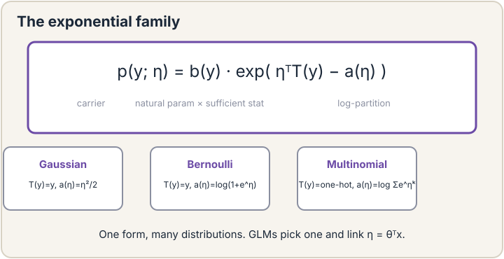

## How to read this lesson

This lesson has two levels. **Level 1 (Core)** contains what you need to
understand everything that follows in CS229 and the courses that build on
it. **Level 2 (Deep)** contains what you need for correct, interview-grade
understanding. Read Level 1 straight through. Return to Level 2 when you
want depth.

No prerequisites are assumed. Every term is defined at first use. MLE and
logistic regression were defined in [lecture 3](l03-logistic-regression.html);
they are reused, not re-explained.

## Level 1: One family for many distributions

Lectures 2 and 3 look like two different stories: Gaussian noise gives
least squares, Bernoulli noise gives logistic regression. They are the
same story. Both distributions belong to the **exponential family**
[00:09](ts:00:09):

p(y; eta) = b(y) * exp(eta^T T(y) - a(eta))

Four parts. **b(y)** is the carrier: bookkeeping that depends only on y.
**eta** is the **natural parameter**: the knob the model turns
[14:30](ts:14:30). **T(y)** is the **sufficient statistic**: the summary
of y that matters. **a(eta)** is the **log-partition function**: the
normalizer that makes probabilities sum to one.

 exp(eta^T T(y) - a(eta)). Gaussian, Bernoulli, multinomial all fit. Original plate.")

Plug in choices and familiar distributions fall out. Gaussian: T(y) = y,
a(eta) = eta^2/2. Bernoulli: T(y) = y, a(eta) = log(1 + e^eta). The
sigmoid from lecture 3 is not a free choice anymore. It is what the
Bernoulli's log-partition function forces. Multinomial extends Bernoulli
to many classes [21:13](ts:21:13).

The log-partition function has a second job. Its derivatives give the
mean and variance of the distribution. Differentiate a(eta) once: you get
the expected value of T(y). Twice: the variance. The normalizer secretly
carries the moments.

> [!QA]
> Q: Why bother unifying distributions into one family?
> A: One derivation covers all of them. Prove that MLE for an exponential-family GLM is concave, and you have proved it for linear regression, logistic regression, and softmax regression at once. The family also tells you which link function is canonical instead of guessing. Unification turns three theorems into one.
> Follow-up: What is the natural parameter intuitively?
> A: The dial that the linear predictor turns. In a GLM you set eta = theta^T x, so theta steers eta, and eta selects the distribution. Everything the model learns flows through eta. The data only ever sees the distribution eta picks.

## Level 1: The GLM recipe

A **generalized linear model** is built in three steps [01:50](ts:01:50).

Step one: pick an exponential-family distribution for y given x.
Gaussian for numbers, Bernoulli for binary labels, multinomial for many
classes. Step two: set the natural parameter eta = theta^T x. This is the
**canonical link**: linear predictor straight into the natural parameter
[15:23](ts:15:23). It is canonical because the mathematics simplifies,
not because anyone voted. Step three: fit theta by MLE, with gradient
ascent or Newton's method from lecture 3.

Least squares, logistic regression, and softmax regression are all GLMs.
Same recipe, different distribution. When you meet a new GLM in the wild,
ask only which distribution it picked. The rest is machinery you already
own.

> [!QA]
> Q: What does a GLM generalize about linear models?
> A: The output distribution. A linear model says y is Gaussian around theta^T x. A GLM says y follows any exponential-family distribution whose natural parameter is theta^T x. The linear predictor stays. The noise model becomes flexible. That is the whole generalization.
> Follow-up: When is the canonical link the wrong choice?
> A: When the problem demands a different shape, like probabilities that saturate asymmetrically. The canonical link is the default that keeps the math clean. Non-canonical links exist and sometimes fit better, but you pay with a harder optimization problem.

## Level 1: Softmax and its four whys

For K classes, the GLM with a multinomial distribution gives **softmax**
[01:57](ts:01:57). Logits z_1..z_K go in, probabilities come out:

softmax(z)_k = e^(z_k) / sum_j e^(z_j)

The lecture gives four reasons softmax won. One: positivity. Exponentials
are never negative, so every class gets a valid probability. Two:
**maximum entropy**. Among distributions matching the observed averages,
softmax assumes the least beyond the data [68:43](ts:68:43). Three:
numerical stability. Subtracting the max logit before exponentiating
avoids overflow with zero change to the result. Four: gradients flow to
all classes, so every logit learns from every example.

Softmax appears twice in every transformer: once in attention
[02:34](ts:02:34), once in the final layer that picks the next token.
Lecture 14 reuses it without re-deriving it. The probabilities it emits
are the model's uncertainty, made explicit.

> [!QA]
> Q: Why exponentiate instead of just normalizing the logits?
> A: Logits can be negative, and probabilities cannot. Dividing raw logits by their sum can give negative or undefined values. The exponential maps everything to positive numbers first, then normalization makes them sum to one. As a bonus, the exponential is what the multinomial's log-partition function demands, so the choice is canonical, not ad hoc.
> Follow-up: What goes wrong numerically, and what is the fix?
> A: E^z overflows for large z. The fix: subtract the maximum logit from all logits before exponentiating. Shifting every logit by a constant cancels in the fraction, so the output is identical and the largest exponential is e^0 = 1. Every serious implementation does this.

## Level 1: Cross-entropy and label smoothing

The MLE loss for classification has a name: **cross-entropy**
[61:10](ts:61:10). For one example with true class c:

loss = -log p_c

where p_c is the model's predicted probability of the true class. Wrong
and confident is punished hardest: p_c near zero sends the loss toward
infinity. The loss chip from lecture 2 now holds cross-entropy. Same
chip, new formula.

**Label smoothing** softens the target [63:45](ts:63:45). Instead of
demanding probability 1 on the true class, it asks for 1 - epsilon on
the true class and spreads epsilon over the rest. Why: hard targets make
the model overconfident and push logits toward infinity. Smoothing is a
small admission of uncertainty in the labels. It usually helps
calibration and rarely hurts accuracy.

> [!QA]
> Q: Cross-entropy or squared loss for classification?
> A: Cross-entropy. It is the MLE loss for discrete outputs, so it matches the probabilistic story. Squared loss on probabilities punishes confident errors too weakly and has no clean reading. Lecture 2 noted squared loss sometimes works anyway. Prefer the principled one unless you have evidence otherwise.
> Follow-up: Does label smoothing change the best achievable loss?
> A: Yes, deliberately. With hard targets the optimum pushes logits to infinity. Smoothing caps them: the model stops pushing once it matches the soft target. That is the point. Infinite logits are overconfidence, and overconfidence generalizes badly.

## Level 2: Maximum entropy, properly

The maximum-entropy justification deserves one careful paragraph. Among
all distributions with a given expected value of T(y), the exponential
family member is the one with the highest entropy: it assumes nothing
beyond the constraints. Softmax is therefore the most honest distribution
consistent with the observed class averages. This is a theorem, not a
slogan. It is also why the exponential family keeps appearing: nature
plus honesty keeps producing it.

The practical consequence: when your features are the class averages you
trust, softmax is the default. Reaching for a fancier output distribution
needs a reason stronger than taste.

## Level 2: What GLMs cannot do

GLMs draw linear boundaries in feature space. Eta = theta^T x is linear
in x, always. If the classes are tangled so no line separates them, no
GLM fixes it. Two escapes. Engineer better features by hand, the classic
answer. Or let the model learn the features, which is the neural network
answer of lecture 7. GLMs are the ceiling of linear methods. The course
spends the next lectures breaking through that ceiling.

## Recap: the whole lesson on one screen

Eight ideas carry this lecture. Read each card. Say the core sentence out
loud. If you can, you own the lesson.

<strong>1. One family, many distributions</strong>

p(y; eta) = b(y) exp(eta^T T(y) - a(eta)). Gaussian, Bernoulli,
multinomial all fit. The sigmoid was forced, not chosen.

Key: eta is the knob; a(eta) normalizes

<strong>2. GLMs: pick, link, fit</strong>

Pick a distribution. Set eta = theta^T x, the canonical link. Fit by
MLE. Least squares, logistic, and softmax are all GLMs.

Key: distribution plus linear eta

<strong>3. Softmax turns logits into probabilities</strong>

Exponentiate, normalize. Positive, sums to one. Lives in attention and
in every LLM's final layer.

Key: e^z_k / sum e^z_j

<strong>4. Four whys of softmax</strong>

Positivity. Maximum entropy: honest given the averages. Numerical
stability via max subtraction. Gradients reach every class.

Key: positive, honest, stable, full gradients

<strong>5. The log-partition function carries moments</strong>

Differentiate a(eta) once for the mean, twice for the variance. The
normalizer is not bookkeeping. It is the distribution's summary.

Key: a'(eta) = mean, a''(eta) = variance

<strong>6. Cross-entropy is classification MLE</strong>

Loss = -log p of the true class. Confident errors explode the loss.
The loss chip holds a new formula. Same chip.

Key: -log p_true

<strong>7. Label smoothing admits uncertainty</strong>

Target 1 - epsilon on truth, spread epsilon elsewhere. Stops logits
running to infinity. Better calibration, rarely worse accuracy.

Key: soften targets, curb overconfidence

<strong>8. GLMs are linear in x, always</strong>

Eta = theta^T x cannot bend. Tangled classes need better features or
learned features. GLMs are the ceiling of linear methods.

Key: linear boundary; next: neural nets

## Official sources and further reading

**Official:**
- Lecture 4 video: exponential family [00:09](ts:00:09), GLM family [01:50](ts:01:50), softmax [01:57](ts:01:57), cross-entropy [61:10](ts:61:10), label smoothing [63:45](ts:63:45), maximum entropy [68:43](ts:68:43).
- CS229 Spring 2026 official course notes: GLM chapter.

**Further reading:**
- Nelder and Wedderburn (1972), "Generalized Linear Models": the founding paper.
- Jaynes (1957), "Information Theory and Statistical Mechanics": maximum entropy, for the curious.

**Caveats from these sources.** The maximum-entropy argument assumes your
constraints are the averages you actually trust; wrong constraints give
confidently wrong distributions. Label smoothing's epsilon is a
hyperparameter with no universal value; 0.1 is common, not canonical.
Softmax probabilities are often miscalibrated on modern deep nets even
with smoothing; calibration is its own topic.

## Connections to the other courses

- **CS336:** softmax is the final layer of every language model; cross-entropy on next-token prediction is the training loss of the entire course.
- **CS224N:** the attention softmax and the output softmax are the same function in two roles.
- **CS329H:** Bradley-Terry models are Bernoulli GLMs; reward models are logistic regression on preferences.

> [!CHEAT]
> **GLM cheatsheet.** Exponential family: p(y; eta) = b(y) exp(eta^T T(y) - a(eta)). Natural parameter eta is the dial. Log-partition a(eta): derivatives give mean, variance. GLM recipe: pick distribution, eta = theta^T x (canonical link), fit by MLE. Members: least squares (Gaussian), logistic (Bernoulli), softmax (multinomial). Softmax: e^z_k / sum e^z_j; subtract max for stability. Cross-entropy: -log p_true. Label smoothing: soften targets, curb infinity.

> [!MEMORY]
> **Pick, link, fit.** Every GLM is three decisions. The distribution you assume. The link from linear predictor to parameter. The MLE fit. New GLM in the wild: ask which distribution it picked. The rest is machinery.
