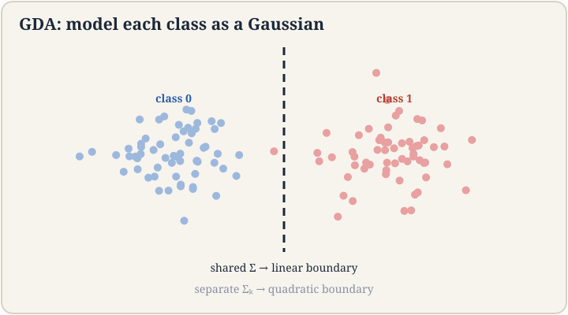
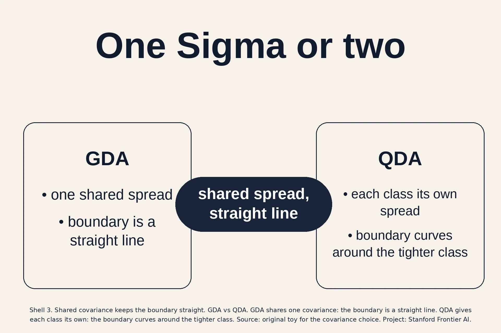
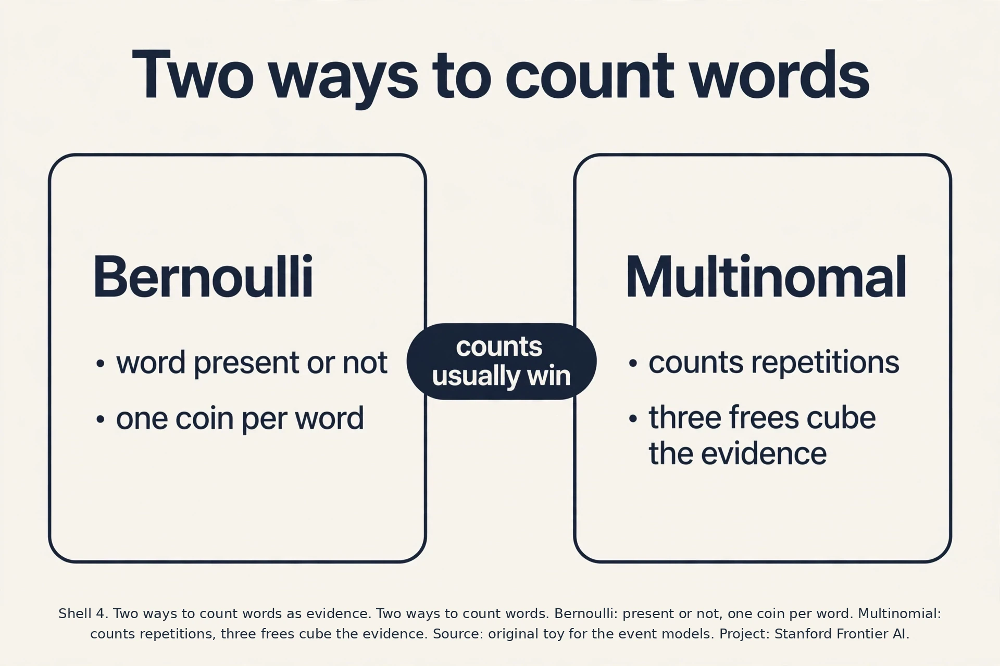
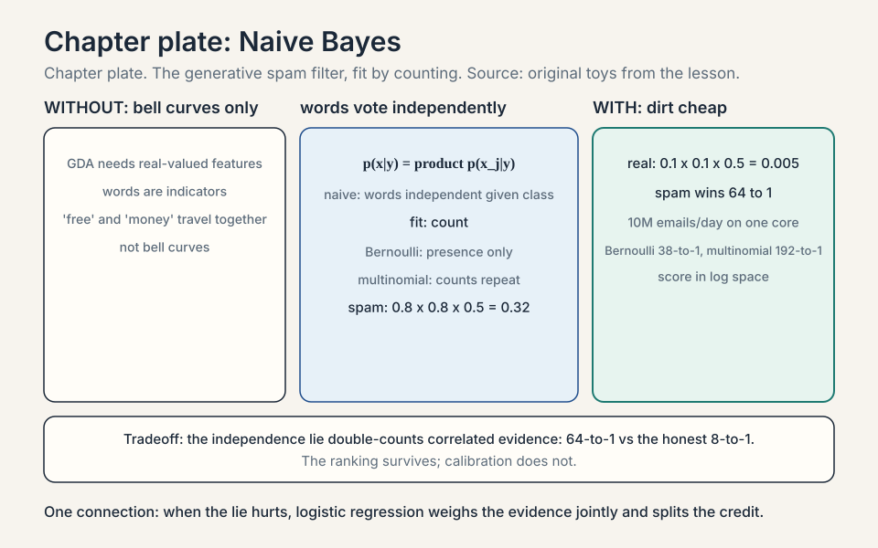
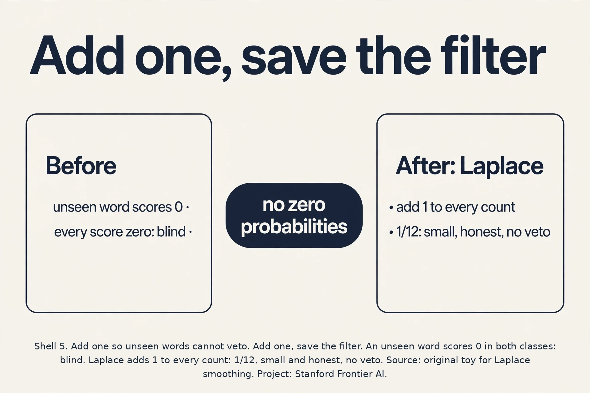
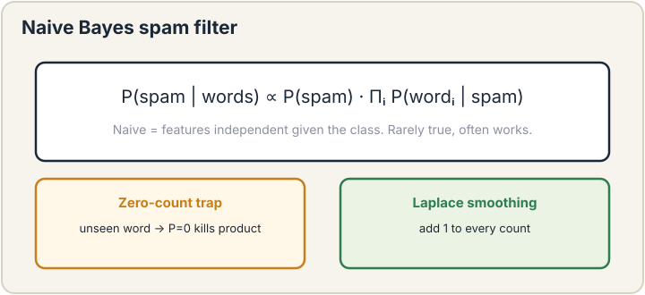

## The job: a cat or a small elephant

A new animal arrives at the shelter. It weighs 40 kilograms. Is it
a very large cat or a very small elephant? You have records: 100
cats with their weights, 100 elephants with theirs. The lecture's
running toy uses exactly this: two species, one feature, weight.

Logistic regression would draw a boundary directly: find the line
that best separates cats from elephants. That is the
**discriminative** approach: model p(y|x), the probability of the
class given the features, and learn the boundary. Every model so far
in this course was discriminative.

But there is another way to use the records. Model each species on
its own: the distribution of cat weights, and the distribution of
elephant weights. A 40 kg animal is a plausible small elephant and
an implausible giant cat, so call it an elephant. This is the
**generative** approach: model p(x|y), the distribution of features
inside each class, plus p(y), how common each class is. Then use
Bayes' rule to flip it around:

```ascii
p(y | x) = p(x | y) * p(y) / p(x)
```

Read it: the probability it is an elephant given 40 kg equals how
likely 40 kg is for elephants, times how common elephants are,
divided by how likely 40 kg is overall. The denominator p(x) is the
same for both species, so the decision is: pick the class with the
bigger p(x|y) * p(y).

### Subchapter: LDA, the other name

GDA with shared **covariance** (how the features vary together, the
shape of the spread) has a second name: **LDA**, linear
discriminant analysis. Same model, same linear boundary, older
name (Fisher, 1936). Interviewers use both. "LDA" usually means the
shared-covariance Gaussian classifier. "QDA" means the
separate-covariance version. "GDA" is the course's name for the
shared version. Three names, two models: LDA = GDA (linear),
QDA (quadratic).

The naming trap: "discriminant analysis" sounds discriminative,
but LDA/GDA are generative: they model p(x|y), not the boundary.
Fisher's original LDA was derived differently (maximizing the ratio
of between-class to within-class scatter), but the Gaussian
shared-covariance model gives the same linear boundary. When a
job posting says "LDA," read GDA.

### Subchapter: one dataset, two roads

Run both roads on one toy. Class 0: (0,0), (1,0). Class 1: (0,2),
(1,2). Discriminative road: draw the boundary directly. The
classes separate cleanly at y = 1. A logistic fit puts the line
there.

Generative road: model each class. mu_0 = (0.5, 0), mu_1 =
(0.5, 2), shared Sigma = small. The bells cross at the midpoint:
y = 1. Same line. The discriminative road asked "where is the
dividing line". The generative road asked "what does each class
look like" and the line fell out. Two framings, one boundary. The
roads diverge when the class models are wrong: then the
discriminative line still fits the boundary, while the generative
line inherits the class models' mistakes.

, draw the line directly. Generative: model each class, the line falls out of Bayes rule. Source: original diagram for the two framings. Project: Stanford Frontier AI.")

## First attempt: compare the averages

The naive idea: compute the average cat weight and the average
elephant weight, and pick whichever average the new animal is
closest to. Toy numbers: cats average 4 kg, elephants average 4,000
kg. A 40 kg animal is closer to 4 than to 4,000, so call it a cat.
Wrong, and obviously wrong: 40 kg is 10 times the cat average but a
perfectly ordinary small elephant.

The failure: averages throw away spread. Cat weights cluster
tightly around 4 kg. Elephant weights spread widely. Averages-only
comparison cannot see that 40 kg sits 36 standard deviations above
the cat mean but well inside the elephant range. The fix is to model
the full distribution of each class, spread included. That is what
generative models do.

 = p(x|y)p(y)/p(x): model each class, pick the biggest p(x|y) times p(y). Right: two roads to the same line at y = 1; they diverge when the class models are wrong. Bottom: class models cost assumptions and buy one-pass training. Dense chapter plate. Source: original synthesis of the lesson. Project: Stanford Frontier AI.")

## Gaussian discriminant analysis

Model each class's features as a **Gaussian** (bell curve). For the
toy, one feature: cat weights ~ Gaussian(mean 4, variance 1),
elephant weights ~ Gaussian(mean 4000, variance 40000). A new animal
weighing x gets two scores: the bell-curve height at x for cats, and
for elephants. Multiply each by the class frequency p(y). Pick the
bigger.

Fit by MLE, and the estimates are embarrassingly simple: the mean is
the average of the class's examples, the variance is the average
squared deviation, and p(y) is the class fraction. Closed form, one
pass over the data. The lecture stresses this: GDA is dirt cheap to
train.

### Subchapter: GDA's MLE, proved

The proof is one line per parameter: maximize the joint log
likelihood sum log p(x^(i)|y^(i)) + log p(y^(i)). The class
fraction phi separates: derivative gives phi_hat = (number of
class-1 examples)/m. The means separate per class: mu_0_hat is the
average of class 0's examples, mu_1_hat the average of class 1's.
The shared covariance pools both classes' squared deviations:
Sigma_hat = (1/m) sum (x^(i) - mu_{y^(i)})(x^(i) -
mu_{y^(i)})^T.

Work it on class 0 = {1, 3}, class 1 = {7, 9}. mu_0 = 2, mu_1 = 8,
phi = 0.5. Squared deviations: (1-2)^2 + (3-2)^2 + (7-8)^2 +
(9-8)^2 = 4, over 4 examples: Sigma = 1. Four numbers, one pass,
done. No iterations, no learning rate, no initialization. This is
what "dirt cheap" means: the fit is arithmetic, not optimization.

In two dimensions the Gaussian needs a **covariance matrix** Sigma:
it describes spread in each direction and how features vary together.
**GDA** (Gaussian discriminant analysis) models p(x|y=0) and
p(x|y=1) as Gaussians with different means mu_0, mu_1 but a shared
covariance Sigma. Why shared? With one shared Sigma, the quadratic
terms in the two bell curves cancel when you compare them, and the
decision boundary becomes a straight line. The lecture's demo shows
two elliptical clouds and the line between them: classify by which
side of the line a point falls on.

Work the boundary on a toy. One feature, cats ~ Gaussian(4, 1),
elephants ~ Gaussian(40, 1), equal class frequencies. A new animal
weighs x. Compare the two densities: the decision flips where they
are equal. With equal variances, that is the midpoint: x = 22. Below
22, the cat bell is taller. Above, the elephant bell. The boundary
is one number. In d dimensions with shared Sigma, the same algebra
gives a linear boundary: w^T x + b = 0, with w = Sigma^-1 (mu_1 -
mu_0). GDA, the generative model, produces a linear classifier, the
same shape as logistic regression's. Different road, same destination.

### Subchapter: the quadratic that cancels, step by step

See exactly where linearity comes from. Decide by comparing log
p(x|y=1) p(y=1) against log p(x|y=0) p(y=0). Each Gaussian
log-density is -(1/2)(x - mu)^T Sigma^-1 (x - mu) plus constants.
Expand: -(1/2) x^T Sigma^-1 x + mu^T Sigma^-1 x - (1/2) mu^T
Sigma^-1 mu. The first term, -(1/2) x^T Sigma^-1 x, is identical
for both classes because Sigma is shared. In the difference, it
cancels.

What survives is linear in x: (mu_1 - mu_0)^T Sigma^-1 x, plus the
constant -(1/2) mu_1^T Sigma^-1 mu_1 + (1/2) mu_0^T Sigma^-1 mu_0
+ log(phi/(1-phi)). The decision is w^T x + b > 0 with
w = Sigma^-1 (mu_1 - mu_0). The linearity is not an assumption. It
is the shared covariance deleting the quadratic term. Give each
class its own Sigma and the x^T Sigma^-1 x terms differ: nothing
cancels, and the boundary keeps its x^2 terms. That is QDA.



### Subchapter: the prior p(y), worked

The p(y) factor is not decoration. Ten thousand emails: 9,000 real,
1,000 spam. p(spam) = 0.1, p(real) = 0.9. A new email has word
scores p(words|spam) = 0.05 and p(words|real) = 0.008. The
likelihood favors spam 6 to 1. Multiply by the priors: spam gets
0.05 x 0.1 = 0.005, real gets 0.008 x 0.9 = 0.0072. Real wins.

The rare class must shout louder to win: its likelihood advantage
has to beat the 9-to-1 prior handicap. This is correct behavior
when the priors match deployment: most mail is real. It is a trap
when they do not: train on 50/50 lab data, deploy on 99/1 real
traffic, and the prior misleads every decision. The fix is to set
p(y) from deployment frequencies, not training frequencies, or to
tune the decision threshold on a validation set afterward.

### Subchapter: QDA, the quadratic sibling

GDA shares one covariance across classes. Drop that and each class
gets its own Sigma. The model is now **QDA** (quadratic discriminant
analysis). The quadratic terms no longer cancel, so the boundary
curves: it bends around the tighter class like a fence around a
small yard.

Count the price. In d = 2, GDA fits 2 means (4 numbers), 1 Sigma (3
numbers), and the class fraction: 8 knobs. QDA fits 2 means and 2
Sigmas: 11 knobs. In d = 100, GDA needs about 5,251 knobs and QDA
about 10,301. Double the knobs, double the data needed to fit them
without overfitting. The decision rule: shared spread, use GDA.
Wildly different spreads and plenty of data, QDA earns its keep.

### Subchapter: QDA decision, worked

Watch the quadratic boundary appear in one dimension. Class 0 ~
Gaussian(0, 1), class 1 ~ Gaussian(3, 4) (standard deviation 2),
equal priors. Set the densities equal: (1/sqrt(2 pi)) exp(-x^2/2)
= (1/sqrt(8 pi)) exp(-(x-3)^2/8). Take logs and simplify:
x^2/2 - (x-3)^2/8 = log 2 = 0.693. Multiply by 8: 4x^2 - (x^2 -
6x + 9) = 5.545. So 3x^2 + 6x - 14.545 = 0, giving x = 1.42 or
x = -3.42.

Two crossing points: the boundary is quadratic, not a single
number. Class 0, the tighter bell, wins the middle interval
(-3.42, 1.42). Class 1, the wider bell, wins both tails: its fat
tails beat the tight bell far from both centers. The picture is
the fence around the small yard from the QDA subchapter, now with
coordinates. GDA would have drawn one line and missed the tails
entirely.



, the discriminative road. Center: per-class Gaussians fit by class averages in one pass: the bells cross at x = 22. Right: shared covariance gives w = Sigma^-1(mu_1 - mu_0): linear, 5,251 knobs vs QDA's 10,301 at d = 100. Bottom: shared spread buys linearity and half the knobs. Dense chapter plate. Source: original synthesis of the lesson. Project: Stanford Frontier AI.")

## The key question

GDA needs real-valued features and bell curves. What about the spam
filter from lecture 1, where the features are words: does the email
contain "free"? does it contain "meeting"? Words are not bell
curves. Can the generative idea survive discrete features?

## Naive Bayes: the generative spam filter

Yes. Keep the generative frame, change the distribution. Represent
each email as a vector of word indicators: x_j = 1 if word j appears.
Model p(x|y) with the **naive** assumption: given the class, each
word appears independently of the others. "Naive" because it is
false: "free" and "money" travel together in spam. The model ignores
that.

Under independence, p(x|y) factors into a product over words:
p(x_1|y) * p(x_2|y) * ... . Each factor is one coin flip: how often
word j appears in class y's mail. Fit by MLE: count. The probability
that "free" appears in spam is (spam emails containing "free") /
(all spam emails). One pass over the corpus. The lecture's verdict:
dirt cheap to train, surprisingly accurate, dirt cheap at inference
too: look up the word probabilities, multiply (or add the logs),
pick the bigger class.

### Subchapter: when independence fails badly, worked

The lie has a worst case: perfectly correlated features. Two
features, x_1 and x_2, where x_2 = x_1 always (a duplicated
column). Spam: x_1 = 1 in 80% of spam. Real: x_1 = 1 in 10% of
real. Naive Bayes counts the evidence twice: spam score gets
0.8 x 0.8 = 0.64, real gets 0.1 x 0.1 = 0.01. The likelihood ratio
is 64 to 1. The honest ratio, counting the evidence once, is 8 to
1. The model is 8 times overconfident.

With ten duplicated columns the ratio becomes 8^10: astronomical
overconfidence from one real signal. The ranking usually survives
(spam still wins), but the probabilities are fiction. The fixes in
order: drop duplicated features, or move to logistic regression,
which weighs the evidence jointly and splits the credit. The
interview line: "Naive Bayes double-counts correlated evidence.
The argmax (the class with the highest score) survives, the calibration does not."

Work a toy. Vocabulary: {free, meeting}. Training: 10 spam, 10 real.
"free" appears in 8 spam, 1 real. "meeting" appears in 2 spam, 9
real. New email contains "free" but not "meeting". Score spam:
p(free|spam) * p(no meeting|spam) * p(spam) = 0.8 * 0.8 * 0.5 =
0.32. Score real: 0.1 * 0.1 * 0.5 = 0.005. Spam wins by 64 to 1.
The logs make it addition: log scores add per word, which is how
implementations do it.

### Subchapter: two ways to count words

The lesson's Naive Bayes is the **multivariate Bernoulli** model:
each word is present or not, one coin per word. There is a second
event model: the **multinomial**. It counts repetitions. An email
with "free" three times contributes p(free|spam) once under
Bernoulli and p(free|spam)^3 under multinomial.

The multinomial usually wins on long documents, where repetition
carries signal: three "free"s is stronger evidence than one. The
Bernoulli model can win on short texts, where presence is all there
is. Scikit-learn ships both: BernoulliNB and MultinomialNB. The
decision rule: short texts, try Bernoulli. Long documents, start
multinomial.

### Subchapter: the multinomial event model, worked

Score the document "free free money" under both models.
Vocabulary: {free, money, meeting}. Spam word probabilities:
p(free|spam) = 0.4, p(money|spam) = 0.3, p(meeting|spam) = 0.05.
Real: p(free|real) = 0.05, p(money|real) = 0.1, p(meeting|real) =
0.4. Equal priors.

Bernoulli (presence only): spam score = 0.4 x 0.3 x (1-0.05) =
0.114. Real score = 0.05 x 0.1 x (1-0.4) = 0.003. Ratio: 38 to 1.
The second "free" changed nothing: presence is binary.

Multinomial (counts): spam score = 0.4^2 x 0.3 = 0.048. Real
score = 0.05^2 x 0.1 = 0.00025. Ratio: 192 to 1. The repeated
"free" squared its evidence: 0.4^2 vs 0.05^2. On long documents
this compounding is the signal. On a three-word text it is mostly
the same verdict, louder. The lecture's guidance: the event model
is a modeling choice about what repetitions mean, not a detail.





## Where it breaks: the zero that kills

Now the failure the lecture spotlights. A new email contains the
word "congratulations". It never appeared in the 20 training emails.
MLE says p(congratulations|spam) = 0/10 = 0 and
p(congratulations|real) = 0/10 = 0. The product for both classes is
zero. Every email containing any unseen word scores zero for both
classes, and the classifier goes blind. One unseen word vetoes
everything else the email says.

The fix is **Laplace smoothing**: pretend you saw each word once
more than you did. Add 1 to every count:

```ascii
p(word j | class y) = (count of j in y + 1) / (total words in y + vocabulary size)
```

The toy: p(congratulations|spam) = (0+1)/(10+2) = 1/12 instead of 0.
The unseen word now contributes a small, honest probability instead
of a veto. The lecture calls this "the magic": it prevents zero
probabilities and shrinks confidence in all estimates, pulling wild
fractions like 1/1 back toward uniform. It is the simplest form of
**regularization**, the theme of lecture 6.





### Subchapter: the log trick, again

The toy multiplies three numbers. A real email has thousands of
words, each with probability far below 1. The product underflows to
zero in floating point, exactly the disease the log cured in lecture
3. Implementations add logs: log(0.32) = -1.14, log(0.005) = -5.30.
The decision is unchanged (bigger is still better), and no product
ever touches zero. Every Naive Bayes implementation scores in log
space. Memorize the pair: the toy score was (0.32, 0.005), the log
score is (-1.14, -5.30).

/(10+2) = 1/12, small, honest, and non-vetoing. Right: no vetoes: wild fractions shrink toward uniform, scored in log space as (-1.14, -5.30). Bottom: the price of humility is small. Dense chapter plate. Source: original synthesis of the lesson. Project: Stanford Frontier AI.")

## The honest price

Generative models buy cheap training and pay in assumptions. GDA
assumes each class is Gaussian with shared covariance. Real classes
are lumpy, skewed, multimodal. The bell curve is wrong and the line
it draws is wrong with it. Naive Bayes assumes words are
independent given the class. "Free" and "money" are not independent.
The model double-counts correlated evidence and grows overconfident.
The lecture is candid: these models are "ad hoc" in their
assumptions, and discriminative models usually win on pure accuracy
when data is plentiful, because they model the boundary directly
instead of modeling each class and hoping the boundary comes out
right. What generative models keep: one-pass training, tiny
inference cost, and they work when data is scarce, because the
strong assumptions squeeze more from fewer examples.

### Subchapter: Ng and Jordan, the sample-complexity duel

The small-data claim has a theorem behind it. Ng and Jordan
("On Discriminative vs. Generative Classifiers," 2001) compared
logistic regression against GDA head to head. The result: GDA
reaches its asymptotic (higher) error with O(log n) examples,
while logistic regression needs O(n) examples to reach its
asymptotic (lower) error. With n features, GDA needs on the order
of log n samples to get close to its best. Logistic regression
needs on the order of n.

At n = 1,000 features: GDA is near its ceiling with tens of
examples, logistic regression needs hundreds. But GDA's ceiling is
higher: with infinite data, the discriminative model wins, because
it optimizes the boundary directly. The practical duel: data
scarce, go generative. Data plentiful, go discriminative. This is
the theoretical spine of the lecture's "dwarfs" remark, and it is
why GDA still ships in clinics and cold starts while logistic
regression owns the data-rich world.

## Mapping back

| Idea | Pain it answers | How |
|---|---|---|
| Generative framing | Discriminative models learn only the boundary | Model p(x\|y) and p(y); Bayes' rule gives p(y\|x); full class distributions, not just the dividing line |
| GDA | Averages-only comparison ignores spread | Bell curves per class with shared Sigma; MLE is class averages; boundary is linear: w = Sigma^-1(mu_1 - mu_0) |
| Naive Bayes | GDA needs bell curves; words are discrete | Word indicators with the independence assumption; fit by counting; toy: spam wins 0.32 to 0.005 |
| Laplace smoothing | One unseen word zeroes every score | Add 1 to every count: (0+1)/(10+2) = 1/12; no vetoes, shrunk confidence |

> [!QA]
> Q: What is the difference between generative and discriminative models?
> A: A discriminative model learns p(y|x) directly: given the features, which class? Logistic regression draws the boundary. A generative model learns p(x|y) and p(y): what each class looks like, and how common it is. Then Bayes' rule flips it into p(y|x) for decisions. GDA models each class as a Gaussian. Naive Bayes models each class as word probabilities. Generative training is usually closed-form counting. Discriminative training is usually iterative optimization.
> Follow-up: When does the generative approach win?
> A: When data is scarce. The strong assumptions (Gaussian classes, independent words) squeeze more signal from few examples. With plentiful data, discriminative models usually win on accuracy because they optimize the boundary directly instead of hoping it falls out of the class models. The lecture notes the discriminative versions "dwarf" the generative ones in modern use, but GDA and Naive Bayes remain the cheap, fast baseline.

> [!QA]
> Q: Why does GDA with shared covariance give a linear boundary?
> A: Compare the two Gaussian densities at a point x. Each has a quadratic term x^T Sigma^-1 x in the exponent. With one shared Sigma, that term is identical for both classes and cancels in the comparison. What remains is linear in x: w^T x + b with w = Sigma^-1(mu_1 - mu_0). The decision "which bell is taller" becomes "which side of a line". Give each class its own covariance and the quadratics survive: the boundary becomes quadratic (that model is called QDA).
> Follow-up: What are the MLE estimates for GDA?
> A: mu_0 is the average of class 0's examples, mu_1 the average of class 1's, Sigma the average squared deviation pooled across classes, and p(y=1) the fraction of class-1 examples. All closed form, one pass. No iterations, no learning rate.

> [!QA]
> Q: What breaks in Naive Bayes without Laplace smoothing, and what does smoothing do?
> A: Any word unseen in training gets probability 0 in both classes by raw counting. One such word in a new email zeroes the whole product, and classification collapses. Laplace smoothing adds 1 to every word count: p = (count + 1)/(total + V). The unseen word gets 1/(total+V) instead of 0: small, honest, non-vetoing. It also shrinks every estimate toward uniform, taming wild fractions from tiny samples. The lecture calls it the simplest regularization.
> Follow-up: Is the independence assumption ever true?
> A: Almost never, and the model works anyway. Correlated words get double-counted, which inflates confidence but usually preserves the ranking of the classes. When ranking is all you need, the wrong assumption is cheap and fast. When you need calibrated probabilities, it is a real problem.

> [!QA]
> Q: Walk me through the mechanism: fit GDA by hand on class 0 = {1, 3} and class 1 = {7, 9}, equal class fractions.
> A: mu_0 = (1+3)/2 = 2. mu_1 = (7+9)/2 = 8. Pooled variance: squared deviations from own means are (1-2)^2 + (3-2)^2 + (7-8)^2 + (9-8)^2 = 1+1+1+1 = 4, over 4 examples = 1. The densities cross at the midpoint: x = 5. A new animal at x = 6 lands above 5, so class 1. Closed form, one pass, no iterations.
> Follow-up: What changes if class 1 is 9 times rarer than class 0?
> A: The p(y) factor penalizes the rare class: its bell is multiplied by 0.1, the common one by 0.9. The crossing point moves toward class 1's side, so the rare class claims less territory. Rare classes must shout louder to win.

> [!QA]
> Q: Applied design: filter 10 million emails a day on a single machine. What do you build?
> A: Multinomial Naive Bayes in log space. Training is one counting pass over the corpus: memory is one float per vocabulary word. Inference per email is a table lookup and an addition per word. Ten million emails a day is 116 a second. NB does that on one core with room to spare. Laplace smoothing is mandatory: unseen words arrive daily.
> Follow-up: When do you graduate to logistic regression?
> A: When NB's accuracy plateaus and you can afford iterative training. Correlated words ("free", "money") get double-counted by NB. Logistic regression weighs the evidence jointly. The honest upgrade path: NB first for the baseline and the speed, logistic regression when the baseline is not enough.

> [!QA]
> Q: GDA and logistic regression draw the same linear boundary. When does each win?
> A: GDA wins on small data: closed-form fits squeeze more from few examples because the Gaussian assumption does half the work. Logistic regression wins on big data: it optimizes the boundary directly instead of hoping the boundary falls out of two class models. The classical result (Ng and Jordan): GDA reaches its higher asymptotic error with O(log n) examples, logistic regression needs O(n) to reach its lower one. Small data, generative. Big data, discriminative.
> Follow-up: Does that mean GDA is obsolete?
> A: No. Small-data regimes are everywhere: medical studies with 200 patients, BCI with 50 trials, any cold-start problem. GDA and its cousin LDA still ship there. Obsolete on ImageNet does not mean obsolete in the clinic.

> [!QA]
> Q: Why does Naive Bayes stay competitive in text despite the independence lie?
> A: Classification needs the argmax, not calibrated probabilities. Correlated words get double-counted, which inflates confidence but rarely flips which class wins: the ranking survives the lie. The model is also dirt cheap, so it wins on speed-adjusted accuracy. When the lie hurts: highly correlated features plus a need for honest probabilities, like expected-loss decisions. Then the overconfidence is a real bill.
> Follow-up: Name the fix that keeps the speed but fixes the confidence.
> A: There is not a free one. Calibrated alternatives (logistic regression, Platt scaling on NB scores) cost the joint modeling NB skipped. Speed, accuracy of ranking, calibrated confidence: pick two cheaply, pay for the third.

## Coverage map: every lecture claim and where it lives

| Lecture claim | Covered in | File line |
|---|---|---|
| 40 kg animal: giant cat or small elephant | The job: a cat or a small elephant | L31 |
| Bayes' rule: pick max p(x\|y) p(y) | The job: a cat or a small elephant | L31 |
| LDA = GDA (linear); QDA (quadratic); Fisher 1936 | LDA, the other name | L62 |
| One dataset, two roads, same boundary y = 1 | one dataset, two roads | L80 |
| Averages-only comparison fails: ignores spread | First attempt: compare the averages | L98 |
| GDA: per-class Gaussians, shared Sigma | Gaussian discriminant analysis | L114 |
| GDA MLE: class averages, pooled variance, class fraction | GDA's MLE, proved | L129 |
| Shared Sigma cancels the quadratic term: w = Sigma^-1(mu_1 - mu_0) | the quadratic that cancels, step by step | L166 |
| Prior p(y): rare class must shout louder (0.005 vs 0.0072) | the prior p(y), worked | L186 |
| QDA: own Sigma per class, curved boundary, knob counts | QDA, the quadratic sibling | L202 |
| QDA 1-D worked: crossings at 1.42 and -3.42 | QDA decision, worked | L217 |
| Words are not bell curves: can the idea survive | The key question | L237 |
| Naive Bayes: independence, fit by counting; toy 0.32 vs 0.005 | Naive Bayes: the generative spam filter | L244 |
| Correlated features double-counted: 64-to-1 vs honest 8-to-1 | when independence fails badly, worked | L262 |
| Bernoulli vs multinomial event models | two ways to count words | L288 |
| Multinomial worked: "free free money", ratio 192 to 1 | the multinomial event model, worked | L303 |
| Unseen word zeroes every score | Where it breaks: the zero that kills | L324 |
| Laplace smoothing: (0+1)/(10+2) = 1/12 | Where it breaks: the zero that kills | L324 |
| Log space: (0.32, 0.005) -> (-1.14, -5.30) | the log trick, again | L352 |
| Ng and Jordan 2001: O(log n) vs O(n) sample complexity | Ng and Jordan, the sample-complexity duel | L379 |

Lecture video zRdE8A4UZes verified real via direct page-title fetch
(Lecture 5: Gaussian Discriminant Analysis, Stanford Online). oEmbed
401 = embedding disabled by owner, linked not embedded. Explainer
embed O2L2Uv9pdDA verified via oEmbed.

## Recap: the whole lesson on one screen

1. **The job.** 40 kg animal: giant cat or small elephant? Model
   each species, not just the boundary.
2. **First attempt.** Compare averages: 40 is closer to 4 than
   4,000, so "cat". Wrong: averages discard spread.
3. **The generative turn.** Model p(x|y) per class plus p(y).
   Bayes' rule decides: pick max p(x|y)p(y).
4. **GDA.** Each class a Gaussian, shared Sigma. MLE = class
   averages. Boundary where bells cross: linear,
   w = Sigma^-1(mu_1 - mu_0). Toy: x = 22.
5. **The key question.** Words are not bell curves. Can the idea
   survive discrete features?
6. **Naive Bayes.** Words independent given the class. Fit by
   counting. Toy email: spam 0.32 vs real 0.005. Dirt cheap.
7. **The zero that kills.** Unseen word -> probability 0 -> every
   score zero. Laplace smoothing: add 1 to every count.
8. **The honest price.** Gaussian and independence assumptions are
   usually false. Discriminative models win on big data. Generative
   wins on small data and on speed.
9. **QDA.** Each class gets its own Sigma: the boundary curves.
   d = 100 needs ~10,301 knobs vs GDA's ~5,251. Different spreads
   plus plenty of data, or stay linear.
10. **Two event models.** Bernoulli: present or not. Multinomial:
    counts repetitions. Long documents start multinomial.
11. **Log space.** The toy (0.32, 0.005) becomes (-1.14, -5.30).
    No product ever touches zero.

## What is used where

**Naive Bayes filtered the world's email.** [uncertain: historical
claim, not sourced here.] Early-2000s spam
filters (the lecture's direct descendant) ran Naive Bayes on every
inbox [uncertain: product internals, not public]. Modern filters layer
rules, reputation, and learned ensembles
on top, but NB remains the cheap first stage and the baseline every
text classifier must beat [uncertain: industry practice, not sourced].
Sentiment analysis tutorials still start
here [uncertain: not surveyed].

**GDA's family survives as LDA/QDA.** Scikit-learn ships both
(scikit-learn docs, checked Oct 2026: closed-form solutions, no
hyperparameters to tune).
They still ship in small-data production: brain-computer interfaces,
medical diagnostics, and any cold-start classifier with hundreds of
examples [uncertain: deployment details, not public]. Closed form,
no tuning, no GPU.

Sources (checked Oct 2026): scikit-learn ships LinearDiscriminantAnalysis and QuadraticDiscriminantAnalysis, closed-form, no hyperparameters to tune.

## Watch next

<div class="video-block"><div class="video-wrap"><iframe src="https://www.youtube-nocookie.com/embed/O2L2Uv9pdDA" title="StatQuest: Naive Bayes, Clearly Explained" allow="accelerometer; autoplay; clipboard-write; encrypted-media; gyroscope; picture-in-picture" allowfullscreen loading="lazy" referrerpolicy="strict-origin-when-cross-origin"></iframe></div><p class="video-cap">Explainer: StatQuest, Naive Bayes Clearly Explained. Josh Starmer builds the spam filter from counting. Watch after the Naive Bayes section.</p></div>

## Official sources and further reading

**Official:**
- Lecture 5 video, Stanford Online YouTube:
  - [Chris Ré derives](https://www.youtube.com/watch?v=zRdE8A4UZes)
  GDA from the Gaussian, shows the linear boundary, and builds the
  Naive Bayes spam filter with Laplace smoothing.
- Official subtitle transcript (en-US): the lecture's spoken text.
- CS229 Spring 2026 official course notes (local PDF): the full
  GDA and Naive Bayes derivations.

**Caveats from these sources.** The lecture's cats-and-elephants
toy uses whimsical units ("very large cats or very small
elephants"). The mechanism is what matters. The Naive Bayes MLE
derivation is stated, not derived live ("the proof is identically
the same" as GDA's). The counting formulas are in the notes. The
"dirt cheap" claims are about training and inference cost versus
iterative methods, not a formal complexity statement.

## Connections to the other courses

- **CS229 L03:** the discriminative route to the same job:
  logistic regression models p(y|x) directly.
- **CS229 L04:** GDA's linear boundary as a GLM-style result. The
  Gaussian is in the exponential family.
- **CS229 L09-L10:** the generative idea grown up: Gaussian
  mixtures and EM, where the class labels are hidden.
- **CS229 L11:** diffusion models: the modern generative program,
  modeling p(x) directly with neural networks.
- **CS224N:** Naive Bayes as the classical text classifier before
  neural methods.
